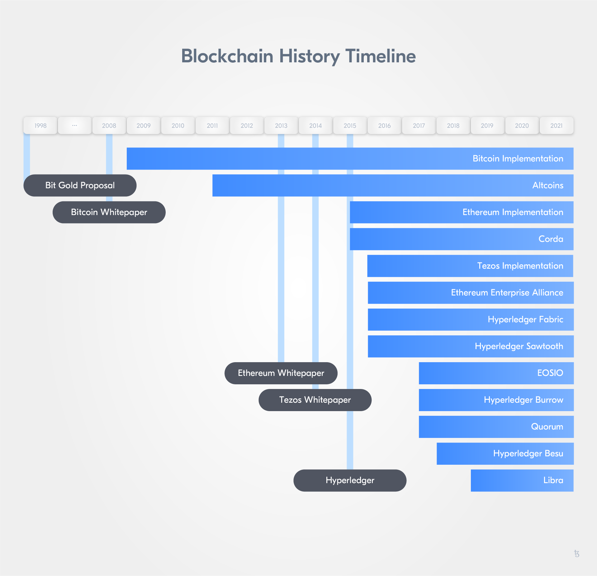
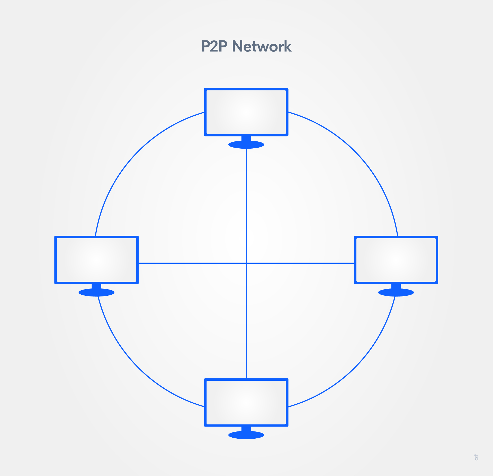
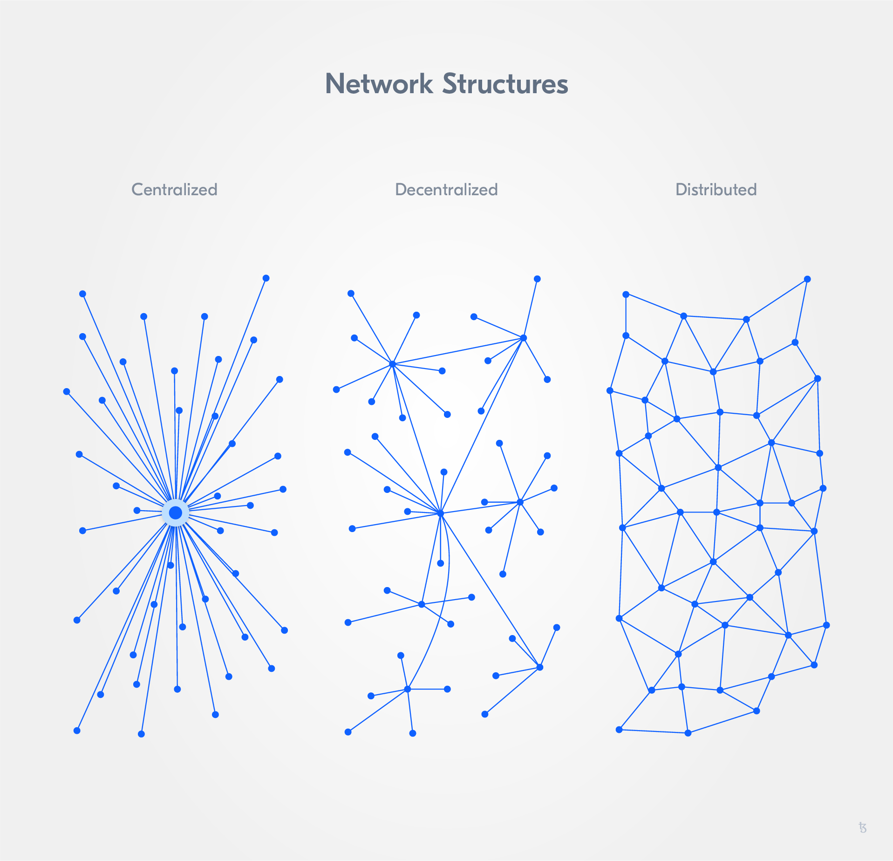

import HighlightBox from "../../src/components/HighlightBox"

Tezos is a peer-to-peer (P2P), open-source blockchain protocol with which you can execute transactions and deploy smart contracts.

<HighlightBox type="info">

In order to understand whether blockchain technology in general and specifically Tezos is a good fit for your project, it is important to understand where it comes from and who is driving it.

</HighlightBox>

## The origin

Important groundwork was laid in the 1980's and 1990's for what will later be known as blockchain technology. Although the technology itself was not created until 2008, researchers from different fields in computer science and cryptography proposed solutions to many problems regarding security, transparency, and trust. All of them contributed to the development of the first large scale, successful public blockchain network, **Bitcoin**.

In 1991, two research scientists, Stuart Haber and W. Scott Stornetta, identified a problem: How can it be ensured that digital documents are authentic and changes to them are tracked in an immutable time-stamped manner? In *How to time-stamp a digital document*, they worked on the concept of append-only, cryptographically secured logs. With their work, the foundations of what much later becomes blockchain technology were laid. Later in 1998 [Bruce Schneier](https://www.schneier.com/crypto-gram/) and [John Kelsey](https://www.nist.gov/people/john-m-kelsey) proposed a computationally cheap way to safeguard sensitive information and allow for computer forensics with secure audit logs by using hashing, authentication keys, and encryption keys (See: [Schneier, B. & Kelsey, J. (1998): *Secure Audit Logs to Support Computer Forensics*](https://www.schneier.com/academic/paperfiles/paper-auditlogs.pdf)).

Then in 1994, when computer scientist Nick Szabo first described the concept of [smart contracts](http://www.fon.hum.uva.nl/rob/Courses/InformationInSpeech/CDROM/Literature/LOTwinterschool2006/szabo.best.vwh.net/smart.contracts.html), Szabo's intent was to minimize the need for trusted intermediaries. In 1998, Szabo argued in favour of a decentralised digital currency; he proposed BitGold, a conceptual predecessor to Bitcoin. Szabo proposed Proof-of-Work as a consensus algorithm to solve cryptographic puzzles in a P2P network with Byzantine Fault Tolerance. The solutions are also linked together by a "hash chain" (See: [Moskoy, Phillip (2018): *What Is Bit Gold? The Brainchild of Blockchain Pioneer Nick Szabo*](https://coincentral.com/what-is-bit-gold-the-brainchild-of-blockchain-pioneer-nick-szabo/)). Although BitGold was never implemented, many perceive it as being the direct ancestor to Bitcoin.

As we can see, these intellectual predecessors identified elements that are essential to blockchain technology.

The new millennium arrived and on October 31, 2008, Satoshi Nakamoto called for a P2P system for a digital currency that would allow online payments to be sent directly from one party to another without going through a financial institution or requiring any other third party involvement. This sounds familiar for a reason: Nick Szabo had already mentioned a currency that would depend minimally on third parties, BitGold. However, Satoshi’s paper differed significantly - not only because of the name difference between BitGold and Bitcoin. The Bitcoin White Paper also proposed a data structure for the Bitcoin blockchain and laid out the decentralised consensus mechanism. It became the first large scale, successful public blockchain network.

As the first blockchain network launched, several were to follow.

In 2014 Vitalik Buterin started what is now known as the **second wave** of blockchain technology by publishing the paper underlying the **Ethereum** blockchain protocol, [A Next Generation Smart Contract & Decentralised Application Platform (Vitalik Buterin, Ethereum’s creator)](https://github.com/ethereum/wiki/wiki/White-Paper). Beyond a distributed ledger, the Ethereum White Paper proposed the development of a distributed computation platform. The project raised roughly $20 million in one of the most successful crowdfunding campaigns up to that point. The first public network was up and running in 2015. At the same time, it spawned the first managed blockchain network approach when the company Eris forked a version of Ethereum and expanded it to implement a layer of permissions, as well as making it easier to deploy custom, access controlled networks. In 2017 the [Ethereum Enterprise Alliance](https://entethalliance.org/) was formed as an industry consortium to adapt Ethereum for enterprise use.

As soon as it became clear that the technology presents a very attractive base infrastructure for payments, other groups and organisations adapted the technology for their purposes or developed new approaches using the same basic principles but adapting them to more traditional use cases.
Late 2015 saw the establishment of the **[Hyperledger Foundation](https://www.hyperledger.org/)**, an industry consortium with a focus on enterprise blockchain technology for managed networks and business applications. Following the Hyperledger endeavours, R3, first a bank consortium that later became an enterprise software company, launched **Corda**, an open-source blockchain platform.

This brief background introduces the vibrant community and fast-paced evolution of the space from which **Tezos** would emerge. In August 2014, L.M. Goodman published the [Tezos position paper](https://tezos.com/static/position_paper-841a0a56b573afb28da16f6650152fb4.pdf) followed by the [Tezos White Paper](https://tezos.com/static/white_paper-2dc8c02267a8fb86bd67a108199441bf.pdf) on September 2nd of the same year. By the Fall of 2014, a group of developers tasked with developing the protocol had produced a crude but functional network shell. In 2017, the **[Tezos Foundation](https://tezos.foundation/)** raised $232 million in one of the biggest initial coin offerings (ICO) that year. The network launched in June 2018 its Betanet and later in September its **Mainnet**.

In 2019, two **protocol upgrades** followed: **[Athens](https://www.coindesk.com/welcome-to-athens-tezos-completes-historic-first-blockchain-vote)** and **[Babylon](https://tezos.foundation/update-week-of-21-october-2019/)**. Both upgrades aimed at making the native coin, **tez** (XTZ), more attractive. With Babylon, simple smart contracts development, a more robust version of the consensus algorithm, and improvements on the delegation process were promoted. In March 2020, **Carthage** followed, an update to allow for complex application development and improve accuracy and security of the blockchain. **Delphi** and **Edo** followed in September 2020 and February 2021. [Delphi](https://blog.nomadic-labs.com/delphi-official-release.html) tackled gas consumption, storage costs, and smart contracts to continue optimising the network. [Edo](https://tezos.foundation/edo-proposal/) included next to some bug fixes, improvements to performance and gas consumption to lower gas fees, as well as some changes to the upgrade process, and the introduction of [sapling](https://blog.nomadic-labs.com/sapling-integration-in-tezos-tech-preview.html) for shielded transactions and [tickets](https://medium.com/tqtezos/tickets-on-tezos-part-1-a7cad8cc71cd).

--> Think about including stable coin integration and fungible tokens/standardized tokens here -->

## Tezos: A P2P network

Tezos is a blockchain network that allows for peer-to-peer transactions. So, let's take a short look at P2P networking and its relation to distributed networks.

A **peer-to-peer (P2P) network** has a **distributed architecture**. All participants, called nodes, are equal. Understood as equality is that all participants are **equally privileged and equipotent**. Each node connects to a limited number of other nodes, which are commonly referred to as its **peers**. Peers make resources like computing power and network bandwidth available to all peers in the network.

In P2P networking there is no central server, storage, or authentication of users. Peers can be understood as file servers and clients at the same time. If a node cannot answer a request, it will forward it to some or all of its known peers. This combination of client-server roles opens up **resilience** and **scalability** gains.

Why is this?

Resilience is improved because one node being down does not translate to a service disruption or the whole network stopping to work. Scalability is gained because each new node serves as a new client but also a server.

### Security in P2P networks - A challenge

Security is challenging in P2P networking for two reasons.

* P2P software has to be **downloaded** to become part of the network, making it especially vulnerable to remote exploits. 
* Because of **interconnectivity**, every peer has an equal network connection, a malicious participant could send incorrect requests or returns, as well as malware and corrupted data through the entire network. Other security risks are denial of service (DDoS) attacks, routing attacks, and routing network partitions. 

Hashing, chunk verification, and a higher degree of encryption are means to mitigate security risks in P2P networks. 

### P2P networking & distributed networks

Networks can be decentralised, distributed, centralised or a mix of both.

Broken down, a blockchain is a distributed ledger that records all transactions on the chain. Nodes in such a distributed ledger need to have a copy of said ledger, as well as constantly remain in communication with the network, which needs to continuously run without ever being offline. A blockchain requires a high degree of resilience and scalability due to it being a distributed P2P network with an expected growing number of nodes and processing necessities.

**Tezos** can be understood as such a distributed P2P network based on blockchain technology. As such, every node establishes and maintains a connection with the network, functions as more than a client of the network, and effectuates a number of operations.

Tezos implements a **P2P layer**. The node instantiates the P2P layer which is parameterised by the type of messages exchanged over the network (to support different P2P protocol versions and extensions) and the type of metadata for each peer. The metadata is used to compute a score for each peer that reflects the level of trust in the nodes. Policies can control communication between the node and peers based on the different scores (levels of trust) in those peers.

The P2P layer consists of a connections pool, the operations on those connections, and a set of workers. The worker pattern is used extensively and followed by the set of workers.

Now that we have covered the P2P layer of Tezos, let's take a closer look at its blockchain component.
