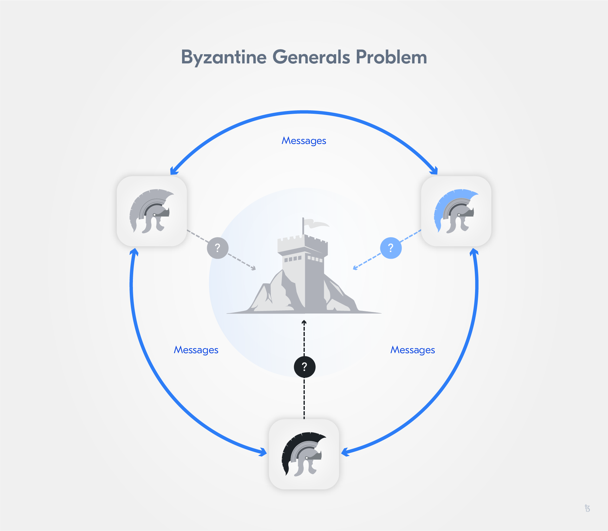
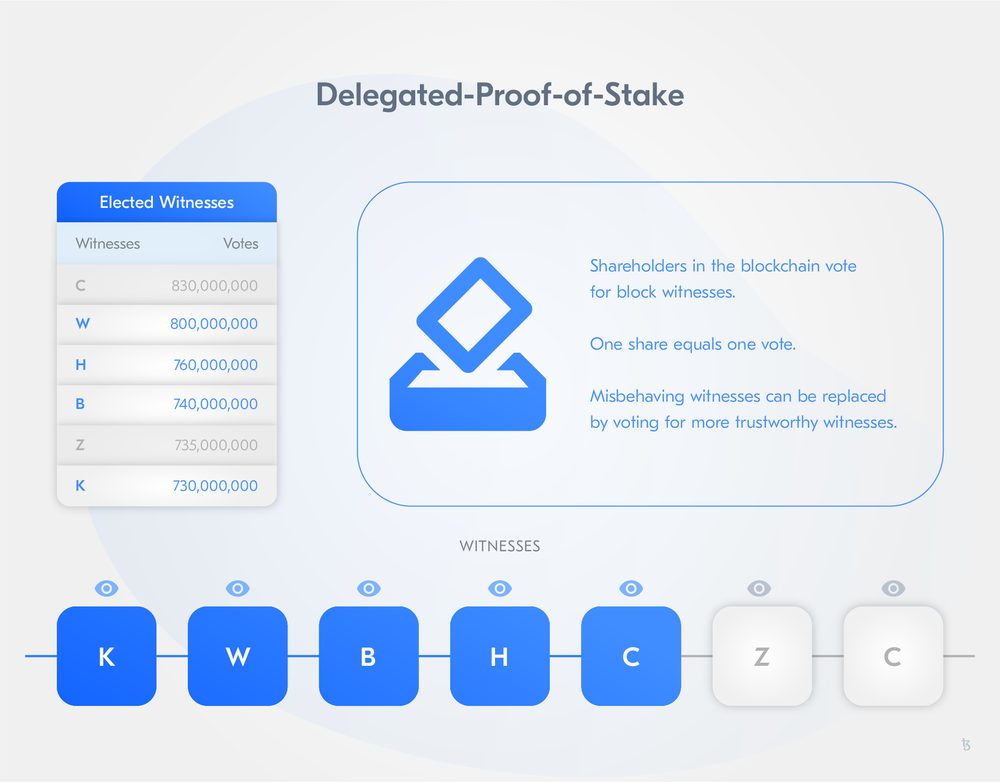

import HighlightBox from "../../src/components/HighlightBox"
import YoutubePlayer from "../../src/components/YoutubePlayer"

import {
  ExpansionPanel,
  ExpansionPanelList,
  ExpansionPanelListItem
} from 'gatsby-theme-apollo-docs';

Now that we have taken a look at the origins of blockchain technology and the Tezos protocol, let's focus our attention on **Tezos as a blockchain network** and **trusted execution on-chain**.

## Tezos a blockchain network: What is a blockchain?

Just to cover all our bases, let's briefly dive into what a blockchain is and what it solves to better understand why Tezos is more than a P2P network and the value added of blockchain technology, solving the double-spending problem of digital cash systems.

The blockchain journey begins with a problem...the **double-spending problem**. The double-spending problem refers to the challenge of designing a digital cash system that is at once a digital artifact but cannot be spent more than once.

The Bitcoin Whitepaper presented a solution to the "double-spending" problem for digital currencies. In doing so, it presented the underlying technology known as blockchain and an example of blockchain's possible application in the form of a simple blockchain implementation called "Bitcoin".

<HighlightBox type="tip">

[Satoshi Nakamoto: *Bitcoin: A Peer-to-Peer Electronic Cash System*](https://bitcoin.org/bitcoin.pdf) - It is a fairly straightforward paper, having a look at it is recommended.

</HighlightBox>

In the current financial system, double-spending is avoided by the involvement of centralized third parties that manage and control financial transactions. A third party such as a bank, credit card company, or payment service is used as a trusted ledger keeper. Consequently, it is generally not possible for two parties to exchange value online without involving a trusted third party to handle the settlement process and update their ledgers, as well as account balances.

At a high level, Bitcoin solves the double-spending problem by replacing the trusted central ledger-keepers with a decentralised and distributed network of ledger-keepers. Each member of the network has an exact replica of the ledger. In addition, no one can update the ledger without the consensus of the network to approve the changes.


It is as though each transaction is observed by a **large crowd of witnesses** who reach consensus about proposed changes. The crowd prohibits events that should not occur, such as spending the same funds twice (i.e. double-spending).

Bitcoin and its underlying technology convincingly demonstrate that a network of participants that don't necessarily trust each other can achieve consensus about the validity of a transaction, its history, and the resulting state of the ledger. This is interesting because simple ledgers of account balances and simple protocols for moving funds are far from the only use cases for shared data consensus.

### How does a blockchain work?

Imagine one wants to *retain and monitor changes* to a file, for example, a logfile. Now, imagine one also wants to verify an unbroken history of all changes ever made to the file. How can one proceed? A well-understood solution uses **cryptographic** [**hash functions**](https://en.wikipedia.org/wiki/Cryptographic_hash_function).

Let's briefly introduce the concept of cryptographic hash functions in case you are unfamiliar with them.

The ideal cryptographic hash function has **five main properties**:

* **Deterministic**: the same message always results in the same hash;
* **Fast**: the hash value for any given message is computed quickly;
* **Resistant**: it is not feasible to generate a message from its hash value except by trying all possible messages;
* **Avalanche effect**: a small change to a message changes the hash value so extensively that the new hash value appears uncorrelated with the old value;
* **Unique**: it is infeasible to find two different messages with the same hash value.

Thus, a hash function:

* converts an input, a.k.a. the message, into an output, a.k.a the hash,
* does the conversion in a reasonable amount of time,
* makes it practically impossible to re-generate the message out of the hash,
* leads to even the smallest change in the message changing the hash beyond recognition, and
* makes it practically impossible to find two different messages with the same hash.

<HighlightBox type="tip">

You can see hashing in action to get the feel for it here: [http://onlinemd5.com/](http://onlinemd5.com/">http://onlinemd5.com/). As you type into the text box, the hash updates automatically. Even a minuscule change to the input creates a completely different hash. Try it out!

</HighlightBox>

With such a function, you can:

* prove that you have a message without disclosing the content of the message, for instance to prove you know your password or to prove you previously wrote a message,
* rest assured the message was not altered, and 
* index your messages.

A hash can be used to prove an input exactly matches the original, but the original cannot be reconstructed from a hash. So, a hash function can demonstrate that a copy of the file is an authentic replica of the original in every detail.

But what about subsequent changes to the file? Suppose we want to demonstrate that a series of changes is authentic, complete and in the correct order?

Let's suppose that we will only append new entries to the end of the file. How can a hash function help us be certain that a series of entries is the unbroken chain of inputs?

We can make a rule that states that in addition to the new content, the previous hash will also be an input of the next hash.

The (pseudo-)code would look like this:

```javascript
version2Hash = hash(version2Changes + version1Hash)
```

This way, one can examine *candidate* changes, as well as confirm that the previous file is correct, and ensure that subsequent changes are accurately disclosed. This process repeats for all subsequent versions. Any version of the file contents can be shown to be part of an **unbroken chain of changes** all the way back to the file inception. This is pure mathematics.

Any departure from the system, e.g. a hash does not compute as expected, proves a break in the history and is therefore invalid. 


Interestingly, since knowledge of the current hash of the latest valid version is an input to the next version's hash function, it is not possible to generate a new valid version without knowledge of the valid version that precedes it. This process forces changes to be **appended** to a previous valid version.

Blockchains function in similar ways. Blocks of transactions, logical units wrapping a set of transactions in a specific order, are appended using hashes of previous blocks as inputs into hashes of subsequent blocks. Any participant can quickly verify an unbroken chain of blocks, i.e. the correct order.

There are some important constraints to keep in mind when talking about transaction ordering in distributed networks:

* **Everyone** has a little bit of **authority**, i.e. there is **no central authority**;
* A blockchain is a **distributed timestamp server without a central network time**;
* Because of **physics and network latency**, every node will learn about transaction proposals in a slightly different order and each node will arrive at a slightly different opinion about the ordering of transactions.

Cryptographic hash functions are instrumental in that they empower all participants to ensure that they possess an undistorted history of everything. Since all nodes can verify the chain independently, they can proceed on the assumption that all other nodes will eventually come into agreement about the history of everything. This is known as **eventual consensus**.

Without a central authority determining the truth, another problem arises when it comes to **determining the order of transactions**.

Although there is no obvious way to settle it, **transaction order must be resolved** because processing transactions out of order would produce non-trivial differences in outcomes. Without agreement about the transaction order, there can be no agreement about the balance of accounts.

Solving the double-spending problem with the help of hashes to ensure an immutable ledger was not the only problem technology innovators faced in distributed computing: the agreed transaction list has to be identified and consensus on the correct order of transactions has to be reached in a hierarchy-free, permission-less and failure-prone network.

Let's take a closer look at consensus in blockchain!

### Consensus and decentralised networks

In a distributed network without authorities, we need a process to reach consensus about what is to be considered the **truth**. This problem is commonly known as the **Byzantine Generals' Problem** and mitigation strategies for it are subsumed under the term **Byzantine Fault Tolerance** (BFT).

In the traditional description of the problem, generals, whose armies are spread around a target city, need to reach consensus on a time to attack. To achieve this, they can only rely on **unsecured communication channels**, whereby, for instance, a lack of acknowledgement can either be caused by a failure to deliver a message, by a dead general or by a failure to deliver the acknowledgment.



Similar to the generals who must decide when to attack, in a distributed ledger the agreed transaction list has to be identified and consensus on the correct order of transactions has to be reached.

Remember, individual transactions are sent to the network from individual nodes. Each node must pass (or fail to pass) transactions to other nodes. Because of physical latencies, not all nodes will see the same transactions at the same time. Each node must therefore build its own order of transactions. Since all nodes participate equally, there is **no authoritative order of transactions**. Still, the network must decide which node's version, or any version, of the truth will be the authoritative truth.

Blockchains use a process called **consensus algorithm**. The process disambiguates the order of the transactions even though well-meaning nodes independently arrive at slightly different opinions about the matter. The process does so **without reliance on an authoritative time source**.

Let's look at a selection of the most popular consensus algorithms.

**Practical Byzantine Fault Tolerance (PBFT)**

PBFT was first published in 1999 and arose in academic corners. PBFT focuses on providing a **practical Byzantine state machine replication**, which is able to tolerate malicious nodes and manipulated messages. The main aim is achieving a **consensus of all honest nodes**. This translates into a **practical requirement** for networks: The amount of malicious nodes needs to be equal or less to 1/3 of all nodes. Thus, the more nodes the less likely the practical requirement has been surpassed.

<HighlightBox type="info">

You can access the paper by Miguel Castro and Barabara Liskov on *Practical Byzantine Fault Tolerance* [here](http://pmg.csail.mit.edu/papers/osdi99.pdf). There is also a very understandable [presentation](http://www.comp.nus.edu.sg/~rahul/allfiles/cs6234-16-pbft.pdf). 

</HighlightBox>

All **nodes** in the network are **ordered in sequence** with the primary node as leader and the remaining nodes as followers (called backup nodes). In addition, there are validating and non-validating peer nodes.

It is a **three-phase protocol**, in which the client sends a request to a so-called primary, i.e. leader node. The primary multicasts the request to the backup nodes/replicas with a sequence number. These agree on the sequence number, execute the request and send a reply to the client. The message is verified when a certain amount of repetitive messages is send and then the replicas agree on the total order of requests. The backup nodes/replicas agree on a total order of requests, i.e. achieve consensus on the order of record. The nodes then accept or reject the order of record.

**Proof-of-Work (PoW)**

PoW was first introduced with Bitcoin. A user completes a task of **arbitrary difficulty**. This is generally implemented as a search for a random number, which when combined with ordered transactions in a block yields a hash function result that matches a criteria such as minimum number of leading zeroes, i.e. the aim of the specified task. Finding such a solution is taken as evidence of considerable effort (or proof that considerable work *must* have been invested in the search).

<YoutubePlayer videoId="2tLfvo_f9_c"/>

**Nodes**, also known as **miners**, conduct their searches independently. The successful node that announces a solution first receives an economic reward, i.e. the economic incentive for mining. The claim is substantiated through the arbitrary amount of work. If a node wishes to distort/influence the ledger in a PoW system, it must first acquire an **authoritative position**, i.e. overcoming the *combined problem-solving capacity* of the network and maintaining that lead over time. This known attack vector is called 51%-attack - If a single party acquires more than 50% of the total problem-solving capacity of the network, that party is theoretically able to alter the consensus.

The control mechanism for the amount of work is called **difficulty** and it guarantees a given average block creation time. Difficulty adjusts to compensate for increasing/decreasing total network problem-solving capacity. Thus, PoW networks do not get faster as more computing capacity is added. They become more resilient by increasing difficulty, which raises the threshold a 51%-attacker will need to overcome.

PoW mechanisms require a large resource investment as invested work is the base for claim substantiation, so to say, mining is resource-intensive. For this reason, PoW mechanisms have been widely criticised for their energy consumption - Running Bitcoin requires the energy consumption of a small country.

**Proof-of-Stake (PoS)**

PoS is based on the assumption that _those with the most to lose_, i.e. with a stake invested in the network, are the most incentivised to safeguard network integrity. Validators place funds at risk (i.e. **the stake**). For any given block, a validator is selected in pseudo-random fashion. Whereas a validator with more stake has a higher probability of being selected for block generation. While PoS systems generally reward validators with new coins for honest behaviour (i.e. block rewards), validators also receive transaction fees when creating blocks. PoS solves the energy problem in PoW as "work" (i.e. use of energy through computational power) is not the proof requested.

A successful PoS system must address the problem of **"nothing at stake"**; Randomly-selected validators must face a disincentive for bad behaviour as well as a high probability that bad behaviour will be detected. A solution is to incentivise validators to generate blocks that are likely to be accepted by the network and face them with economic punishment when a block isn't.

PoS networks do not only face the "nothing at stake" problem, but furthermore introduce challenges in regard to **centralisation**. **Economies of scale** in staking can lead to a situation, in which token holders with a small stake have a smaller profit margin than those with a large stake. This creates incentives to only participate as a large token holder or a consortium of many smaller holders leading to centralisation, which then creates new risk as a high degree of decentralisation is the base for a secure network.

**Delegated-Proof-of-Stake (DPoS)**

An extension of the PoS algorithms is called **Delegated-Proof-of-Stake (DPoS)**. The algorithm is called DPoS because like in PoS the value of a vote is determined by the stake. However, there is a fixed validator set.

In this type of consensus mechanism, so-called **witnesses** are elected by the stakeholders of the network. Witnesses secure the network. Afterwards, several witnesses, representing at least 50% of the stakeholders' votes, are chosen for the block creation.



Witnesses are paid fees for creating and validating blocks, i.e. providing their services. This economic incentive also leads to competition potentially increasing with each new member due to the limited number of witnesses. In case a witness misbehaves, the network's community is able to withdraw their votes for a single witness, i.e. "fire" the witness.

Alongside ascribing the role of witnesses to some participants, DPoS networks also elect **delegates**. Delegates are a group of participants that supervise network governance and performance, and propose changes that are then voted on by the entire network.

Many consider DPoS algorithms superior to PoW and PoS because of their fast block creation, a high degree of security, energy efficiency, level of integrity, and democratic structure. However, DPoS systems are less decentralized than PoW and PoS systems because they have fixed validator sets and higher barriers to entry.

<ExpansionPanel title="Consensus on Tezos: Liquid Proof-of-Stake">

Tezos relies on a consensus mechanism, which combines elements of classical PoS with DPoS. It is called **Liquid Proof-of-Stake (LPoS)**. This consensus mechanism is rather PoS with the opportunity of delegation than a classical DPoS mechanism.

Tezos' LPoS shares attributes with both, but can also be differentiated through specific characteristics unique to Tezos:

* **DPoS elements:** Participants can **delegate** their stake to validators creating a lower entry barrier, BUT delegation is optional, and consensus relies on a more inclusive **set of validators** - multiple ten-thousands instead of only under 100, modest computing infrastructure needed;
* **PoS element:** Validators are **selected based on the amount of stake/tokens** they hold.

We will dive deeper into Tezos' consensus mechanism in the section _[Main Ideas Behind the Tezos Protocol - Change and Evolution: Implementing change without hard forks](/blockchain-fundamentals/getting-2)_.

</ExpansionPanel>

## Trusted execution on-chain - Smart contracts

A contract is commonly known as a formalisation of a relationship and/or transaction. In common law a contract is understood as a “meeting of minds”. The term smart contract was first used in Nick Szabo’s 1994 article *[Formalizing and securing relationships on public networks](https://firstmonday.org/ojs/index.php/fm/article/view/548/469)*, which referred to the possibility of representing traditional contracts (from common law) in distributed protocols, especially in conjunction with digital transactions, as well as lowering transaction fees. Smart contracts combine rising technical possibilities with insights from business administration.


<YoutubePlayer videoId="ymK7Ss-HBPc"/>

In blockchain protocols, a **smart contract** represents _a computer protocol intended to provide a self-executing, self-enforcing, and self-verifying contract_. Thus, the contract itself contains the enforcement of its terms, i.e. they are **self-executing**. They facilitate the process of forming self-executing contracts through the use of protocols and user interfaces. In addition, they **reduce costs** by automating stipulated actions, i.e. being **self-enforcing**.

Like other forms of software, smart contracts tend to do precisely what they are programmed to do. This can, at times, stand in stark contrast to what the author of a traditional analogue contract intended the contract to do. Smart contracts require that contingencies and outcomes are specified in great detail to ensure proper functioning as well as to prevent unintended consequences, which in common law would be disputed in court. The self-enforcing nature of smart contracts implies that unintended outcomes may be non-trivial. Importantly, smart contracts do not include the concept of intent.

Smart contracts cannot be changed once deployed. Here, Tezos differentiates from other blockchain networks: Certain Tezos smart contracts can be updated (`lambda` types or proxy redirect). This gives more flexibility when developing them and decreases the risk in case something is not functioning as intended.

We covered the essential main concepts of blockchain technology and how they relate to Tezos. Let's continue our dive-deep with a look at how Tezos specifically addresses certain lacks managed and public blockchain networks have in common.

<HighlightBox type="reading">

- [Castro, M. & Liskov, B. (1999): Practical Byzantine Fault Tolerance](http://pmg.csail.mit.edu/papers/osdi99.pdf)
- [Castro, M. & Liskov, B.: Practical Byzantine Fault Tolerance presentation](https://www.comp.nus.edu.sg/~rahul/allfiles/cs6234-16-pbft.pdf)
- [Cryptographic Hash functions](https://en.wikipedia.org/wiki/Cryptographic_hash_function)
- [Satoshi Nakamoto: Bitcoin: A Peer-to-Peer Electronic Cash System](https://bitcoin.org/bitcoin.pdf) 
- [Szabo, Nick (1994): Formalizing and securing relationships on public networks](https://firstmonday.org/ojs/index.php/fm/article/view/548/469)
- [Tezos Stats](https://tzstats.com)
- [Vasa (2018): ConsensusPedia: An Encyclopedia of 30 Consensus Algorithms. A complete list of all consensus algorithms](https://hackernoon.com/consensuspedia-an-encyclopedia-of-29-consensus-algorithms-e9c4b4b7d08f)
- [Vitalik Buterin (2016): On Settlement Finality](https://blog.ethereum.org/2016/05/09/on-settlement-finality/)
- [Witherspoon, Z. (2013): A Hitchhiker’s Guide to Consensus Algorithms. A quick classification of cryptocurrency consensus types](https://hackernoon.com/a-hitchhikers-guide-to-consensus-algorithms-d81aae3eb0e3)

</HighlightBox>
