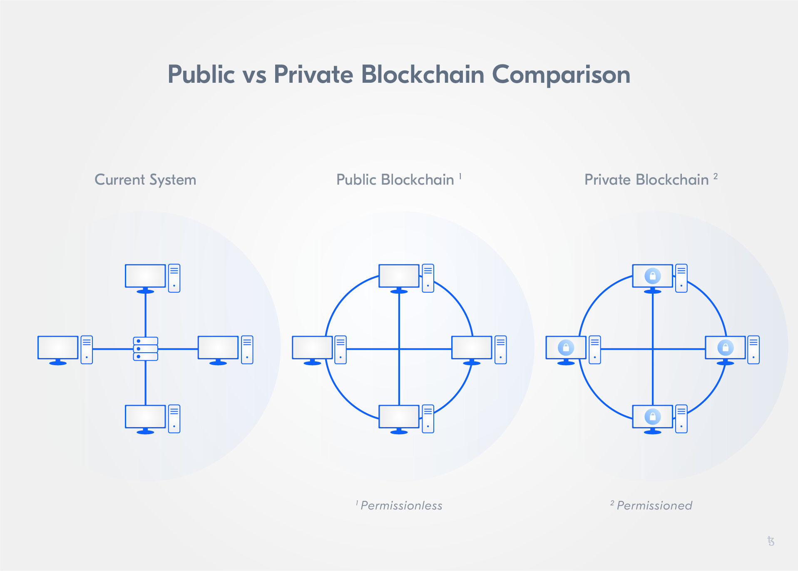

import HighlightBox from "../../src/components/HighlightBox"

Tezos implemented several ideas tackling challenges of other general-purpose built blockchains. Let's take a closer look at Tezos's specific characteristics in regard to:

* the deployment pattern,
* the Tezos governance process and updateability of the protocol,
* the Tezos consensus mechanism, Liquid Proof-of-Stake, and
* smart contract development and deployment.

## Tackling the management problems of public chains

Blockchains can be categorised along two main deployment patterns: Public and private/managed blockchains. The deployment pattern has major implications on the functioning of a network.

The main way to differentiate between blockchains is to consider their **form of access**, which refers to:

* whether there is a **distinction between users** or not, and
* whether the **access** to the blockchain is open/public or controlled/private.

### The original: Public blockchain networks

The most obvious way to operate a blockchain protocol is in the form of a **public** network. This is what blockchain technology was originally invented for and arguably remains its most powerful form of implementation.

A public blockchain, compared to a private or managed one, is characterised by **open access**. Every participant has access to data and can validate as well as add blocks in public blockchains. Anyone, without needing the permission of another authority, can write and read data.

Because network participants are not vetted and can add to the ledger without needing approval, public blockchains incorporate ways to arbitrate discrepancies and include defence mechanisms against attacks. Thus, guarding against malicious participants is not required, i.e. there is no barrier to entry, and no access control system needs to be in place. The beauty of the public network lies among others in its **self-defence** attribute. In addition, public blockchains benefit from **demand-side economies of scale**, also called **network effects**.

Most public blockchain networks have a few specific attributes:

* **Accessibility:** All you need to connect is the client software and an internet connection. No AML, KYC, identity checks, or subscription payment is required;
* **No hierarchy:** All nodes are equal, meaning no individual node has more authority than another;
* **Crypto-economic incentives:** The lack of a central authority means there is no absolute defence against malicious behaviour. Instead, the network usually incentivises benevolent behaviour and dis-incentivises behaviour that endangers the network functioning to de facto implement prohibitive expenses to attack the network and others;
* **Full decentralisation:** Most public networks are completely decentralised because they are non-hierarchical and fully accessible. The playing field for market participants is therefore relatively level, so traditional business models may not work as well.

### Managed blockchains: Bringing back access control

**Managed networks**, just like public networks, rely on blockchain data structures. But unlike public blockchain networks they do not *necessarily* need to mitigate the Byzantine General's Problem because they operate in a predictable environment with elements of authority, hierarchy and accountability. Participants are vetted through an access-control layer that governs network access. Thus, a private network does not have to rely on anonymous participants to validate transactions. Therefore, many mechanisms vital in public blockchains are not necessary for private blockchains.

**Private blockchains** can be:

* **designed for a limited number of vetted and approved participants**,
* **designed for optimised performance**, and
* **governed by a well-defined agreement between the participants**.

### Public vs managed: It's all about suitability

Public networks are based on game theory and economic incentives, which means that every action is probabilistic. We have no guarantee that our transactions will be picked up and even the integrity of the network is merely very likely, not 100% guaranteed. This is often unacceptable, for example, for traditional financial institutions. Still, one of the biggest expenses financial and other institutions face is the operation and maintenance of infrastructure as well as the cost resulting from leaks, hacks, errors, and data incompatibility.

Unlike public networks, where interaction is governed by the protocol and crypto-economic incentives, in managed networks the blockchain protocol is a technical enforcement of pre-existing relationships and legally enforceable agreements.

<!--> Maybe add at a later point of time table "Publicvsprivate.png" -->

Private blockchains are seen by many as contradictory to the existential notion of blockchain technology. Blockchains were introduced as a means to replace trusted third parties and create (procedural) trust-based relations between pseudonymous participants. Private blockchains are also criticised in regard to their degree of transparency, often said to be "only a database" or a traditional centralised system with some degree of cryptographic auditability, but not a "full" or "real" blockchain.

Different deployment patterns have their own benefits and drawbacks. They are also more or less suited to different intended network functions.

### Tezos: Amending a public deployment pattern

The Tezos network is based on a public deployment pattern. As such, it profits from all benefits public, general-purpose built blockchains bring. This reflects in the network access design. Tezos is a public blockchain and thus, access is not restricted. This can drive adoption of a blockchain protocol because access barriers aren't established.

At the same time, Tezos addresses some major challenges of public chains.

First, the protocol is designed in its latest version, to allow for privacy. As public chains are transparent and accessible, it is often argued that managed blockchains are the only option to establish the degree of **privacy and confidentiality** financial markets require. Tezos has a solution, which doesn't require a managed design: Sapling. This has been introduced by the Edo upgrade.

In addition, Tezos avoids the difficulty **hard forks** bring to public chains by allowing protocol upgrades via its governance process. These are also helpful to allow the blockchain to include changes.

Besides the **governance process** allowing for upgrades on-chain, the Tezos consensus mechanism assists in making the protocol more resilient against attack vectors and security risks other chains relying on PoW and PoS mechanisms are faced with. Among other things, Tezos' consensus mechanism secures the network against malicious nodes.

Let's take a closer look at how change is managed on Tezos!

<HighlightBox type="reading">

- [Arluck, J. (2018): Liquid Proof-of-Stake by Jacob Arluck](https://medium.com/tezos/liquid-proof-of-stake-aec2f7ef1da7)
- [Proof-of-stake in Tezos](https://tezos.gitlab.io/008/proof_of_stake.html)
- [Tezos Software Architecture](https://tezos.gitlab.io/shell/the_big_picture.html)

</HighlightBox>

Resources:

- [Tezos Software Architecture](https://tezos.gitlab.io/shell/the_big_picture.html)
