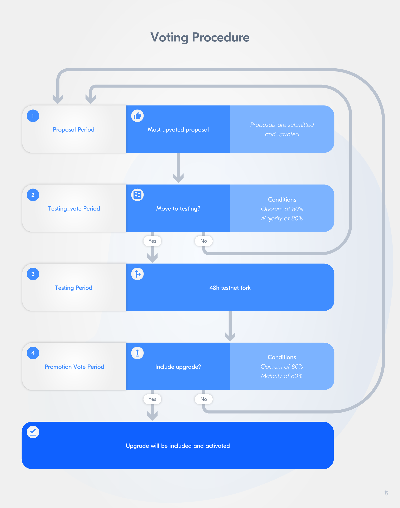

import HighlightBox from "../../src/components/HighlightBox"

import {
  ExpansionPanel,
  ExpansionPanelList,
  ExpansionPanelListItem
} from 'gatsby-theme-apollo-docs';

## Implementing change, avoiding hard forks

A blockchain can be understood as a ledger. This ledger is immutable and transparent to the network participants. The way in which the network is conceptualised influences its implementation, the benefits it brings, and challenges it faces.

Because data is validated and stored decentralised, unless both the protocol and the data itself have some immutability property, there is no certainty that the data has not been tampered with and the protocol has not been modified to benefit any one actor disproportionately. **Immutability** is a central attribute of blockchains to ensure **trust in the system** and **integrity of the data**. There might be situations where the rule of immutability needs to be flexible, where the protocol or the data in fact do need to be changed.

Tezos addresses this public blockchain dilemma by providing an **on-chain governance mechanism**, which reduces the coordination costs for upgrades immensely. Public blockchains often conduct their "governance process" off-chain. This entails coordinating communication across different platforms to make an upgrade more probable of being accepted by all network participants. The coordination required leads to high coordination costs. Additionally, on-chain governance helps avoid hard forks caused by some stakeholders objecting an upgrade and continuing on an older protocol version. Hard forks are especially painful when it comes to holding a stake in tokens - A hard fork leads to two competing states of the "true state", which makes all related to assets with financial value very complicated.

<ExpansionPanel title="Types of governance in blockchain">

Blockchain governance processes can be differentiated into two types:

* **On-chain governance**: Decisions are made on-chain, as in the case of Tezos, Cardano, and Polkadot;
* **Off-chain governance**: Stakeholders (i.e. token holders, protocol developers, etc.) debate in forums (i.e. Reddit, conferences), as in the case of Ethereum and Bitcoin.

</ExpansionPanel>

Tezos was designed to solve this "fork-based governance" model of early blockchain implementations. As the value of a blockchain is largely determined by its network effects, the Tezos governance mechanism is meant to disincentivise forking so that network effects are better retained over time.

Tezos was envisioned to include the possibility of **upgrades** and **self-governance mechanisms**. The **[Tezos Governance Mechanism](https://medium.com/tezos/amending-tezos-b77949d97e1e)** was developed for this purpose. With it protocol upgrades (including upgrade propositions, selection and testing, as well as activation) can be conducted without having to create a hard fork.

In addition to an on-chain governance mechanism, Tezos also has the ability to **self-amend**. Node operators of other blockchain implementations must manually upgrade the software of their nodes when conducting a network upgrade. Even if non-contentious, coordinating and executing a network upgrade can be extremely difficult and becomes increasingly difficult as a network grows and becomes more decentralised. Self-amendment in Tezos is designed to solve this coordination and execution problem of conducting upgrades in a decentralised network. If an amendment (upgrade) to Tezos is approved by its stakeholders via the governance mechanism, then all nodes are automatically upgraded, no manual intervention is needed.

Both the governance mechanism and self-amendment are built in at the protocol level. Restrictions about what can and cannot be changed at the protocol level may be implemented via the governance mechanism. For example, if stakeholders wanted to cap the total supply of tez, they could do so or set a requirement stating that 90% of all stakeholders must approve such a proposal for it to be implemented. This is to ensure that more sensitive or controversial changes to the protocol require stronger consensus or must meet predefined rules before being enacted. This is a form of constitutionalism at the protocol level and can govern how future rules can be adopted.

### The Tezos amendment process

<ExpansionPanel title="The amendment process">
&nbsp;

<ExpansionPanelList>

The **Tezos amendment process** consists of **four** different stages:

<ExpansionPanelListItem number="1">

**Proposal period:** Bakers can submit and upvote up to 20 proposals per period (including duplicates). The proposal is submitted with the *proposal operation*, which includes the parameters source (i.e. the baker submitting), proposal period when it was submitted, and proposal's hash. Bakers then vote on the proposals in an approval voting mechanism, i.e. one can vote for a number of candidates/options as each possibility is an individual, independent choice, and then the option with the most approval votes wins - Voting on proposals is often referred to as "upvoting" for this reason. After its eight baking cycles, the most-upvoted proposal moves to the next stage unless no proposals were submitted or there is a tie;
</ExpansionPanelListItem>

<ExpansionPanelListItem number="2">

**Exploration vote period** or **testing_vote period:** Bakers have to decide on whether the proposal should be tested. This vote is also cast on-chain with the *ballot operation*, which requires a source (i.e. the baker), the voting period when it was submitted, the proposal it is addressing, and the specified ballot ("yay", "nay", or "abstain"). The bakers' votes are weighted proportionally to their staking balance's number of rolls at the start of this period. After eight cycles, the votes are counted. The proposal proceeds, if the quorum and the 80% supermajority of affirmative votes is met (80% of the total of all yes and no votes are affirmative, or `YES/(YES+NO)`). If this is not the case, another proposal period begins.
</ExpansionPanelListItem>

<ExpansionPanelListItem number="3">

**Testing period:** A testnet fork is ran next to the Tezos main chain for 48 hours to allow the network to clearly differentiate between the main chain and the test fork. With the fork correct migration testing is possible in the given context (i.e. valid state transactions can be conducted without disruption), and it can be ensured that a proposal can become an upgrade to the protocol because the effects of migration are better assessable than in a testnet context, and test operations can be conducted with real accounts and using existing infrastructure (e.g. hardware wallets, remote signers, etc.). Using a testnet fork also means that bakers need to validate on two chains.
</ExpansionPanelListItem>

<ExpansionPanelListItem number="4">

**Promotion vote period:** The network has to decide on the upgrade. Basis for the network's decision is the results of the testing period as well as the off-chain discussions of the proposal. Bakers' votes are weighed proportionally to the number of rolls in the baker's staking balance from the start of this period. Bakers can only cast one vote during the period, e.g. each baker can send one ballot operation. If the proposal is accepted with an 80% supermajority of non-abstentions and the quorum is met, the upgrade is included in the Mainnet. If one of these requirements is not fulfilled it is back to square one, the proposal period.
</ExpansionPanelListItem>
</ExpansionPanelList>
</ExpansionPanel>


All the above mentioned periods lasts for eight baking cycles - eight baking cycles are almost 33 blocks/23 days. For a full cycle to be conducted one can expect a three month duration period. When a period is successful, the amendment process is finalised. In case it is not, the proposal period begins again, the process restarts so to say.

<ExpansionPanel title="The quorum">

A **quorum** is _the minimum number of participants/members/voters of a deliberative body required to be in session and cast a ballot_. A quorum ensures that the body's work is representative of the majority of members. A quorum is not equal to the participation, which is the ratio indicating the number of received votes. It just indicates a body is procedurally ready to vote and decide.
In the exploration vote period and promotion vote period the quorum becomes very important as it is a requirement for an affirmative vote and proceeding with the proposal.

How does the quorum in Tezos look like?
For each period, the quorum is recalculated based on the participation rate of the past voting period. The new quorum can be calculated with a simple function: Q<sub>t+1</sub> = 8/10*Q<sub>t</sub> + 2/10*P<sub>t</sub>
Whereas Q is the Quorum for a voting period, P the participation rate in a voting period, t the index for time of the voting period. The participation rate (P<sub>t</sub>) is calculated as follows: P<sub>t</sub> = [V<sub>YES</sub> + V<sub>NO</sub> + V<sub>ABSTAIN</sub>]/R;
V: Number of votes, R: Number of total rolls at start of the period.

The first **Tezos' quorum** was 80% of all rolls (at the genesis block, i.e. Q<sub>0</sub>). Afterwards, it has been updated each vote to account for changing participation rates.

For more on the quorum take a look at: <code>[src/proto_alpha/lib_protocol/src/amendment.ml](https://gitlab.com/tezos/tezos/blob/c92f370930c5f1bf5224358f70d8cb3af6329cf5/src/proto_alpha/lib_protocol/src/amendment.ml)</code>.

</ExpansionPanel>

### Operations for Voting

There are three instances, in which bakers vote on-chain: at the end of the proposal, testing_vote, and promotion vote period. The first is conducted with the `proposals` operation, and the latter two with the `ballot` operation. Let's take a brief look at these two operations.

The **`proposal` operation**:

```

Proposals : {
  source: Signature.Public_key_hash.t ;
  period: Voting_period_repr.t ;
  proposals: Protocol_hash.t list ; }

```

As you can see in line

```

source: Signature.Public_key_hash.t ;

```

the source is the public key hash.

The unique identifier of each voting period is indicated with:

```

period: Voting_period_repr.t ;

```

and the proposals, which are being upvoted, are communicated with a non-empty list of maximum 20 protocol hashes, as you can see in line:

```

proposals: Protocol_hash.t list ; }

```

This operation can be submitted more than once. The only limitation is that the cumulative length of the proposals list has to be less than 20.

Now, let's take a look at the **`ballot` operation**.

```

Ballot : {
  source: Signature.Public_key_hash.t ;
  period: Voting_period_repr.t ;
  proposal: Protocol_hash.t ;
  ballot: Vote_repr.ballot ; }

```

This operation also uses the public key hash as a source (i.e. `source: Signature.Public_key_hash.t ;`) and the voting period as a unique identifier (i.e. `period: Voting_period_repr.t ;`).

The proposal

```

proposal: Protocol_hash.t ;

```

refers to the proposal that is under consideration.

In addition, the ballot 

```

ballot: Vote_repr.ballot ; }

```

can be either `Yea`, `Nay`, or `Pass`. Whereas `Pass` allows for not influencing the vote's result while allowing for quorum.

The ballot operation can only be submitted **once** during a voting period.

<HighlightBox type="info">

In case you want to check out more details on Tezos operations, we recommend [this source](https://gitlab.com/tezos/tezos/blob/2701012bf0cd6d9a51203d065e55b8f6e22a88c5/src/proto_alpha/lib_protocol/src/operation_repr.ml).

</HighlightBox>

--> We could also include client commands; https://tezos.gitlab.io/master/whitedoc/voting.html -->


<
<ExpansionPanel title="The first use case of the amendment process: Athens A & B">
&nbsp;

<ExpansionPanelList>


Athens is the name given to the first use of the Tezos amendment process. Two proposals were submitted, [Athens A and B](https://medium.com/tqtezos/reflecting-on-athens-the-first-self-amendment-of-tezos-4791ab3b1de1). The proposals wanted to include two backwards-incompatible network upgrades targeting the gas limit and roll sizes. One proposal was just advocating for an increase in the gas limit (**Athens B**), the other aimed at increasing the gas limit and reducing the roll size (**Athens A**). Substantially speaking, both proposals were almost identical.

The **gas limit** was initially set at a conservative value for the launch of Tezos to protect the chain. To allow a larger transaction throughput, the gas limit change was proposed. Allowing more computation in blocks and operations was expected to increase the maximum of transactions per block and the complexity of transactions, and with it facilitate smart contract deployment.

The **roll size** was envisioned to be reduced from 10,000tez to 8,000tez. This was intended to lower the entry barrier for baking and thus, block creation. Before the proposals, a baker needed 10,000tez to be selected to propose or endorse a block. Lowering the roll size makes the entry costs lower, and therefore helps diminish entry barriers, possibly leading to higher network participation.

In addition, some minor fixes that would not change the protocol significantly were also included.

[Nomadic Labs](https://www.nomadic-labs.com/), which worked on both proposals, performed testing for all upgrades proposed, and concluded that there were no significant performance difference between both proposals and the gas limit was calculated to fit the Mainnet context and not disrupt the network's running.

As the Tezos amendment process is designed to foster self-governance, stakeholders discussed the economic and operational costs associated with the proposals, as well as taking into account the migration.

** The results**



<ExpansionPanelListItem number="1">

During the **proposal period**, 170 bakers (amounting to 25,855 rolls) participated. The Tezos Foundation decided to explicitly not vote but let the community engage and decide on which of the two proposals would move on in the process. As this vote does not require the 80% quorum, the vote could be conducted with a 49% participation. In the end, Athens A had a bigger majority than Athens B; Athens A was approved with 71% (i.e. 102 bakers) and Athens B with 29% (i.e. 68 bakers). Thus, Athens A advanced to the exploration vote period, and Athens B was disregarded.
</ExpansionPanelListItem>

<ExpansionPanelListItem number="2">

For the **exploration vote period**, participation increased from 170 bakers to 194 (e.g. 46,390 rolls instead of 25,855). This 194 bakers represented approximately 87% of the stake supply. Therefore the 80% quorum needed was fulfilled for the vote to be eligible (the participation was at 86.98%). As the quorum was no issue, only the 80% supermajority was the last hurdle left. In this period, bakers can choose to vote with "yay", "nay", or "pass". The Tezos Foundation opted to vote with "pass" to contribute to the quorum, but at the same time doesn't tip the balances and continue remaining neutral - Remember that the supermajority refers to 80% of all "yay" and "nay" votes, the "pass" votes are disregarded. 178 bakers voted in favour (i.e. 57.86%), 3 bakers against (i.e. 0.02%), and 13 bakers passed (i.e. 42.12%). Athens A moved along to the testing period with a majority of 99.88%.
</ExpansionPanelListItem>

<ExpansionPanelListItem number="3">

Athens A was tested using a test chain. Baker participation was not as high as in the main chain, and block times were slower than on the Mainnet. This was not unexpected as running the test on a forked chain instead of a testnet requires bakers to engage in both chains, the test chain and main chain, as well as more storage space of each bakers disk space.
</ExpansionPanelListItem>

<ExpansionPanelListItem number="4">

The last stage, the **promotion period**, began with an adjusted quorum of 81.39% due to high participation and turnout in the exploration period, which serves as reference point for the new-calculated quorum. 216 bakers (e.g. 47,031 rolls or approximately 84.3% of the stake) voted on whether Athens A should become an upgrade for the Tezos protocol. Of 216, 201 bakers voted in favour (i.e. 64.96%), three against (i.e. 0.07%), and 12 passed (i.e. 34.97%). With an 84.35% participation and a supermajority of 99.89%, Athens A was activated on May 30th.
</ExpansionPanelListItem>
</ExpansionPanelList>
</ExpansionPanel>

## Improved PoS consensus

Another attribute of Tezos that should be highlighted is its consensus mechanism design, **Liquid Proof-of-Stake (LPoS)**. Compared to a DPoS mechanism, LPoS prioritises security, decentralisation, and accountability in governance. Let's take a closer look at LPoS!

In an LPoS-based blockchain, a baker, i.e. validator node, that produces blocks is **randomly selected** to do so based on its **own funds staked** and those that are **delegated** to it by other stakeholders. Whereas, the stake is measured in Tezos tokens (XTZ), also called tez. Afterwards, randomly selected endorsers validate blocks produced by bakers.

In Tezos, block production rights are randomly selected proportional to a baker’s stake. For performance reasons, stake is measured in "rolls". Currently, one **roll** is equal to 8,000 tez, rounded down (e.g. 15,999 tez is one roll) - This constant may be changed via the Tezos governance mechanism. The rolls available to a baker consist of the bakers own staked tez as well as tez delegated to it from originated accounts. Bakers must put up a security deposit to disincentivise malicious behaviour. The size of a baker's security deposit depends on the amount of blocks a baker is selected to produce and/or endorse.

Bakers earn rewards for securing the network (producing and endorsing blocks). Rewards are currently [dynamically calculated](https://blog.nomadic-labs.com/emmy-an-improved-consensus-algorithm.html) and are calibrated for a target inflation rate of approximately 5.5% initially. As rewards are a fixed amount, this inflation rate will decrease over time. However, these constants may also be changed by stakeholders via the Tezos governance mechanism. The rewards paid by bakers to delegates are outside the scope of the protocol. Thus, it is up to bakers to distribute their rewards to delegates. It is expected that bakers will compete for delegated tez on the basis of reliability, fees, security, and other factors like contributions to the Tezos ecosystem.

Stakeholders that do not bake themselves (via an implicit account) can delegate their stakes (i.e. Tezos tokens, XTZ, "tez") to bakers. The ability to delegate increases the amount of tez that bakers can count towards their total stake participating in consensus (their own, plus the tez delegated to them by others). It also allows stakeholders of any size to participate in LPoS and earn the associated rewards for securing the Tezos network. The more total stake a baker has participating in consensus, the higher probability it has of being randomly selected to produce a block as block production rights are proportional to one’s total stake.

Tezos stakeholders have the ability to participate in consensus either directly themselves or to delegate their stake to other bakers. As such, Tezos consensus can be described as "proof of stake with delegation". Stakeholders can fluidly switch between participating themselves or delegating, and can also easily switch delegators. For these reasons, LPoS has gained traction when describing Tezos’ consensus mechanism.

<HighlightBox type="tip">

If you want to continue exploring LPoS, we can recommend *[Liquid Proof-of-Stake](https://medium.com/tezos/liquid-proof-of-stake-aec2f7ef1da7)* by Jacob Arluck and [Proof-of-stake in Tezos](https://tezos.gitlab.io/007/proof_of_stake.html).

</HighlightBox>

## Making smart contract development safer

Smart contract development is challenging. One main reason is that contracts are self-executing, self-enforcing, and self-verifying contract while not being upgradable after deployment. The contract you deploy, is the contract that will be executed, enforced, and verified. This means that deployment is a risky business.

Tezos makes smart contract development safer by providing a public blockchain platform that runs smart contracts, which can be upgraded, and introducing a functional language tailored to smart contract development, Michelson.

Let's explore the value added stemming from Tezos, as well as some of the known risks to keep in mind as we move towards the Tezos architecture.

**Reliability** of both the network platform and the contracts that run on it is always a concern. After all, if platforms do not behave as expected, or if contracts don't behave as the authors intended, the consequences can be quite serious. Incidents of defects diminish trust in smart contracts, the system, and even cast doubt upon the very workability of smart contracts and blockchain technology in general.

Tezos' design aims for reliability, security and modularity. How so? Smart contracts in Tezos are more reliable because they more easily facilitate **formal verification**.

Formal verification is a much discussed topic. There is some resistance from the developer communities; to developers who are accustomed to fast development turnaround methodologies such as [Agile](https://en.wikipedia.org/wiki/Agile_software_development), the very idea of formal verification may seem like a foreign concept. It's easy to lose sight of the existence of more disciplined approaches that are more common in mission-critical settings like nuclear and aeronautical engineering.

For Tezos, more easily supporting formal verification allows one to prove smart contract code correctness, and with it make contracts more secure and reliable. The Tezos ecosystem contains a number of specialised tools focused on secure DApp development, and at the same time the opportunity to analyse smart contract code more easily.

Another important design aspect with which the Tezos platform brings additional value to the blockchain ecosystem can be found in regard to its **governance mechanism**.

**Upgrades** to blockchains are particularly difficult to execute in decentralised consensus-based systems as the need for agreement among a distributed set of participants is implied and always includes an element of overturning previous agreements. It is also very difficult to remedy such a situation in an environment where change can be considered a bug and where breaking changes may harm software that is already deployed. For example, in informal terms, Ethereum does what it does the way it does it but developers have little assurance about platform invariants. Invariants are not well-defined. The same community resistance that stands as a bulwark against breaking changes is also, arguably, an impediment to progress. The same can be said of Bitcoin. Both networks, Bitcoin and Ethereum, have suffered disagreements about what is progress and what is an anti-feature. Bitter disputes have split their communities and as a result disrupted their network effects, which disrupts their value.

Upgrades are especially challenging absent previously agreed governance processes that define how upgrades are to be achieved. Without clearly defined governance mechanisms, upgrades can be disorderly, inefficient, and damaging to communities. The Tezos governance process is designed to address this problem. Tezos offers a pre-defined [governance mechanism](https://medium.com/tezos/amending-tezos-b77949d97e1e) to upgrade the protocol.

These aspects of reliability, security, and upgradeability make Tezos an attractive public blockchain and smart contracts platform for developers to build on.

**Performance** is always a challenge in public blockchains. Public permissionless smart contract platforms sacrifice transaction throughput for decentralisation. They have, however, demonstrated the need for research into the matter and Tezos is designed with new theoretical foundations in mind. While Ethereum aims to upgrade its consensus system to Proof-of-Stake (currently Proof-of-Work), such an upgrade is challenging for the reasons mentioned above, among other. Tezos uses a unique <a href="https://medium.com/tezos/liquid-proof-of-stake-aec2f7ef1da7">Proof-of-Stake process</a> that incorporates delegation (this is not the same as Delegated Proof-of-Stake systems like EOS or Tron), initially - We say "initially" because the possibility of upgrades could lead it to be amended in the future.

Even though these positive aspects add real value, the question still remains: Why not use languages based on JavaScript, Python or other popular choices? These languages can be used to write smart contracts on Tezos, however, as higher-level languages. Language choice is a Darwinian process. Consider your favourite language today. Did it exist in its present form, say, ten years ago?

To write smart contracts on Tezos, a domain-specific language called **Michelson** is used. It is stack-based, with high-level data types and primitives and strict static type checking. On first encounter, it seems to be an odd language choice as it does not have features like polymorphism or named functions. Dealing with the stack is complicated and there is no standard library to rely on. Even though it appears underpowered when compared to languages such as Haskell or OCaml, the language's restrictions are a result of its design goals.

Michelson is designed as a readable compilation target to make the **compiler's output understandable**. The idea behind it is to empower developers to **build analysis tools and compilers** by using a language that is simple enough to do so.

Here it becomes evident that Michelson follows a different theoretical assumption: Instead of building on bytecode like with the EVM, which requires confidence in the program and compiler toolchain, using a human-readable bytecode allows to more easily check and verify properties of programs and their compiled outputs.

<ExpansionPanel title="Why is Michelson higher-level bytecode compared to the EVM's bytecode?">

Michelson has two main properties that make it a more accessible and understandable bytecode:

* One of the design choices with Tezos is to allow for a language which makes the output easier to understand. Michelson does not present you with a long row of numbers, but instead offers expressions. A program written in Michelson consists of a series of instructions run in sequence;
* Michelson includes elements like maps, lists or sets. This makes it fundamentally different from the EVM.

</ExpansionPanel>

The development and characteristics of Michelson follow the idea to create a simple core language, which can be amended with features as they are needed. This is different from attempting to create a more overarching language in the beginning, which then breaks backwards compatibility. The goals are to provide a platform:

* inclusive of business logic,
* with readable bytecode, and
* using a small language that can be expanded depending on its use cases.

Michelson follows the line of the general Tezos design that aims to resolve the issues public blockchains typically have with reliability and security, upgradeability, and performance.

<HighlightBox type="info">

We will intensively deal with Michelson at a later point.

</HighlightBox>
