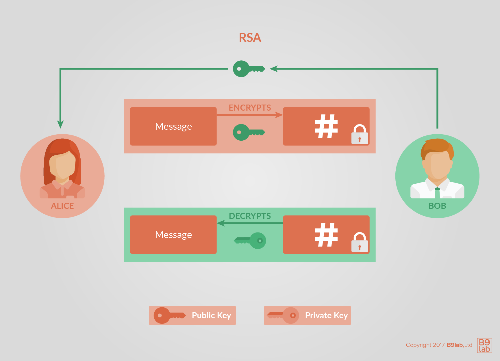
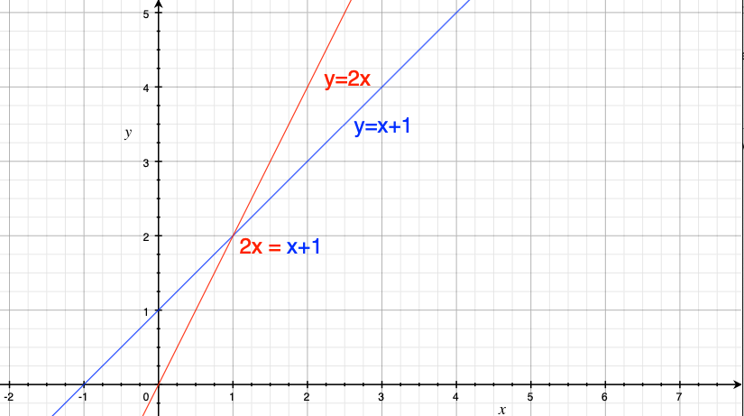
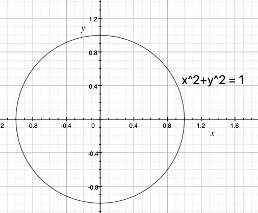
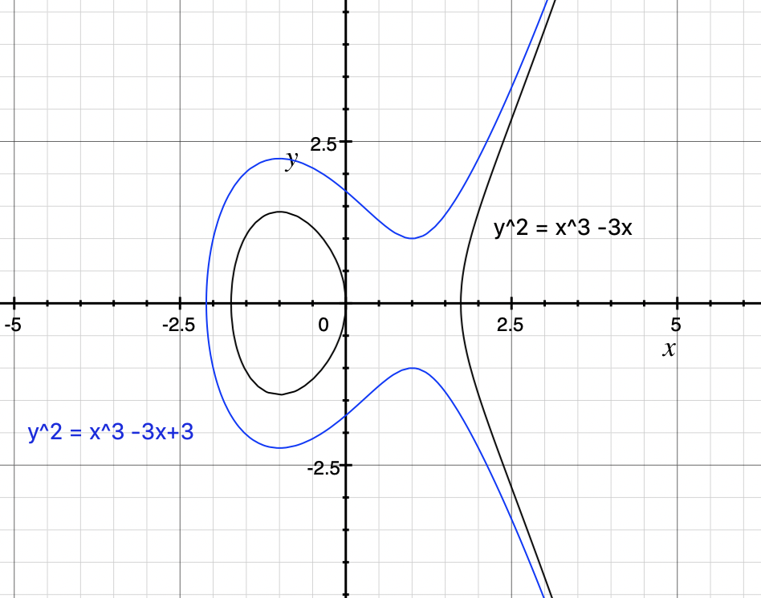
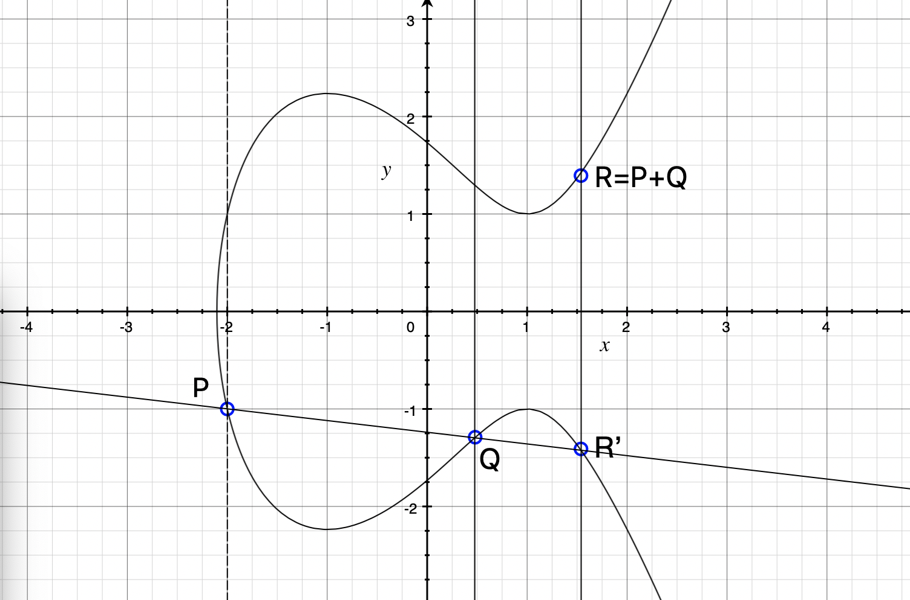

# Fundamentals

## Public key cryptosystems

Modern cryptographic systems leverage computer capabilities to make accessible the power of certain mathematical functions.

### Public / private key

Such keys always come in pairs and offer various capabilities. Those capabilities are based on cryptographic mathematics. As their name suggest, the public key is meant to be distributed to whoever is relevant, while the private key is to be jealously guarded, akin to having your house address public, but keeping the key to your house private.

Let's have a look at examples, which you may know under the names:

* RSA
* PGP, GnuPG

Example (Linux):

```
// Create SECP256K1 private key with explicit parameters for backward compatibility
$ openssl ecparam -name secp256k1 -genkey -noout -out secp256k1-key.pem -param_enc explicit
// Create public key
$ openssl ec -in secp256k1-key.pem -pubout -out secp256k1-key-pub.pem
// Show public key
$ openssl ec -in secp256k1-key-pub.pem -pubin -text -noout

// Create RSA private key
$ openssl genrsa -des3 -out rsa-key.pem 2048
Generating RSA private key, 2048 bit long modulus
.....................................................+++
...........+++
e is 65537 (0x10001)
Enter pass phrase for rsa-key.pem:
Verifying - Enter pass phrase for rsa-key.pem:
// Create public key
$ openssl rsa -in rsa-key.pem -outform PEM -pubout -out rsa-key-pub.pem
Enter pass phrase for rsa-key.pem:
writing RSA key
```

This is like a password that is used to encrypt your private key on disk. If the private key was not encrypted, it would be at greater risk of theft. Since you are just testing here, you can put nothing or a simple word. But remember that whenever you create keys in the future, you need to protect them with a proper password.

Note that you may need openssl version 1.0 or newer.

#### Encrypt and decrypt

Alice wants to send a message to Bob, and for Bob's eyes only:

* Bob gives Alice his public key
* Alice uses Bob's public key to encrypt the message
* Alice sends Bob the encrypted message
* Bob decrypts the message with his private key



Example:

```bash
// Encrypt file
$ openssl pkeyutl -encrypt -pubin -inkey rsa-key-pub.pem -in helloworld.txt -out helloworld.enc
// Decrypt file
$ openssl pkeyutl -decrypt -inkey rsa-key.pem -in helloworld.enc -out helloworld2.txt
```

If you receive an error, try with `openssl rsautl` instead.

#### Sign and verify

Alice wants to make sure that Bob's public announcement is indeed from Bob:

* Bob gives Alice his public key
* Bob signs his announcement with his private key
* Bob sends Alice his announcement and its signature
* Alice verifies the signature with Bob's public key


Example:

```bash
// Sign file hash
$ openssl dgst -sha256 -sign secp256k1-key.pem -out helloworld-bin.sha256 helloworld.txt
// Encode signature in Base64
$ openssl base64 -in helloworld-bin.sha256 -out helloworld.sha256

// Decode signature form Base64
$ openssl base64 -d -in helloworld.sha256 -out helloworld-bin-decoded.sha256
// Verify signature
$ openssl dgst -sha256 -verify secp256k1-key-pub.pem -signature helloworld-bin-decoded.sha256 helloworld.txt
Verified OK
```

#### Mix and match

It is possible to mix both ideas, whereby Alice encrypts her message with Bob's public key, then signs the encrypt file with her private key. Upon reception, Bob verifies the signature with Alice's public key, then decrypts the file with his private key.

#### What is this sorcery?

If these examples seem counter-intuitive it means you sense the mathematical wizardry of public key encryption. It's not especially important that you understand the math at a deep level, but it is important that you understand the properties of it. 

Given four keys: A,B,C and D, we can encrypt a message with A, B and C such that D is required to decrypt it and D is very hard to guess or discover. So, if Alice knows her private key and her public key and she also knows Bob's public key, she can encrypt a message that can only be understood by someone with knowledge of Bob's private key. 

We can proceed with the understanding that signed messages from Alice could only come from someone with knowledge of Alice's private key.


### Key management, PKI

If you look again at the Alice and Bob examples, you will notice that there is a vulnerability in "Bob gives Alice his public key". A malicious Charlie could intercept Bob's public key and pass on his own public key to Alice.
Key management and public key infrastructure (PKI) is an important aspect of cryptography that helps mitigate this risk.

#### Cryptographic hash functions

Such a hash function:

* converts an input, a.k.a. the message, into an output, a.k.a the hash
* does the conversion in a reasonable amount of time
* is such that it is practically impossible to re-generate the message out of the hash
* is such that the tiniest change in the message, changes the hash beyond recognition
* is such that it is practically impossible to find 2 different messages with the same hash

With such a function, you can:

*  prove that you have a message without disclosing the content of the message, for instance:
    * to prove you know your password
    * to prove you previously wrote a message
* rest assured the message was not altered
* index your messages

MD5 is such a function:

```bash
$ echo "The quick brown fox jumps over the lazy dog" | md5
37c4b87edffc5d198ff5a185cee7ee09
```

On Linux, it is `md5sum`. Now let's introduce a typo:

```bash
$ echo "The quick brown fox jump over the lazy dog" | md5
4ba496f4eec6ca17253cf8b7129e43be
```

Notice how the 2 hashes have nothing in common.

`MD5` is no longer considered a hard-to-crack hash function. Bitcoin uses `SHA-256`. Ethereum uses `Keccak-256`and `Keccak-512`.

It is possible to index content by its hash, in essence creating a hashtable. If you have used IPFS or BitTorrent's magnet links, among others, then you have used a hashtable.

### Digital Certificates

Digital certificates are used (among other things) to prove an identity. They are given by a recognised Certification Authority(CA).  A widespread procedure is the public key certificate. It proves the ownership of a public key. We will describe below the standard X.509.

The standard X.509 is defined by the Telecommunication Standardization Sector(ITU-T) of the International Telecommunication Union(ITU).[[1]](https://en.wikipedia.org/wiki/X.509) It offers format and semantics for public key certificates. [X.509](https://www.ietf.org/rfc/rfc5280.txt) is profiled in the formal language ASN.1. Common use cases are validation of documents and securing of communication. For an example, X.509 is used in TLS/SSL. Its origin is in the X.500 standard from year 1988. Since version 3, X.509 enables flexible topologies, like bridges and meshes. Invalid certificates are listed in certificate revocation lists. (CRLs) CRL is vulnerable against DOS attacks.

A X.509 certificate contains information such as version number, serial number, signature algorithm, validity period, subject name, public key algorithm, subject public key, certificate signature algorithm, certificate signature and extensions. An extension has a type, a corresponding value and a critical flag. Non-critical extensions are only informational.

#### Signature

The concept of digital signatures is simple. If a given message is first hashed and then encrypted by a private key, one can verify the signature by decryption with corresponding public key. We need to hash the message to avoid the creation of signatures by mixing the messages and corresponding signatures. (See RSA chapter) This way, we know, that the sender has the private key to the given public key. 

## Theory

### RSA

RSA(Rives, Shamir, Adleman) is a public-key cryptosystem that was first published in 1977. The premise is that if you have a public key ```$$(pubKey,n)$$``` and a private key ```$$priKey$$``` then you can do the following operations on very large numbers:

* encrypt a message:

`$$message ^ {pubKey} \equiv encMessage \mod n$$`

* decrypt the encrypted message:

`$$encMessage ^ {priKey} \equiv message \mod n$$`

Of course, you need to have `$n$` large enough so as not to destroy the `$message$`'s information. Notice also that to encrypt, you need to know both `$pubKey$` and `$n$`, that is the pair that needs to be public knowledge. The `$priKey$`, as ever, is to be protected.

If you want to express that in terms of a theorem, you would say that:

> there exists a triplet `$(priKey, pubKey, n)$` such that for any `$message$`, we get `$(message ^ {pubKey}) ^ {priKey} \equiv message \mod n$`, with the additional hurdle that calculating `$priKey$` out of `$(pubKey, n)$` is computationally expensive and in practice impossible.

Let us work out in detail how you create such a triplet.

#### How

How can we calculate such a triplet of `$(pubKey, n)$` and `$priKey$`? Of course, the difficulty and the art was in finding the following solution, and proving it satisfies the theorem above. Let us dive right in.

* First we choose two prime numbers `$p$` and `$q$`. Then we calculate `n` as their product: `$n = p \cdot q$`.
* Second, we calculate [Euler's totient function](https://en.wikipedia.org/wiki/Euler%27s_totient_function) `$\phi(n)$`. Unfortunately, calculating `$\phi$` in general terms is an NP problem. Fortunately, and this is no accident, if and only if `p` and `q` are prime numbers, then, it turns out that `$$\phi(n) = (p - 1) \cdot (q - 1)$$` .
* Now we can use a random `$pubKey$`, that satisfies the following 2 conditions:
    * it is [coprime](https://en.wikipedia.org/wiki/Coprime_integers) with `$\phi(n)$`
    * it is smaller than `$\phi(n)$`.
* From there, calculating the `$priKey$` means calculating a `$priKey$` that satisfies the following equation:

`$$a \cdot \phi(n) + priKey \cdot pubKey = 1$$`

where we can use the [extended euclidean algorithm](https://en.wikipedia.org/wiki/Extended_Euclidean_algorithm) to get `$priKey$`. You will notice that in this algorithm the part on the right: `$= 1$` is actually `$= gcd(phi(n), pubKey)$`. [gcd](https://en.wikipedia.org/wiki/Greatest_common_divisor) is the greatest common divisor.

Now we can delete `$p$`, `$q$` and `$\phi(n)$`. And delete them we must, as they could otherwise be used to crack the private key.

#### Example

Let us have a look at an example. 

* We pick `$p = 2399$` and `$q = 26371$`, which are prime numbers large enough for our demonstration. From them, we deduce that `$n = 63264029$` and `$\phi(n) = 63235260$`.
* Now, we have to pick a `$pubKey < \phi(n)$` and not a divisor of it. Let us pick `$pubKey = 54833$`.
* With the help of the [Python implementation](https://en.wikibooks.org/wiki/Algorithm_Implementation/Mathematics/Extended_Euclidean_algorithm) of the extended euclidean algorithm, we pass `xgcd(63235260, 54833)`. It returns us a triplet. We only care about the last element of it, i.e. `$priKey = 6589577$`.

```python
$ python
Python 2.7.15 (default, Dec 13 2018, 23:06:29) 
[GCC 4.2.1 Compatible Apple LLVM 10.0.0 (clang-1000.11.45.5)] on darwin
Type "help", "copyright", "credits" or "license" for more information.
>>> def xgcd(a, b):
...     """return (g, x, y) such that a*x + b*y = g = gcd(a, b)"""
...     x0, x1, y0, y1 = 0, 1, 1, 0
...     while a != 0:
...         q, b, a = b // a, a, b % a
...         y0, y1 = y1, y0 - q * y1
...         x0, x1 = x1, x0 - q * x1
...     return b, x0, y0
... 
>>> xgcd(63235260, 54833)
(1, -5714, 6589577)
```

Now we forget about `$p$`, `$q$` and `$\phi(n)$`. Time to put this effort to good use. Let us encrypt the `$message = 9874587$`. Yes, any digital message is essentially a large number. Notice that we took a message that is smaller than `$n$`. That is by design, otherwise we would lose information. We calculate:

`$$9874587 ^ {54833} \equiv 36898107 \mod 63264029$$`

Our encrypted message is thus `$36898107$`. 

You also happen to know the `$priKey$`, so let us decrypt this right away. We calculate the message back:
`$$36898107 ^ {6589577} \equiv 9874587 \mod 63264029$$`

Yes, our message is, and was, `$9874587$`.

#### Why it works

Let us first introduce Fermat's little theorem. It states that if `$p$` is a prime number then for any number `$a$`, we have `$$a ^ p \equiv a \mod p$$`. If `$a$` is not a multiple of `$p$`, then it can be rewritten as `$$a ^ {p - 1} \equiv 1 \mod p$$`. Our proof will use that knowledge later on.

Let us rework what we have:

`$a \cdot \phi(n) + priKey \cdot pubKey = 1$` means that:

`$$priKey \cdot pubKey \equiv 1 \mod \phi(n)$$`

So `$priKey \cdot pubKey - 1$` is a multiple of `$\phi(n)$`.

But you will recall that `$\phi(n)$` is itself a product of `$p - 1$` and `$q - 1$`. It follows that `$priKey \cdot pubKey - 1$` is a multiple of `$p - 1$` and is also a mutiple of `$q - 1$`. For our purposes, and to express these multiples, we will introduce `$h$` and `$k$` such that:

`$$priKey \cdot pubKey - 1 = h \cdot (p - 1) = k \cdot (q - 1)$$`

With this, let us hop on what we want to prove, encryption followed by decryption works. Let us do just that:

`$$(message ^ {pubKey}) ^ {priKey}$$`

Which, we remember from our algebra classes can be rewritten as:

`$$message ^ {pubKey \cdot priKey}$$`

Which, again, can be rewritten as:

`$$message \cdot message ^ {pubKey \cdot priKey - 1}$$`

Oh we now recognise this thing we had a few lines above. Let us replace and rewrite as:

`$$message \cdot message ^ {h \cdot (p - 1)}$$`

And algebra class helping out, can be rewritten as:

`$$message \cdot (message ^ {p - 1}) ^ {h}$$`

It looks awfully like something we saw in Fermat's little theorem. Let us first suppose that `$message$` is a multiple of `$p$`, i.e. that `$message \equiv 0 \mod p$`. In that case we can say that `$$message ^ {p \cdot q} \equiv message \mod p$$`. 

In other cases, thanks to Fermat's, we have `$message \cdot (message ^ {p -1 }) ^ {h} \equiv message \cdot 1 ^ {h} \equiv message \mod p$`

Now, we can do the same steps but this time with `$k$` and `$q$` in mind: `$message \cdot (message ^ {q -1 }) ^ {k} \equiv message \cdot 1 ^ {k} \equiv message \mod q$`

Let us remember that `$p$` and `$q$` are prime. So for a number to be a multiple of both, it has to be a multiple of their product `$p \cdot q = n$`.

So by mixing these 2 paths, we end up with, `$$(message ^ {pubKey}) ^ {priKey} \equiv message \mod {p \cdot q} \equiv message \mod n$$`. This is what we set out to demonstrate about why RSA works.

#### Trivial zero-knowledge Proof

In order to visually save some space, let us call `$ x $` our message, `$ e $` our public key and `$ E $` our RSA encrytion function. We thus have `$ E(x) = x^e $`. Here we do not care about the private key, which would allow us to decrypt, nor do we care about `$ \mod n $`. We only care about the fact that the keys were created so that they are practically impossible to crack.

We are now going to construct a game scenario whereby Alice wants to prove to Bob that she knows a piece of information without telling Bob what that piece of information is. That is the zero-knowledge part of the proof.

The scenario is the following. Alice and Bob are given a very large number, `$ z $`, for which it is difficult to find divisors. Think `$ z = x \cdot y $` where `$ x $` and `$ y $` are prime numbers. The winner of the game is the one who can find these `$ x $` and `$ y $` divisors. However, the winner does not want the loser to know these divisors, to prevent the loser from pretending that _they_ found the divisors. The winner still wants to convince the loser that they found those divisors.

Let us assume Alice found `$ x $` and `$ y $` such that `$ z = x \cdot y $`. All Alice has to do is give Bob the following 3 pieces of information:

* `$ E(x) $`
* `$ E(y) $`
* `$ z $`, yes, Bob already has it

With these, all Bob has to do to verify Alice's claim is compare `$ E(x) \cdot E(y) $` and `$ E(z) $`. If they are equal, Bob is satisfied with the verification. Why? Because using the classical properties of the [exponentiation](https://en.wikipedia.org/wiki/Exponentiation):

`$$ E(x) \cdot E(y) = x^e \cdot y^e = {x \cdot y}^e = E(x \cdot y) = E(z) $$`

Alice can thus convincingly claim that she has won the game. Additionally, Alice is pretty much reassured that Bob cannot find `$ x $` nor `$ y $`, because he would have to calculate Alice's private key so as to do `$ E(x)^{priKey} \mod n $`. And we know that calculating the private key is practically impossible.

Let us reuse our previous example. If we use `$ x = 12 $` and `$ y = 24 $`, then we get `$12 \cdot 24 = 288$` for the output and we get `$$E(12) \cdot E(24) \equiv E(288) \equiv 60822364 \mod 63264029 $$` with same `$(pubKey, n)$` and `$priKey$` like in the above section. So if we give someone `$E(12)$`, `$E(24)$` and our output `$288$`, he can verify, if the calculation is done well, without knowing `$x$` and `$y$`.

Another trivial example of zero-knowledge proof are digital signatures with RSA. When signing, you use your private key, while the counterparty uses your public key to verify. So in essence, you prove that you have access to the private key without disclosing it. 

### Elliptic-curve cryptography

Another popular tool for creating public-private key pairs are elliptic curves. This topic is a bit more complicated than RSA.

Let us begin with some simple geometry. A straight line can be described as a function with:

`$ y = m \cdot x + c $`

In the following diagram, we show two such lines:



You will notice that they intersect at one point. The point where they do is the solution to the equation:

`$ 2 \cdot x = x + 1 $`

To heavily belabour the point, we can express straight lines and points as equations. In our case, the blue line is expressed as:

`$ y = x + 1 $`

but nothing stops us from rewriting it as:

`$ y - x = 1 $`

From there we can also understand the line as the set of all `$(x, y)$` points that satisfy this equation.

In the same vein, we can also describe a circle thusly:

`$ x^2 + y^2 = 1 $`



What are the `$ (x, y) $` points that solve this equation? Since we know that `$ x $` and `$ y $` can only be between `$ -1 $` and `$ 1 $`, we can parameterise these points thusly:

`$ (x, y) = (\cos t, \sin t) $`

where `$ t $` ranges from `$ 0 $` to `$ 2 \cdot \pi $`. Similarly we can parameterise an ellipse with:

`$ (x, y) = (a \cdot \cos t, b \cdot \sin t) $`

The story from here to elliptic curves is a little complicated and loose. Let us say we want to calculate the circumference of an ellipse. For this, we need an integral:

`$ \int_{0}^{2 \cdot \pi} {\sqrt {( \frac {dx} {dt})^2 + (\frac {dy} {dt})^2} \cdot dt} $`

Which can be rewritten :

`$ \int_{0}^{2 \cdot \pi} {\sqrt {({\frac {d (a \cos t)} {dt}})^2 + ({\frac {d (b \sin t)} {dt}})^2} dt} $`

If we use the [eccentricity] (https://en.wikipedia.org/wiki/Eccentricity_(mathematics)), defined by `$ \epsilon = \sqrt{1 - \frac {b^2} {a^2}} $`, we get (with a few steps in between):

`$ 4 \cdot a \cdot \int_{0}^{\pi/2} {\sqrt{1-\epsilon^2(\sin t)^2} dt} $`

In it we see for the first time the so-called elliptic integral (of the second kind):

`$ \int_{0}^{T} {\sqrt {(1-\epsilon^2(\sin t)^2)} dt} $`

Let us just leave it that way. Such integrals are not easy to calculate. 


If we want to calculate the inverse of an elliptic integral - [given circumference but unknown boundaries](https://en.wikipedia.org/wiki/Jacobi_elliptic_functions#Definition_as_inverses_of_elliptic_integrals) - we face a group of functions called [elliptic functions](https://en.wikipedia.org/wiki/Elliptic_function). It turns out that those functions are very useful for variety of topics and there is a simple form called [Weierstrass's elliptic functions](https://en.wikipedia.org/wiki/Weierstrass%27s_elliptic_functions). 

As a central result of the theory of elliptic functions we face the equation

`$ Y^2 = 4 \cdot X^3 + a \cdot X + b $`

with X as the Weierstrass's elliptic function and Y as derivative of X. 

The curve with points `$ (x, y) $` which satisfy:

`$ y^2 = x^3 + ax + b $`

- with some additional conditions, which we will not elaborate on - is therefore called elliptic curve.

Just as we were able to represent straight lines, circles and ellipses, we can also draw such curves:



As mentioned, elliptic curves are not ellipses.

One special property of elliptic curves is that we can create a new commutative and associative operator, which will allow us to create an [abelian group](https://en.wikipedia.org/wiki/abelian_group). By way of comparison, the `$ + $` number operator is commutative:

`$ a + b = b + a $`

and associative:

`$ a + (b + c) = (a + b) + c $`

As a matter of fact, we choose to call our new operator `$ + $`. It will operate, not on numbers, but on `$ (x, y) $` points of the elliptic curve. All points of the elliptic curve are in the abelian group; the abelian group **is** the elliptic curve. That is the special property we talked about.

The difficulty, now, is to devise this operator such that it fulfills the characteristics that make it a [group](https://en.wikipedia.org/wiki/Group_(mathematics)).

Let us define the addition:

`$ P + Q = R $`

of the points `$ P $` and `$ Q $` like in the following diagram:



where we draw a line from `$ P $` to `$ Q $` to get `$ R^\prime $`. We are not done yet. The result of the addition is the [inverse](https://en.wikipedia.org/wiki/Inverse_element) of `$ R^\prime $`, the point `$ R $` flipped across the x axis from `$ R^\prime $`.

An inverse `$ -R $` of `$ R $` is defined by:

`$ R +(-R) = R + R^\prime = O $`

so one gets the [neutral element](https://en.wikipedia.org/wiki/Identity_element) as result. The neutral element `$ O $` is a point in infinite without coordinates `$ (x, y) $`. So if we draw a line from `$ R \text{\textquoteright} $` to `$ R $` the result will be an intersection at infinity. 

What happens if select ` $ P $ ` and ` $ Q $` in such a way that there is no `$ R \text{\textquoteright} $`(third intersection)? Well this does not happen over [an finite field](https://en.wikipedia.org/wiki/Elliptic_curve#Elliptic_curves_over_finite_fields), notice that our diagramm shows an elliptic curve over the real numbers. 

We can think about the case if we want to calculate `$ P+P $`. In this case we use the [tangent line](https://en.wikipedia.org/wiki/Tangent#Tangent_line_to_a_curve) at `$ P $`.

If we write down the way we add the points `$ P=(x_1,y_1) $` and `$ R=(x_2,y_2) $`, we get:

`$ x_3 \equiv s^2 -x_1 - x_2 \mod p $`

`$ y_3 \equiv s(x_1-x_3)- y_1 \mod p $`

with

`$ s \equiv (y2-y1)/(x2-x1) \mod p $` if `$ P \neq Q $`

`$ s \equiv (3x^2_1+a)/(2y_1) \mod p $` if `$ P = Q $`

and

`$ Q=(x_3,y_3) $`

Well we have a `$ \mod p $` beacuse we want to use this addition with an [elliptic curve over a finite field](http://www.graui.de/code/elliptic2/) `$ \mathbb{F}_p $`.
In this case we do not have a continuous curve. Instead the elliptic curve is a set of points now.

Because we have addition, we can also do multiplication:

`$ n \cdot P = P + P + ... + P $`

where we add `$ P $` `$ n $` times to `$ O $`. This calculation can be done [easy](https://en.wikipedia.org/wiki/P_(complexity)) but if we want to divide,

`$ R = n \cdot P $`

to get `$ n $`, there is no [easy](https://en.wikipedia.org/wiki/NP_(complexity)#Why_some_NP_problems_are_hard_to_solve) way to do so for **some elliptic curves**. 

This means we can use `$ n $` as a private key and `$ R $` as the public key and there will be no easy way to find `$ n $` using `$ R $` and `$ P $`(called **generator point**, can be any element of the curve if `$ p $` is prime).

Now we can encrypt with [Elliptic-curve Diffie–Hellman (ECDH)](https://en.wikipedia.org/wiki/Elliptic-curve_Diffie%E2%80%93Hellman) or sign with [Elliptic Curve Digital Signature Algorithm (ECDSA)](https://en.wikipedia.org/wiki/Elliptic_Curve_Digital_Signature_Algorithm). 

### Learn More

<div class="b9-reading">
	<ul>
		<li><a href="https://en.wikipedia.org/wiki/Zero-knowledge_proof">Zero-knowledge proof</a></li>
		<li><a href="http://www.mathaware.org/mam/06/Kaliski.pdf">The Mathematics of the RSA Public-Key Cryptosystem</a></li>
        <li><a href="https://andrea.corbellini.name/2015/05/17/elliptic-curve-cryptography-a-gentle-introduction/">Elliptic Curve Cryptography: a gentle introduction</a></li>
		<li><a href="https://wiki.openssl.org/index.php/Command_Line_Elliptic_Curve_Operations">EC Operations</a></li>
		<li><a href="http://osxdaily.com/2012/01/30/encrypt-and-decrypt-files-with-openssl/">Encrypt and Decrypt</a></li>
		<li><a href="https://gist.github.com/ezimuel/3cb601853db6ebc4ee49">Sign and verify</a></li>
	</ul>
</div>
