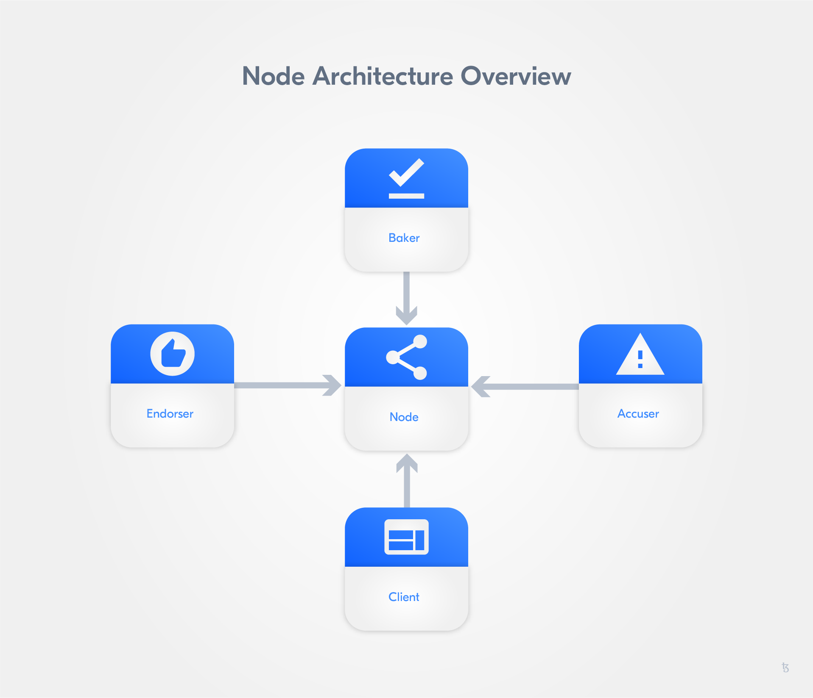

import HighlightBox from "../../src/components/HighlightBox"

## Tezos Architecture Overview

To understand the architecture of the Tezos platform, one needs to comprehend the function of:

* the endorser,
* the baker,
* the accuser,
* the node, and
* the client.

Above, you can see a graphical representation of Tezos' architecture and the relation between its individual elements.

### Node

A Tezos node is the local component of the system. It manages the context, which is the local knowledge of the Tezos blockchain state, and the connection to the gossip network and other nodes.

The gossip network is how Tezos nodes communicate to exchange blocks and operations with each other. The admin client, as well as the local endorser, baker, accuser, and client connect to the Tezos network through the node. The admin client can monitor peer-to-peer (P2P) connections.

As well as listening for updates to the context, the node can send operations to peers when instructed to by the client or emit new blocks when instructed by the baker. Furthermore, the node can endorse blocks when instructed by the endorser or even report bad blocks when instructed by the accuser.

State changing operations propagate through the network via gossip between peers until a baker includes the operation in a block. An operation can propagate across several peers before it is included in a block. New blocks are currently produced about once per minute, but this could change in the future via the Tezos governance mechanism.

After initialisation, the node will sync up with the Tezos network. As the node processes blocks, it runs the operations in the blocks against the local copy of the context to create a new context. The latest block received is known as the head of the chain. Nodes advertise the latest chain head they have to other nodes in the network.

The node also gathers metadata about peers and multiple chains that may exist so it can select the best one based on its fitness. “Fitness” determines the quality of the chain leading up to that block.

### Client

The Tezos client is the main interface to the node. The client can read the context and inspect the state (get) and it can instruct the node to perform work such as broadcasting an operation to the network.

### Baker

In Tezos, validators are referred to as bakers. As the name suggests, the baker is responsible for baking (producing) new blocks. Bakers are connected to implicit accounts (more on implicit (tz1…) vs. originated (KT1…) accounts later) and compute baking rights on a per account basis based on a baker’s total stake (i.e. tokens participating in consensus). The baker is unique in that it needs direct access to the node data directory for performance reasons.

When the baker is selected to bake a block, it draws transactions from the mempool, which is the pool of operations that are known about (via gossip) but have not yet been included in a block.

### Endorser

Like the baker, the endorser is connected to an implicit account and computes endorsing rights on a per account basis based on a baker’s total stake. On receipt of new blocks it verifies the validity of the block. If the block is valid it will broadcast an endorsement operation.

### Accuser

The accuser is a daemon that monitors all blocks received. It looks for two indications of invalid blocks:

* When a baker has signed two blocks at the same block height (blocks at the same level).
* When an endorser injects more than one endorsement operation for the same baking slot.

Such irregularities trigger double-baking and double-endorsing operations that cause the offender to lose a portion of its stake (i.e. a security deposit).

## The peer-to-peer layer

The node instantiates the P2P layer which is parameterised by the type of messages exchanged over the network (to support different P2P protocol versions and extensions) and the type of metadata for each peer. The metadata is used to compute a score for each peer that reflects the level of trust in the nodes. Policies can control communication between the node and peers based on the different scores (levels of trust) in those peers.

The P2P layer consists of a connections pool, the operations on those connections, and a set of workers. The worker pattern is used extensively and followed by the set of workers.

## OCaml, Michelson, SmartPy, LIGO, and other languages

Tezos itself is implemented in [OCaml](https://ocaml.org/). OCaml is a functional programming language used in mission-critical industries that require formal proofs of properties of programs. [Michelson](https://tezos.gitlab.io/mainnet/whitedoc/michelson.html) is a domain-specific language used to write smart contracts on Tezos. It is stack-based, strongly typed, and designed to facilitate formal verification so developers can more easily prove properties of their smart contracts.

There are several other Tezos smart contracts languages. [SmartPy](https://smartpy.io/) is an intuitive and effective smart contracts language and development platform that will allow Python developers to write smart contracts on Tezos. [LIGO](https://ligolang.org/) is a statically typed high-level language that compiles down to Michelson. The syntaxes that are currently supported are PascaLIGO (pascal-like syntax) and CameLIGO (caml-like syntax). 
ReasonLIGO (reason-like syntax) will be supported soon. 
[Morley/Lorentz](https://hackage.haskell.org/package/morley) is a library to write Michelson contracts in Haskell.
[Fi](https://fi-code.com/) is another high-level language that compiles to Michelson and is similar to Javascript and Solidity. Additionally, developers can write Tezos smart contracts in [ReasonML](https://medium.com/tocqueville-group/announcing-granary-a-tezos-development-environment-manager-by-stove-labs-b4a649e0598f).

<HighlightBox type="tip">

[Watch](https://www.youtube.com/watch?v=zl5Ice0z9oU&feature=youtu.be) Arthur Breitman talk about Tezos.

</HighlightBox>

<HighlightBox type="reading">
<ul>
	<li><a href="https://learn.tqgroup.io/files/language.html#faq">Introduction to Smart Contracts in Tezos</a> by the Tocqueville Group (TQ)</li>
    <li><a href="https://learn.tqgroup.io/files/language.html#faq">Michelson Tutorial Series</a> by camlCase</li>
    <li><a href="https://learn.tqgroup.io/files/language.html#faq">Michelson presentation</a> by Benjamin Canou</li>
    <li><a href="https://tezos.com/static/white_paper-2dc8c02267a8fb86bd67a108199441bf.pdf">Tezos White Paper</a></li>
  	<li><a href="https://tezos.com/static/position_paper-841a0a56b573afb28da16f6650152fb4.pdf">Tezos Position Paper</a></li>
    <li><a href="https://tezos.stackexchange.com/">Tezos StackExchange</a></li>
    <li><a href="https://tezos.gitlab.io/mainnet/">Tezos Developer Documentation</a></li>
    <li><a href="https://developers.tezos.com/">Tezos Developer Portal</a></li>
    <li><a href="https://learn.tqgroup.io/">TQ Tezos Wiki</a></li>
    <li><a href="https://medium.com/tezos">Tezos Medium Publication</a></li>
    <li><a href="https://youtu.be/ftA7O04yxXg">General Tezos Presentation</a> by Arthur Breitman</li>
    <li><a href="https://gitlab.com/camlcase-dev/michelson-tutorial/tree/master">Michelson Tutorial Series</a> by camlCase</li>
    <li><a href="https://medium.com/tqtezos/why-tezos-is-the-best-platform-for-tokenized-assets-89a960cfa828">“Why Tezos is the Best Platform for Tokenized Assets”</a> by Charlie Wiser</li>
    <li><a href="https://smartpy.io/">SmartPy.io</a></li>
    <li><a href="https://ligolang.org/">LIGO</a></li>
</ul>
</HighlightBox>
