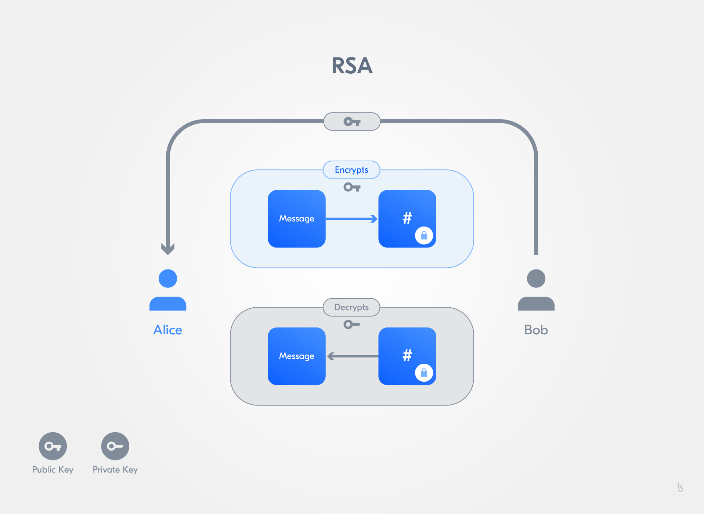
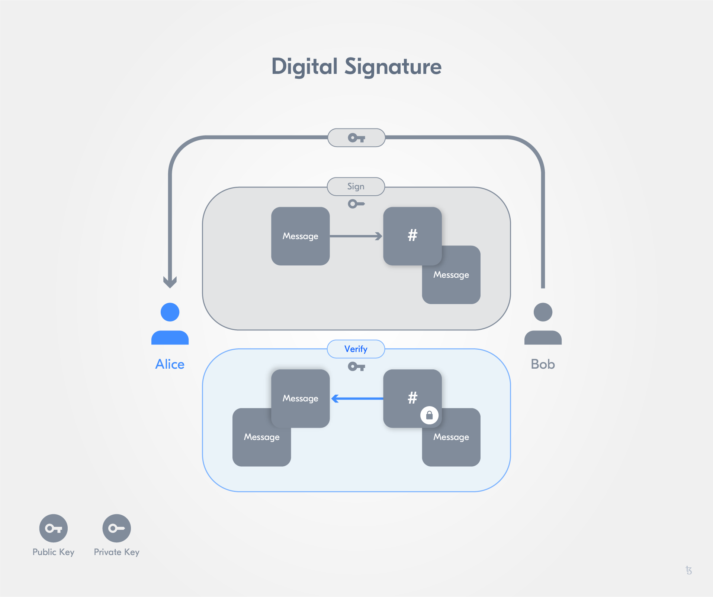

import HighlightBox from "../../src/components/HighlightBox"

import {
  ExpansionPanel,
  ExpansionPanelList,
  ExpansionPanelListItem
} from 'gatsby-theme-apollo-docs';


It is now time to participate in a Tezos network.

There are currently three Tezos networks:

- [Mainnet](https://tzstats.com/), has been live and open since 30 June 2018,
- [Edonet](https://edo.tzstats.com/), a test network that runs the same protocol as the mainnet, and
- [Florencenet](https://tezos.gitlab.io/introduction/test_networks.html#florencenet), a cutting-edge development network that runs most recent proposed protocol.

The **Mainnet** is the main Tezos blockchain, where Tezos tokens (tez) have real value - so play with it only when you are confident in what you are doing. 

<ExpansionPanel title="The history mode - Different types of nodes">

**History modes** are a _representation of different policies determining the historical/past data included in a node_. They are useful as you can select what part of the chain's history you want to store in our node setup. This helps **manage the disk storage** required.

For nodes there are **three modes** in Tezos:

* The **rolling mode**: A node that only stores the minimal rolling fragment of data to validate blocks and synchronise with the head;
* The **full mode**: The **deault mode**, the node stores the **minimum data amount** needed to reconstruct the complete ledger state since the genesis block;
* The **archive mode**: Node stores all chain data to query for information since the genesis block.

As said before, in the **rolling mode**, the minimal data for rolling is stored. Thus, it is the _lightest mode_. The node is able to validate blocks and only requires minimal and bounded disk storage. Bootstrapping the mode can be done within minutes. It is suitable to run on low-resource architectures. As a downside, the node cannot query block information in regard to balances and staking rights. Furthermore, it doesn't help other nodes to bootstrap because it cannot provide the complete chain history.

**Full mode** for nodes allows to store the minimal data needed to reconstruct the ledger state, thus requiring little disk storage. It can be synchronised using a snapshot, and can help other nodes bootstrap and synchronise with the Tezos chain. This mode is most-suitable for baker nodes. The necessary disk storage continously increases while history "progresses". This type of node cannot query for balances or staking rights.

The **archive mode** is the _heaviest mode_ as archive nodes store the whole data of the blockchain. This allows archive nodes to query for any information since the genesis block. As the whole chain is available, archive nodes are especially suited for indexers and block explorers. At the same time, this node type requires a large amount data storage.

If you want to find out more on how to set up the different node types, we recommend the documentation on:

* [Setting up a node in rolling mode](https://tezos.gitlab.io/user/history_modes.html#set-up-a-rolling-node);
* [Setting up a node in full mode](https://tezos.gitlab.io/user/history_modes.html#set-up-a-full-node);
* [Settinp up a node in archive mode](https://tezos.gitlab.io/user/history_modes.html#set-up-an-archive-node).

We will walk you through the first steps to set up a full node and begin developing on Edonet shortly.

</ExpansionPanel>

The easiest way to maintain a Tezos node is to use the docker images that are generated from the [Tezos repository](https://gitlab.com/tezos/tezos/tree/master) on GitLab. They are published on DockerHub and the repository offers a script called `tezos-docker-manager.sh`, which can pull the necessary images and start a Docker Compose network. 

<HighlightBox type="tip">

We just need to rename the script into <code>mainnet.sh</code> if we want to participate on the mainnet. After all, the program name called from the Terminal is the first parameter passed to the process. ;) 

</HighlightBox>

### Docker

Docker offers so-called "software containers" to execute applications. "Container" is a similar concept to that of virtual machines (VM) and uses **libcontainer**. The isolation level is not as strong as with a VM because Docker containers share the host OS kernel. On the other hand, containers are lighter in weight (Storage, RAM and CPU) and faster in execution compared to a VM.

**Dockerfiles** are blueprints for creating **Docker Images**, which are used to start **containers**. You can find public images on [Docker Hub](https://hub.docker.com/). 

<ExpansionPanel title="Setting up your VM">

If you use Windows on your host, we strongly recommend you use a VM to first establish a workspace based on Ubuntu Linux. 

Check out these step-by-steps:

`youtube: https://youtu.be/RacKewhRAD4`

`youtube: https://youtu.be/I235LTD1iMM`

`youtube: https://youtu.be/yEJBH1UPMfE`

</ExpansionPanel>

## First steps

We will begin our Tezos development on **Edonet**.

<HighlightBox type="tip">

Make sure you have installed [Docker](https://www.docker.com/get-started)!

</HighlightBox>

First, we are going to download the Edonet script, make it executable, and run it. Open a terminal (when you see a `$` it means it is a terminal command, do not paste the `$`) and paste the following commands:

```sh
$ wget -O edonet.sh https://gitlab.com/tezos/tezos/raw/latest-release/scripts/tezos-docker-manager.sh
$ chmod +x edonet.sh
$ ./edonet.sh start --rpc-port 8732
```
As the script spins up Docker images, it first needs to download them, and this may take some time. When the images are on your machine, it will start 7 containers. You can inspect them with:

```sh
$ docker ps
```
You should now see something similar to:


<HighlightBox type="tip">

In case docker complains about connection pool, run export `COMPOSE_PARALLEL_LIMIT=25` and restart the network.

</HighlightBox>

<HighlightBox type="info">

You can find each component's description in the previous section, **Tezos Architecture** and list supported protocols with `./edonet.sh client list understood protocols`. Notice, only one protocol is activated at any given time. 

</HighlightBox>

From time to time, the `tezos-docker-manager.sh` script will be updated, and, when you want the latest version, instead of downloading it again with the wget command, you can enter:

```sh
$ ./edonet.sh update_script
```

or 

```sh
$ ./edonet.sh restart
```

which will stop the network, update the script, and start the network again. In case you want to disable automatic update when restarting, you can use:

```sh
$ export TEZOS_ALPHANET_DO_NOT_PULL=yes
```

<HighlightBox type="warn">

When the script is being updated, you may again need the command `chmod +x edonet.sh` to make it executable.

</HighlightBox>

Wait a few minutes for the node container to start synchronising with the edonet and then check its logs with:

```sh
$ docker logs edonet_node_1 --follow
```
You should be able to see how it syncs up. To stop the endless logs, press <kbd>CTRL-C</kbd>.

Any command starting with `./edonet.sh client` will behave as a **tezos-client**. So, this will be our way to interact with the **node** container we started.

You can get a list of the commands with:

```sh
$ ./edonet.sh client man
```
<HighlightBox type="tip">

You can find the reference for the client commands in the [client manual](https://tezos.gitlab.io/shell/cli-commands.html) of the Tezos Developer Documentation.

</HighlightBox>

## First private key

Before you can send anything on this network, you will need a public-private key pair. Let's take a closer look at the cryptographic concept of public and private keys.

Public-private keys always come in pairs and offer various capabilities. Those capabilities are based on cryptographic mathematics. As their name suggest, the public key is meant to be distributed to whoever is relevant, while the private key is to be jealously guarded, akin to having your house address public, but keeping the key to your house private.

#### Encrypt and decrypt

Alice wants to send a message to Bob, and for Bob's eyes only:

* Bob gives Alice his public key;
* Alice uses Bob's public key to encrypt the message;
* Alice sends Bob the encrypted message;
* Bob decrypts the message with his private key.



#### Sign and verify

Alice wants to make sure that Bob's public announcement is indeed from Bob:

* Bob gives Alice his public key;
* Bob signs his announcement with his private key;
* Bob sends Alice his announcement and its signature;
* Alice verifies the signature with Bob's public key.



### Key management and PKI

If you look again at the Alice and Bob examples, you will notice that there is a vulnerability in "Bob gives Alice his public key". A malicious Charlie could intercept Bob's public key and pass on his own public key to Alice.

Key management and public key infrastructure (PKI) is an important aspect of cryptography that helps mitigate this risk.

<ExpansionPanel title="RSA">

RSA(Rives, Shamir, Adleman) is a public-key cryptosystem that was first published in 1977. The premise is that if you have a public key ```$$(pubKey,n)$$``` and a private key ```$$priKey$$``` then you can do the following operations on very large numbers:

* encrypt a message:

`$$message ^ {pubKey} \equiv encMessage \mod n$$`

* decrypt the encrypted message:

`$$encMessage ^ {priKey} \equiv message \mod n$$`

Of course, you need to have `$n$` large enough so as not to destroy the `$message$`'s information. Notice also that to encrypt, you need to know both `$pubKey$` and `$n$`, that is the pair that needs to be public knowledge. The `$priKey$`, as ever, is to be protected.

If you want to express that in terms of a theorem, you would say that:

> there exists a triplet `$(priKey, pubKey, n)$` such that for any `$message$`, we get `$(message ^ {pubKey}) ^ {priKey} \equiv message \mod n$`, with the additional hurdle that calculating `$priKey$` out of `$(pubKey, n)$` is computationally expensive and in practice impossible.

Let's work out in detail how you create such a triplet.

**How**

How can we calculate such a triplet of `$(pubKey, n)$` and `$priKey$`? Of course, the difficulty and the art was in finding the following solution, and proving it satisfies the theorem above. Let's dive right in!

* First we choose two prime numbers `$p$` and `$q$`. Then we calculate `n` as their product: `$n = p \cdot q$`.
* Second, we calculate [Euler's totient function](https://en.wikipedia.org/wiki/Euler%27s_totient_function) `$\phi(n)$`. Unfortunately, calculating `$\phi$` in general terms is an NP problem. Fortunately, and this is no accident, if and only if `p` and `q` are prime numbers, then, it turns out that `$$\phi(n) = (p - 1) \cdot (q - 1)$$` .
* Now we can use a random `$pubKey$`, that satisfies the following 2 conditions:
    * it is [coprime](https://en.wikipedia.org/wiki/Coprime_integers) with `$\phi(n)$`;
    * it is smaller than `$\phi(n)$`.
* From there, calculating the `$priKey$` means calculating a `$priKey$` that satisfies the following equation:

`$$a \cdot \phi(n) + priKey \cdot pubKey = 1$$`

where we can use the [extended Euclidean algorithm](https://en.wikipedia.org/wiki/Extended_Euclidean_algorithm) to get `$priKey$`.

You will notice that in this algorithm the part on the right: `$= 1$` is actually `$= gcd(phi(n), pubKey)$`. [gcd](https://en.wikipedia.org/wiki/Greatest_common_divisor) is the greatest common divisor.

Now we can delete `$p$`, `$q$` and `$\phi(n)$`. And delete them we must, as they could otherwise be used to crack the private key.

**Example**

Let's have a look at an example. 

* We pick `$p = 2399$` and `$q = 26371$`, which are prime numbers large enough for our demonstration. From them, we deduce that `$n = 63264029$` and `$\phi(n) = 63235260$`.
* Now, we have to pick a `$pubKey < \phi(n)$` and not a divisor of it. Let's pick `$pubKey = 54833$`.
* With the help of the [Python implementation](https://en.wikibooks.org/wiki/Algorithm_Implementation/Mathematics/Extended_Euclidean_algorithm) of the extended Euclidean algorithm, we pass `xgcd(63235260, 54833)`. It returns us a triplet. We only care about the last element of it, i.e. `$priKey = 6589577$`.

```python
$ python
Python 2.7.15 (default, Dec 13 2018, 23:06:29) 
[GCC 4.2.1 Compatible Apple LLVM 10.0.0 (clang-1000.11.45.5)] on darwin
Type "help", "copyright", "credits" or "license" for more information.
>>> def xgcd(a, b):
...     """return (g, x, y) such that a*x + b*y = g = gcd(a, b)"""
...     x0, x1, y0, y1 = 0, 1, 1, 0
...     while a != 0:
...         q, b, a = b // a, a, b % a
...         y0, y1 = y1, y0 - q * y1
...         x0, x1 = x1, x0 - q * x1
...     return b, x0, y0
... 
>>> xgcd(63235260, 54833)
(1, -5714, 6589577)
```

Now we forget about `$p$`, `$q$` and `$\phi(n)$`. Time to put this effort to good use. Let's encrypt the `$message = 9874587$`. Yes, any digital message is essentially a large number. Notice that we took a message that is smaller than `$n$`. That is by design, otherwise we would lose information. We calculate:

`$$9874587 ^ {54833} \equiv 36898107 \mod 63264029$$`

Our encrypted message is thus `$36898107$`. 

You also happen to know the `$priKey$`, so let's decrypt this right away. We calculate the message back:
`$$36898107 ^ {6589577} \equiv 9874587 \mod 63264029$$`

Yes, our message is, and was, `$9874587$`.

**Why it works**

Let's first introduce Fermat's little theorem. It states that if `$p$` is a prime number then for any number `$a$`, we have `$$a ^ p \equiv a \mod p$$`. If `$a$` is not a multiple of `$p$`, then it can be rewritten as `$$a ^ {p - 1} \equiv 1 \mod p$$`. Our proof will use that knowledge later on.

Let's rework what we have:

`$a \cdot \phi(n) + priKey \cdot pubKey = 1$` means that:

`$$priKey \cdot pubKey \equiv 1 \mod \phi(n)$$`

So, `$priKey \cdot pubKey - 1$` is a multiple of `$\phi(n)$`.

But you will recall that `$\phi(n)$` is itself a product of `$p - 1$` and `$q - 1$`. It follows that `$priKey \cdot pubKey - 1$` is a multiple of `$p - 1$` and is also a multiple of `$q - 1$`. For our purposes, and to express these multiples, we will introduce `$h$` and `$k$` such that:

`$$priKey \cdot pubKey - 1 = h \cdot (p - 1) = k \cdot (q - 1)$$`

With this, let's hop on what we want to prove, encryption followed by decryption works. Let's do just that:

`$$(message ^ {pubKey}) ^ {priKey}$$`

Which, we remember from our algebra classes can be rewritten as:

`$$message ^ {pubKey \cdot priKey}$$`

Which, again, can be rewritten as:

`$$message \cdot message ^ {pubKey \cdot priKey - 1}$$`

Oh we now recognise this thing we had a few lines above. Let's replace and rewrite as:

`$$message \cdot message ^ {h \cdot (p - 1)}$$`

And algebra class helping out, can be rewritten as:

`$$message \cdot (message ^ {p - 1}) ^ {h}$$`

It looks awfully like something we saw in Fermat's little theorem. Let's first suppose that `$message$` is a multiple of `$p$`, i.e. that `$message \equiv 0 \mod p$`. In that case we can say that `$$message ^ {p \cdot q} \equiv message \mod p$$`. 

In other cases, thanks to Fermat's, we have `$message \cdot (message ^ {p -1 }) ^ {h} \equiv message \cdot 1 ^ {h} \equiv message \mod p$`

Now, we can do the same steps but this time with `$k$` and `$q$` in mind: `$message \cdot (message ^ {q -1 }) ^ {k} \equiv message \cdot 1 ^ {k} \equiv message \mod q$`

Let's remember that `$p$` and `$q$` are prime. So for a number to be a multiple of both, it has to be a multiple of their product `$p \cdot q = n$`.

So by mixing these 2 paths, we end up with, `$$(message ^ {pubKey}) ^ {priKey} \equiv message \mod {p \cdot q} \equiv message \mod n$$`. This is what we set out to demonstrate about why RSA works.

</ExpansionPanel>

Now that we dived into the basics relating to public-key cryptosystems, let's do something basic and **create a new key pair**, which our local node will know as `myFirstKey`:

```sh
$ ./edonet.sh client gen keys "myFirstKey"
```
Now, let's take a look at the balance of the test account we just created:

```sh
$ ./edonet.sh client get balance for myFirstKey
Warning:
  
                 This is NOT the Tezos Mainnet.
  
          Do NOT use your fundraiser keys on this network.

0 ꜩ
```
Zero tez! There is no free lunch. Because we do not even have any tez, we cannot pay gas for a transfer or a smart contract operation and there is not much we can do with this account right now.

## Adding testnet tez (XTZ)

Let's get some Edonet tez to work with! The easiest way to get some _Edonet_ tez is through the [faucet](https://faucet.tzalpha.net/). It will not only give you free tez but also give you a brand new wallet (public-private key pair) on the Edonet, which you will have to copy into your node container.

<HighlightBox type="info">

Yes, the faucet website created a private key for you and you had to download it. This means that someone, somewhere, could have a copy of your private key. That would not be safe **if we were using tez on the mainnet**. But we are using the Edonet, so we will let it slide this time.

Also remember: The private key created by the faucet is **only meant for the testnet**. Thus, they are not meant to be used in the Mainnet.

</HighlightBox>

Let's say the file you got is `tz1Z47xv2h6GnFvuUUbBz3qTgoNqmiRxZNm1.json`. 

How does the content of this file look?

```
{
  "mnemonic": [
    "hollow",
    "fruit",
    "ticket",
    "yellow",
    "flush",
    "mule",
    "wrap",
    "used",
    "sound",
    "about",
    "flavor",
    "embody",
    "carry",
    "car",
    "estate"
  ],
  "secret": "caaf49e039da94487321601b2eb1301db959831f",
  "amount": "12710245904",
  "pkh": "tz1Z47xv2h6GnFvuUUbBz3qTgoNqmiRxZNm1",
  "password": "Ww4fHJlnQS",
  "email": "dtubyufk.vxacwchy@tezos.example.org"
}
```

In it, all seed words, or "secrets", are contained, which we need to create the private key for the public key hash `tz1Z47xv2h6GnFvuUUbBz3qTgoNqmiRxZNm1`. At a later point in time, we will see how this works when we write a client. As long as we use the **tezos-client**, we do not need to take care of it.

In a terminal, go to the folder where the file is, and run:

```sh
$ docker exec edonet_node_1 whoami                              
tezos
# Just confirming what is the default user

$ docker exec edonet_node_1 id -g -n tezos
nogroup
# Just confirming the group of the default user

$ docker cp tz1Z47xv2h6GnFvuUUbBz3qTgoNqmiRxZNm1.json edonet_node_1:/home/tezos/

# Assigning the account to the tezos account
$ docker exec edonet_node_1 sudo chown tezos:nogroup /home/tezos/tz1Z47xv2h6GnFvuUUbBz3qTgoNqmiRxZNm1.json
```
Then activate an account with this wallet:

```sh
$ ./edonet.sh client activate account faucetWallet with /home/tezos/tz1Z47xv2h6GnFvuUUbBz3qTgoNqmiRxZNm1.json
Node is bootstrapped.
Operation successfully injected in the node.
Operation hash is 'ooZjAiGJcRR3sM26DAnNB6bGbVMuoViKmVthXSAjqzVmTCJn4z5'
Waiting for the operation to be included...
Operation found in block: BLHoZxUARaeQw26DdZLNXWn4vZDM6gnCTpDhUV4s7v5uzEFW1cH (pass: 2, offset: 0)
This sequence of operations was run:
  Genesis account activation:
    Account: tz1Z47xv2h6GnFvuUUbBz3qTgoNqmiRxZNm1
    Balance updates:
      tz1Z47xv2h6GnFvuUUbBz3qTgoNqmiRxZNm1 ... +ꜩ22906.629056
```

<HighlightBox type="tip">

If you want to deploy a contract with this account, make sure your node is sync'd up. You can check if the node is sync'd up with `./edonet.sh client bootstrapped`. 

If you have difficulties syncing up, you can try to **import a [snapshot](https://snapshots-tezos.giganode.io/)**.

Just download a rolling or full snapshot for the edonet, stop the node:

```bash
$ ./edonet.sh stop
```

and import it with:

```bash
$ ./edonet.sh clear
$ ./edonet.sh snapshot import FULLPATH/snapshot.full
```

Please replace `FULLPATH` with the path of the file, it needs to be an **absolute path**.

**IMPORTANT**: 

```bash
./edonet.sh clear 
```

will **remove all blockchain data**. So please, if you made good progress with the syncing up and you can estimate the time left, it will be better to **wait**. 

</HighlightBox>

We said that there is a chance that this `faucetWallet` may be compromised, so it is within the realm of the reasonable to _protect_ our tez in a local-only wallet. Let's do that and transfer some tez from `faucetWallet` to our `myFirstKey` account:

```sh
$ ./edonet.sh client transfer 1 from faucetWallet to myFirstKey --burn-cap 0.5
```

After your transaction has been included in a block, your `myFirstKey` account should have received 1 tez, which you can check again with:

```sh
$ ./edonet.sh client get balance for myFirstKey
1 ꜩ
```
