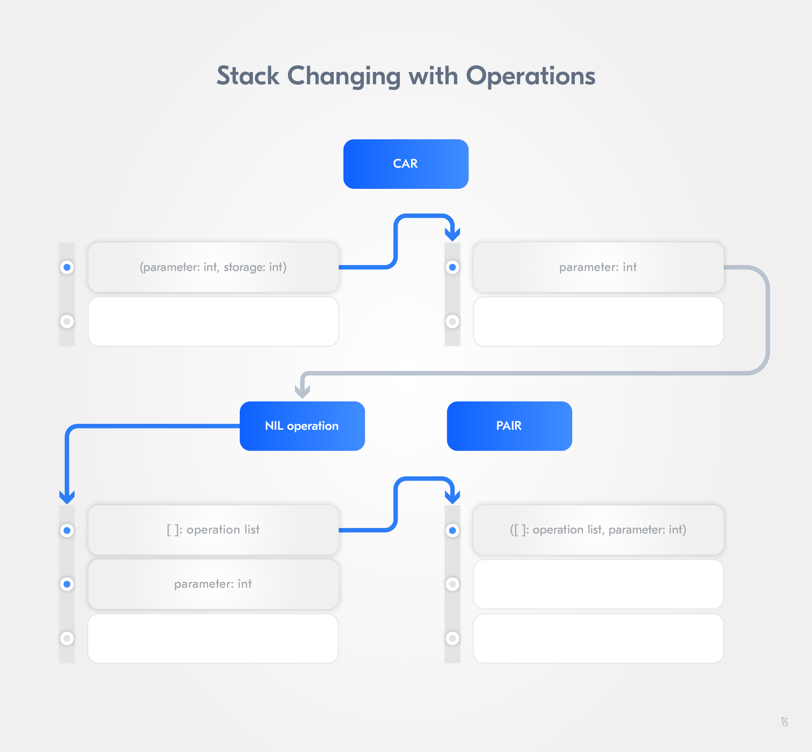

import HighlightBox from "../../src/components/HighlightBox"

# Testnet

It is now time to participate in a Tezos network.

There are currently three Tezos networks:

- [Mainnet](https://tzstats.com/), has been live and open since 30 June 2018,
- [Delphinet](https://delphi.tzstats.com/), a test network that runs the same protocol as the mainnet,
- [Edonet](https://edo.tzstats.com/), a cutting-edge development network that runs most recent proposed protocol.

The **Mainnet** is the main Tezos blockchain, where Tezos tokens (tez) have real value - so play with it only when you are confident in what you are doing. 

The easiest way to maintain a Tezos node is to use the docker images that are generated from the [Tezos repository](https://gitlab.com/tezos/tezos/tree/master) on GitLab. They are published on DockerHub and the repository offers a script called `tezos-docker-manager.sh`, which can pull the necessary images and start a Docker Compose network. 

<HighlightBox type="tip">

We just need to rename the script into <code>mainnet.sh</code> if we want to participate on the mainnet. After all, the program name called from the Terminal is the first parameter passed to the process. ;) 

</HighlightBox>

### Docker

Docker offers so-called "software containers" to execute applications. "Container" is a similar concept to that of virtual machines (VM) and uses **libcontainer**. The isolation level is not as strong as with a VM because Docker containers share the host OS kernel. On the other hand, containers are lighter in weight (Storage, RAM and CPU) and faster in execution compared to a VM.

**Dockerfiles** are blueprints for creating **Docker Images**, which are used to start **containers**. You can find public images on [Docker Hub](https://hub.docker.com/). 

<HighlightBox type="tip">

If you use Windows on your host, we strongly recommend you to use a VM to first establish a workspace based on Ubuntu Linux. 

</HighlightBox>

<!--- Install VirtualBox Version 6 on Windows and create a VM, https://youtu.be/RacKewhRAD4 --> 

<!--- Install Ubuntu 18.04 LTS on the VM, https://youtu.be/I235LTD1iMM -->

<!--- Install Chrome and SublimeText on Ubuntu 18.04, https://youtu.be/voPd69JH_so -->

<!--- Configure Bi-Directional Clipboard and use Snapshops. Ubuntu 18.04 and VirtualBox 6, https://youtu.be/yEJBH1UPMfE -->

## First steps

We will begin our Tezos development on the Edonet. 

<HighlightBox type="info">

Make sure you have installed [Docker](https://www.docker.com/get-started)!

</HighlightBox>

First, we are going to download the Edonet script, make it executable, and run it. Open a terminal (when you see a `$` it means it is a terminal command, do not paste the `$`) and paste the following commands:

```sh
$ wget -O edonet.sh https://gitlab.com/tezos/tezos/raw/latest-release/scripts/tezos-docker-manager.sh
$ chmod +x edonet.sh
$ ./edonet.sh start --rpc-port 8732
```
As the script spins up Docker images, it first needs to download them, and this may take some time. When the images are on your machine, it will start 7 containers. You can inspect them with:

```sh
$ docker ps
```
You should now see something similar to:


<HighlightBox type="tip">

You can find each component's description in the previous section, **Tezos Architecture** and list supported protocols with `./edonet.sh client list understood protocols`. Notice, only one protocol is activated at any given time. 

</HighlightBox>

From time to time, the `tezos-docker-manager.sh` script will be updated, and, when you want the latest version, instead of downloading it again with the wget command, you can enter:

```sh
$ ./edonet.sh update_script
```

or 

```sh
$ ./edonet.sh restart
```

which will stop the network, update the script, and start the network again. In case you want to disable automatic update when restarting, you can use:

```sh
$ export TEZOS_ALPHANET_DO_NOT_PULL=yes
```

<HighlightBox type="warning">

When the script is being updated, you may again need the command `chmod +x alphanet.sh` to make it executable.

</HighlightBox>

Wait a few minutes for the node container to start synchronising with the alphanet and then check its logs with:

```sh
$ docker logs edonet_node_1 --follow
```
You should be able to see how it syncs up. To stop the endless logs, press <kbd>CTRL-C</kbd>.

Any command starting with `./edonet.sh client` will behave as a **tezos-client**. So, this will be our way to interact with the **node** container we started.

You can get a list of the commands with:

```sh
$ ./edonet.sh client man
```
<HighlightBox type="tip">

You can find the reference for the client commands in the [client manual](https://tezos.gitlab.io/shell/cli-commands.html) of the Tezos Developer Documentation.

</HighlightBox>

## First private key

Before you can send anything on this network, you will need a public-private key pair. So let us do something basic and create a new key pair, which our local node will know as `myFirstKey`:

```sh
$ ./edonet.sh client gen keys "myFirstKey"
```
Now let us take a look at the balance of the test account we just created:

```sh
$ ./edonet.sh client get balance for myFirstKey
Warning:
  
                 This is NOT the Tezos Mainnet.
  
          Do NOT use your fundraiser keys on this network.

0 ꜩ
```
Zero tez! There is no free lunch. Because we do not even have any tez, we cannot pay gas for a transfer or a smart contract operation and there is not much we can do with this account right now.

## Adding Testnet Tez (XTZ)

Let us get some Edonet tez to work with! The easiest way to get some _Edonet_ tez is through the [faucet](https://faucet.tzalpha.net/). It will not only give you free tez but also give you a brand new wallet (public-private key pair) on the Edonet, which you will have to copy into your node container.

<HighlightBox type="info">

Yes, the faucet website created a private key for you and you had to download it. This means that someone, somewhere, could have a copy of your private key. That would not be safe **if we were using tez on the mainnet**. But, we are using the Edonet, so we will let it slide this time.

</HighlightBox>

Let us say the file you got is `tz1Z47xv2h6GnFvuUUbBz3qTgoNqmiRxZNm1.json`. 

How does the content of this file look?

```
{
  "mnemonic": [
    "hollow",
    "fruit",
    "ticket",
    "yellow",
    "flush",
    "mule",
    "wrap",
    "used",
    "sound",
    "about",
    "flavor",
    "embody",
    "carry",
    "car",
    "estate"
  ],
  "secret": "caaf49e039da94487321601b2eb1301db959831f",
  "amount": "12710245904",
  "pkh": "tz1Z47xv2h6GnFvuUUbBz3qTgoNqmiRxZNm1",
  "password": "Ww4fHJlnQS",
  "email": "dtubyufk.vxacwchy@tezos.example.org"
}
```

In it, all seed words, or "secrets", are contained, which we need to create the private key for the public key hash `tz1Z47xv2h6GnFvuUUbBz3qTgoNqmiRxZNm1`. At a later point in time, we will see how this works when we write a client. As long as we use the **tezos-client**, we do not need to take care of it.

In a terminal, go to the folder where the file is, and run:

```sh
$ docker exec edonet_node_1 whoami                              
tezos
# Just confirming what is the default user

$ docker exec edonet_node_1 id -g -n tezos
nogroup
# Just confirming the group of the default user

$ docker cp tz1Z47xv2h6GnFvuUUbBz3qTgoNqmiRxZNm1.json edonet_node_1:/home/tezos/

# Assigning the account to the tezos account
$ docker exec edonet_node_1 sudo chown tezos:nogroup /home/tezos/tz1Z47xv2h6GnFvuUUbBz3qTgoNqmiRxZNm1.json
```
Then activate an account with this wallet:

```sh
$ ./edonet.sh client activate account faucetWallet with /home/tezos/tz1Z47xv2h6GnFvuUUbBz3qTgoNqmiRxZNm1.json
Node is bootstrapped.
Operation successfully injected in the node.
Operation hash is 'ooZjAiGJcRR3sM26DAnNB6bGbVMuoViKmVthXSAjqzVmTCJn4z5'
Waiting for the operation to be included...
Operation found in block: BLHoZxUARaeQw26DdZLNXWn4vZDM6gnCTpDhUV4s7v5uzEFW1cH (pass: 2, offset: 0)
This sequence of operations was run:
  Genesis account activation:
    Account: tz1Z47xv2h6GnFvuUUbBz3qTgoNqmiRxZNm1
    Balance updates:
      tz1Z47xv2h6GnFvuUUbBz3qTgoNqmiRxZNm1 ... +ꜩ22906.629056
```

<HighlightBox type="tip">

If you want to deploy a contract with this account, make sure your node is sync'ed up. You can check if the node is sync'ed up with `./edonet.sh client bootstrapped`.

</HighlightBox>

We said that there is a chance that this `faucetWallet` may be compromised, so it is within the realm of the reasonable to _protect_ our tez in a local-only wallet. Let us do that and transfer some tez from `faucetWallet` to our `myFirstKey` account:

```sh
$ ./edonet.sh client transfer 1 from faucetWallet to myFirstKey --burn-cap 0.5
```

After your transaction has been included in a block, your `myFirstKey` account should have received 1 tez, which you can check again with:

```sh
$ ./edonet.sh client get balance for myFirstKey
1 ꜩ
```

# Writing smart contracts on Tezos

## Michelson

In Tezos, the machine code for smart contracts, the equivalent of assembly, is called [Michelson](https://tezos.gitlab.io/007/michelson.html) and warrants many sections in its own right. For now, we will be content knowing that, similarly to the JVM or the Ethereum VM, it is stack-based. Unlike the EVM, though, which treats any element on its stack differently depending on what the next opcode is, in Michelson, each opcode is strongly typed.

<HighlightBox type="info">

Later on, we will extensively address and work with Michelson. In this moment, our main focus is to introduce Michelson so that we can deploy a contract with the **tezos-client**.

</HighlightBox>

### Strongly typed

Any assembler is commonly able to check that the stack has the right number of operands for each of its opcodes. Thanks to its strong typing, the Michelson assembler goes further and can type-check each low-level opcode before sending the compiled contract across the network. The "output(s)" of an opcode must match the "input(s)" of the next opcode. By comparison, this goes further than the JVM. If you are familiar with it, the JVM [erases](https://docs.oracle.com/javase/tutorial/java/generics/erasure.html) the generic types, so when your Java code contained a `List<T extends Animal>`, the compiled bytecode only mentions a `List`. By contrast, the Michelson bytecode still would have your `List<Animal>`, `List<SchroedingerCat>` or whichever inner type the compiler was able to collapse to.

### Storage, not memory

Moreover, unlike the JVM or the EVM, it does not use a heap, or a memory if you will. It does have access to what is called `storage`, which, in effect, represents the only data that is persisted within the system across transactions and time.

So, a Michelson program takes in a 1-level-deep stack with a pair of a parameter and storage, and outputs a 1-level-deep stack with a pair of an operation list and modified storage. Since there is no memory, the stack is also where the program gets its input from: The input is the only element in the stack when calling the program; the parameter is the left part of that input tuple, and that parameter can be a tuple. Conversely, the output is the only element in the stack when the program exits.

A Tezos node will directly execute a serialised Michelson program when asked to.

## Our first contract

Time to deploy our first Tezos contract! 

Create a new file `repeater.tz` in the same folder as `edonet.sh` and paste:

```michelson
parameter int;
storage int;
code { CAR ;
       NIL operation ;
       PAIR };
```
into it. Then save it.

This is a **repeater contract**, which will take an integer as a parameter and return it, in effect saving that number in the storage.

Remember that in Tezos, each contract takes as input one pair of a parameter and storage structure, and then returns, as output, one pair consisting of an operation list and another storage structure. It is stack-based.

Before any contract operation, the stack has been populated by the Tezos environment according to the transaction that spawned the contract. The stack has one level, populated with the input pair. Our code here has **3 instructions**:

1. We pop this input pair from the top of the stack, we take the left-hand part of the input pair `CAR`, i.e. the input parameter, and push that back into the top of the stack. At this stage, the stack is still 1-level deep as the pair was consumed and replaced with the parameter;
2. We push an empty operation list, `NIL operation`, to the top of the stack. At this stage, the stack is 2-level deep;
3. We make a pair of both levels of the stack with the operation list on the left, `PAIR`. Each instruction is working on the stack, e.g. `PAIR` will take the parameter and operation list from the stack and push a pair. The stack is back to being 1-level deep.

At this stage, the Tezos environment takes the output storage structure, here an `int`, puts it in storage and executes the operations, if there are any.



Before we deploy this contract, we can test it with any test parameter and storage:

```sh
$ ./edonet.sh client run script container:repeater.tz on storage 0 and input 1
```
It will give you as a result:

```
storage
  1
emitted operations
  
big_map diff
```

Notice the trick we did here? We did not pretend that it was deployed and that it had a certain storage. Instead we passed all the needed inputs - namely parameter and input storage - to the function that this contract represents. The contract _function_ does not need any context or other parameters to run.

We can also check the stack:

```
$ ./edonet.sh client typecheck script container:repeater.tz -details
Warning:
  
                 This is NOT the Tezos Mainnet.
  
           Do NOT use your fundraiser keys on this network.

Well typed
Gas remaining: 1039996.720 units remaining
{ parameter int ;
  storage int ;
  code { /* [ pair (int @parameter) (int @storage) ] */
         CAR
         /* [ @parameter int ] */ ;
         NIL operation
         /* [ list operation : @parameter int ] */ ;
         PAIR
         /* [ pair (list operation) (int @parameter) ] */ } }
```

So it starts with one element `[ pair (int @parameter) (int @storage) ]` in the stack and ends with one element `pair (list operation) (int @parameter)`. Each element in the stack is separated by `:`. Take your time to compare this output with the image.

Satisfied with this exhaustive battery of tests, let us deploy this contract:

```sh
$ ./edonet.sh client originate contract repeater for myFirstKey transferring 0.1 from myFirstKey running container:repeater.tz --init 0 --burn-cap 0.295
Warning:
  
                 This is NOT the Tezos Mainnet.
  
           Do NOT use your fundraiser keys on this network.

Node is bootstrapped.
Estimated gas: 1561.562 units (will add 100 for safety)
Estimated storage: 295 bytes added (will add 20 for safety)
Operation successfully injected in the node.
Operation hash is 'ooQgdA5UGXVS7baUcjjjQqLwf2bXxP77At1JirEpVTYHePcumXy'
Waiting for the operation to be included...
Operation found in block: BLYvNmjVZJhDMyuJDgtEstVR2fTFWV1tWFUD8tFQHryBLWctaHg (pass: 3, offset: 0)
This sequence of operations was run:
  Manager signed operations:
    From: tz1hu7mhXfqCmzKqF9CEvnXiAe7pV6UW7Akr
    Fee to the baker: ꜩ0.000359
    Expected counter: 288484
    Gas limit: 1000
    Storage limit: 0 bytes
    Balance updates:
      tz1hu7mhXfqCmzKqF9CEvnXiAe7pV6UW7Akr ............. -ꜩ0.000359
      fees(tz3Q67aMz7gSMiQRcW729sXSfuMtkyAHYfqc,103) ... +ꜩ0.000359
    Revelation of manager public key:
      Contract: tz1hu7mhXfqCmzKqF9CEvnXiAe7pV6UW7Akr
      Key: edpku9L6fth99m4LvFMJRGtLjYP7UQ8WaK3o2EKsAN7XHex3JJQdFB
      This revelation was successfully applied
      Consumed gas: 1000
  Manager signed operations:
    From: tz1hu7mhXfqCmzKqF9CEvnXiAe7pV6UW7Akr
    Fee to the baker: ꜩ0.00034
    Expected counter: 288485
    Gas limit: 1662
    Storage limit: 315 bytes
    Balance updates:
      tz1hu7mhXfqCmzKqF9CEvnXiAe7pV6UW7Akr ............. -ꜩ0.00034
      fees(tz3Q67aMz7gSMiQRcW729sXSfuMtkyAHYfqc,103) ... +ꜩ0.00034
    Origination:
      From: tz1hu7mhXfqCmzKqF9CEvnXiAe7pV6UW7Akr
      Credit: ꜩ0.1
      Script:
        { parameter int ; storage int ; code { CAR ; NIL operation ; PAIR } }
        Initial storage: 0
        No delegate for this contract
        This origination was successfully applied
        Originated contracts:
          KT1V3UiHJ7fsaYYEDUsxABsHciHBEm5HVPHr
        Storage size: 38 bytes
        Paid storage size diff: 38 bytes
        Consumed gas: 1561.562
        Balance updates:
          tz1hu7mhXfqCmzKqF9CEvnXiAe7pV6UW7Akr ... -ꜩ0.0095
          tz1hu7mhXfqCmzKqF9CEvnXiAe7pV6UW7Akr ... -ꜩ0.06425
          tz1hu7mhXfqCmzKqF9CEvnXiAe7pV6UW7Akr ... -ꜩ0.1
          KT1V3UiHJ7fsaYYEDUsxABsHciHBEm5HVPHr ... +ꜩ0.1

New contract KT1V3UiHJ7fsaYYEDUsxABsHciHBEm5HVPHr originated.
The operation has only been included 0 blocks ago.
We recommend to wait more.
Use command
  tezos-client wait for ooQgdA5UGXVS7baUcjjjQqLwf2bXxP77At1JirEpVTYHePcumXy to be included --confirmations 30 --branch BM7p5GAC3MFR9rJZGQEJEvdMhNuvTME6hTPjzugFZsrhcJW8mNw
and/or an external block explorer.
Contract memorized as repeater.
```

<HighlightBox type="info">

Tezos offers two kinds of accounts, [implicit and originated](https://github.com/tezoscommunity/faq/wiki/Tezos-Technical-FAQ#what-is-the-difference-between-implicit-and-originated-accounts).

Only originated accounts can have Michelson code, though this may change in the future via a Tezos amendment.

</HighlightBox>

Now, with:

```sh
$ ./edonet.sh client list known contracts
Warning:
  
                 This is NOT the Tezos Mainnet.
  
          Do NOT use your fundraiser keys on this network.

repeater: KT1E7MZbQay94N4uFnxGGg6eBZxdnyLY8BjB
faucetWallet: tz1Z47xv2h6GnFvuUUbBz3qTgoNqmiRxZNm1
myFirstKey: tz1W4W2yFAHz7iGyQvFys4K7Df9mZL6cSKCp
```
you can see the address of our contract. Your client gives aliases to some addresses for your convenience. You can add aliases or do it without too.

Time to do our **first contract interaction**, here known as `transfer`:

```sh
$ ./edonet.sh client transfer 0 from myFirstKey to repeater --arg "1"
```
In the output, you will see `Updated storage: 1`.

<ul>
  	<li><a href="https://tezos.gitlab.io/mainnet/whitedoc/michelson.html">Michelson documentation</a></li>
    <li><a href="https://gitlab.com/camlcase-dev/michelson-tutorial/tree/master">Michelson Tutorial Series</a> by camlCase</li>
    <li><a href="https://learn.tqgroup.io/files/language.html#faq">Michelson presentation</a> by Benjamin Canou</li>
  <li><a href="https://www.michelson-lang.com/">Original Michelson language homepage</a> (note some changes have been made to Michelson since then)</li>
</ul>
