import HighlightBox from "../../src/components/HighlightBox"

import {
  ExpansionPanel,
  ExpansionPanelList,
  ExpansionPanelListItem
} from 'gatsby-theme-apollo-docs';

<ExpansionPanel title="Python refresher">

Do you want to freshen up your Python skills before beginning to work with SmartPy? It gives you a good starting point from which to dive deep into SmartPy.

Python is one of the most known high-level programming languages. 
It was released for the first time in the early 1990s, after being developed in the 1980s by Guido van Rossum as an ABC language successor. 
Since then, Python has become a popular choice for developers because of its syntax and readability

Python supports object-oriented and functional coding.

A code in Python has a **very clear visual structure based on its semantic structure**. Python uses **whitespace indentation to signal blocks**, and not keywords or curly brackets (like for example C++). This is also called **off-side rule** - blocks are delimited by indentations. 

**Indentation increases** are included to **define boundaries of statements**, whereas **decreased indentation signals the end of a block**. This is suspended within brackets though, where the closing bracket denotes the end of the block.

_Our Python elaborations in this section refer to **Python 3** because SmartPy uses an interpreter for Python 3. Are you still on Python 2.x, circumventing an update so far? Go look at a [version comparison article](https://sebastianraschka.com/Articles/2014_python_2_3_key_diff.html) to understand the differences - you really just have to keep in mind little (though important!) things._


**Play along**

If you don't have a Python environment at hand for testing, you can use one of the many free online environments, for example [repl.it](https://repl.it/languages/python3).

On documents, the standard reference is:

* [the Python Tutorial](https://docs.python.org/3/tutorial/),
* [the Python Documentation](https://docs.python.org/3/reference/index.html), and
* [Python HOWTOs](https://docs.python.org/3/howto/index.html).

We have written this refresher to give you a quick reference on the most important topics. **It is not complete though**. If you want deeper understanding of a specific topic, you should look into the Python Documentation linked above.


**Types in Python**

This is an overview of the general data types, which we will use

<table>
<tr><th>Numerics</th><th>Text</th><th>Binary</th><th>Sequence</th><th>Mapping</th><th>Set</th></tr>
<tr><td>int</td><td>String</td><td>Byte</td><td>List</td><td>Dict</td><td>Set</td></tr>
<tr><td>float</td><td>&nbsp;</td><td>Bytearray</td><td>Tuple</td><td>&nbsp;</td><td>Frozenset</td></tr>
<tr><td>complex</td><td>&nbsp;</td><td>&nbsp;</td><td>Range</td><td>&nbsp;</td><td>&nbsp;</td></tr>
</table>

**  - Objects**

Almost everything in Python is an **Object** - including simple and complex types, as well as functions. 

**  - Numerics in Python**

**Integers** are the usual basic number datatype. They can store a signed number with a variable size - Once you reach the maximum storage size, Python will transparently switch to a larger internal datatype, like long.

```python
my_int = 5
my_int = int(5)
my_int = int('5')
```

**Floats** are [floating point numbers](https://en.wikipedia.org/wiki/IEEE_754), allowing storage a number with a decimal point.

```python
my_float = 2.3
my_float = float(2)
my_float = float('2.3')
```

**Complex** numbers consist of two parts, a _real part_ and an _imaginary part_, and can be expressed in the form `a + bi` where a and b are real numbers, and i = sqrt(-1).

```python
my_complex = complex(2, 3)
my_complex = complex('2+3j')
```

**Be aware!**
**There has been an important change from Python 2.x to 3.x on implicit type conversion for integer:** Previously in 2.x (and in many other languages), when writing an expression like <code class='hljs hl-inline'>x = 3/2</code>, the arithmetic operation was returning the same datatype as the input, in this case int. Therefore, the result is <code class='hljs hl-inline'>1</code>. In Python 3.x however, the datatype is automatically (implicitly) converted to float - so the result is <code class='hljs hl-inline'>1.5</code>! If you want to force and int result, you can use an explicit conversion use this syntax: <code class='hljs hl-inline'>x = 3//2</code>

Floating point numbers offer limited precision, based on the way the number is actually stored internally.
The important part: **Never use floats for**:
<ul>
  <li>Money related values, like an account balance, or factors used in a balance calculation,</li>
  <li>Numbers which need to have a fixed precision, and</li>
  <li>Decimals like 1.0000000762.</li>
</ul>

The usual solution is to either use an int if you have a fixed decimal (money), or an accurate decimal data type. For more information, further read on the <a href="https://en.wikipedia.org/wiki/IEEE_754">IEEE 754 specification</a> and <a href="https://en.wikipedia.org/wiki/Machine_epsilon">Machine epsilon</a> is recommended. Also, do not forget that the precision can vary, depending on the actual numbers used. E.g. <code class='hljs hl-inline'>1.78 - 0.7 = 1.08</code>, but <code class='hljs hl-inline'>0.78 - 0.7 = 0.08000000000000007</code>.

**  - Text in Python**

**String** literals are enclosed between `"` or `'`. You can explicitly convert a different data type into string using `str()`.

```python
my_string = "Hello Python"
another_string = str(5)
```

Strings can be **formatted** using the `format()` method. This helps to build strings from multiple variables, as well as to write cleaner code. For example:

```python
language = "Python"
version = 3
pi = 3.17159

string_a = "Hello " + language + " " + str(version) + " (not " + str(round(pi,2)) + ")"
string_b = "Hello {} {} (not {:.2f})".format(language, version, pi)

# Hello Python 3 (not 3.17)
```

The format() method is quite extensive and powerful - and it also helps writing more readable code. If you need a refresher, we recommend to take a look at:

<ul>
<li><a href="https://docs.python.org/3/library/string.html#format-specification-mini-language">the Python documentation</a>, and</li>
<li><a href="https://pyformat.info/">the Python formatting tutorial</a>.</li>
</ul>

**  - Binary**

**Bytes** is an immutable sequence of single bytes - therefore it is quite similar to a string (every ASCII character in 8-bit encoding can be stored in byte). They are not interchangable with strings though. A bytes sequence can be defined from a string literal by prefixin it with a `b`:

```python
my_bytes_sequence = b'This is a literal'
```

Using the `bytes()` constructor, you can also an empty bytes sequence with a fixed length (`bytes(32)`), predefined from an iterable of integers (`bytes(range(20))`) or by copying it from another object (`bytes(bytes_sequence)`).

**Be aware!**
When creating a byte sequence from a string literal, each character must be in the standard ASCII characterset (x &lt;= 127). Values above 127 must be entered using an espace sequence. When creating from ints, they accepts numbers &lt; 256.

*Bytearrays* are exactly like the previous bytes, with one difference: They are mutable. They can also be created using the constructor from the same objects as the bytes sequence, eg:

```python
my_byte_array = bytearray(b'This is a literal')
```

**Be aware!**
<code class='hljs hl-inline'>bytes()</code> and <code class='hljs hl-inline'>bytearray()</code> do not accept a string, but only a binary string as parameter. This is also true for their methods.

**  - Sequence**

**List** is a datatype very common to an array. However, the datatype is not enforced - you could mix different types in list. They are mutable sequences of objects.
A list can be constructed using square brackets, like this:

```python
my_list = [1, 2, 5, 7]
my_mixed_list = [1, 2, 'three', 4]
```

It is also possible to construct a list from a list comprehension, or from an iterable.

**Tuples** are immutable sequences, which are usually used to store heterogeneous data (this is not enforced). They are created using parentheses instead of brackets:

```python
my_tuple = (1,2,3)
```

**Ranges** are immutable sequences of numbers. They are used for loops, but also in other places like the previous example for the bytes constructor shows. The syntax is pretty simple:

```python
range(stop)
range(start, stop[,step])

my_number_list = list(range(0,16,2))
# [0, 2, 4, 6, 8, 10, 12, 14]
```

Note that a range does not include the stop number. Therefore, `range(5)` equals `[0,1,2,3,4]`.

**  - Mapping**

**Dicts** are lists of key-value pairs, where the key must be a hashable object. They can be created using curly brackets:

```python
my_dict = {'bob': 25, 'alice': 10}
```

A value can be retrieved with the key: `my_dict['alice']`. Be careful though, if the key can not be found, an error will be thrown. If you want your code to be resilient, you should use the `get()` method, which returns `None` if no key is found, or a predefined value:

```python
my_dict = {'bob': 25, 'alice': 10}

print(my_dict.get['carol']) # None
print(my_dict.get['carol'], '') # empty string
```

You can also create a dict from another dict, or an iterable. When creating from an interable, each item must be an iterable itself with exactly two items.

```
dict2 = dict(((1, "one"), (2, "two"), (3, "three")))
dict3 = dict(dict2)
```
**  - Set**

**Sets** are unordered collections of distinct items, which must be hashable. They are mutable, but do not allow for index or slice operations, as they are unordered.

**Frozenset** is an immutable set. Due to it's immutability, it is hashable and can therefore be used as a dictionary key.

Both allow construction from an interable, a set can also be created from a list of objects in curly brackets:

```python
my_set = set(range(10))
my_frozenset = frozenset(range(10))
my_set = {1,2,3,4,5,6}
```


**Mutability**

**Mutability** is the ability of an object to be changed after creation. In the previously introduced datatypes for Sets, we saw that a `set` is mutable, while a `frozenset` is not. Actually, most datatypes in Python are immutable, except for `dict`, `list`, `set` and `bytearray`. All basic types (including numbers) are immutable.


Do not mix up mutability with assignment. We can not change an int, but we can create and assign a *new object instance*:

```python
x = 5
x = 7
```

could be read as

```python
x = int(5)
x = int(7)
```

When you need to add an object to an immutable sequence, you need to create a new sequence based on the existing (probably with a mutable type do perform your operations):

```python
my_tuple = (1,2,3)

temp_list = list(my_tuple)
temp_list.append(4)
my_tuple = tuple(temp_list)

print(my_tuple)   # output (1,2,3,4)

```


**Operators**

**  - Truthness**

Any object can be tested for truthness, and will return `True` unless:

* It has a `__bool__()` method, which returns `False`;
* It has a `len()` method, which returns 0;
* It is a numeric type with a value of 0.

**  - Boolean**

Python supports three boolean operations, in the following priority order:

* and,
* or,
* not.

They are similar to `&&` operators in other languages: The second argument is only evaluated if necessary.

**  - Comparison**

Python supports the usual comparison operations: `<, <=, >, >=, == and !=`. They all have the same priority, which is higher than the priority of Boolean Operations. Furthermore, you can compare object identity with `is` and it's negated form `is not`.

When comparing objects of different type, the result will always be unequal, except for numeric types. For more information on comparing complex types (like class instances), refer to the [comparisons section](https://docs.python.org/3.7/library/stdtypes.html#comparisons) in the Python documentation.

**  - Bitwise Operators**

Available bitwise operators:

<table>
<tr><th>Operation</th><th>Symbol</th></tr>
<tr><td>AND</td><td>&amp;</td></tr>
<tr><td>OR</td><td>&#124;</td></tr>
<tr><td>XOR</td><td>&#94;</td></tr>
<tr><td>INVERT</td><td>&#126;</td></tr>
<tr><td>SHIFT</td><td>&lt;&lt;, &gt;&gt;</td></tr>
</table>

**  - Assignment**

Next to an assignment using `=`, Python also supports the shortcut operators `+=, -=, *=, /= and %=`, as well as shortcut assignments for all bitwise operators. Furthermore, you can use:

* `**=` for an exponential calculation
* `//=` for a floor division

**  - Membership**

The operators `in` and `not in` are used to determine the membership (presence) of an item in a sequence.

```python
my_list = [1,2,5,7]

a = 2 in my_list # True
b = 3 in my_list # False
```


**Control Flow**

**  - Indentation**

First a quick reminder: In Python, blocks are defined by indentation and usually start after a colon (`:`), where many other languages use curly brackets. For example, the following javascript code:

```javascript
if (a==b) {
  console.log("a and b are equal")
} else {
  console.log("a and b are not equal")
}

```


would require the following indentation to be implemented in Python:

```python
if a==b:
  print("a and b are equal")

else:
  print("a and b are not equal")

```

You should use one tab *or* two spaces as indentation and keep it consistent accross all your files. When in doubt about the correct formatting of a file, you can use a quick online tool like the [Python Formatter](https://pythoniter.appspot.com/) to check your formatting.

**  - If**

If statements in Python support `if, elif` and `else`:

```python
x = 3

if x < 2:
  print("x is smaller than 2")

elif x >5:
  print("x is greater than 5")

else:
  print("x is between 2 and 5")

```

**  - For**

Unlike in most other languages, a for loop in Python always iterates over a sequence of items. To iterate over numbers, you can use a `range`:


```
for i in range(10):
  print(i)
```

**  - While**

The while loop is similar to other languages though, requiring a loop condition:

```python
x = 1
while x < 5:
  x += 1
  print(x)
```


**  - Break, Continue, and Else**

You can break out of a for or while loop using the `break` statement. When encapsulating multiple loops into each other, it breaks the innermost one. `continue` is used to jump to the next loop iteration. When using `break`, you can also define an `else` statement on a loop, which runs if no break occurs. A little example:

```python
for x in range(5):
  if x > 5:
    print("x is greater than 5")
    break
  else:
    print(x)

else:
  print("no number greater than 5 in range")
```


**Functions**

A function can be defined using the `def` keyword. A quick example syntax for a simple function that takes one argument:

```python
def my_function(arg1):
  print(arg1)
```

As seen on the previous Control Flow elements, the function body is in a block, which is defined by its indentation and prefixed with a colon (`:`) in the line before the block.

A function *call*, as we have seen for the print function, is done using the function name and parenthesis. You must add the parenthesis, even if you are not passing any arguments, to distinguish the function call from variable access.


**  - More parameters**

Parameters of a function are _named_, this means we can rearrange the order of parameters when calling a function, by writing them out. Imagine a logging function:

```python
def log_message(msg, level):
  ... do some stuff here
```

This could be called with `log_message("my message", "debug")`, but also with `log_message(level="debug", msg="my message")`, which results in the same function call.

Then, Python supports both default values and parameter lists for function parameters. Default parameters are directly assigned in the function signature:

```python
def log_message(msg, level="debug"):
  ...
```

Combined with the ability to pass params in any order when assigning them to the proper parameter name in the call, this allows for very short function calls where you just need to pass the required objects if you are fine with the default values.

**Be aware!**
Note: You can assign an expression as default parameter, which is very powerful - but can also lead to trouble! The expression is only evaluated once, when the function is defined. So be careful when changing this object inside your function.

Furthermore, you can accept an arbitrary list of parameters (similar to `ARGV` in C or `args` in Java) by prefixing the last parameter name with an asterix (`*`). This automatically creates a tuple with any excess parameters, which we can immediately use to iterate over the parameters:

```python
def sum_numbers(*numbers):
  sum = 0

  for num in numbers:
    sum += num

  return sum
```

Alternatively, you can use two asterix to receive a mapping (`dict`) with pairs of parameter name -> parameter value. This only works when calling the function with named parameters! Quick example:

```python
def generate_book_index(**sections):
    print(sections)

generate_book_index(intro="The Introduction", mid="Main story", end="Twisted end")

# output: {'intro': 'The Introduction', 'mid': 'Main story', 'end': 'Twisted end'}
```

Calling this without named parameters will throw a SyntaxError.

**  - Return value**

Function can return a value, using the `return` keyword:

```python
def get_bigger_number(num):
  return num+1

x = get_bigger_nummber(5)
```

You can also define functions inside functions and return them - the following code is demonstrates this.

```python
def get_func():
  def my_func():
    print("Hello Python")
  
  return my_func

x = get_func()
x()

# output: Hello Python
```

Note that you can not assign a function definition to a variable. The following does *not* work:

```python
x = def my_func():
  ...
```

Instead, you must first declare the function and then assign it, as shown in the sample above.

There are a few more features for functions in Python (annotations, anonymous functions, decorators) - please refer to the [official documentation](https://docs.python.org/3/reference/compound_stmts.html#function-definitions) for more information and a full overview of all keywords.

**  - Complex return values**

It is also possible to return multiple values, by wrapping them in one object:

* When using a class (see below), you can wrap the result in membervariables of the class and return the whole class
* Return in a tuple `return (a,b,c)`, a list `return [a, b, c]` or a dict `return {'a': a, 'b': b}`


**Classes**

Classes! You have come a long way, now we can finally have some fun.

Classes define class objects, that means they are a blueprint for object instances (as in all other languages). They can have member variables and member functions. Python also supports inheritance. And if you want to go crazy, you can use [Metaclasses](https://docs.python.org/3/reference/datamodel.html#metaclasses) to create and change new classes in runtime. But let's start with the basics:

```python
class Point:
  def __init__(self, x=0, y=0):
    self.x = x
    self.y = y

  def print_position(self):
    print("Position x: {} y: {}".format(self.x,self.y))

a = Point()
a.print_position() # output: Position x: 0 y: 0

b = Point(2,5)
b.print_position() # output: Position x: 2 y: 5
```

First of all, we use the `class` keyword to define a new class, followed by the class name.

**  - Member functions**

Member functions are added the same way as defining them on File level, by using the keyword `def`. Every memberfunction should have `self` as the first parameter, allowing access to the class instance (other languages do this implicitly and offer access through the keyword `this`).

**  - Constructor**

In the second line, you can see the class constructor `def __init__(self, x=0, y=0):`. This has a few specialities:
* The constructor name must be `__init__`
* The first parameter must always be `self`
* You don't have to declare member variables before using them, but you must access them with `self.`, which points to the class instance.

We use a default parameter value for x and y, to make it optional to set an initial position. It is convention to start a classname with an uppercase letter, to easliy distinguish them from instances or other variables in the code.

**  - Class and Instance variables**

A class variable is like a static (or shared) variable, which is shared between all class instances. It is defined in the class body:

```
class Point:
  count = 0           # class variable

  def __init__(self, x=0, y=0):
    self.x = x        # instance variable
    self.y = y
    Point.count +=1


a = Point()
b = Point()

print(a.count) # output: 2
print(b.count) # output: 2
```

Be careful not to use a class variable accidentally! If you would put `x` and `y` as class variables in this example, each new `Point` created would overwrite the existing point data, resulting in all points being at the same position.

**  - Overrides**

We have already used an override for the constructor, named `__init__`. System default functions which can be overridden all follow this naming scheme `__NAME__` and offer customization of create, delete, formatting and comparing behaviour. A full list is available in the [Python documentation](https://docs.python.org/3/reference/datamodel.html#customization).

The string function is another function we should look at. It is called when using `str()` on a class (which is used when printing it with `print`). It is comparable to Java's `toString()`. In our previous sample, the `print_position` function should be changed to do so:

```python
class Point:
  def __init__(self, x=0, y=0):
    self.x = x
    self.y = y

  def __str__(self):
    print("Point (x: {} y: {})".format(self.x,self.y))
```

**  - Inheritance**

A class can inherit another class (it is derived from another class) using the following syntax:

```
class DerivedClass(BaseClass):
  ...
```

It is also possible to inherit multiple classes: `class DerivedClass(BaseClass, BaseClass2, BaseClass3`.

A BaseClass can also be derived from another BaseClass (inheritance chain). When overwriting methods, the **method resolution order** becomes important to determine which function is called. The order with multiple inherited classes is:

* First look in the DerivedClass for the method
* If not found, recursively go through the BaseClass (and it's BaseClass)
* If not found, start with the next inherited class (`BaseClass2`) and go through it recursively

This allows for complex inheritance structures (like diamonds), where Python is able to optimize call paths. You can find more on this in the document on [Method Resolution Order](https://www.python.org/download/releases/2.3/mro/).

**  - super() and other calls to parent**

When inheriting a class in Python, you can access the functions of the base class through two ways:
* `super().function_name` is used to call a function in all base classes, without knowing the class name.
* When you know the class name (or want to access a specific function), you can also directy call it using `BaseClass.function_name()`

Let's take a look at a quick sample. We will reuse our existing `Point` class (not listed again in the following code) and create a `Shape` class, from which we derive a `Triangle` class.

```python
class Shape:
  def __init__(self, points=[], color=None):                          # (1)
    self.points = list(points)
    self.color = color
  
  def add_point(self, point):                                         # (2)
    self.points.append(point)

  def set_color(self, color):
    self.color = color
    print("set color to {}".format(color))


class Triangle(Shape):
  def __init__(self, color=None):                                     # (3)
    points = (Point(0,0), Point(0,0), Point(0,0))
    super().__init__(points=points, color=color)                      # (4)

  def add_point(self, *args):                                         # (5)
    print("Error: Adding points to triangle not allowed!")


shape1 = Shape()
shape1.add_point(Point(1,2))
shape1.add_point(Point(1,4))

triangle1 = Triangle()
triangle1.add_point(Point(1,2))                                       # (6)
triangle1.set_color("red")                                            # (7)

```

A few remarks:

* (1) We use a list to store the points of the shape. If no points are passed to the constructor, an empty list is created;
* (2) Instead of accessing the members directly from outside, we offer a function `add_point` to add a new point to the list of points;
* (3) A triangle always has three points, therefore we do not want the constructor to take an arbitrary list of points. We could add a parameter for a list with exactly three Points. For simplicity, we just set three default points when creating a new triangle;
* (4) From the Triangle's constructor, we call the constructor of the base class (`Shape`), to setup the points and color. We are using the Triangle's constructor to predefine values and setup objects in regards to the Triangle, then pass this with the other arguments to the base class. Instead of `super`, we could have used `Shape.__init__()`. **Note** when calling `super`, you do not pass `self`, but you need to do so when calling the `BaseClass()` function;
* (5+6) We do not want to allow adding points to a triangle, therefore we overwrite the function and print a message when somebody tries to use it. This is for demonstration only, in real life you probably want to throw an error
* (7) The `set_color` function is not overridden, therefore it will call `Shape.set_color()`.

**  - Private variables**

There are no _real_ private variables or functions in Python. However, the previous sample shows that sometimes, you might want to allow access to some members, and avoid name clashed when deriving classes. Look at the color member: When setting the color on a `Triangle` instance, it will pass the value to the inherited `Shape` class. But maybe, you want the `Triangle` to have it's own color member, which is different from the color of the `Shape` (e.g. line color and fill color). For this, in Python there is a concept called **name mangling**:

When prefixing a class member (variable or function) with at least two leading underscores and at most one trailing underscore, it is considered a private class member (e.g. `__color`). When you derive from a class with private members, the member name is being replaced automatically with `_Classname__membername`. In above example, if `Shape` would define `__color`, it would be derived in `Triangle` as `_Shape__color` (mind the uppercase start!). This is useful when working with multiple inheritance, when you want to preserve the base class members for intra-class access.

**  - Empty classes**

You can also use empty classes, to which you can add arbitrary data _on the fly_. You can define an empty class with the following syntax:

```
class MyEmptyClass:
  pass
```

**pass** is a null operation statement.
You can then create an instance of this class and add any data with the `.` accessor:

```
wrapper = MyEmptyClass()

wrapper.someVal = 5
wrapper.otherVal = "Hello Python"
```


**Modules**

At some point, you want to split up your code into multiple files and probably order them by categories, functions or similar. In Python, you call these modules. A module can contain executable statements and function definitions. Statements are run once, when the module is imported and are used for initialization purposes. When importing a module, you can define whether you want to only import a specific function or the whole module, and whether to import it into a namespace (in context of your file you are importing into), or at top level. To give a quick example, imagine we put the `Shape` and `Triangle` class from the previous sample in a new file, called _geometry.py_. In a second file (within the same folder), we want to use them. We could write:

```
import geometry
```

This would allow us to access the `Shape` and `Triangle` class using `geometry.Shape` and `geometry.Triangle`.

It is also possible to change the top accessor name (which is the filename by default), with the following syntax:

```
import geometry as geo
```

To then access the classes with `geo.Shape` and `geo.Triangle`.

Finally, can choose what to import by using:

```
from geometry import Shape, Triangle
```

When using this syntax, the classes and functions are available at the top-level namespace, therefore you can access them directly: `Shape` and `Triangle`. You can import everything using `from geometry import *`.

You can combine all of these:

```
from geometry import Triangle as ThreeSidedShape
```

For convenience, Python treats folders like subpackages (similar to java). So if you would put our geometry file in a folder called `lib`, you could import it using:

```
import lib.geometry
```

Import statements are always at the top of the file.

</ExpansionPanel>

In what way is **SmartPy** convenient?

Using a popular programming language, such as Python, to write smart contracts is an immense advantage for first-time smart contract programming. 
Most smart contracts are written in protocol- or smart contract-specific languages.

With **SmartPy** you can dive into smart contract writing without the necessity to learn a smart contract-specific language before getting your hands on any smart contract development. So, it makes life much easier.

**SmartPy** offers different **tools**: 

* **Analytics**: Elements of the UI in SmartPy.io to analyse smart contracts and their properties;
* **SmartML**: A virtual machine written in OCaml;
* **Compiler**: Used to translate contracts from SmartML to Michelson;
* **Python library**: Facilitates the use of SmartML definitions.

<HighlightBox type="info">

We will address the different tools throughout this section.

</HighlightBox>

We will mainly deal with the Python library of SmartPy. 

The **SmartPy library**  is used to access **SmartML** definitions; We can get a **SmartML** piece from a **SmartPy** piece. SmartPy offers a **compiler** to translate **SmartML** to **Michelson**.

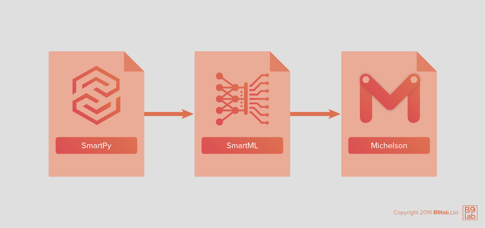

## SmartPy Editor

We can work with an [online editor](https://smartpy.io/ide) that gives us an **integrated development environment**.

You can access the online editor by going to: [https://smartpy.io](https://smartpy.io)

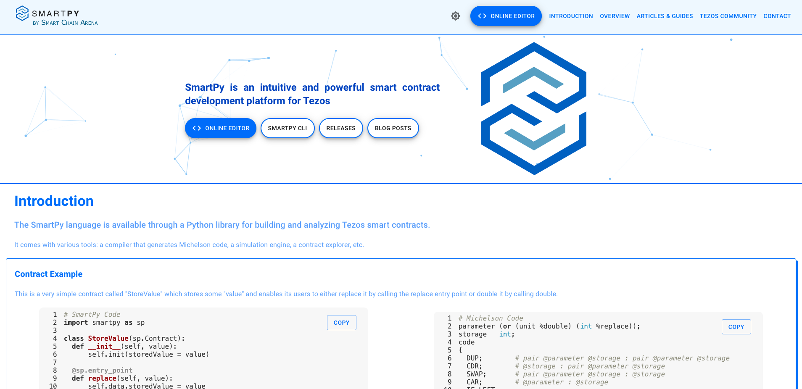

where you can go to the IDE, or access information regarding the SmartPy CLI, articles and guides, blog posts, etc.. 

Or go directly to the IDE at [https://smartpy.io/ide](https://smartpy.io/ide).

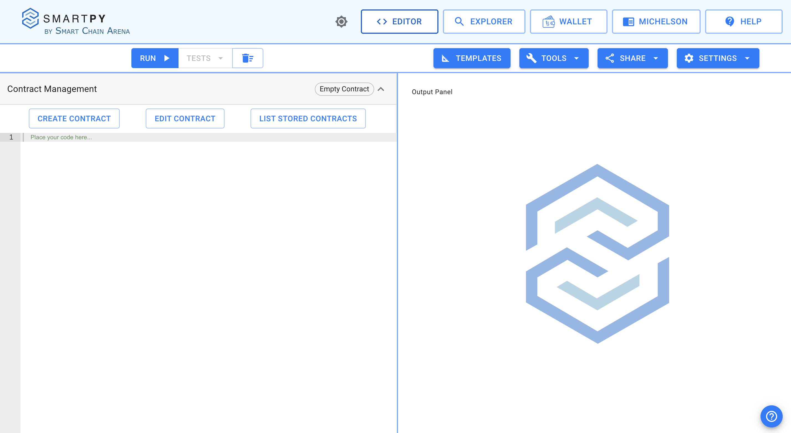

In the IDE, you can find a number of helpful tabs in the upper left corner.

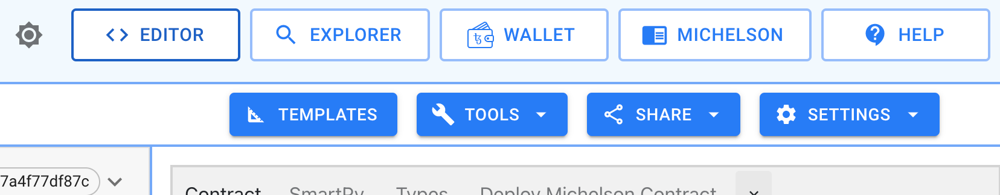

**Templates** helps you load one of the available templates.

Under **Tools** you can load a contract from your disk, download the contract to your disk, or download the output panel.

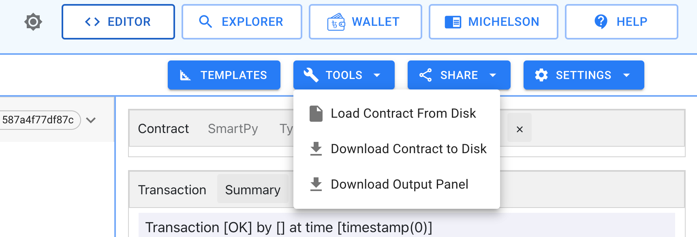

With **Share**, you can share your embedded code with a link or with IPFS.

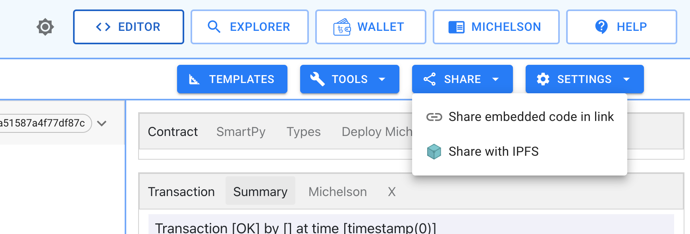

In the **Settings** tab, you can set up your UI layout and helpers.

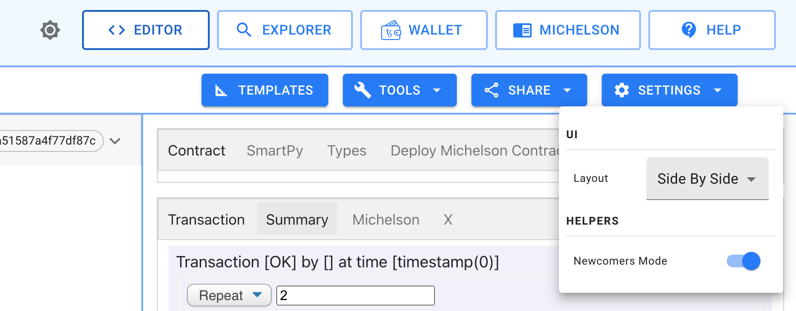

Above these, you can find tabs to redirect you to the **SmartPy Contract Explorer**, **SmartPy Wallet**, and the editor for **Michelson**.


The SmartPy Explorer, a very helpful tool, looks like this:

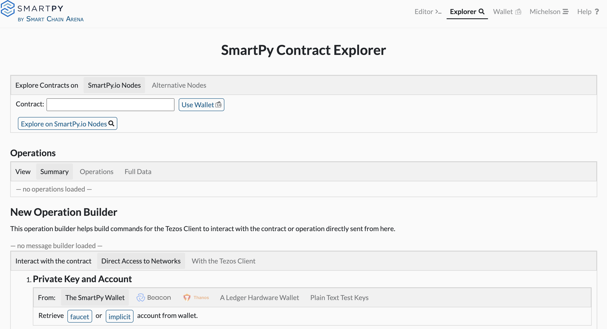

Let's begin with a simple program to gather some experience with this editor:

```python
import smartpy as sp

@sp.add_test(name = "First test")
def test():
    scenario = sp.test_scenario()
    scenario.p("First Output")
```

We use a **decorator to add a test**. This type of tests can be conducted with the online editor.

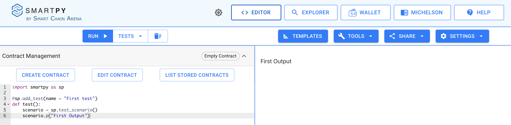

In standard view, we can display HTML on the right-side half with `setOutput`, e.g.:

```python
import smartpy as sp

@sp.add_test(name = "First test")
def test():
    scenario = sp.test_scenario()
    scenario.p("<h1>First Output</h1>")
```

SmartPy has also other [methods](https://smartpy.io/reference.html#_tests_and_scenarios) to help with documentation:

```python
scenario.h1("a title")
scenario.h2("a subtitle")
scenario.h3(..)
scenario.h4(..)
scenario.p("Some text")
```

We can create as many test outputs as we want:

```python
import smartpy as sp

@sp.add_test(name = "First_test")
def test():
    scenario = sp.test_scenario()
    scenario.p("First Output")

@sp.add_test(name = "Second_test")
def test():
    scenario = sp.test_scenario()
    scenario.p("Second Output")
```

You can switch between the tests using the **Tests** option in the menu bar.

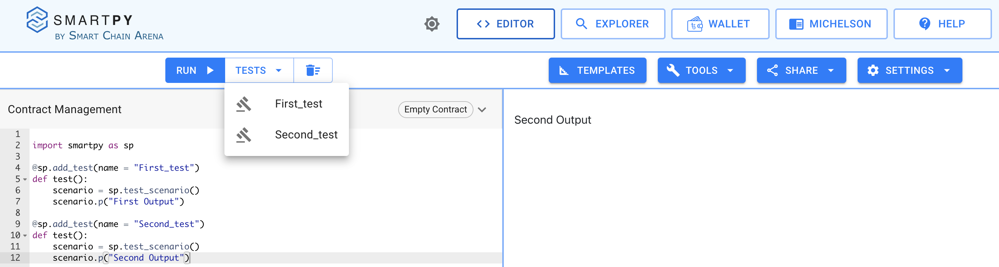

## Repeater contract

Let's again start with a **repeater contract**.

A **repeater contract** waits for an input, and then gives it back as an output without editing. Remember, each contract takes as input one pair of a parameter and storage structure, and then returns as output one pair consisting of an operation list and another storage structure.

So, we will save the input parameter simply in the storage:

```python
# Import SmartPy
import smartpy as sp

# Define Smartcontract

class repeater(sp.Contract):
    def __init__(self):
        # Define a value with initial integer 0
        self.init(storage=0)

    # Define Entry Point
    @sp.entry_point
    def repeat(self, params):
        self.data.storage= params

@sp.add_test(name = "First_test")
def test():
    firstContract= repeater()
    scenario = sp.test_scenario()

    scenario.register(firstContract, show = True)
    scenario+= firstContract.repeat(2)
```

We want to take a closer look at this script.

As you can see, with

```python
import smartpy as sp
```

we can import SmartPy like a common Python module.

```python
class repeater(sp.Contract):
    def __init__(self):
        # Define a value with initial integer 0
        self.init(storage=0)
```

Please don't let you get confused at this point. We consciously choose the name `storage` for the number that we save. Later on you can see that we can produce considerably more complicated data structures. SmartPy itself offers us `self.data`, which corresponds to the storage in Michelson. Our `class repeater` inherits the class `sp.Contract`.

```python
    # Define Entry Point
    @sp.entry_point
    def repeat(self, params):
        self.data.storage= params
```

Here you can notice that we save the input directly in `self.data.storage`. We also define a so-called [entry point](https://blog.nomadic-labs.com/michelson-updates-in-005.html). Previous `self.init` will iterate on the defined entry points to build the smart contract.

Afterwards, we program the test and the output:

```python
@sp.add_test(name = "First_test")
def test():
    firstContract= repeater()
    scenario = sp.test_scenario()

    scenario.register(firstContract, show = True)
    scenario+= firstContract.repeat(2)
```

This part almost looks like a normal Python program. This is the strength of SmartPy: We can use Python for [metaprogramming](https://en.wikipedia.org/wiki/Metaprogramming).

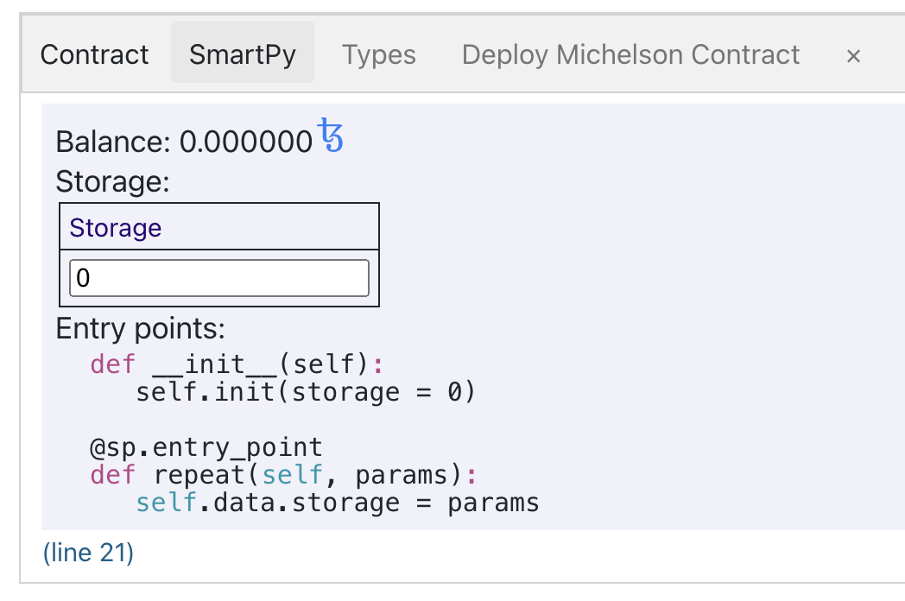

We use `register(firstContract, show = True)` to produce the first output. For this reason, we have access among other to the Michelson code.

Have a look at the Michelson code and the test transaction:

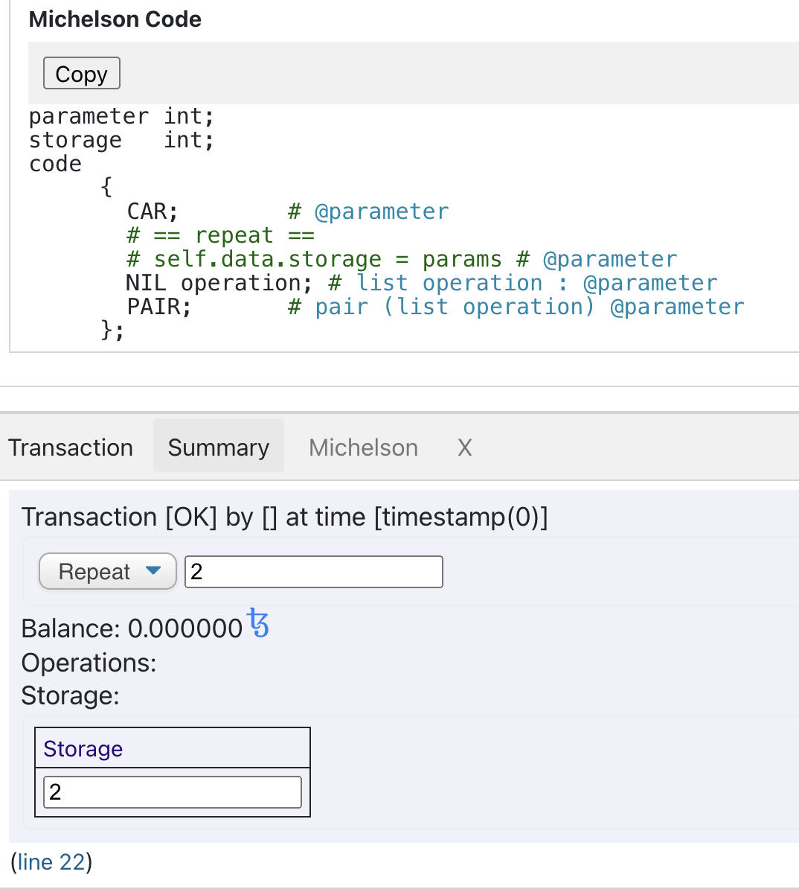

There you see our repeater contract, which we already code and test in Michelson. Michelson does not have variable names, hence the compiler comments with the help of our source code.

<HighlightBox type="tip">

Before you continue, try to change the repeater contract so that a string is given as input.
Take a look at the Michelson code: What changed? Examine the `TYPES` tab of the output.

</HighlightBox>

## Multiple parameters

How do we **manage multiple inputs**?

Let's extend our repeater, and code an adder:

```python
import smartpy as sp

# Define Smartcontract

class adder(sp.Contract):
    def __init__(self):
        # Define storage with initial integer 0
        self.init(storage=0)

    # Define Entry Point
    @sp.entry_point
    def add(self, params):
        self.data.storage= params.first + params.second

@sp.add_test(name = "First_test")
def test():
    adderContract= adder()

    scenario = sp.test_scenario()
    scenario+=adderContract

    scenario+= adderContract.add(first=2, second=3)
```

You see that you can give multiple inputs:

```python
adderContract.add(first=2, second=3)
```

and use access like:

```python
self.data.storage= params.first + params.second
```

Now that we took our first steps with SmartPy, let's continue with a look at typing and conditions in the SmartPy library.

<HighlightBox type="reading">
<ul>
<li><a href="https://medium.com/@SmartPy_io/introducing-smartpy-and-smartpy-io-d4013bee7d4e">Introducing SmartPy and SmartPy.io, an Intuitive and Effective Language and Development Platform for Tezos Smart Contracts</a> by SmartPy.io</li>
<li><a href="https://medium.com/@SmartPy_io/a-first-encounter-with-smartpy-70e28bfeed79">A First Encounter with SmartPy</a> by SmartPy.io</li>
</ul>
</HighlightBox>
