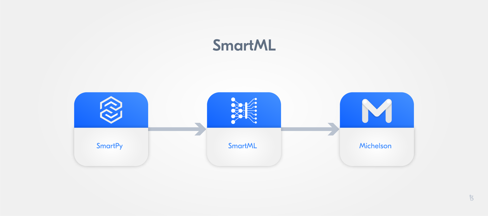

# SmartPy - First Steps

In what way is **SmartPy** convenient? 
The use of a popular programming language such as Python to write smart contracts is an immense advantage for first-time smart contract programming. 
Most smart contracts are written in protocol or smart contract-specific languages. With SmartPy you can dive into smart contract writing without the necessity to learn a smart contract-specific language before getting your hands on any smart contract development. 
So, it makes life much easier.

**SmartPy** offers different tools: 

* Analytics: elements of the UI in SmartPy.io to analyse smart contracts and their properties;
* SmartML: a virtual machine written in OCaml;
* Compiler: used to translate contracts from SmartML to Michelson;
* Python library: which facilitates the use of SmartML definitions.

We will address them throughout this section.

We will mainly deal with the Python library of **SmartPy**. 

The **SmartPy** library is used to access **SmartML** definitions. This means that we can get a piece **SmartML** from a piece **SmartPy**. **SmartPy** offers a compiler to translate **SmartML** to **Michelson**.



## SmartPy Editor

Momentarily, we can work with an online [editor](https://smartpy.io/ide) that gives us an integrated development environment.


Let us begin with a simple program to gather some experience with this editor:

```python
import smartpy as sp

@sp.add_test(name = "First test")
def test():
    scenario = sp.test_scenario()
    scenario.p("First Output")
```

We use a decorator to add a test. This type of tests can be conducted with the online editor.


In standard view, we can display HTML on the right-side half with `setOutput`, e.g.:

```python
import smartpy as sp

@sp.add_test(name = "First test")
def test():
    scenario = sp.test_scenario()
    scenario.p("<h1>First Output</h1>")
```

SmartPy has also other [methods](https://smartpy.io/reference.html#_tests_and_scenarios) to help with documentation:

```python
scenario.h1("a title")
scenario.h2("a subtitle")
scenario.h3(..)
scenario.h4(..)
scenario.p("Some text")
```

We can create so many test outputs as we want:

```python
import smartpy as sp

@sp.add_test(name = "First_test")
def test():
    scenario = sp.test_scenario()
    scenario.p("First Output")

@sp.add_test(name = "Second_test")
def test():
    scenario = sp.test_scenario()
    scenario.p("Second Output")
```

You can switch between those tests with the **Tests** in the menu bar.


## Repeater Contract

Let us again start with a **repeater** contract.

A **repeater** contract waits for an input and then gives it back as an output without editing. Remember, each contract takes as input one pair of a parameter and storage structure, and then returns as output one pair consisting of an operation list and another storage structure.

So, we will save the input parameter simply in the storage:

```python
# Import SmartPy
import smartpy as sp

# Define Smartcontract

class repeater(sp.Contract):
    def __init__(self):
        # Define a value with initial integer 0
        self.init(storage=0)

    # Define Entry Point
    @sp.entry_point
    def repeat(self, params):
        self.data.storage= params

@sp.add_test(name = "First_test")
def test():
    firstContract= repeater()
    scenario = sp.test_scenario()

    scenario.register(firstContract, show = True)
    scenario+= firstContract.repeat(2)
```

We want to take a closer look at this script.

As you can see, with

```python
import smartpy as sp
```


we can import **SmartPy** like a common Python module.

```python
class repeater(sp.Contract):
    def __init__(self):
        # Define a value with initial integer 0
        self.init(storage=0)
```

Please do not let you get confused at this point. We consciously choose the name `storage` for the number that we save. Later on you can see that we can produce considerably more complicated data structures. **SmartPy** itself offers us `self.data`, which corresponds to the storage in Michelson. Our `class repeater` inherits the class `sp.Contract`.

```python
    # Define Entry Point
    @sp.entry_point
    def repeat(self, params):
        self.data.storage= params
```

Here you can notice that we save the input directly in `self.data.storage`. We also define a so called [entry point](https://blog.nomadic-labs.com/michelson-updates-in-005.html). Previous `self.init` will iterate on the defined entry points to build the smart contract. Afterwards, we program the test and the output:

```python
@sp.add_test(name = "First_test")
def test():
    firstContract= repeater()
    scenario = sp.test_scenario()

    scenario.register(firstContract, show = True)
    scenario+= firstContract.repeat(2)
```

This part almost looks like a normal Python program. This is the strength of **SmartPy**; we can use Python for [metaprogramming](https://en.wikipedia.org/wiki/Metaprogramming). 


We utilise `register(firstContract, show = True)` to produce the first output. For this reason, we have access among other to the Michelson code. Have a look at the Michelson code and the test transaction:


There you see our repeater contract which we already code and test in Michelson. Michelson does not have variable names, hence the compiler comments with the help of our source code.

<div class="b9-tip">
    <p>Before you continue, try to change the repeater contract so that a string is given as input.</p>
    <p>Take a look at the Michelson code: What changed? Examine the <b>TYPES</b> tab of the output.</p>
</div>

## Multiple Parameters

How do we manage multiple inputs? Let us extend our repeater, and code an adder:

```python
import smartpy as sp

# Define Smartcontract

class adder(sp.Contract):
    def __init__(self):
        # Define storage with initial integer 0
        self.init(storage=0)

    # Define Entry Point
    @sp.entry_point
    def add(self, params):
        self.data.storage= params.first + params.second

@sp.add_test(name = "First_test")
def test():
    adderContract= adder()

    scenario = sp.test_scenario()
    scenario+=adderContract

    scenario+= adderContract.add(first=2, second=3)
```

You see that you can give multiple inputs like:

```python
adderContract.add(first=2, second=3)
```

and use access like:

```python
self.data.storage= params.first + params.second
```

<div class="b9-reading">
<ul>
<li><a href="https://medium.com/@SmartPy_io/introducing-smartpy-and-smartpy-io-d4013bee7d4e">SmartPy.io: Introducing SmartPy and SmartPy.io, an Intuitive and Effective Language and Development Platform for Tezos Smart Contracts</a></li>
<li><a href="https://medium.com/@SmartPy_io/a-first-encounter-with-smartpy-70e28bfeed79">SmartPy.io: A First Encounter with SmartPy</a></li>
</ul>
</div>