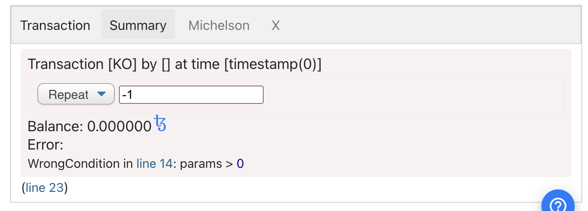

import HighlightBox from "../../src/components/HighlightBox"

Now, let's write a different smart contract. It shall sum all natural numbers from 0 to a given number: 

```python
import smartpy as sp

# Define Smartcontract

class Summarize(sp.Contract):
    def __init__(self):
        # Define storage with initial integer 0
        self.init(storage=0)

    # Define Entry Point
    @sp.entry_point
    def sum(self, params):
        sp.for i in sp.range(1, params+1):
            self.data.storage+= i

@sp.add_test(name = "Second_test")
def test():
    scenario = sp.test_scenario()
    second_contract= Summarize()

    scenario+=second_contract
    scenario+= second_contract.sum(5)
```

So, we now have:

```python
    @sp.entry_point
    def sum(self, params):
        sp.for i in sp.range(1, params+1):
            self.data.storage+= i
```

You see that SmartPy has `sp.for` to iterate a [list](https://smartpy.io/reference.html#_lists), and `sp.range` to produce such a list of integers, like `range` does in Python.

Why don't we just write the following?

```python
    @sp.entry_point
    def sum(self, params):
        for i in range(1, params+1):
            self.data.storage+= i
```

Because Python does not know what the parameter in the transaction or the storage on the blockchain is.

As mentioned, we can use Python for metaprogramming. So, we could write something like:

```python
import smartpy as sp

# Define Smartcontract

class Summarize(sp.Contract):
    def __init__(self):
        # Define storage with initial integer 0
        self.init(storage=0)

    # Define Entry Point
    @sp.entry_point
    def sum(self):
        for i in range(1, 6):
            self.data.storage+= i

@sp.add_test(name = "Third_test")
def test():
    scenario = sp.test_scenario()
    second_contract= Summarize()

    scenario+=second_contract
    scenario+= second_contract.sum()
```

That is, we could write a function, which is not dependent neither of the input or the storage. Keep in mind that either way it has write access to the storage.

How does the Michelson code of such a contract look like?

```michelson
parameter unit;
storage   int;
code
  {
    CDR;        # @storage
    # == sum ==
    # self.data.storage += 1 # @storage
    PUSH int 1; # int : @storage
    ADD;        # int
    # self.data.storage += 2 # int
    PUSH int 2; # int : int
    ADD;        # int
    # self.data.storage += 3 # int
    PUSH int 3; # int : int
    ADD;        # int
    # self.data.storage += 4 # int
    PUSH int 4; # int : int
    ADD;        # int
    # self.data.storage += 5 # int
    PUSH int 5; # int : int
    ADD;        # int
    NIL operation; # list operation : int
    PAIR;       # pair (list operation) int
  };
  ```

Can you see how the loop is [unrolled](https://en.wikipedia.org/wiki/Loop_unrolling) and Python appends the addition in-line?

In the Python code, you can see:

```python
def sum(self):
        for i in range(1, 6):
            self.data.storage+= i
```

This will be translated to 5 times `ADD` in the Michelson code.

Remember that **computation is costly** on blockchains as each calculation costs gas and with it de facto money. A code with a **minimalistic approach**, in regard to the contract code, is therefore cheaper. [It is advisable to do the least possible number of calculations on the blockchain](/blockchain-fundamentals/introduction-2#trusted-execution-on-chain---smart-contracts), metaprogramming can help with that.

If we instead use SmartPy and write:

```python
import smartpy as sp

# Define Smartcontract

class Summarize(sp.Contract):
    def __init__(self):
        # Define storage with initial integer 0
        self.init(storage=0)

    # Define Entry Point
    @sp.entry_point
    def sum(self):
        sp.for i in sp.range(1, 6):
            self.data.storage+= i

@sp.add_test(name = "Third_test")
def test():
    scenario = sp.test_scenario()
    second_contract= Summarize()

    scenario+= second_contract
    scenario+= second_contract.sum()
```

We get as Michelson code:

```michelson
parameter unit;
storage   int;
code
  {
    DUP;        # pair @parameter @storage : pair @parameter @storage
    CDR;        # @storage : pair @parameter @storage
    SWAP;       # pair @parameter @storage : @storage
    CAR;        # @parameter : @storage
    # == sum ==
    # for i in sp.range(1, 6): ... (sp.TIntOrNat) # @parameter : @storage
    PUSH int 1; # int : @parameter : @storage
    PUSH bool True; # bool : int : @parameter : @storage
    LOOP
      {
        # self.data.storage += i # int : @parameter : @storage
        DIG 2;      # @storage : int : @parameter
        SWAP;       # int : @storage : @parameter
        DUP;        # int : int : @storage : @parameter
        DUG 2;      # int : @storage : int : @parameter
        ADD;        # int : int : @parameter
        DUG 2;      # int : @parameter : int
        # loop step # int : @parameter : int
        PUSH int 1; # int : int : @parameter : int
        ADD;        # int : @parameter : int
        DUP;        # int : int : @parameter : int
        PUSH int 6; # int : int : int : @parameter : int
        COMPARE;    # int : int : @parameter : int
        GT;         # bool : int : @parameter : int
      }; # int : @parameter : @storage
    DROP 2;     # @storage
    NIL operation; # list operation : @storage
    PAIR;       # pair (list operation) @storage
  };
```

Here, we have less `ADD` instructions, which are nested in the `LOOP` instruction because of:

```python
    sp.for i in sp.range(1, 6):
            self.data.storage+= i
```

This means that the loop as such is included in Michelson. In doing so, we can see and decide which calculations we want to perform on the blockchain.

## Typing

We know that Python uses [duck typing](https://en.wikipedia.org/wiki/Duck_typing) and Michelson is [strong typed](https://en.wikipedia.org/wiki/Strong_and_weak_typing). How does this fit together?

Let's take another look at our **repeater contract**:

```python
# Import SmartPy
import smartpy as sp

# Define Smartcontract

class Repeater(sp.Contract):
    def __init__(self):
        # Define storage with initial integer 0
        self.init(storage=0)

    # Define Entry Point
    @sp.entry_point
    def repeat(self, params):
        self.data.storage= params

@sp.add_test(name = "First_test")
def test():
    first_contract= Repeater()
    scenario = sp.test_scenario()

    scenario.register(first_contract, show = True)
    scenario+= first_contract.repeat(2)
```

When we take a more detailed look in the SmartPy editor under the tab `Types`, we see:

```
Storage:
{
  storage: sp.TIntOrNat;
}.layout("storage")
Entry points:
| repeat sp.TIntOrNat
```

Our storage has the type `TIntOrNat`. This is due to the fact that **Michelson** has the types `int` and `nat`, and our script doesn't allow SmartPy to simply recognize which one we need or respectively which one we want to use. When observing the Michelson code, we can see that our storage in the end has the type **int** - eventually a decision has to be made.

In case we initialise the storage differently:

```python
        # Define storage with initial integer 0
        self.init(storage=sp.nat(0))
```

we see in the `Types` tab:

```
Storage:
{
  storage: sp.TNat;
}.layout("storage")
Entry points:
| repeat sp.TNat
```

Feel free to test:

```python
        # Define storage with initial integer 0
        self.init(storage=sp.int(0))
```

and check which type we now have.

## Conditions

Often we want a smart contract to **only accept a transaction under certain conditions**. The most important tool in SmartPy for this is `sp.verify(condition)`. Should the condition not be met, the entire transaction becomes invalid and our script stops running:

```python
# Import SmartPy
import smartpy as sp

# Define Smartcontract

class Repeater(sp.Contract):
    def __init__(self):
        # Define storage with initial integer 0
        self.init(storage=sp.int(0))

    # Define Entry Point
    @sp.entry_point
    def repeat(self, params):
        sp.verify(params>0)
        self.data.storage= params

@sp.add_test(name = "First_test")
def test():
    first_contract= Repeater()
    scenario = sp.test_scenario()

    scenario.register(first_contract, show = True)
    scenario+= first_contract.repeat(-1).run(valid=False)
```

In the Michelson code, you see:

```michelson
parameter int;
storage   int;
code
  {
    CAR;        # @parameter
    # == repeat ==
    # sp.verify(params > 0) # @parameter
    DUP;        # @parameter : @parameter
    PUSH int 0; # int : @parameter : @parameter
    COMPARE;    # int : @parameter
    LT;         # bool : @parameter
    IF
      {}
      {
        PUSH string "WrongCondition: params > 0"; # string : @parameter
        FAILWITH;   # FAILED
      }; # @parameter
    # self.data.storage = params # @parameter
    NIL operation; # list operation : @parameter
    PAIR;       # pair (list operation) @parameter
  };
```

and because of our test with `-1`you can see the corresponding message in the editor:



We also have `sp.if`. So, when we don't want our script to stop, we can write:

```python
# Import SmartPy
import smartpy as sp

# Define Smartcontract

class Repeater(sp.Contract):
    def __init__(self):
        # Define storage with initial integer 0
        self.init(storage=sp.int(0))

    # Define Entry Point
    @sp.entry_point
    def repeat(self, params):
        sp.if params>0:
            self.data.storage= params
        sp.else:
            self.data.storage= 0
            
@sp.add_test(name = "First_test")
def test():
    first_contract= Repeater()
    scenario = sp.test_scenario()

    scenario.register(first_contract, show = True)
    scenario+= first_contract.repeat(-1)
```

We have used `sp.for` already.

In addition, SmartPy offers `sp.while`.

```
    # Define Entry Point
    @sp.entry_point
    def repeat(self, params):
        sp.while (params>0):
            params+=1
            
        self.data.storage= params
```

<HighlightBox type="tip">

Take a look at this <a href="https://smartpy.io/dev/reference.html">SmartPy Reference Manual</a>. It contains a very useful overview.

</HighlightBox>

<HighlightBox type="reading">

* [Duck typing](https://en.wikipedia.org/wiki/Duck_typing)
* [Loop unrolling](https://en.wikipedia.org/wiki/Loop_unrolling)
* [SmartPy.io: Reference Manual](https://smartpy.io/reference.html)
* [SmartPy.io: Reference Manual - Lists](https://smartpy.io/reference.html#_lists)
* [Strong and weak typing](https://en.wikipedia.org/wiki/Strong_and_weak_typing)

</HighlightBox>
