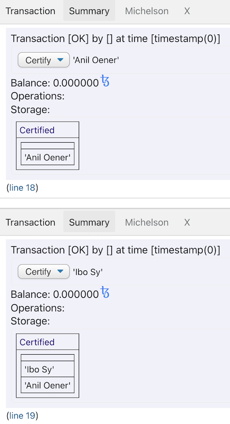
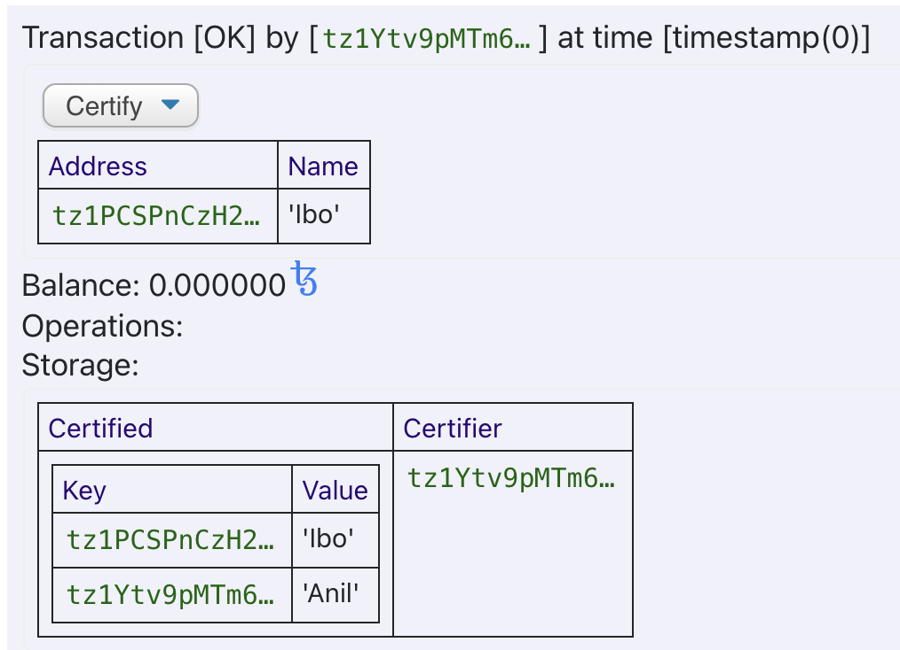

Let's test a more complicated storage structure.

Imagine that at the end of a course, you want to test all the students, and accordingly certify their performance. Let's write the for this purpose needed basic smart contract together.

We begin our thinking with what we want:

- We want to maintain a **list of students**, which passed the exam and thereby are certified;
- We want to **restrict who is able to change the list** so that not everybody is able to do so.

Let's start with the former: How could we represent students? The easiest would be to work with a list:

```python
import smartpy as sp

class Certification(sp.Contract):
    def __init__(self):
        self.init(certified=[])

    @sp.entry_point
    def certify(self, params):
        self.data.certified.push(params)

@sp.add_test(name = "Certify")
def test():
    Contract= Certification()
    scenario = sp.test_scenario()

    scenario+=Contract
    scenario+=Contract.certify("Anil Oener")
    scenario+=Contract.certify("Ibo Sy")
```

Ok, we can see how the list is growing in the output when we add new students with the help of the "certify" function:



You can see how SmartPy understands that we want to use a `List` without explicit typing.

Currently, we have **two issues**:

- Everyone is able to invoke this smart contract, and expand the list of certified students;
- It could be that two students have the same name.

We can solve the first quite simply by using `sp.verify`:

```python
import smartpy as sp

class Certification(sp.Contract):
    def __init__(self):
        self.init(certified=sp.list(t=sp.TString), certifier=sp.address("tz1W4W2yFAHz7iGyQvFys4K7Df9mZL6cSKCp"))

    @sp.entry_point
    def certify(self, params):
        sp.verify(sp.sender==self.data.certifier)
        self.data.certified.push(params)

@sp.add_test(name = "Certify")
def test():
    Contract= Certification()
    scenario = sp.test_scenario()

    scenario+=Contract
    scenario+=Contract.certify("Anil Oener").run(sender=sp.address("tz1W4W2yFAHz7iGyQvFys4K7Df9mZL6cSKCp"))
    scenario+=Contract.certify("Ibo Sy").run(sender=sp.address("tz1W4W2yFAHz7iGyQvFys4K7Df9mZL6cSKCp"))
```

or better testing with `test_account`:

```python

import smartpy as sp

class Certification(sp.Contract):
    def __init__(self, certifier):
        self.init(certified=sp.list(t=sp.TString), certifier=certifier.address)

    @sp.entry_point
    def certify(self, params):
        sp.verify(sp.sender==self.data.certifier)
        self.data.certified.push(params)

@sp.add_test(name = "Certify")
def test():
    Anil = sp.test_account("Anil")
    Ibo = sp.test_account("Ibo")
    
    Contract= Certification(certifier=Anil)
    scenario = sp.test_scenario()

    scenario+=Contract
    
    scenario+=Contract.certify("Anil Oener").run(sender=Anil)
    scenario+=Contract.certify("Ibo Sy").run(sender=Anil)
```

We expanded our storage and **saved an address that represents the certifier**. Now, if a different address tries to add to the list,

```python
sp.verify(sp.sender==self.data.certifier)
```

it will lead to an **invalid transaction**.

A common existing verification in smart contract writing is: What address does this smart contract call? In SmartPy, we have access to the address via `sp.sender`.

Now, we can tackle the second issue.

We need a [unique identifier](https://en.wikipedia.org/wiki/Unique_identifier) for the students. The most simple and obvious solution would be the **use of the student's Tezos address as unique identifier**. For this, a `map` is perfectly suited:

```python
import smartpy as sp

class Certification(sp.Contract):
    def __init__(self, certifier):
        self.init(certified=sp.map(tkey=sp.TAddress, tvalue=sp.TString), certifier=certifier.address)

    @sp.entry_point
    def certify(self, params):
        sp.verify(sp.sender==self.data.certifier)
        self.data.certified[params.address]= params.name

@sp.add_test(name = "Certify")
def test():
    Anil = sp.test_account("Anil")
    Ibo = sp.test_account("Ibo")
    
    Contract= Certification(certifier=Anil)
    scenario = sp.test_scenario()

    scenario+=Contract
    
    scenario+=Contract.certify(name= Anil.seed, address= Anil.address).run(sender=Anil)
    scenario+=Contract.certify(name= Ibo.seed, address= Ibo.address).run(sender=Anil)
```

In other words, our storage can be described as:

```
Storage:
{
  certified: sp.TMap(sp.TAddress, sp.TString);
  certifier: sp.TAddress;
}.layout(("certified", "certifier"))
Entry points:
| certify
  {
    address: sp.TAddress;
    name: sp.TString;
  }.layout(("address", "name"))
```

and again we see how the list is growing:



Finally, we want to use a `big_map` instead of a `map`:

```python

import smartpy as sp

class Certification(sp.Contract):
    def __init__(self, certifier):
        self.init(certified=sp.big_map(tkey=sp.TAddress, tvalue=sp.TString), certifier=certifier.address)

    @sp.entry_point
    def certify(self, params):
        sp.verify(sp.sender==self.data.certifier)
        self.data.certified[params.address]= params.name

@sp.add_test(name = "Certify")
def test():
    Anil = sp.test_account("Anil")
    Ibo = sp.test_account("Ibo")
    
    Contract= Certification(certifier=Anil)
    scenario = sp.test_scenario()

    scenario+=Contract
    
    scenario+=Contract.certify(name= Anil.seed, address= Anil.address).run(sender=Anil)
    scenario+=Contract.certify(name= Ibo.seed, address= Ibo.address).run(sender=Anil)
```

## Deploying with SmartPy

SmartPy allows us to **deploy the smart contract directly within the browser**.

First, we can again **import an account from the faucet**:


Now we need to **activate and reveal** this account, before we can deploy our contract:


Afterwards, we can **deploy the smart contract**:


and check via the explorer:


Notice that we want to work on the test network and therefore we need to pick up a node participating in the test network:


