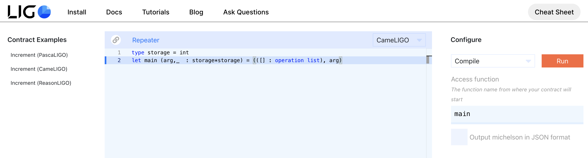

import HighlightBox from "../../src/components/HighlightBox"

import {
  ExpansionPanel,
  ExpansionPanelList,
  ExpansionPanelListItem
} from 'gatsby-theme-apollo-docs';

<ExpansionPanel title="OCaml Introduction">

## OCaml

In this section, we want to give you a quick introduction into [OCaml](https://en.wikipedia.org/wiki/OCaml).

You should take a look at OCaml for multiple reasons:

* the [reference implementation](https://gitlab.com/tezos/tezos/tree/master/src) of the **Tezos components** is written in OCaml, and
* it is easier to **illustrate some concepts** in OCaml, which are also present in Michelson or LIGO.

With OCaml, you can use [functional](https://en.wikipedia.org/wiki/Functional_programming), [imperative](https://en.wikipedia.org/wiki/Imperative_programming), or [object oriented](https://en.wikipedia.org/wiki/Object-oriented_programming) programming.

We don't want to look at objects and loops here, instead we will learn the syntax and some design concepts in functional programming.

To get started, please [install](https://ocaml.org/docs/install.html) OCaml on your machine.

<HighlightBox type="warn">

Please read the install instructions carefully. The recommended way to install OCaml is using opam, which is a package manager for OCaml. We also recommend using opam.
**Windows users with WSL** are out of luck this time: opam will not run properly in WSL, because it does not support bubblewrap. There is a workaround (by disabling sandboxing), which is **not recommended**. You can install OCaml directly with apt instead, or use a full VM.

</HighlightBox>

After the installation succeeds, you can start OCaml with:

```bash
$ ocaml
```

Next to compilers (for bytecode and native binaries), the OCaml installation also offers an interpreter, which we have just started. We will use it in interactive mode, to explore OCaml.

```ocaml
        OCaml version 4.08.1
# 
```

The symbol `#` is a [promt](https://en.wikipedia.org/wiki/Command-line_interface#Command_prompt).

To continue the tradition, we will start with ["Hello World!"](https://en.wikipedia.org/wiki/%22Hello,_World!%22_program):

```ocaml
# print_string "Hello world!\n";;
Hello world!
- : unit = ()
```

Let's take a look at this first piece of code and the output. As expected, `print_string` takes a `string` as input and prints it on the screen.

Try:

```ocaml
# print_string;;
- : string -> unit = <fun>
```

Did you expect an error? OCaml is a functional programming language, this means a functional value is returned. It is just not applied yet.
But what does the output mean? This is the [signature](https://en.wikipedia.org/wiki/Type_signature) of the function - we will look closer into this in a moment. Btw, `<fun>` stands for a value that the interpreter spares us. 

Try something different:

```ocaml
# "Hello world!\n";;
- : string = "Hello\n"
```

Do you see the `-` in the output? Let's try it a bit differently:

```ocaml
# let message="Hello world!\n";;
val message : string = "Hello world!\n"
```

Okay, now we have a value `"Hello world!\n"` with type `string`, and its name is `message`. If there is no name for a value, we will see `-`. The details of the `let` keyword will be discussed later.

Now, let's look back at our first output:

```ocaml
- : unit = ()
```

We now know, this is a value without Name. The value is `()` and the type is `unit`. Do you remember the `unit` type from Michelson? This type can only have the value `()`, it is similar to `void` in C/C++.

Finally, what's with `;;`? If we use the interpreter, we must append `;;` at the end of our command to execute it. You won't find this in a `.ml` file. But in the interpreter, we are in a [read-eval-print-loop](https://caml.inria.fr/pub/docs/manual-ocaml/toplevel.html)(REPL), therefore we have to indicate the phrase is complete and should be executed.

If you forget the `;;` don't worry, you can also add it on the next line:

```ocaml
# print_string "Hello world!\n"
  
  ;;
Hello world!
- : unit = ()
# 
```

You can quit the OCaml session with `#quit;;`(here, the symbol `#` **needs to be written out**). You can also use <kbd>CTRL-D</kbd> to quit.

<HighlightBox type="tip">

We strongly recommend trying out the tool [utop](https://github.com/ocaml-community/utop). It is a very good top-level for OCaml (REPL). Try it out, you will see the difference to `ocaml` immediately.

</HighlightBox>

**Types**

OCaml uses [static typing](https://en.wikipedia.org/wiki/Type_system#Static_type_checking) and type inference to decide on the types, so we don't have to care about it much. Still, sometimes we have to indicate the type we want to use explicitly. If we use the `ocaml` top-level, OCaml will tell us the detected type.

Here is an overview of the basic types, taken from the [OCaml tutorials](https://ocaml.org/learn/tutorials/basics.html):

```
type        Range
int         31-bit signed int (roughly +/- 1 billion) on 32-bit
            processors, or 63-bit signed int on 64-bit processors
float       IEEE double-precision floating point, equivalent to C's double
bool        A boolean, written either true or false
char        An 8-bit character
string      A string
unit        Written as ()
```

**  - Integers**

Let's define a number `x`:

```
# let x : int = 42;;
val x : int = 42
```

We use the keyword `let` again. It can do more, but used like this, it is a global definition. *We bind the value 42 to the name x*. Here, we explicitly declare the type of `x`
integer support the operations `+`, `-`, `*`, `/` and `mod`.

```
# let y= -x*2/3 mod 3 + x;;
val y : int = 41
```

Note that the interpreter shows us the right datatype, without us declaring it explicitly.

**Float**

```
# let x = 42.0;;
val x : float = 42.
```

What happens if the try to run:

```
# let y= x-1;;
Error: This expression has type float but an expression was expected of type
         int
```

Okay, 1 is an integer and we get a type error. It should run if we change the `1` to a float, right?

```
# let y = x - 1.0;;
Error: This expression has type float but an expression was expected of type
         int
```

Unfortunately not. But why? Because OCaml does not know operator overloading, therefore we need to use a different operator instead:

```
# let y = x -. 1.0;;
val y : float = 41.
```

This works fine. Our previous formula which we used to try the different operations needs a bit more to be converted to floats:

```
# let y= mod_float (-. x*.2.0/.3.0) 3.0 +. x;;
val y : float = 41.
```

For floats, `a mod b` becomes `mod_float a b`.

Note that the order of execution with these operators follow mathematical convention. The expressions in the parentheses will be evaluated first.
By the way, you can use the keywords `begin` and `end` instead of the parentheses:

```
# let y= mod_float begin -. x*.2.0/.3.0 end 3.0 +. x;;
val y : float = 41.
```

This might help to improve the readability at some places - here, not really.
There is no implicit cast in OCaml. To subtract a float from an integer, we need to use an explicit cast:

```
# let x= 42;;
val x : int = 42
# let y = (float_of_int x) -. 1.0;;      
val y : float = 41.
```

For this we use `float_of_int`. There are other similar functions (e.g. `char_of_int` and `int_of_char`), see [this list](https://ocaml.org/releases/4.02/htmlman/libref/Pervasives.html).

Last but not least, `float` also has a power operator:

```
# 2.0 ** 8.0 ;;
- : float = 256.
```

**Booleans**

As mentioned before, booleans can assume the value `true` or `false`:

```
# true;;
- : bool = true
# false;;
- : bool = false
# 
```

Let's try some comparison operators:

```
# true < false;;
- : bool = false
# false < true;;
- : bool = true
# false = false;;
- : bool = true
```

The comparison operators `<`, `>`, `=`, `<=`, `>=` can be applied on basic types. For `int` and `float`, they follow the usual numeric ordering. For `bool` it defines `false < true`.

For `char` the ASCII order applies:

```
# '/' < 'O';;
- : bool = true
# 'Q' < 'q';;
- : bool = true
# 'r' < '{';;
- : bool = true
```

For `string` the [lexicographical_order](https://en.wikipedia.org/wiki/Lexicographical_order) is used.

**Char**

Characters are enclosed in single quotes:

```ocaml
# let c1 = 'a';;
val c1 : char = 'a'
# let c2 = '\n';;
val c2 : char = '\n'
# let c3 = '\"';;
val c3 : char = '"'
# 
```

**String**

We already encountered a string in our first program. Here is another example:

```ocaml
# let firstname = "Ibo";;
val firstname : string = "Ibo"
# let lastname = "Sy";;
val lastname : string = "Sy"
# let name = firstname ^ " " ^ lastname;;
val name : string = "Ibo Sy"
# String.length name;;
- : int = 6
```

Wow, what a short name. To concatenate string, we use the `^` operator.

**Optional values**

There is a so-called `option` type in OCaml. It can either have the value `None` or `Some`, and comes in handy in certain cases to ensure the type security. 

This code:

```ocaml
# let div a b = a/b;;
val div : int -> int -> int = <fun>
# div 2 0;;
Exception: Division_by_zero.
```

gives us an error, since a division by `0` is not defined and we don't return an `int`, even though our signature is `val div : int -> int -> int = <fun>`. We can solve the problem with option:

```ocaml
# let div x y = if y = 0 then None else Some (x/y) ;;
val div : int -> int -> int option = <fun>
# div 2 0;;
- : int option = None
# div 2 1;;
- : int option = Some 2
```

**Let**

Now we have learned enough data types to do something more interesting. 
Let's talk about `let` again: So far, we used it in a way which is a [syntactic sugar](https://en.wikipedia.org/wiki/Syntactic_sugar).

The `let` syntax is:

```ocaml
let name = exp1 in exp2
```

Here, `exp1` is evaluated first, and the result is named `name` in `exp2`.

```ocaml
# let x = 8 in x*x;;
- : int = 64  
```

Note that `x` is only defined in `x*x`.
​
`let` itself is an expression. In OCaml, almost everything is an expression. Therefore, we can nest `let`:
​

```ocaml
# let x = 3 + 4 in let y = x + x in y * 3;;
- : int = 42
```
​
In this case, `x=7` is calculated first, then `y=14` and finally `-=42`.
​
We mentioned that we have used syntactic sugar before:
​

```ocaml
# let x = 42;;
val x : int = 42
# let y= -x*2/3 mod 3 + x;;
val y : int = 41
```
​
How would we write this in form of `let exp1 in exp2`?
​

```ocaml
# let x = 42 in 
let y= -x*2/3 mod 3 + x 
in y;;
```
​
That's also the reason why we are able to run:
​

```ocaml
# let x=1;;
val x : int = 1
# let x=2;;
val x : int = 2
```
​
even though variables are immutable in OCaml.
​

```ocaml
# let x =1 in let x=2 in x;;
Warning 26: unused variable x.
- : int = 2
```
​
This is called *shadowing*; we bind `x` again, and only this last binding is visible.
​
**Functions**
​
We can define functions with `fun`:
​

```ocaml
# let add = fun a b -> a + b;;
val add : int -> int -> int = <fun>
# add 2 5;;
- : int = 7
```
​

This defines an anonymous function(*lambda*). Because functions are expressions as well, we can use them inside `let` and thereby name them.
​
Alright, but why does the signature show:
​

```ocaml
val add : int -> int -> int = <fun>
```
​
In OCaml, you typically take one thing at a time. So if you give a function 2 parameters, it will create 2 functions, each of which takes 1 parameter. This is called [currying](https://en.wikipedia.org/wiki/Currying), a kind of nesting call. If Javascript was currying functions, it would mean that declaring add like so:
​

```javascript
function add(left, right) {
    return left + right;
}
```
​
would, under the hood, be curried into:
​

```javascript
function add(left) {
    return function (right) {
        return left + right;
    }
}
```
​
So, instead of calling `var sum = add(2, 3);`, you could call `var sum = add(2)(3);`. And because you have the option, you could declare a new function `var addTwo = add(2);`. This addTwo is a function, which can be called `var sum = addTwo(3);`.
​
In OCaml, it would look like this:
​

```ocaml
# let add a b = a + b;;
val add : int -> int -> int = <fun>
# let addTwo = add 2;;
val addTwo : int -> int = <fun>
# addTwo 3;;
- : int = 5
```
​
By the way, the expression:
​

```ocaml
# let add = fun a b -> a + b;;
```
​
and:
​
```ocaml
let add a b = a + b;;
```
​
are the same. We could also use `function`:
​

```ocaml
# let add = function (a,b) -> a+b;;
val add : int * int -> int = <fun>
```
​
This results in a different signature, because using `function`, we can only define functions with one parameter. Here, due to `(a,b)` OCaml detects that the input should be a Tuple. We will talk about Tuples in a moment - first we need to talk about [pattern matching](https://en.wikipedia.org/wiki/Pattern_matching), because there is another difference between `fun` and `function`.
​
Another important keyword is `rec`. We will use it to define [recursive functions](https://en.wikipedia.org/wiki/Recursion_(computer_science)).
​

```ocaml
# let rec fib n = if n = 0 || n = 1 then 1. else fib(n-1)+.fib(n-2);;
val fib : int -> float = <fun>
# fib 10;;
- : float = 89.
```
​

`rec` is required here, because otherwise `fib` would not be defined inside the function.

Now, back to [matching](https://caml.inria.fr/pub/docs/oreilly-book/html/book-ora016.html), it has the following syntax:

```ocaml
match expr with
| p1 -> expr1
:
| pn -> exprn
```

With it we can rewrite our [Fibonacci](https://en.wikipedia.org/wiki/Fibonacci_number) function:

```ocaml
# let rec fib i = fun
    match i with
    0 -> 0
  | 1 -> 1
  | n -> fib (n-1) + fib (n-2);;
val fib : int -> int = <fun>
```

Or as mentioned before, we can use `function`:

```ocaml
# let rec fib = function
  | 0 -> 0
  | 1 -> 1
  | n -> fib (n-1) + fib (n-2);;
val fib : int -> int = <fun>
```

**If statement**
​
We also used `if` and `else` before. The full syntax is:
​

```ocaml
if condition then exp1 else exp2
```
​
If the `condition` is `true`, `exp1` will be evaluated and if it is `false`, `exp2` will be evaluated. Please note that the values of `exp1` and `exp2` need to be the same type. You can omit `exp2`:
​

```ocaml
# if 3>2 then print_string "OK!";;
OK!- : unit = ()
```
​
This only works because `print_string` has a value of `()`. The following will not work:
​

```ocaml
# if 3>2 then true;;
Error: This variant expression is expected to have type unit
         because it is in the result of a conditional with no else branch
       The constructor true does not belong to type unit
```
​
This means, we must make sure the types are matching by adding an else statement:
​

```ocaml
# if 3>2 then true else false;;
- : bool = true
```
​
`if` are expressions as well and can be nested.
​
​
**  - Lists and tuples**
​
`list` and `tuple` are immutable so all modifying actions on them return a new instance.
​

```ocaml
let myList = [ "hello"; "world" ];;
```
​
will be inferred to a `string list`. Note carefully the `;` between the 2 elements. If you had placed a `,` there:
​

```ocaml
let myList = [ "hello", "world" ];;
```
​
it would have been inferred to a `(string * string) list`, yes a list of Tuples. Which also means that the following:
​

```ocaml
let myList = [ "hello"; "beautiful", "world" ];;
```
​
will result in an `inconsistent types in list` because you put a `,` after `"beautiful"`.
​
A very important operation on lists is `::` :
​

```ocaml
# let myList = "hello" :: "beautiful" ::  "world" :: [];;
val myList : string list = ["hello"; "beautiful"; "world"]
```
​
The length of a list can be retrieved with:
​

```ocaml
List.length myList;;
```
​
The main difference between Tuples and Lists is that a List can only have one type of values:
​

```ocaml
# let myList = [ "hello"; 2];;       
Error: This expression has type int but an expression was expected of type
         string
```
​
while a Tuple can have different types:
​

```ocaml
let myTuple = "hello",2;;
val myTuple : string * int = ("hello", 2)
```
​
Or written with the bracket notation:
​

```ocaml
let myTuple = ("hello",2);;
```
​
When using Tuples and Lists, we cannot access arbitrary elements. Using `fst`, we can get the first element, and using `snd` you can get the second element.

Let's define a function, which receives a tuple with two elements and interchanges them:


```ocaml
# let swap (a,b) = (b,a);;
val swap : 'a * 'b -> 'b * 'a = <fun>
# swap (1,2);;
- : int * int = (2, 1)
```

**  - User defined types**

With the keyword `type` we can define own types. Let's take a look at a simple example:

```
# type storage=int;;
type storage = int
```

**  - Record types**

Records are what you may know as a `struct` by another name. Record type elements are accessed by name. For instance:


```ocaml
# type person = { name : string; age : int; address : string; };;
type person = { name : string; age : int; address : string; }
# let p:person = { name="foo"; age = 20; address="bar"};;
val p : person = {name = "foo"; age = 20; address = "bar"}
# p.name;;
- : string = "foo
```

**  - Variant types**

Ok, so OCaml is strongly typed, yet it allows you some flexibility. By flexibility, we mean that you could have a variable that is, for instance, either an `int` or a `string`. It is called a [variant type](https://en.wikipedia.org/wiki/Variant_type). To help you grasp the concept if it is new, let's use a contrived Java analogy.

```java
public class EitherIntOrString {
    private Integer theInt;
    private String theString;

    public EitherIntOrString(@NotNull String theString) {
        this.theInt = null;
        this.theString = theString;
    }

    public EitherIntOrString(int theInt) {
        this.theInt = theInt;
        this.theString = null;
    }

    public Integer getTheInt() {
        return theInt;
    }

    public String getTheString() {
        return theString;
    }

    public boolean isInt() {
        return theInt != null;
    }
}
```

We can use an instance of `EitherIntOrString`, pass it around, and, at any time check whether it is effectively an `int` or a `string`, before moving on.

[OCaml](https://ocaml.org/learn/tutorials/data_types_and_matching.html) offers the same in a more succinct way:

```ocaml
# type eitherIntOrString = 
| IntActually of int
| StringActually of string    
  ;;
type eitherIntOrString = IntActually of int | StringActually of string
```

On each line, the word on the left, `IntActually` and `StringActually`, is called a constructor but you can also think of them as classes because the word you use, like `IntActually` has to be unique in your code. The two `|` you see here look like they are placed for visual effect, but they are in fact logical `OR` to separate the different constructors. Yes, you could remove the first `|` and define your type like so:

```ocaml
type eitherIntOrString = IntActually of int | StringActually of string;;
```

But we sort of like the visual effect.

Interestingly if you wanted to add a nullable option, you could add one line, like so:

```ocaml
# type eitherIntOrString = 
| Nothing
| IntActually of int
| StringActually of string;;      
type eitherIntOrString =
    Nothing
  | IntActually of int
  | StringActually of string
```

The type, on the right side, `of int`, is to be expressed as per the type you want, so if you wanted to add a person, you could add the line:

```ocaml
| PersonActually of string * int * string
```

So this is the type declaration, how about using it? Simple, you call the constructor:

```ocaml
# let anIntActually = IntActually 3;;
val anIntActually : eitherIntOrString = IntActually 3
# let aStringActually = StringActually "Hello World";;
val aStringActually : eitherIntOrString = StringActually "Hello World"
```

To add further flexibility, it is possible to parameterise your type such as:

```ocaml
type 'defineLater eitherSomethingOrString = 
| SomethingActually of 'defineLater
| StringActually of string;;
```

Here `'defineLater` is the type we can define later. When using it you would rely on the aggressive typing:

```ocaml
# let anIntActually = SomethingActually 3;;
val anIntActually : int eitherSomethingOrString = SomethingActually 3
```

When you try the following:

```ocaml
# let identity x = x;;
val identity : 'a -> 'a = <fun>
```

you can again see the notation `'a`. This is due to the above function being a [polymorphic](https://caml.inria.fr/pub/docs/manual-ocaml/polymorphism.html) function:

```ocaml
# identity 2;;
- : int = 2
# identity 2.0;;
- : float = 2.
# identity "Hello!";;
- : string = "Hello!"
```

<HighlightBox type="reading">

**Next steps**

Our quick introduction turned out to be a bit more extensive than announced - and there is so much more! So far, we have only looked at functional programming. But as mentioned, OCaml also supports imperative and object oriented programming.

As there are already some very good resources available online for free about OCaml, we don't want to restate everything here but rather point you towards these. A few topics, just to tease you:

* Modules, including existing ones like Graphics and Gc
* Modifiable Data Structures like Vectors
* Polymorphism
* Streams and I/O ops
* Abstract classes, Interfaces, 
* Mixing different styles
* Further tools

And much more - including many samples - can be found on these pages:

* _[Developing Applications With OCaml](https://caml.inria.fr/pub/docs/oreilly-book/html/index.html)_ by Chailloux, Manoury, Pagano
* _[OCaml Code Examples page](https://ocaml.org/learn/taste.html)_
* _[OCaml for the Skeptical](https://www2.lib.uchicago.edu/keith/ocaml-class/)_ by Keith Waclena, pointing to many further resources.

</HighlightBox>

</ExpansionPanel>

## LIGO

[LIGO](https://ligolang.org/) is a statically-typed, high-level language that compiles down to Michelson. The syntaxes currently supported are **PascaLIGO** (pascal-like syntax) and **CameLIGO** (caml-like syntax).

Similar to SmartPy, it is still in development. The [idea](https://ligolang.org/docs/contributors/philosophy/) is to offer a secure and simple tool. In the long term, the plan is to support [multiple syntaxes](https://ligolang.org/docs/contributors/road-map/long-term/).

The [installation](https://ligolang.org/docs/intro/installation/) is easy. Since we have previously worked with Docker, we also want to use it for LIGO:

```bash
$ curl https://gitlab.com/ligolang/ligo/raw/dev/scripts/installer.sh | bash -s "next"
```

Although other syntaxes will be supported in the future, here we want to introduce two which are already quite advanced in their development.

## CameLIGO

Along the way we have gained experience with smart contracts and OCaml. This will make it easier for us to engage with CameLIGO.
Before diving into details, let's again write our prominent **repeater** contract.

Create `repeater.mligo`:

```ocaml
type storage = int
let main (arg,storageIn  : storage*storage) = (([] : operation list), arg)
```

It looks very similar to OCaml with the difference being that, momentarily, we have to explicitly pass all types. The rest should look familiar from OCaml and Michelson:

* `type storage = int` is a type definition,
* `main` takes two arguments, the *parameter* `arg` and the *storage* `storageIn`,
* even though we named our input storage instance `storageIn`, we do nothing with it, so it could have been left as `_`,
* the value is a tuple `([], arg)`, whereas `[]` is of the type `operation list`.

Let's do a very quick test with the [online editor](https://ide.ligolang.org/):



At the bottom you will see the Michelson output:

```
{ parameter int ; storage int ; code { UNPAIR ; SWAP ; DROP ; NIL operation ; PAIR } }
```

Well, we have worked with Michelson before and know that this code can be written in a bit more efficient way by replacing

```
UNPAIR ; SWAP ; DROP
```

with 

```
CAR
```

which will do the same, take the left of the input pair `parameter*storage`.

### Storage

Smart contracts have access to and can modify their own storage, the structure that has to be defined as part of the contract definition. The code and the storage type go together. In fact, the storage is just another type, and by convention we name it `storage`. The type is flexible, but, like the code, cannot be changed once deployed.

For instance, if you have a contract that does not need to save anything to the storage, you would declare:

```ocaml
type storage = unit
```
If your contract only needs to save a positive number, you would declare:

```ocaml
type storage = nat
```

If your contract only needs to save either a positive number or nothing, you would declare:

```ocaml
type storage = nat option
```

Where `option` is one of the native parameterised variants: `type 'a option = None | Some 'a`.

If your contract only needs to save a single person, you would declare it with a record:

```ocaml
type storage = {
    name: string;
    age: nat;
    streetAddress: string;
    tezAddress: address;
}
```

If your contract wants to act as a Tezos token ATM, you may declare its storage with:

```ocaml
type storage = {
    balances: (address, tez) map;
    totalSupply: tez;
}
```

This will create a namespace mapping addresses to balances in tez.

## The smart contract to certify students

We want to start with an example that we already know from SmartPy and Michelson, the student certification contract.
Let's begin by defining a student:

```ocaml
type student = {
    name : string ;
    certificate : bool;
  }
```

Since we don't want everyone to be able to issue certificates, we also want to save an address which represents the authorised person:

```ocaml
type storage = {
  students : student list;
  certifier : address;
}
```

Now, we can add the following function:

```ocaml
type student = {
    name : string ;
    certificate : bool;
  }
type storage = {
  students : student list;
  certifier : address;
}
let certifyStudent (name,oldState : string*storage) =
    let reqSender = sender in
    if reqSender = oldState.certifier 
    then 
      let newStudents:(student list) = 
      { name = name; certificate = true } :: oldState.students in
      let newState:storage = { students = newStudents; certifier = oldState.certifier } in
      ( ([]:operation list) , newState )
    else 
      ( ([]:operation list) , oldState ) 
```

It should be clear now what we mean with *caml-like syntax*.

We now can compile the code and get the Michelson output:

```
{ parameter string ; storage (pair (address %certifier) (list %students (pair (bool %certificate) (string %name)))) ; code { UNPAIR ; SENDER ; DIG 2 ; DUP ; DUG 3 ; CAR ; SWAP ; COMPARE ; EQ ; IF { SWAP ; DUP ; DUG 2 ; CDR ; SWAP ; PUSH bool True ; PAIR ; CONS ; SWAP ; CAR ; PAIR ; NIL operation ; PAIR } { DROP ; NIL operation ; PAIR } } }
```

You can store this Michelson code and deploy it with the help of the `tezos-client`, as we have done before; e.g. using `--init 'Pair {} "tz1W4W2yFAHz7iGyQvFys4K7Df9mZL6cSKCp"'`.

Let's take a look at the example at [https://ligolang.org/](https://ligolang.org/):

```ocaml
type storage = int

(* variant defining pseudo multi-entrypoint actions *)

type action =
| Increment of int
| Decrement of int

let add (a,b: int * int) : int = a + b
let sub (a,b: int * int) : int = a - b

(* real entrypoint that re-routes the flow based on the action provided *)

let main (p,s: action * storage) =
 let storage =
   match p with
   | Increment n -> add (s, n)
   | Decrement n -> sub (s, n)
 in ([] : operation list), storage

```

This shows that we can use pattern matching as we know it from OCaml, and also add comments the same way. This is especially useful when used as shown in this example.
You have been using multiple entry points already. When using LIGO, this [alternative pattern](https://ligolang.org/docs/advanced/entrypoints-contracts) is currently recommended.

## PascaLIGO

[Pascal](https://en.wikipedia.org/wiki/Pascal_(programming_language)) is a relatively beginner friendly language and has many keywords. For this reason, a pascal-like syntax should help with writing smart contracts that are easier to read and understand.

<HighlightBox type="tip">

LIGO offers a [VSCode extension](https://ligolang.org/docs/intro/editor-support).

</HighlightBox>

Let's start with the repeater contract again:

```pascal
function main (const arg : int;  const storageIn : int) : (list(operation) * int) is
  block {skip} with ((nil : list(operation)), arg)
```

After a quick test via online IDE, save this as `repeater.ligo` and run:

```bash
ligo dry-run ./repeater.ligo main 5 0
```

Hopefully you will see the expected value.

For definitions, [similar to pascal](https://ligolang.org/docs/language-basics/functions) we use:

- `function main` to define a function which can be used as entry point.
- `(const arg : int;  const storageIn : int)` for our input parameters, as we have done with other languages.
- `(list(operation) * int)` to set the return type, as seen before it is a tuple consisting of a `(list(operation)` and an `int`.
- `block {skip}` when we don't want to calculate anything
- `with ((nil : list(operation)), arg)` to return a the tuple together with the new input.

We define variables with `const`(*immutable*) and `var`(*mutable*), where `var` can only be used inside functions or blocks.

So, how would our certification contract for the students looks like?

```pascal
type student is record
    name : string ;
    certificate : bool;
end
type certStorage is record
  students : list(student);
  certifier : address;
end
function certifyStudent (const studentName : string; const oldState:certStorage) : (list(operation) * certStorage) is
  begin
  if sender =/= oldState.certifier then failwith("Only certifier can call this function");
  else skip;
  const newStudent : student = record 
            name = studentName; 
            certificate= True;
            end;
  const oldList:list(student) = oldState.students;
  const newList:list(student) = cons(newStudent, oldList);
  const newState : certStorage = record
            students= newList;
            certifier= oldState.certifier;
            end;
  end with ((nil : list(operation)), newState)
```

In this sample, we define our storage similar to our implementation in CameLIGO:

```pascal
type student is record
    name : string ;
    certificate : bool;
end
type certStorage is record
  students : list(student);
  certifier : address;
end
```

<HighlightBox type="info">

Take a look at the [types section](https://ligolang.org/docs/next/language-basics/types/) in the LIGO documentation.

</HighlightBox>

Afterwards, we define our entry point with the right input and output parameter types:

```pascal
function certifyStudent (const studentName : string; const oldState:certStorage) : (list(operation) * certStorage)
```

We add our usual check:

```pascal
if sender =/= oldState.certifier then fail("Only certifier can call this function");
  else skip;
```

<HighlightBox type="tip">

Take a look at the [available operators](https://ligolang.org/docs/language-basics/types) in the LIGO documentation.

</HighlightBox>

After that, we define a new student:

```pascal
const newStudent : student = record 
            name = studentName; 
            certificate= True;
            end;
```

And extend our list with this new student:

```pascal
const oldList:list(student) = oldState.students;
const newList:list(student) = cons(newStudent, oldList);
```

Next, we change the state with the new list:

```pascal
const newState : certStorage = record
          students= newList;
          certifier= oldState.certifier;
          end;
```

to finally store this new state:

```pascal
end with ((nil : list(operation)), newState)
```

<HighlightBox type="reading">

- [Taco shop smart-contract](https://ligolang.org/docs/tutorials/get-started/tezos-taco-shop-smart-contract/) tutorial by LIGO
- [The Tezos Agora Forum](https://forum.tezosagora.org/tag/ligo) with updates.
- LIGO [philosophy, design and roadmap](https://ligolang.org/docs/contributors/origin/)
- [Beginner's Guide to Tezos Smart Contracts with LIGO](https://www.youtube.com/watch?v=Ozf250c52AI) by Matej Sima

</HighlightBox>
