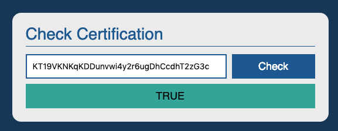
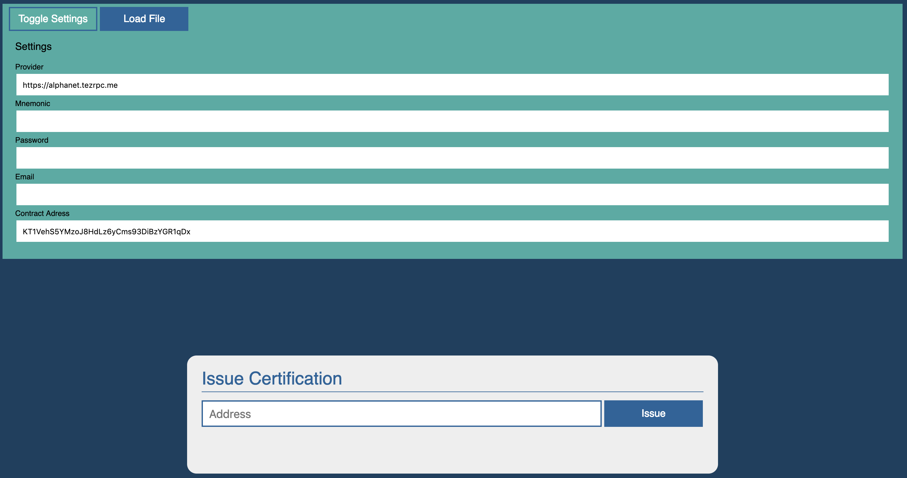

# Taquito

After writing smart contracts for the Tezos blockchain, we will now dive into clients.

As we know the tezos-node offers a JSON/RPC interface. In this chapter, we want to communicate with the *tezos-node* without using the *tezos-client*. The reason is that, at the end of the day, we want to write applications, which we can hand over to the client without more ado.

We need a possibility for the average user to interact with a smart contract. We will work with a smart contract similar to the student certification smart contract, which you already deployed. We do not store the name of the students to keep our first clients simple.

So we will need:

- A user interface to check if a student is certified.
- A user interface for the certifier.

[Taquito](https://tezostaquito.io/) is a Tezos Typescript library. You can find the source code in the [offical repository](https://github.com/ecadlabs/taquito). 

It includes various features, among others:

- The @taquito/taquito package that builds upon the other packages in the Tezos Typescript Library Suite and offers higher level utility
- @taquito/rpc package that wraps the RPC endpoints
- @taquito/signer package to sign with tezos keys
- @taquito/tezbridge-wallet and @taquito/beacon-wallet packages implementing Wallet API


In addition, it is very well [documented](https://tezostaquito.io/docs/quick_start/). There is a npm package for [Taquito](https://www.npmjs.com/package/@taquito/taquito) that we can use.
But our first contact with Taquito will be without Node.js but later we will also talk about it with Node.js.

# Certificate Verifier

Since fetching the contract storage is relatively simple, it qualifies well to see Taquito in action for the first time. We will keep all our GUI project files in a folder. So go ahead and create a folder for it, and download [jQuery](https://cdnjs.cloudflare.com/ajax/libs/jquery/3.3.1/jquery.slim.min.js) into it.

In addition, we can embed Taquito into a HTML page with:

```html
<script src="https://unpkg.com/@taquito/taquito@8.0.6-beta.0/dist/taquito.min.js"
crossorigin="anonymous" integrity="sha384-Nl9zWZPEZwA7IDtkqHP9BThh6Os+lYrN0JOM3qzCIdsQqxKChg57TaoeCIcDfwex"></script>
```

The Verifier has to fulfil a simple task: verify the certification of a given student address. Therefore, a single input field is sufficient. It will look like this:



We are taking the primrose path: We will first create a HTML page, and with it contact a public node to fetch data from the Tezos blockchain.

<tip>
You can find a list of [community tezos nodes](https://tezostaquito.io/docs/rpc_nodes/) at the documentation.
</tip>

Let us start with the `index.html` file:

```html
<html>
<head>
  <link rel="stylesheet" type="text/css" href="./app.css">
  <title>Check Certification</title>
  <script src="jquery.slim.min.js"></script>
  <script src="https://unpkg.com/@taquito/taquito@8.0.6-beta.0/dist/taquito.min.js"
crossorigin="anonymous" integrity="sha384-Nl9zWZPEZwA7IDtkqHP9BThh6Os+lYrN0JOM3qzCIdsQqxKChg57TaoeCIcDfwex"></script>
</head>
<body>
  <div id="app-container">
    <div class="title-bar">Check Certification</div>
    <div class="content-box">
      <table class="form-table">
        <tr><td class="col-1">
          <input class="form-input" type="text" id="address" placeholder="Address"/>
        </td><td>
          <a href="#"><div class="form-submit" onclick="getCertStatus('KT1SgX1ZehTysGcNoSwypwg6Xs5Cj7cpokwK','#address','#result-bar')">Check</div></a>
        </td></tr>
        <tr><td colspan="2">
          <div id="result-bar" class="result-bar"></div>
        </td></tr>
      </table>      
    </div>
  </div>
  <script src="verifier.js"></script>
</body>
</html>
```

There you can see our contract's address: [KT1SgX1ZehTysGcNoSwypwg6Xs5Cj7cpokwK](https://better-call.dev/edo2net/KT1SgX1ZehTysGcNoSwypwg6Xs5Cj7cpokwK/operations)

You will notice that the script `verifier.js` at the end does not exist yet. Let us create it in the same folder:

```javascript
const tezos = new taquito.TezosToolkit('https://edonet.smartpy.io/');

function updateStatusUI(status, itemSelector) {
  const bar = $(itemSelector).removeClass().addClass("result-bar");

  if (status == "loading") {
    bar.addClass("result-load").html("Loading...");
  } else if (status == "True") {
    bar.addClass("result-true").html("True");
  } else if (status == "False") {
    bar.addClass("result-false").html("False");
  } else {
    bar.addClass("result-false").html("Error: " + status);
  }
}

function getCertStatus(contractAddress, inputId, outputId) {
  updateStatusUI("loading", outputId);

  return tezos.contract.at(contractAddress).
  then(contract => {
    return contract.storage()
    .then(contractStorage => {
      console.log(JSON.stringify(contractStorage, null, 4));
      const students = contractStorage.certified;
      const inputVal = $(inputId).val();

      const found = students.find(student => student == inputVal);

      if(found !== undefined) {
        updateStatusUI("True", outputId);
      } else {
        updateStatusUI("student not found", outputId);
      }
    })})
    .catch(e => {
      updateStatusUI(e, outputId);
      console.error(e);
    });
}
```

Save this. It is brief, but will do the job. The interesting part is:

```javascript
  return tezos.contract.at(contractAddress).
  then(contract => {
    return contract.storage()
    .then(contractStorage => {
      console.log(JSON.stringify(contractStorage, null, 4));
      const students = contractStorage.certified;
      const inputVal = $(inputId).val();

      const found = students.find(student => student == inputVal);
```

Note that it returns us the _whole_ storage. Afterwards, we look for the requested student. 

<tip>
Taquito offers [MichelsonMap](https://tezostaquito.io/docs/maps_bigmaps) for working with `Map` and `BigMap` types.
</tip>

https://tezostaquito.io/docs/maps_bigmaps

You can [download this DApp](https://github.com/b9lab/tezos-sample-verifier) and test it. The smart contract is hardcoded at the address KT1SgX1ZehTysGcNoSwypwg6Xs5Cj7cpokwK, and we added a student with the address tz1Q2zkgZENNF2g95NN7g1CtxAqKynWViSeN.

<expandable>
The CSS file for styling if you want to:

```css

body {
  font-family: sans-serif;
  background-color: #173f5f;
}

#app-container {
  width: 500px;
  margin:auto;
  margin-top: 20vh;
  padding: 20px;
  background-color: #eeeeee;
  border-radius: 15px;
}

.title-bar {
  margin-left: 3px;
  margin-right: 3px;
  font-size: 28px;
  padding-bottom: 5px;
  border-bottom: 1px solid #20639b;
  margin-bottom: 10px;
  color: #20639b;
}

.content-box {
  width:100%;
}

.form-input {
  width: 100%;
  padding-left: 10px;
  font-size: 18px;
  height:42px;
  border: 2px solid #20639b;
}

.form-submit {
  font-size: 18px;
  height: 38px;
  background-color: #20639b;
  border: 2px solid #20639b;
  color: #ffffff;
  text-align: center;
  line-height: 38px;
  margin-left: 5px;
}

.form-submit:hover {
  background-color: #ffffff;
  color:#20639b;
  border: 2px solid #20639b;
}

.form-table {
  width: 100%;
}

.col-1 {
  width: 70%;
}

a {
  text-decoration: none;
}

.result-bar {
  margin-top: 5px;
  width: 100%;
  height: 42px;
  font-size: 18px;
  line-height: 42px;
  text-align: center;
  text-transform: uppercase;
}

.result-load {
  background-color: #f6d55c;
  color: #000000;
}

.result-true {
  background-color: #3caea3;
  color: #000000;
}

.result-false {
  background-color: #ed553b;
  color: #000000;
}
```

</expandable>

# Certificate Issuer

Ok, we have the verifier. Time to issue some certificates to students!

The important point is that we do not just enquire for information this time, instead we want to update the storage on the blockchain, and will thus need to sign a transaction. Therefore, we need a public and private key pair.

As is common in "private-key-land", your private key can be generated from a mnemonic. In this case, a 12-word BIP-39 mnemonic. This is how Taquito will generate and encrypt your private key:

```javascript
tezos.setProvider({signer: InMemorySigner.fromFundraiser(email, password, mnemonic)});
```

Now, you already have a private key JSON "wallet" obtained from the faucet. This private key was actually defined in the genesis of the testnet. To mimic the mainnet, they were issued with passwords and emails. All 3, mnemonic, password, and email can be found in your JSON file.

<warning>
`InMemorySigner` is a local signer implementation and is *NOT* meant to be used in production.
</warning>

With the in-browser private key generation covered, let us move on to sending a transaction. That is where we will use:

```javascript
tezos.contract.at(accountSettings.contractAddress)
                       .then((contract) => {
                        reportResult("Sending...", "info", "#result-bar");
                        return contract.methods.default(studentAddress).send();})
```

to call the contract. You can see that Taquito can create a [contract abstraction](https://tezostaquito.io/docs/wallet_API#--contract-properties-and-methods) with the address of the smart contract.

We can pass to the `contract.methods.entrypoint` as many parameters as the `entrypoint` needs, where `entrypoint` is the method you want to call on your smart contract. So we could do:

```javascript
contract.methods.default(studentAddress, studentName).send()
```

if we want to test our certification smart contract which also stores the names of the students.
For an entrypoint without parameters, you can use:

```javascript
[['unit']]
```

as parameter. In the present case, we only need to pass the address of the student to certify, which is easily done. 

The testnet network processes transactions with a 0 fee, but with this wallet from the faucet we are rich. So if you want to specify any fees, or set limits, you can do so with [send](https://tezostaquito.io/docs/wallet_API#--send-function-arguments).

In addition you can use Taquitos [estimation methods](https://tezostaquito.io/docs/estimate#estimate-values) to pick up reasonable values.

Let us continue with the HTML code. This time, to be able to pack all the necessary information, we need more than one input field:



```html
<html>
<head>
  <link rel="stylesheet" type="text/css" href="./app.css">
  <title>Issue Certificate</title>
  <script src="./jquery.slim.min.js"></script>
  <script src="https://unpkg.com/@taquito/taquito@8.0.6-beta.0/dist/taquito.min.js"
crossorigin="anonymous" integrity="sha384-Nl9zWZPEZwA7IDtkqHP9BThh6Os+lYrN0JOM3qzCIdsQqxKChg57TaoeCIcDfwex"></script>

</head>
<body>
  <div id="settings-bar">
    <a href="#" class="btn btn-settings" id="btn_settings">Toggle Settings</a>
    <a href="#" class="btn btn-load" id="btn_load">Load File</a><input type='file' id='upl_input'>
    <div id="settings-box">
        <p>Settings</p>
        <p class="form-title">Provider</p>
        <input type="text" id="provider" class="form-input form-input-small">
        <p class="form-title">Mnemonic</p><input type="text" id="mnemonic" class="form-input form-input-small">
        <p class="form-title">Password</p><input type="text" id="password" class="form-input form-input-small">
        <p class="form-title">Email</p><input type="text" id="email" class="form-input form-input-small">
        <p class="form-title">Secret</p><input type="text" id="secret" class="form-input form-input-small">
        <p class="form-title">Contract Adress</p><input type="text" id="contractAddress" class="form-input form-input-small">
      </div>
  </div>

  <div id="app_container">
    <div class="title-bar">Issue Certificate</div>
    <div class="content-box">
      <table class="form-table">
        <tr><td class="col-1">
          <input class="form-input" type="text" id="inp_address" placeholder="Address"/>
        </td><td>
          <a href="#" id="btn_issue" class="btn btn-submit">Issue</a>
        </td></tr>
        <tr><td colspan="2">
          <div id="result-bar" class="result-bar"></div>
        </td></tr>
      </table>      
    </div>
  </div>
  <script src="./signer.js"></script>
  <script src="./certifier.js"></script>
</body>
</html>
```

And for the `certifier.js` script:

```javascript
// This is for demonstration purposes only! Don't handle live keys like this.
// You can hardcode your account settings and contract address here for local testing.
function initUI() {
    updateUISetting({
        provider: "https://edonet.smartpy.io/",
        mnemonic: "pen orphan heavy bone fever reform never detail zone parade act civil bench space adapt",
        password: "dBKYO9LP1O",
        email: "lihaeain.eflfwsqy@tezos.example.org",
        contractAddress: "KT1SgX1ZehTysGcNoSwypwg6Xs5Cj7cpokwK"
    });

    // setup all UI actions
    $('#btn_issue').click(() => certify($('#inp_address').val()));
    $('#btn_settings').click(() => $('#settings-box').toggle());
    $("#upl_input").on("change", loadJsonFile);
    $('#btn_load').click(() => $("#upl_input").click());
}

function updateUISetting(accountSettings) {
    $('#provider').val(accountSettings.provider);
    $('#mnemonic').val(accountSettings.mnemonic);
    $('#password').val(accountSettings.password);
    $('#email').val(accountSettings.email);
    $('#contractAddress').val(accountSettings.contractAddress);
}

function readUISettings() {
    return {
        provider: $('#provider').val(),
        mnemonic: $('#mnemonic').val(),
        password: $('#password').val(),
        email: $('#email').val(),
        contractAddress: $('#contractAddress').val()
    };
}

function loadJsonFile() {
    // This doesn't work in IE
    const file = $("#upl_input").get(0).files[0];
    const reader = new FileReader();
    const accountSettings = readUISettings();
    reader.onload = parseFaucetJson(accountSettings);
    reader.onloadend = () => updateUISetting(accountSettings);
    reader.readAsText(file);
}

// Parses the faucet json file 
function parseFaucetJson(settingsToFillIn) {
    return function(evnt) {
        const parsed = JSON.parse(evnt.target.result);
        settingsToFillIn.mnemonic = parsed['mnemonic'].join(" ");
        settingsToFillIn.password = parsed['password'];
        settingsToFillIn.email = parsed['email'];
        return settingsToFillIn;
    }
}

function reportResult(result, type, itemSelector) {
    return $(itemSelector)
        .html(result)
        .removeClass()
        .addClass("result-bar")
        .addClass(type == "error" ?
            "result-false" :
            type == "ok" ?
            "result-true" :
            "result-load");
}

// This is the main function, interacting with the contract through taquito
function certify(studentAddress) {
    const accountSettings = readUISettings(),
    tezos = new taquito.TezosToolkit(accountSettings.provider);

    tezos.setProvider({
        signer: InMemorySigner.InMemorySigner
                .fromFundraiser(accountSettings.email, 
                  accountSettings.password, 
                  accountSettings.mnemonic)
    });

    return tezos.contract.at(accountSettings.contractAddress)
        .then((contract) => {
            reportResult("Sending...", "info", "#result-bar");
            return contract.methods.default(studentAddress).send();
        })
        .then((op) => {
            reportResult("Waiting for confirmation...", "info", "#result-bar");
            return op.confirmation(1).then(() => op.hash);
        })
        .then((hash) => {
            reportResult("Operation injected: " + hash, "ok", "#result-bar");
        })
        .catch((error) => {
            reportResult(error.message, "error", "#result-bar");
        });
}

$(document).ready(initUI);

```

You can see that we wait for the operation be included in a block. For production, you would wait more than a few blocks before accepting the confirmation.

You can see, that we use:

```javascript
    tezos.setProvider({
        signer: InMemorySigner.InMemorySigner
                .fromFundraiser(accountSettings.email, 
                  accountSettings.password, 
                  accountSettings.mnemonic)
    });
```

Well `InMemorySigner.InMemorySigner` looks strange because of how we import `@taquito/signer`. It is not included in the `@taquito/taquito` because it is not relevant for the production. 

You will notice that we miss the script `signer.js`. It includes `InMemorySigner` but you can generate it with a Javascript file like:

```javascript
const InMemorySigner = require("@taquito/signer");

window.InMemorySigner = InMemorySigner;
```

and Browserify via:

```bash
$ browserify abovescript.js -o signer.js
```

or download it from the [certifier repository](https://github.com/b9lab/tezos-sample-certifier).

<expandable>
The CSS file for styling:

```css
body {
  font-family: sans-serif;
  background-color: #173f5f;
}

#app_container {
  width: 800px;
  margin:auto;
  margin-top: 20vh;
  padding: 20px;
  background-color: #eeeeee;
  border-radius: 15px;
}

.title-bar {
  margin-left: 3px;
  margin-right: 3px;
  font-size: 28px;
  padding-bottom: 5px;
  border-bottom: 1px solid #20639b;
  margin-bottom: 10px;
  color: #20639b;
}

.content-box {
  width:100%;
}

#settings-box {
  padding: 0 10px 20px 10px;

  display:none;
}

.settings-title {
  color: #3caca3;
  text-transform: uppercase;
}

.form-input {
  width: 100%;
  padding-left: 10px;
  font-size: 18px;
  height:42px;
  border: 2px solid #20639b;
}

.form-input-small {
  font-size: 12px;
  height:38px;
  border-color: #3caca3;
}

.form-table {
  width: 100%;
}

.col-1 {
  width: 80%;
}

a {
  text-decoration: none;
}

.result-bar {
  margin-top: 5px;
  width: 100%;
  height: 42px;
  font-size: 18px;
  line-height: 42px;
  text-align: center;
}

.result-load {
  background-color: #f6d55c;
  color: #000000;
}

.result-true {
  background-color: #3caea3;
  color: #000000;
}

.result-false {
  background-color: #ed553b;
  color: #000000;
}

.form-title {
  margin: 4px 0 2px 0;
  font-size: 12px;
}

#settings-bar {
  top: 0;
  left: 0;
  right: 0;
  background-color: #3caca3;
  padding: 5px 10px;
}

.btn {
  display: inline-table;
  width: 120px;
  background-color: #20639b;
  border:2px solid #20639b;
  color: #ffffff;
  font-size: 16px;
  padding: 8px;
  text-align: center;
}

.btn:hover {
  background-color: #ffffff;
  color:#20639b;
  border: 2px solid #20639b;
}

.btn-settings {
  background-color: #3caea3;
}

.btn-submit {
  width: 87%;
}

#upl_input {
  display: none;
}
```
</expandable>

# Taquito with NodeJS
There are many tasks, which we would rather handle from the server side. For such cases, we can use Taquito with NodeJS. You just have to create a node project with:

```bash
$ npm init
```

Afterwards, you can include the Taquito NPM package in your project with:

```bash
$ npm i @taquito/taquito
```

Then create a index.js and try the [first sample](https://tezostaquito.io/docs/quick_start#get-the-current-tezos-balance-for-an-address) from the documentation:

```javascript
const { TezosToolkit } = require("@taquito/taquito");
const Tezos = new TezosToolkit('https://api.tez.ie/rpc/edonet');

Tezos.tz
  .getBalance('tz1h3rQ8wBxFd8L9B3d7Jhaawu6Z568XU3xY')
  .then((balance) => console.log(`${balance.toNumber() / 1000000} ꜩ`))
  .catch((error) => console.log(JSON.stringify(error)));
```

<tip>
Have a look at the offical samples at the [documentation](https://tezostaquito.io/docs/boilerplate)
You will see one sample working with [Parcel](https://parceljs.org/getting_started.html) and another one with [React](https://reactjs.org/). They are written in TypeScript like the Tezos Typescript Library Suite.
</tip>

Let us try another sample and validate a signature:

```javascript
const {
    validateSignature
} = require("@taquito/utils");

//valid
const signature =
    'edsigtkpiSSschcaCt9pUVrpNPf7TTcgvgDEDD6NCEHMy8NNQJCGnMfLZzYoQj74yLjo9wx6MPVV29CvVzgi7qEcEUok3k7AuMg';
const validation = validateSignature(signature);
console.log(`Calling the validateSignature function with ${signature} returns ${validation}.`);

//invalid checksum
const invalidSignature =
    'edsigtkpiSSschcaCt9pUVrpNPf7TTcgvgDEDD6NCEHMy8NNQJCGnMfLZzYoQj74yLjo9wx6MPVV29CvVzgi7qEcEUok3k7AuM';
const invalidValidation = validateSignature(invalidSignature);
console.log(
    `Calling the validateSignature function with ${invalidSignature} returns ${invalidValidation}.`
);
```

The result of validateSignature will be `0 (NO_PREFIX_MATCHED)`, `1 (INVALID_CHECKSUM)`, `2 (INVALID_LENGTH)` or `3 (VALID)`.

<reading>
- Taquito documentation [Tutorial Links](https://tezostaquito.io/docs/tutorial_links/)
- [Batch API](https://tezostaquito.io/docs/batch_API) for more efficient handling of multiple transactions.
</reading>