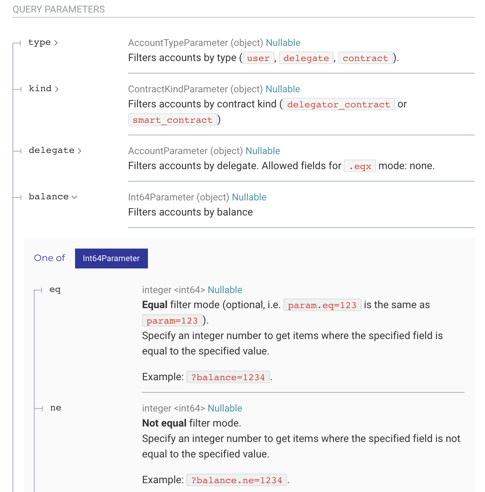

import HighlightBox from "../../src/components/HighlightBox"

[TzKT](https://github.com/baking-bad/tzkt) is a **Tezos blockchain indexer**.

We have talked about how a blockchain includes a lot of transactions and information. Working directly on the whole blockchain to fetch and process data will be time consuming. The **TzKT indexer** can reduce this time and in addition, offers high-level [functionalities](https://github.com/baking-bad/tzkt#features), which are not provided by the Tezos JSON/RPC interface. 

You can [install](https://github.com/baking-bad/tzkt#installation-docker) or [build](https://github.com/baking-bad/tzkt#installation-from-source) it, and [configure](https://github.com/baking-bad/tzkt#install-tzkt-indexer-and-api-for-testnets) it for the testnet.

At this point, we want to learn how to work with the **TzKT API**. Therefore, we will work with a [public endpoint](https://api.tzkt.io/#section/Introduction). 

<HighlightBox type="info">

You want an overview of the provided TzKT APIs and staging environments for testing, take a look [here](https://api.tzkt.io/#section/Introduction).

</HighlightBox>

For the mainnet, we have:

```
https://api.tzkt.io/
```

and for Edonet, we can use:

```
https://api.edo2net.tzkt.io/
```

## Fetching data with Node.js

Because TzKT offers a **REST API**, we could work with any language or tool which supports HTTP requests. Here we want to work with Node.js and [request](https://www.npmjs.com/package/request).

Create a folder and an `index.js` in it:

```javascript

const request = require('request');

request('https://api.edo2net.tzkt.io/v1/accounts?limit=10&select=balance&sort.desc=balance', (err, res, body) => {
  console.log(body);
});

```

Now run:

```bash
$ npm install request
```

and

```bash
$ node index.js
```

We **limit the output** to 10 accounts, and we want to fetch the account balance for those 10.

It is important that you first think about what you want to get before making a request, because it will [impact the performance](https://baking-bad.org/blog/2020/08/10/tezos-explorer-api-tzkt-request-only-what-you-need/). 

You can specify `select`, and use `select.fields` or `select.values` to fetch the fields or the values. As you can see in the `request`, we can also tell TzKT API to `sort` the balances. This will give us the 10 richest accounts.

<HighlightBox type="tip">

Using **data filters** on the Tezos API, instead of on the client, helps increase performance and reduce the risk of errors by developing on the TzKT API. Thus, applying them can be understood as a best practice for developers.

</HighlightBox>

Additionally, we can apply some [filters](
https://baking-bad.org/blog/2020/09/28/tezos-explorer-api-tzkt-filter-data-on-the-api/) through the API:

```javascript
const request = require('request');

request('https://api.edo2net.tzkt.io/v1/accounts?balance.gt=10000000000000', (err, res, body) => {
  console.log(body);
});
```

This finds you an account with a balance greater than 10 million tez. 

<HighlightBox type="warn">

The **amount of endpoints** TzKT offers is huge. [Each is documented](https://api.tzkt.io/), and you can find in the **QUERY PARAMETERS** filters to apply and in the **RESPONSE SCHEMA** the fields you can fetch. Please take your time and have a look into the documentation, e.g. look for different query modes:



</HighlightBox>

Let's fetch the storage of our certification smart contract:

```javascript
const request = require('request');

request('https://api.edo2net.tzkt.io/v1/contracts/KT1SgX1ZehTysGcNoSwypwg6Xs5Cj7cpokwK/storage', 
  (err, res, body) => {
  console.log(JSON.parse(body));
});
```

You see that the response is a JSON, which we can parse:

```json
{
   "certified":[
      "tz1YTVs4uDn1jEQ2Z4RJyR47zAzhXv1b9Q7t",
      "KT1SgX1ZehTysGcNoSwypwg6Xs5Cj7cpokwK",
      "tz1ZRdP17rsZ1DqUbrraQhbcacVHyh4E6Dkw",
      "tz1Q2zkgZENNF2g95NN7g1CtxAqKynWViSeN"
   ],
   "certifier":"tz1WNmpLG56yT4XixkCFe5M5NpZ7gPgVpVqc"
}
```

TzKT offers [deep selection](https://baking-bad.org/blog/2021/03/03/tzkt-v14-released-with-improved-smart-contract-data-and-websocket-api/#get-specific-fields-from-the-storage), so we don't need to fetch the whole storage if we are interested in knowing the certifier:

```
https://api.edo2net.tzkt.io/v1/contracts/KT1SgX1ZehTysGcNoSwypwg6Xs5Cj7cpokwK/storage?path=certifier
```

We do not have such a complex data structure but you could access deeper fields with `path=certifier.field`, etc. - if there were any. 

Now the question arises: If we want to track the activity on our smart contract, [how often](https://baking-bad.org/blog/2020/07/29/tezos-explorer-api-tzkt-how-often-to-make-requests/) do we need to conduct this request?

<HighlightBox type="tip">

It is a recommended best practice when using the TzKT API to not conduct the same data request until there has been a change. Being aware of how often data updates occur, helps you define how often you want to request data.

</HighlightBox>

You know that each transaction needs to be included into a block. So we don't need to fetch data more often than blocks appear. We can fetch the [protocol constants](https://api.edo2net.tzkt.io/v1/protocols/current) and use the **timeBetweenBlocks** value to estimate the arrival time for the next block. Notice, usually you would also wait more than one block to confirm a transaction.

With [request-promise](https://github.com/request/request-promise):

```bash
$ npm install request
```

we can do:

```javascript

const request = require('request-promise');

const timeBetweenBlocks = () => {
  return request("https://api.edo2net.tzkt.io/v1/protocols/current")
    .then(body => JSON.parse(body).constants.timeBetweenBlocks);
}

const blockTime = () => {
  return request('https://api.edo2net.tzkt.io/v1/head')
    .then(body => Date.parse(JSON.parse(body).timestamp));
}

const contractStorage = (address) => {
  return request('https://api.edo2net.tzkt.io/v1/contracts/' + address + '/storage')
    .then(body => JSON.parse(body));
}

const sleep = (milliseconds) => new Promise(resolve => setTimeout(resolve, milliseconds));

async function main() {
  const timeBlocks = await timeBetweenBlocks(),
    timeRequest = 5000;

  let nextBlockTime = await blockTime() + timeBlocks;

  while(true) {
    if(Date.now() >= nextBlockTime) {
      nextBlockTime = await blockTime() + timeBlocks;
      console.log(await contractStorage("KT1SgX1ZehTysGcNoSwypwg6Xs5Cj7cpokwK"));
    }

    await sleep(timeRequest);
  }
}

main();

```

This will wait `timeBetweenBlocks` from the timestamp of the last recent block before fetching the timestamp of the most recent block. Also, even after the time passed, it won't do more than one request each 5 seconds. This should be enough to have an accurate storage.

Notice, we didn't catch any error above, but you should always check for the response if you work with an API.

<HighlightBox type="tip">

You can also try the [WebSocket API JS simple client](https://api.tzkt.io/#section/JS-simple-client) and subscribe to [events](https://api.tzkt.io/#tag/TzKT-Events). This will reduce the traffic further and make the data real-time available.

</HighlightBox>

We can also look for specific entry point calls or parameters in the transactions. Let's confirm with [filtering](https://baking-bad.org/blog/2021/03/03/tzkt-v14-released-with-improved-smart-contract-data-and-websocket-api/#filter-transactions-by-parameter-like-a-boss) that `tz1YTVs4uDn1jEQ2Z4RJyR47zAzhXv1b9Q7t` is certified by `tz1WNmpLG56yT4XixkCFe5M5NpZ7gPgVpVqc`:

```
https://api.edo2net.tzkt.io/v1/operations/transactions?target=KT1SgX1ZehTysGcNoSwypwg6Xs5Cj7cpokwK&parameter=tz1YTVs4uDn1jEQ2Z4RJyR47zAzhXv1b9Q7t&select=sender
```

which will give you:

```
[{"address":"tz1WNmpLG56yT4XixkCFe5M5NpZ7gPgVpVqc"}]
```

Let's do something else not easy to do without the TzKT API and ask for the [number of smart contracts](https://api.tzkt.io/#operation/Accounts_GetCount) in Edonet:

```
https://api.edo2net.tzkt.io/v1/accounts/count?type=contract
```

Another important request you will want to do is to fetch the supported protocols:

```
https://api.edo2net.tzkt.io/v1/protocols
```

this will give you:

```json
[
   {
      "code":-1,
      "hash":"PrihK96nBAFSxVL1GLJTVhu9YnzkMFiBeuJRPA8NwuZVZCE1L6i",
      "firstLevel":0,
      "lastLevel":0,
      "constants":{
        ...
      }
   },
   {
      "code":0,
      "hash":"PtYuensgYBb3G3x1hLLbCmcav8ue8Kyd2khADcL5LsT5R1hcXex",
      "firstLevel":1,
      "lastLevel":1,
      "constants":{
        ...
      }
   },
   {
      "code":1,
      "hash":"PtEdo2ZkT9oKpimTah6x2embF25oss54njMuPzkJTEi5RqfdZFA",
      "firstLevel":2,
      "constants":{
        ...
      }
   }
]
```

There you see the protocol constrains in the `constants` and the regarding protocol hash:

- PrihK96nBAFSxVL1GLJTVhu9YnzkMFiBeuJRPA8NwuZVZCE1L6i: Genesis block
- PtYuensgYBb3G3x1hLLbCmcav8ue8Kyd2khADcL5LsT5R1hcXex: Genesis protocol
- PtEdo2ZkT9oKpimTah6x2embF25oss54njMuPzkJTEi5RqfdZFA: Edonet protocol

So the [current protocol](https://api.edo2net.tzkt.io/v1/protocols/current) is **PtEdo2ZkT9oKpimTah6x2embF25oss54njMuPzkJTEi5RqfdZFA**. 

<HighlightBox type="tip">

You can see supported Tezos protocols on [tzkt.io](https://tzkt.io/protocols) and check the details, e.g. for the [Edonet protocol details](https://tzkt.io/PtEdo2ZkT9oKpimTah6x2embF25oss54njMuPzkJTEi5RqfdZFA/constants).

</HighlightBox>

<HighlightBox type="reading">

* [Baking Bad Blog](https://baking-bad.org/blog/tag/TzKT/)
* [Max (2020): TzKT v1.3.1 Released With Edo Support and Some New Features in the Tezos Explorer and API](https://baking-bad.org/blog/2020/12/28/tzkt-v131-released-with-edo-support-and-new-features-in-tezos-explorer-and-api/) 

</HighlightBox>
