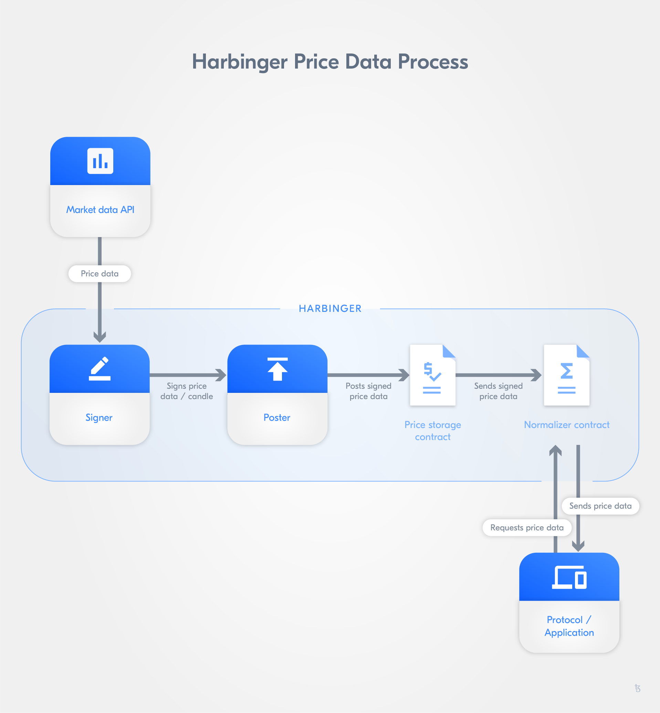
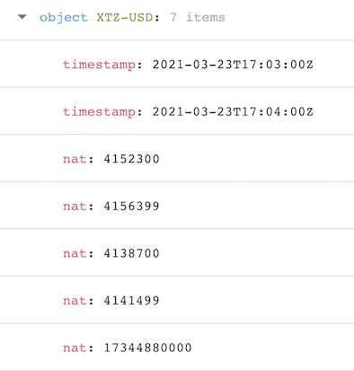

import HighlightBox from "../../src/components/HighlightBox"

import {
  ExpansionPanel,
  ExpansionPanelList,
  ExpansionPanelListItem
} from 'gatsby-theme-apollo-docs';

## The need to introduce external data

The term **[oracle](https://en.wikipedia.org/wiki/Oracle_machine)**, in computability theory, describes an instance that can solve problems that a Turing machine is not capable of. In blockchain, we have a similar situation where the term oracle appears.

One of the main issue areas, when it comes to developing tools and applications on blockchain protocols, is how to introduce **external/off-chain data that cannot be deterministically verified** - You cannot verify if introduced **data is correct and/or potentially malicious**. Thus, introducing off-chain data can be **unreliable** or even have severe **security implications**. How to approach the issue of off-chain data reliability?

As you probably already guessed, the answer is simple: oracles. 

By an **oracle**, in the blockchain context, we understand _a third-party service capable of verifying external data_, i.e. a provider enabling the query of the external data source. Because external data cannot be verified internally an oracle is necessary to uphold reliability. Oracles help introduce reliable external data about external events on the blockchain. Thus, they allow for external API services and the triggering of actions.

As blockchain ecosystems evolve and the number of Decentralized Finance (DeFi) use cases, protocols, and applications rises, the need to incorporate off-chain data has increased. A thriving ecosystem needs oracles.

<HighlightBox type="info">

Remember, the term DeFi covers numerous applications built on top of protocols aimed at decentralizing financial services and reducing the number of intermediaries involved in financial processes.

</HighlightBox>

So, there are use cases for which access to some off-chain data is necessary, for example, recent market data. For such cases, we can use an oracle like [Chainlink](https://blog.chain.link/) or [Harbinger](https://harbinger.live/). Let us take a closer look!

## Chainlink

Chainlink provides a **[decentralized network](https://docs.chain.link/docs/architecture-decentralized-model#decentralized-oracle-network)** formed by **[oracle nodes](https://docs.chain.link/docs/listing-services)**. They are maintained by independent operators. So, we don't depend on just one node but a **network of nodes** - Data becomes more trustworthy and there is no central point of failure. 

Chainlink connects smart contracts and off-chain data through their decentralized oracle network. Therefore, the oracle network provided allows to access off-chain data in a **secure** and **reliable** way.

<HighlightBox type="info">

If you want to take a closer look at Chainlink's source code, we can recommend the Chainlink [GitHub repository](https://github.com/smartcontractkit/chainlink).

</HighlightBox>

### Combining institutional-grade contracts with secure and reliable off-chain data

A cooperation between [SmartPy.io](https://smartpy.io) and [Cryptonomic](https://cryptonomic.tech/) has led to Chainlink being natively available to Tezos developers. Whereas Tezos and its ecosystem can profit from leveraging Chainlink's oracle network to enable applications relying on trustworthy external data.

Chainlink's oracle network bears the benefit of integrating developed, reliable, secure oracle solutions. The network builds on a **growing number of independent, security reviewed, and Sybil resistant node operators**. Additionally, being able to work with a shared node set makes integration less prone to attacks and more seamless. Furthermore, Chainlink has serviced smart contracts worth millions of dollars across multiple projects and chains, i.e. its **performance has been tested**, and it's used by several DeFi applications and blockchain protocols.

Another major argument for using Chainlink is that it provides market data for many **price feeds**. These use at least seven nodes for each feed. The price feed nodes query data from different data aggregators, i.e. the data level is decentralized too. Afterward, the nodes' data is aggregated and pushed on-chain as a _price update_.

Chainlink also provides **long-term viability and flexibility**. Its modularity relies on different components that can be upgraded, which provides flexibility and makes it a long-term option.

Leveraging Chainlink will allow for the development of **fully-integrated contracts** for new applications built on Tezos. These can build their execution of functions on the inclusion of external data on-chain. In the end, this can open the innovative potential of blockchain applications, especially regarding financial applications.

<ExpansionPanel title="Some technical specificities">

You can find a template for Chainlink oracles by SmartPy [here](https://smartpy.io/ide?template=oracle.py), and there also is the official [Solidity implementation](https://github.com/smartcontractkit/chainlink/blob/master/evm-contracts/src/v0.6/Oracle.sol). You can also take a look at the [Chainlink Developer Resources](https://docs.chain.link/docs/getting-started) if you want to dive deeper.

</ExpansionPanel>

## How to use Chainlink

<HighlightBox type="tip">

Please have a look at this [sample project](https://github.com/kuldeep23907/Bifrost-DeFi-DApp/tree/master/TezosChainlinkOracle). The smart contracts to integrate Chainlink are written in SmartPy. The smart contracts are deployed and invoked with [ConseilJS](https://cryptonomic.github.io/ConseilJS/#/).

</HighlightBox>

First, let us have a look at the [SmartPy Chainlink template](https://smartpy.io/ide?template=oracle.py).

There you will find:

- An oracle contract,
- An escrow contract,
- A client contract, and
- A token contract.

You can see that there is an FA2 implementation of the Chainlink token, [LINK](https://coinmarketcap.com/currencies/chainlink/). It is used to pay node operators for retrieving data for smart contracts:

```python

# Oracle Requests are paid with tokens handled in an FA2 contract.
# The FA2 contract template can be extended by a proxy entrypoint to
# ensure transfers to Oracle and payments are synchronized.

FA2 = sp.import_template("FA2.py")

...

class Link_token(FA2.FA2):
    def __init__(self, admin, config, metadata, token_is_proxy = True):
        self.token_is_proxy = token_is_proxy
        if token_is_proxy:
            self.proxy = sp.entry_point(proxy)
        FA2.FA2_core.__init__(self, config, metadata, paused = False, administrator = admin)

```

Let us have a look at the **client contract**:

```python

# Client class is both requester and receiver
# As a consequence, overall architecture is simplified

class Client(Client_requester, Client_receiver):
    def __init__(self, escrow,
                       oracle,
                       token_contract,
                       job_id,
                       admin,
                       verify_answer_validity = False,
                       token_is_escrow = False,
                       token_address = None,
                       token_is_proxy = True):
```

It inherits the classes `Client_requester` and `Client_receiver`. This simplifies things because one contract less needs to be deployed. `Client_requester` can send and pay requests to the oracle via the escrow contract. The `Client_receiver` expects to be called by the oracle contract.

In the **template comments**, among others, you can find:

```python
    A Request contains:
    tag (sp.TString): `REQUEST_TAG`
    oracle (sp.TAddress): address of the Oracle
    target (sp.TAddress): address (and entrypoint) of the target
    job_id (sp.TBytes): job_id as required by Oracle
    parameters (TParameters): Optional parameters
    cancel_timeout (sp.TTimestamp): Time after which the Client can cancel the request
    fulfill_timeout (sp.TTimestamp): Time after which the Oracle cannot fulfil anymore
    client_request_id (sp.TNat): Id of the request. Client shall never emits two requests with same id for its own safety.
    
    A Result contains:
    tag (sp.TString): `RESULT_TAG`
    client (sp.TAddress): address of the client requester
    client_request_id (sp.TNat): Id of the request
    result (TValue): result value computed by the Oracle
```

Let us have a look at the **oracle contract**:

```python
# Oracle is the on-chain incarnation of an Oracle provider.
# It maintains a queue of requests of type `TRequest` containing
# a sender, a target entrypoint and parameters.
class Oracle(sp.Contract):
    def __init__(self,
                 admin,
                 escrow_contract,
                 escrow_address      = None,
                 min_cancel_timeout  = 5,
                 min_fulfill_timeout = 5,
                 min_amount          = 0):
        self.escrow_contract = escrow_contract
        if escrow_address is None:
            escrow_address = escrow_contract.address
        self.init(
            setup = sp.record(
                admin               = admin,
                active              = True,
                min_cancel_timeout  = min_cancel_timeout,
                min_fulfill_timeout = min_fulfill_timeout,
                min_amount          = min_amount,
                escrow              = escrow_address
                ),
            next_id = 0,
            reverse_requests = sp.big_map(tkey = sp.TRecord(client = sp.TAddress, client_request_id = sp.TNat), tvalue = sp.TNat),
            requests = sp.big_map(tkey = sp.TNat, tvalue = TRequest),
        )
```

There you see the request's list, `requests = sp.big_map(tkey = sp.TNat, tvalue = TRequest)`.

At the time of writing, each data provider needs to deploy an oracle contract, so we don't have any proxy. This contract has **two important methods**:

```python
    @sp.entry_point
    def create_request(self, params):
      ...
      data.requests[data.next_id] = request.copy
```

And

```python
    @sp.entry_point
    def fulfill_request(self, request_id, result, force):
      ...
```

The `create_request` entrypoint will be called by the escrow contract and `fulfill_request` by an external source. 

Finally, let us have a look at the **escrow contract comments**:

```python
# Escrow receive the request and payment and transmits the request to the oracle
# The requester can cancel the request and recover his payment after a timeout
# If the Oracle answers before a cancel:
#    the Escrow sends the reward to the Oracle and the answer to Target
class Escrow(sp.Contract):
  ...
```

So, the client will call the escrow, which will forward a request to the oracle. Because the escrow contract handles the payments and validation, it increases trust in the system.

Let us look into this in a **test from the template**:

```python
        ##########
        # Test 1 #
        ##########
        scenario.h2("requester1 sends a request that gets fulfilled")
        requester1_balance = compute_balance(scenario, link_token, requester1.address)
        escrow_balance     = compute_balance(scenario, link_token, escrow.address)
        scenario.h3("A request")

        scenario += requester1.request_value(request_value_params).run(sender = requester1_admin)

        request_id += 1
        # Founds should be locked
        requester1_new_balance = compute_balance(scenario, link_token, requester1.address)
        escrow_new_balance     = compute_balance(scenario, link_token, escrow.address)
        scenario.verify(sp.as_nat(requester1_balance - amount) == requester1_new_balance)
        scenario.verify(escrow_balance + amount == escrow_new_balance)

        scenario.h3("Ledger")
        scenario.show(link_token.data.ledger)

        oracle_balance = compute_balance(scenario, link_token, oracle.address)
        escrow_balance = compute_balance(scenario, link_token, escrow.address)
        # Request must be registered in oracle
        request_key = sp.record(client = requester1.address, client_request_id = request_id)
        scenario.verify(oracle.data.reverse_requests.contains(request_key))

        scenario.h3("Oracle consumes the request")

        scenario += oracle.fulfill_request(request_id = request_id - 1, result = value_int(2_500_000), force = False).run(sender = oracle1)

        # Founds must be unlocked
        oracle_new_balance = compute_balance(scenario, link_token, oracle.address)
        escrow_new_balance = compute_balance(scenario, link_token, escrow.address)
        scenario.verify(oracle_balance + amount == oracle_new_balance)
        scenario.verify(sp.as_nat(escrow_balance - amount) == escrow_new_balance)
        # Request must be removed from oracle
        scenario.verify(~oracle.data.reverse_requests.contains(request_key))
        # Receiver must have registered the result
        scenario.verify_equal(receiver1.data.value.open_some(), 2_500_000)
```

So there are **two calls** (and a lot of validations because this is a test):

```python
        scenario += requester1.request_value(request_value_params).run(sender = requester1_admin)
```

And

```python
        scenario += oracle.fulfill_request(request_id = request_id - 1, result = value_int(2_500_000), force = False).run(sender = oracle1)
```

These calls are the calls you will need to make with your clients if all contracts are deployed. 


The data provider will:

- Check the storage of the oracle contract, and
- Process a request and call `fulfill_request` on the oracle contract.

The data seeker will:

- Call `request_value` with the amount of token and timeout parameters, and
- Check the storage for the requested value.

<HighlightBox type="tip">

You will also need to deploy a faucet to get some tokens to test this. Have a look at the _[Writing Smart Contracts](/smartpy/exercise-1/)_ section to see how you can deploy the contracts with SmartPy and also at the _[Developing Clients](/clients)_ section to see how you can fetch the storage and call the entrypoints of deployed contracts.

</HighlightBox>

<HighlightBox type="reading">

* [SmartContent (2020): Chainlink: Beyond Price Feeds and Data Delivery](https://smartcontentpublication.medium.com/chainlink-beyond-price-feeds-and-data-delivery-4e57c43dbf74)
* [SmartPy.io (2020): Bringing Chainlink Oracles to the Tezos Ecosystem](https://smartpy-io.medium.com/bringing-chainlink-oracles-to-the-tezos-ecosystem-ed47dfc631bd)

</HighlightBox>

## Harbinger: Bringing a price oracle to the Tezos ecosystem

For many DeFi applications to run seamlessly a **trustworthy and reliable price feed** is vital. Among others, a price feed allows for derivatives, futures smart contracts, insurance, etc.

It comes down to a question of **trust**. As DeFi applications involve financial means and their value stems strongly from the accuracy, reliability, and safety of price data, it is important to integrate a price oracle on protocols like Tezos. This avoids (maliciously) manipulated data creating unreliable and untrusty price feeds. **Harbinger** is such _a price oracle for digital assets_. It provides a set of tools and reference contracts. With them, anyone can deploy a price oracle on Tezos.

It allows you to fetch signed price feeds from market data. Exchanges can let their oracles submit a signed price feed, which is then included on-chain by a so-called poster. The exchange signs the price with their private key.

<HighlightBox type="info">

Exchanges can provide Harbinger-compatible price feeds at low costs through a reference signer.

</HighlightBox>

The **poster** "posts" the **signed price** on-chain. Once a smart contract is deployed that relies on the signed price, the signing key is checked, and if correct, the contract deploys using it. This ensures that only trustworthy, i.e. "good", data is used.

### How signed price data gets on-chain

Let us take a step-by-step look at how Harbinger works in a processual sense and the different conceptual elements.



<ExpansionPanel title="The Harbinger process">

<ExpansionPanelList>

<ExpansionPanelListItem number="1">

An exchange provides a **market data API**, which responses with a price when queried. Price data usually comes from an exchange's market order book.

</ExpansionPanelListItem>

<ExpansionPanelListItem number="2">

Data is retrieved from an exchange by the **signer**. The data is signed with a private key.

</ExpansionPanelListItem>

<ExpansionPanelListItem number="3">

The **poster** gets the price from the signer. The signed data is posted to the **storage contract**.

**Or**, the poster invokes a callback on the storage contact pushing the data to a **normalizer contract**. The **volume-weighted average price** is then calculated by the latter.

</ExpansionPanelListItem>

<ExpansionPanelListItem number="4">

A DeFi protocol or decentralized application can now callback the normalizer contract whenever the latest normalized price is needed by their contract.

</ExpansionPanelListItem>

</ExpansionPanelList>

</ExpansionPanel>


<HighlightBox type="tip">

Do you need a Harbinger quickstart? Take a look at [this](https://github.com/tacoinfra/harbinger#quickstart).

</HighlightBox>

Harbinger consists of three main components:

* The **contracts** to keep track of the price data,
* The **signers**, who retrieves and signs price data, and
* The **posters** that retrieve price data from the signer and push it to the oracle contract.

In Harbinger, a [reference signer](https://github.com/tacoinfra/harbinger-signer) is used to support market data APIs from exchanges like [Coinbase](https://pro.coinbase.com/), [Binance](https://www.binance.com/), and [OKEx](http://okex.com/). Whereas the architecture allows exchanges to provide signed price data for the same asset. Thus, **multiple data sources** are possible for the same price. This increases trust and reliability of price data as a medianised price can be calculated.

By using the reference signer, security is increased while it deploys independently from the exchange's network and servers doesn't have to be maintained and has a secure caching API gateway. Posters cannot request a price from the APIs more than once per minute.

To provide reliable and updated price data, posters get signed prices from either a signer or directly from an exchange. The poster can post the prices on-chain at any time. Updating prices is thus decentralized - everyone can post price data from multiple sources and posting doesn't have to rely on just one poster.

As mentioned before, the price is only accepted by the storage contract if the data is signed with a private key.

Posters can function as Serverless Framework applications or run a command line as part of their process to get price data in continuous intervals.

### Harbinger's price storage contracts and normalizer contract

Developers are given the option to leverage Harbinger while configuring contract implementations regarding gas costs, storage use, and data points. This is done through the implementation of two reference contracts:

* The **price storage contract:** stores newest price data for each market at a certain point of time, and
* The **normalizer contract:** normalizes data points - the number of data points can be customized - for one market for a specific range of updates - the number of updates can be also customized.

The **price storage contract** is written in SmartPy and compiled to Michelson. The contract is initialized with the signer's public key. The newest price data is retrieved from a signer and stored with the contract.

<ExpansionPanel title="Data candles">

The price data is available in so-called data candles(i.e. data points for a digital asset). Each candle includes:

* Start time,
* End time, 
* Open price,
* Close price,
* Low price,
* High price, and
* Volume.

Data candles can be retrieved at one-minute intervals.

</ExpansionPanel>

Once data is posted using the price storage contract, it can then be pushed to the normalizer contract either by the same poster or another entity.

The **normalizer contract** is also a reference contract. It helps with the normalization of price data from multiple updates. It calculates the **volume-weighted average** for the price. The contract can be configured regarding what type of weighted price it calculates and the number of data points that are included when normalizing price data.

Posting the newest price data and updating a normalizer contract can both be performed by invoking a call back to the storage contract. This is done in a single atomic transaction and not two.

<ExpansionPanel title="Technical specifications for Harbinger">

Harbinger's price data can be represented in **two different formats**: 

* As a standard Unix timestamp for a candle start and end, or
* As a natural, six-digit number for prices and volumes.

Furthermore, Harbinger has certain asset codes. Contracts can be specified regarding:

* The **signer** providing the price feed for the oracle, and
* The **assets** a contract will track (i.e. the list of asset pairs).

The **price storage contract** is not limited in the number of assets, but can only work with a single price feed, and updates have to be monotonically increasing in start time and signed by a certain key.

The price storage contract has **three entrypoints**:

* `push`: to push the price data from the price storage contract to the normalizer contract;
* `update`: to push updates to the price storage contract;
* `revoke`: to revoke a price storage contract, i.e. the signer's public key and price data is removed triggering the oracle's emergency shutdown.

The **normalizer contract** can only normalize one asset and receive updated data from one oracle. As with the price storage contract, all updates need to be monotonically increasing in start time.

The contract can be configured regarding:

* The **price storage contract address** set to push updates,
* The **asset pair's name** of the to-be-normalized asset, and
* The **number of data points** being stored and normalized.

_Remember that the number of data points also determines the amount of gas and storage needed. So, the **more** data points, the **higher** the gas consumption and storage fees._

The contract only has **one entrypoint**: `update`. The contract receives data updates from the price storage contract.

</ExpansionPanel>

## How to use Harbinger

Basically you can deploy the [oracle](https://github.com/tacoinfra/harbinger-contracts/blob/master/oracle.py) and [normalizer](https://github.com/tacoinfra/harbinger-contracts/blob/master/normalizer.py) contracts with the [Harbinger CLI](https://github.com/tacoinfra/harbinger-cli). 

```bash
$ npm i -g @tacoinfra/harbinger-cli
```

If you deploy the contract, you will need to pass a public key for the signer. 

<HighlightBox type="tip">

There are already contracts deployed for:

* [Coinbase](https://tzkt.io/KT1Jr5t9UvGiqkvvsuUbPJHaYx24NzdUwNW9/storage) - signed by Coinbase Pro,
* [Binance](https://tzkt.io/KT1Mx5sFU4BZqnAaJRpMzqaPbd2qMCFmcqea/storage),
* [Gemini](https://tzkt.io/KT1Jud6STRGZs6hSfgZsaeztbkzfwC3JswJP/storage), and
* [OKEx](https://tzkt.io/KT1G3UMEkhxso5cdx2fvoJRJu5nUjBWKMrET/storage) - signed by Blockscale on the mainnet.

You can see the public keys of the signer in the storage.

Notice that only a signer can update a price feed.

</HighlightBox>

Then you can use the [Harbinger Serverless Price Feed Signer](https://github.com/tacoinfra/harbinger-signer) to sign price feeds. The CLI can also update the contract with a signed price. In addition, you can use the [Harbinger Serverless Poster](https://github.com/tacoinfra/harbinger-poster), which can update the price automatically.

<HighlightBox type="tip">

If you don't want to use those high-level tools, have a look at the [harbinger-lib repository](https://github.com/tacoinfra/harbinger-lib).

</HighlightBox>

In the price storage contract each item will have:

- Oracle data for an asset,
- Period start,
- Period end,
- Open,
- High,
- Low, and
- Close,

Like you can see here for XTZ:



<HighlightBox type="tip">

Have a look at the _[Developing Clients](/clients)_ section to see how you can fetch the storage. Notice that it might be better to fetch the rates from the normalizer contract because of the volume-weighted average price it contains.

</HighlightBox>

<HighlightBox type="reading">

* [Chainlink Developer Resources](https://docs.chain.link/docs/getting-started)
* [Chainlink GitHub Repository](https://github.com/smartcontractkit/chainlink)
* [Harbinger CLI](https://github.com/tacoinfra/harbinger-cli)
* [Harbinger GitHub - Introduction & Quickstart](https://github.com/tacoinfra/harbinger#quickstart)
* [Harbinger - Normalizer contract](https://github.com/tacoinfra/harbinger-contracts/blob/master/normalizer.py)
* [Harbinger - Oracle Contract](https://github.com/tacoinfra/harbinger-contracts/blob/master/oracle.py)
* [Harbinger - Quickstart](https://github.com/tacoinfra/harbinger#quickstart)
* [Youngblood, Luke (2020): Introducing Harbinger: a Self-Sustaining Price Oracle for Tezos](https://medium.com/@Blockscale/introducing-harbinger-a-self-sustaining-price-oracle-for-tezos-7cab5c9971d)

</HighlightBox>

