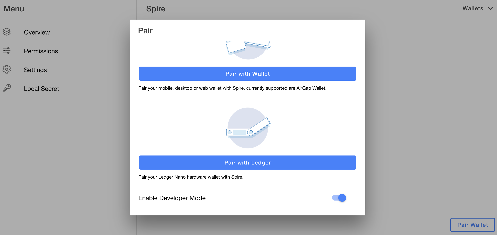
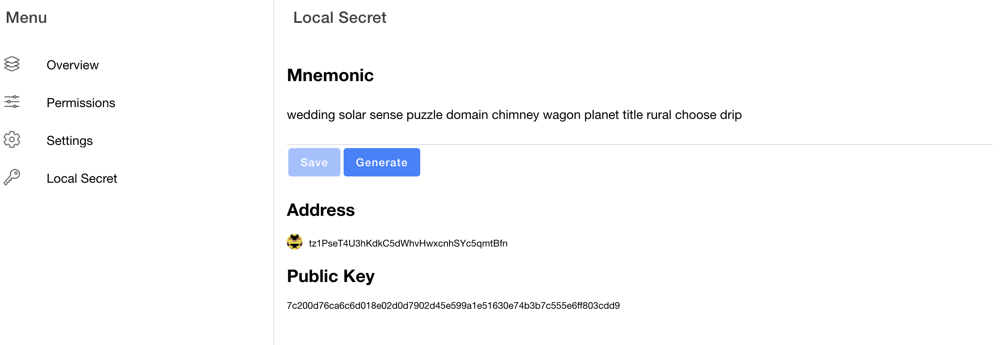
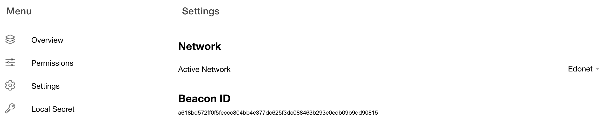
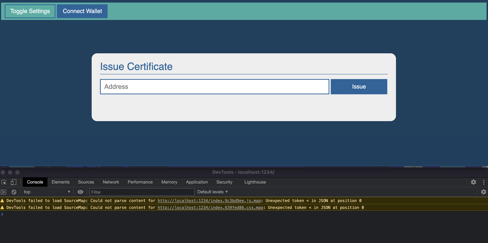
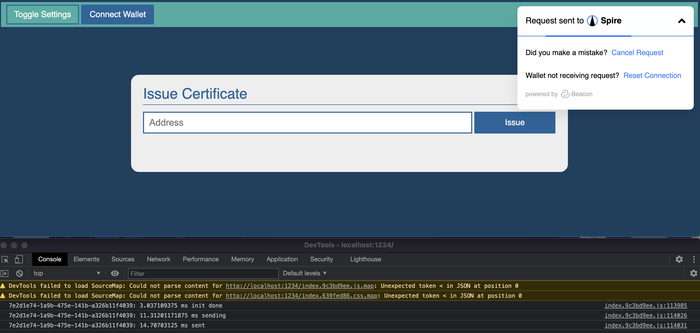
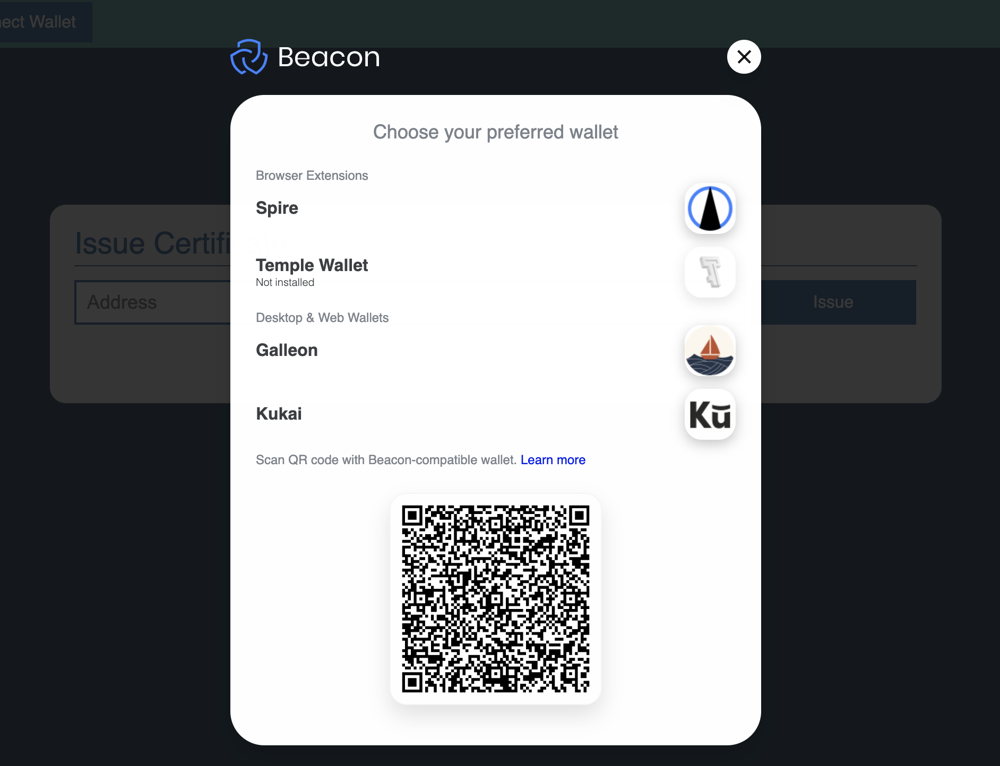
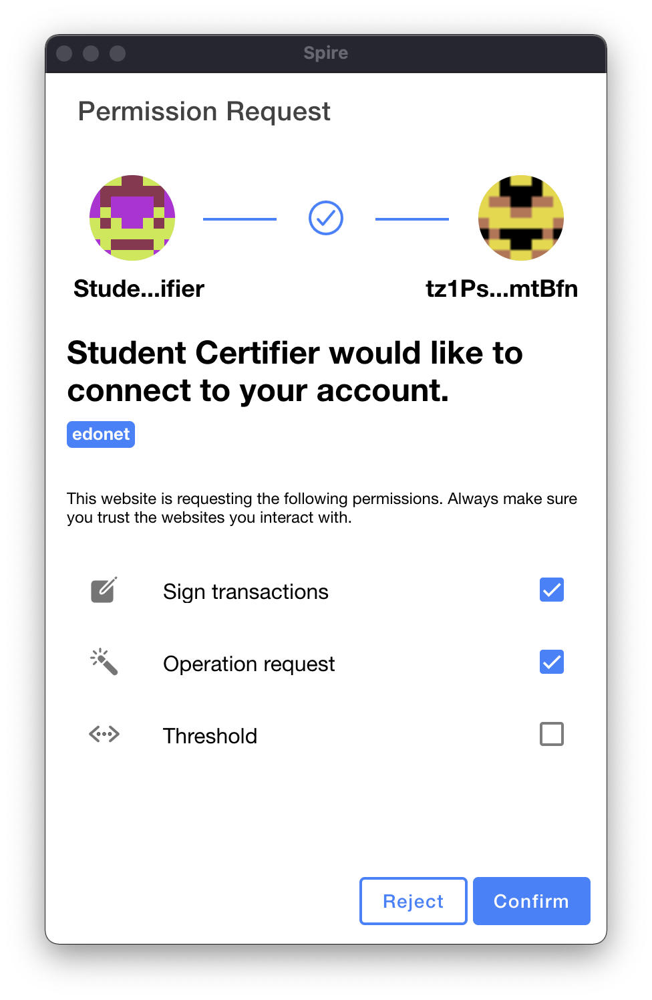
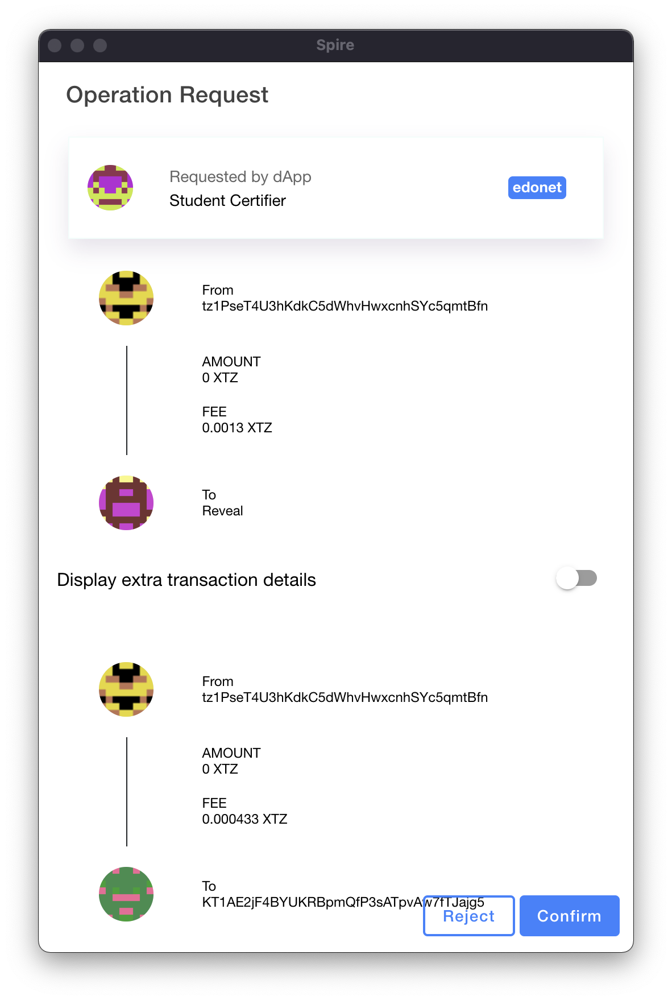

import HighlightBox from "../../src/components/HighlightBox"

import {
  ExpansionPanel,
  ExpansionPanelList,
  ExpansionPanelListItem
} from 'gatsby-theme-apollo-docs';

A **wallet** will store your keys and can also fulfil other tasks, like signing transactions. 

[Beacon](https://www.walletbeacon.io/) is an **interface** between such a wallet and your application. At the time of writing, Beacon supports:

* [AirGap](https://airgap.it/),
* [Galleon](https://github.com/Cryptonomic/Deployments/wiki/Galleon:-Releases),
* [Kukai](https://wallet.kukai.app/),
* [Temple](https://templewallet.com/), formerly known as Thanos, and
* [Spire](https://chrome.google.com/webstore/detail/spire/gpfndedineagiepkpinficbcbbgjoenn). 

We have different options for how we can use the [Beacon SDK](https://github.com/airgap-it/beacon-sdk). We will work with Taquito's [Wallet API](https://tezostaquito.io/docs/wallet_api/), and extend our [certifier application](https://github.com/b9lab/tezos-sample-certifier) so it can be used with a wallet. This is possible because there is a wallet interaction specification called [TZIP-10](https://gitlab.com/tzip/tzip/-/blob/master/proposals/tzip-10/tzip-10.md), which is implemented by Beacon.

## Wallet API

The **Wallet API** supports different wallets. The **npm package** for Beacon is `@taquito/beacon-wallet`.

**Create a folder** for this project, and **run** in it:

```bash
$ npm init
```

Then you can **install the necessary packages**:

```bash
$ npm install @taquito/taquito
$ npm install @taquito/beacon-wallet
```

You have seen how we can use such libraries in the browser with the help of [Browserify](http://browserify.org/). Here we want to work with the [Parcel](https://parceljs.org/getting_started.html) bundler, so it is best if you **install it globally**:

```
$ npm install -g parcel-bundler
```

Then we can again **create an `index.html`**:

```html

<html>
<head>
  <link rel="stylesheet" type="text/css" href="./app.css">
  <title>Issue Certificate</title>
  <script src="./certifier.js"></script>
</head>
<body>
  <div id="settings-bar">
    <a href="#" class="btn btn-settings" id="btn_settings">Toggle Settings</a>
    <a href="#" class="btn btn-connect" id="btn_connect">Connect Wallet</a>
    <div id="settings-box">
        <p>Settings</p>
        <p class="form-title">Provider</p>
        <input type="text" id="provider" class="form-input form-input-small">
        <p class="form-title">Contract Address</p><input type="text" id="contractAddress" class="form-input form-input-small">
      </div>
  </div>

  <div id="app_container">
    <div class="title-bar">Issue Certificate</div>
    <div class="content-box">
      <table class="form-table">
        <tr><td class="col-1">
          <input class="form-input" type="text" id="inp_address" placeholder="Address"/>
        </td><td>
          <a href="#" id="btn_issue" class="btn btn-submit">Issue</a>
        </td></tr>
        <tr><td colspan="2">
          <div id="result-bar" class="result-bar"></div>
        </td></tr>
      </table>      
    </div>
  </div>
</body>
</html>

```

<ExpansionPanel title="The CSS file">

A bit of styling, so it doesn't hurt our eyes:

```css
body {
  font-family: sans-serif;
  background-color: #173f5f;
}

#app_container {
  width: 800px;
  margin:auto;
  margin-top: 20vh;
  padding: 20px;
  background-color: #eeeeee;
  border-radius: 15px;
}

.title-bar {
  margin-left: 3px;
  margin-right: 3px;
  font-size: 28px;
  padding-bottom: 5px;
  border-bottom: 1px solid #20639b;
  margin-bottom: 10px;
  color: #20639b;
}

.content-box {
  width:100%;
}

#settings-box {
  padding: 0 10px 20px 10px;

  display:none;
}

.settings-title {
  color: #3caca3;
  text-transform: uppercase;
}

.form-input {
  width: 100%;
  padding-left: 10px;
  font-size: 18px;
  height:42px;
  border: 2px solid #20639b;
}

.form-input-small {
  font-size: 12px;
  height:38px;
  border-color: #3caca3;
}

.form-table {
  width: 100%;
}

.col-1 {
  width: 80%;
}

a {
  text-decoration: none;
}

.result-bar {
  margin-top: 5px;
  width: 100%;
  height: 42px;
  font-size: 18px;
  line-height: 42px;
  text-align: center;
}

.result-load {
  background-color: #f6d55c;
  color: #000000;
}

.result-true {
  background-color: #3caea3;
  color: #000000;
}

.result-false {
  background-color: #ed553b;
  color: #000000;
}

.form-title {
  margin: 4px 0 2px 0;
  font-size: 12px;
}

#settings-bar {
  top: 0;
  left: 0;
  right: 0;
  background-color: #3caca3;
  padding: 5px 10px;
}

.btn {
  display: inline-table;
  width: 120px;
  background-color: #20639b;
  border:2px solid #20639b;
  color: #ffffff;
  font-size: 16px;
  padding: 8px;
  text-align: center;
}

.btn:hover {
  background-color: #ffffff;
  color:#20639b;
  border: 2px solid #20639b;
}

.btn-settings {
  background-color: #3caea3;
}

.btn-submit {
  width: 87%;
}

#upl_input {
  display: none;
}
```

</ExpansionPanel>

Ok, so far we just **removed the input fields** for the faucet account. Instead, we now have a button to connect a wallet.

Now you need to rewrite parts of `certifier.js`:

```javascript

const $ = require("jquery");
const { TezosToolkit } = require('@taquito/taquito');
const { BeaconWallet } = require('@taquito/beacon-wallet');

function initUI() {
    updateUISetting({
        provider: "https://edonet.smartpy.io/",
        contractAddress: "KT1UhNWxpfnDkxYBQz1BwXHTvhikXueFwfU3"
    });

    // setup UI actions
    $('#btn_issue').click(() => certify($('#inp_address').val()));
    $('#btn_settings').click(() => $('#settings-box').toggle());
    $('#btn_connect').click(() => connectWallet());
}

function updateUISetting(accountSettings) {
    $('#provider').val(accountSettings.provider);
    $('#contractAddress').val(accountSettings.contractAddress);
}

function readUISettings() {
    return {
        provider: $('#provider').val(),
        contractAddress: $('#contractAddress').val()
    };
}

function reportResult(result, type, itemSelector) {
    return $(itemSelector)
        .html(result)
        .removeClass()
        .addClass("result-bar")
        .addClass(type == "error" ?
            "result-false" :
            type == "ok" ?
            "result-true" :
            "result-load");
}

let tezos, wallet;

// This function will connect your application with the wallet
function connectWallet() {
    const accountSettings = readUISettings();
    tezos = new TezosToolkit(accountSettings.provider);

    const options = {
        name: 'Student Certifier'
    };
    wallet = new BeaconWallet(options);

    wallet
        .requestPermissions({
            network: {
                type: "edonet"
            }
        })
        .then((_) => wallet.getPKH())
        .then((address) => console.log(address))
        .then(() => tezos.setWalletProvider(wallet));

}

// This is the main function, interacting with the contract through the Taquito Wallet API
function certify(studentAddress) {
    const accountSettings = readUISettings();
    return tezos.wallet.at(accountSettings.contractAddress)
        .then((contract) => {
            reportResult("Sending...", "info", "#result-bar");
            return contract.methods.default(studentAddress).send();
        })
        .then((op) => {
            reportResult("Waiting for confirmation...", "info", "#result-bar");
            return op.confirmation(1).then(() => op.hash);
        })
        .then((hash) => {
            reportResult("Operation injected: " + hash, "ok", "#result-bar");
        })
        .catch((error) => {
            reportResult(error.message, "error", "#result-bar");
        });
}

$(document).ready(initUI);

```

You see our new function `connectWallet()`. What is new there?

```javascript

    const options = {
        name: 'Student Certifier'
    };
    wallet = new BeaconWallet(options);

```

There are other [useful options](https://tezostaquito.io/docs/wallet_api/#--tzip-10-wallet), like [eventHandlers](https://github.com/airgap-it/beacon-sdk/blob/9d610e015d183cf2689835b94398bd0128ddf32e/src/events.ts#L38) which should be utilised for better user experience in a real application. Anyway we will keep it simple and set only what must be set. 

```javascript
    wallet
        .requestPermissions({
            network: {
                type: "edonet"
            }
        })
        .then((_) => wallet.getPKH())
        .then((address) => console.log(address))
        .then(() => tezos.setWalletProvider(wallet));
```

We first call for a `requestPermissions` for the Edonet testnet, fetch the address of the user, and print it into the console. Then we **set the wallet** as our provider.

Now the wallet will **sign our transactions**:

```javascript

function certify(studentAddress) {
    const accountSettings = readUISettings();
    return tezos.wallet.at(accountSettings.contractAddress)
        .then((contract) => {
            reportResult("Sending...", "info", "#result-bar");
            return contract.methods.default(studentAddress).send();
        })
        .then((op) => {
            reportResult("Waiting for confirmation...", "info", "#result-bar");
            return op.confirmation(1).then(() => op.hash);
        })
        .then((hash) => {
            reportResult("Operation injected: " + hash, "ok", "#result-bar");
        })
        .catch((error) => {
            reportResult(error.message, "error", "#result-bar");
        });
}
```

As you can see, it is just **slightly changed**: We use `tezos.wallet.at` instead of `tezos.contract.at` to **get the contract abstraction**.

## Test run

Let's test this!

First, you need the [Spire](https://chrome.google.com/webstore/detail/spire/gpfndedineagiepkpinficbcbbgjoenn) extension for Chrome. After installation you can turn on the developer mode:



In this case, you can **setup a local secret** and you don't need a wallet to pair it with. 



Now we can **set the network** to Edonet:



Now let's **start our application**!

Run in your project folder:

```bash
$ parcel index.html

...

Server running at http://localhost:1234

...

```

It will tell you where the server is running so you can test your application.

In addition, show the console to see the outputs:



Now, when you hit the `Connect Wallet` button, you most likely will see in the console something similar to:

```
TypeError: sodium.crypto_generichash is not a function
    at Object.<anonymous> (index.9c3bd9ee.js:102295)
    at step (index.9c3bd9ee.js:102228)
    at Object.next (index.9c3bd9ee.js:102177)
    at fulfilled (index.9c3bd9ee.js:102140)
```

This is an issue with Parcel we need to fix first. Thus, in your project folder run:

```bash
$ sed -i 's/require("libsodium-wrappers"));/require("libsodium-wrappers")).default;/g' ./dist/index.9c3bd9ee.js

$ sed -i 's/qrcode(/qrcode.default(/g' ./dist/index.9c3bd9ee.js
```

Please adjust the name `index.9c3bd9ee.js` into the correct one, which will be generated by Parcel in the `dist` folder.

<HighlightBox type="tip">

If you work on MacOs, you will need the command to start with `-i ''` like `sed -i '' 's/require("l....`

</HighlightBox>



Now, we can **select our wallet Spire** to use our local keys:



You have to confirm the permission request:



You should see your address in the console.

```
...
index.9c3bd9ee.js:114026 0ac90fc8-a9fc-5908-5d6f-1b0e9a77db4c: 9.77783203125 ms sending
index.9c3bd9ee.js:114031 0ac90fc8-a9fc-5908-5d6f-1b0e9a77db4c: 14.703857421875 ms sent
index.9c3bd9ee.js:112904 0ac90fc8-a9fc-5908-5d6f-1b0e9a77db4c: 262.90283203125 ms acknowledge
index.9c3bd9ee.js:112925 0ac90fc8-a9fc-5908-5d6f-1b0e9a77db4c: 2754.495849609375 ms response
index.9c3bd9ee.js:112926 0ac90fc8-a9fc-5908-5d6f-1b0e9a77db4c: 2754.822998046875 ms
index.9c3bd9ee.js:502 tz1PseT4U3hKdkC5dWhvHwxcnhSYc5qmtBfn
```

At the time of writing, unfortunately we **cannot** import faucet accounts into Spire. Instead it will generate a new account with 0 tez in it.

So to continue, you will need to transfer some tez from a faucet account on the testnet to your address in Spire first. You can do this, like we did in the _CLI section_, with the `tezos-client` or via [SmartPy](https://smartpy.io/wallet.html) - You will need to visit SmartPy anyway to deploy the [certification contract](https://smartpy.io/ide?code=eJytkUFLxDAQhe_5FaGnFCUguhehoO5F8SKoiIiEmKQ0uE1jZna1_nqTtnG77N40h0LnvZnvZWJb3wWk0MqAvqcSKHhC1EoC0KUJaGurJNrOMfB82TkMUmF5Tmg82tRUCOssCsHArOpjqsYWEyZLOknhycWyqquX15m32naRoesiskxE9cJ31uEvbPT1E8vLIFuYgzzfmDAYPAfjdBxdDXQtUfIZZSfajqi5X0PDptmEpChSa4EGkDnZGlrRYlxMX5QkpRqkKcals6voiE2pKqRS3dohK1K9GLk3b90hRyxPhuGTV13tv0KMEwwAK_D75A7Mw9njaXOr35cL_dRsrj@_lGvun9Xio8Wr2hXlOBSUcTLYOTqX2LT1_H9UZfg2zr7G82Okq@VMJQ_rmHFc_V@jHmDFJf0X6gddefug) again for your new address.

After that, you can try to **issue a certificate**.

Spire will pop up and let you confirm the transaction:



<HighlightBox type="reading">

* [AirGap](https://airgap.it/)
* [Beacon SDK](https://github.com/airgap-it/beacon-sdk)
* [Barde, Claude (2020): Build a Tezos dapp using Taquito and the Beacon SDK](https://medium.com/coinmonks/build-a-tezos-dapp-using-taquito-and-the-beacon-sdk-692d7dc822aa)
* [Browserify](http://browserify.org/)
* [Galleon](https://github.com/Cryptonomic/Deployments/wiki/Galleon:-Releases)
* [Kukai](https://wallet.kukai.app/)
* [Lev-Ari, Chaim (2020): Building a Simple React Dapp on the Tezos Blockchain](https://medium.com/tezos-israel/building-a-simple-react-d-app-on-the-tezos-blockchain-part-1-777ff6b0b84e)
* [Parcel: Getting Started](https://parceljs.org/getting_started.html)
* [SmartPy Wallet](https://smartpy.io/wallet.html)
* [Spire](https://chrome.google.com/webstore/detail/spire/gpfndedineagiepkpinficbcbbgjoenn)
* [Taquito Wallet API](https://tezostaquito.io/docs/wallet_api/)
* [Temple](https://templewallet.com/) (formerly known as Thanos)
* [TZIP-10](https://gitlab.com/tzip/tzip/-/blob/master/proposals/tzip-10/tzip-10.md)

</HighlightBox>

