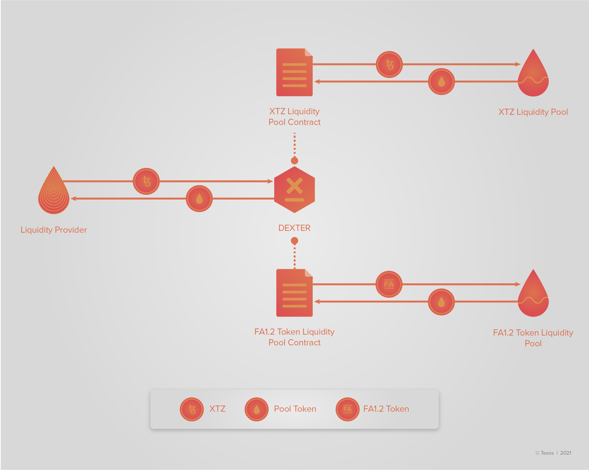

import HighlightBox from "../../src/components/HighlightBox"

import {
  ExpansionPanel,
  ExpansionPanelList,
  ExpansionPanelListItem
} from 'gatsby-theme-apollo-docs';

With the current rise of so-called Decentralised Finance (DeFi) applications and protocols, the need for **interoperability** is evident. Asset trades and operating DApps across protocols can only become viable through the use of wrappers, token swaps, and in the end, decentralised exchanges. Decentralised exchanges have become indispensable for current blockchain protocols and their ecosystems.

<ExpansionPanel title="What is a wrapped token?">

If the term wrapped token seems new to you, don't worry!

A **wrapped token** is _pegged to the value of another token_.

Why is it called wrapped?

It is called wrapped because the token is put in a wrapper, a digital vault. While the token is in a wrapper, another version of the token can be created on another blockchain, of which the unwrapped token is not a native asset. Wrapped tokens are operated on a blockchain while being native on a different one. Wrapping allows to connect different blockchains with another through an **interoperability for non-native assets** and the possibility of a sort of **cross-chain transfers** - Although this aren't real cross-chain transfers.

So to say, a wrapped token is a tokenisation of an existing token, which again is a representation of a tokenised asset. They can be typically unwrapped at any given point of time.

How are tokens wrapped? Often, wrapping tokens requires the involvement of a **custodian** - to hold the amount of native tokens equivalent to the amount of wrapped tokens. The custodian acts as the wrapper.

Wrapped tokens bring advantages in regard to liquidity and capital for exchanges as they allow for **cross-chain liquidity**. Additionally, transaction times and fees can be reduced by riding on the different benefits of blockchains, i.e. combining the beneficial features of the native chain and the wrapped chain.

Because of the benefits wrapped tokens bring with them, wrapper are one of the most important innovations next to decentralised exchanges in the world of blockchain infrastructure projects for smart contract development.

</ExpansionPanel>

## Dexter: Tezos first decentralised trade platform

[Dexter](https://dexter.exchange/) is a non-custodial, open-source decentralised exchange for Tezos developed by [camlCase](https://camlcase.io/). Basically, Dexter is a **Tezos smart contract** written in Morley, which is a Haskell library with Michelson outputs.

<HighlightBox type="tip">

To get a deeper understanding of Dexter and what you can do with this decentralised exchange for Tezos, we recommend looking into the [documentation](https://dexter.exchange/docs/dexter-intro/) whenever you want to find out more on certain topics.

</HighlightBox>

It launched in September 2020 making the trade between XTZ, Tezos' native token, and tzBTC as well as USDtz possible.

The Dexter smart contract and front-end passed a [third-party security audit](https://github.com/trailofbits/publications/blob/master/reviews/dexter.pdf) by [Trail of Bits](https://www.trailofbits.com/). In addition, the contract was formally verified by Nomadic Labs. You can find a summary [here](https://blog.nomadic-labs.com/dexter-decentralized-exchange-for-tezos-formal-verification-work-by-nomadic-labs.html). The [informal specifications](https://gitlab.com/camlcase-dev/dexter/-/blob/master/docs/dexter-informal-specification.md) elaborate the smart contract behaviour. [Property tests](https://gitlab.com/camlcase-dev/dexter/-/tree/master/morley/tests) were also conducted to ensure proper functioning and security.

<HighlightBox type="info">

If you want to take a look at the smart contracts for the first tradeable two FA1.2 tokens to trade on Dexter, you can find them here:

* the [smart contract for tzBTC](https://better-call.dev/mainnet/KT1DrJV8vhkdLEj76h1H9Q4irZDqAkMPo1Qf/code), and
* the [smart contract for USDtz](https://better-call.dev/mainnet/KT1Puc9St8wdNoGtLiD2WXaHbWU7styaxYhD/code).

</HighlightBox>

Dexter allows the **exchange between tez (XTZ) and other Tezos smart contract-based tokens build on the FA1.2 standard** and **exchange **between different FA1.2 tokens**.

<HighlightBox type="tip">

You can find a checklist for FA1.2 smart contract tokens [here](https://gitlab.com/camlcase-dev/dexter/-/blob/develop/docs/token-integration.md). Following this list ensures that the smart contract of the FA1.2 token is compatible with Dexter.

</HighlightBox>

The exchange can be used by:

* **trader** to exchange tez with other FA1.2 tokens, and
* **liquidity providers** to supply financial means to a liquidity pool.

### Trading with Dexter: Exchange tez and FA1.2 tokens

When it comes to **trading**, users have to pay a 0.3% of the total trade amount as a **fee**. The trader pays the fee. The fee helps implement an incentive for liquidity providers.

As mentioned before, as soon as a smart contract has some **liquidity**, trades can be conducted. Any user that holds enough tez or FA1.2 tokens, as specified in the exchange rate as minimal purchase amount, can participate in trading.

Thus, you can trade:

* tez for FA1.2 tokens,
* FA1.2 tokens for tez, and
* FA1.2 tokens for other FA1.2 tokens.

For all trades, the 0.3% exchange fee is subtracted from the equivalent amount you want to exchange for. In addition, pure FA1.2 token exchanges are performed at a preferred exchange rate and at a faster pace, as **only one operation** is necessary.

### Everyone can provide liquidity

**Liquidity providers** supply an equal value of XTZ and the FA1.2 token to the liquidity pool in return for liquidity pool tokens. The liquidity is provided by **"depositing" the tokens into a smart contract*. Thus, anyone owning tez and FA1.2 tokens can become a liquidity provider. As soon as the smart contract has any amount of liquidity, any token owner of tez or the FA1.2 token can trade their tokens for another using Dexter.

<HighlightBox type="info">

There always is one tez-FA1.2 token pair associated with every smart contract in Dexter.

</HighlightBox> 

The pool's token represents a *proportional share of the earned fees*, i.e. a **claim** on the tokens sent to the liquidity pool and the fees collected - Remember, it is a 0.3% fee for each trade. At any point in time, liquidity providers can get the provided XTZ and FA1.2 tokens back in return for the liquidity pool's tokens they hold. When tokens are redeemed, the tokens added to the pool and the fee gains accumulated.

Therefore, liquidity providers earn a **proportional share of the exchange fees** and **baking rewards** from the delegated tez. At the same time, other users benefit from the provided liquidity on the exchange.

<HighlightBox type="tip">

Do you want to take a look at the current liquidity and 24 hour volume of Dexter? Just go to [Dexter Stats](https://stats.dexter.exchange/) and check it out.

</HighlightBox>

### What exactly is a liquidity pool?

As you probably guessed, each exchange on Dexter is based on Dexter smart contracts. Each contract holds two liquidity pools, one for the tez and one for the FA1.2 tokens. Correspondingly, there is a tez pool and a FA1.2 token pool - Remember both can be provided as liquidity.

How does the liquidity pool relate to the pool tokens?

Each liquidity pool is tokenised by the corresponding **liquidity pool token**. So, when you supply liquidity for a pool, you receive the equivalent amount in the pool's token. These tokens cannot be transferred. Still, you can redeem them for the equivalent amount of tokens the pool is based on.

How is the value of liquidity pool tokens determined?

The value of the pool's token is:

* `X*xtz pool / total pool tokens` of XTZ, and
* `X*token pool / total pool tokens` of FA1.2 tokens.

Adding more liquidity increases the total of pool tokens and the amount you own. Decreasing the amount of liquidity, i.e. by redeeming tokens, decreases the amount of tokens and the amount of owned tokens.

Moreover, exchanging tokens changes the amounts of the liquidity pools. A simple economic logic lies behind this.

Let's say, for example, that a user **trades tez for FA1.2 tokens**:

* The amount of the tez liquidity pool increases;
* The amount of the FA1.2 token liquidity pool decreases;
* Redeming tokens in effect results in more tez and less FA1.2 tokens than before the trade;
* The exchange rate tez for FA1.2 token decreases.

Analogously, one can say that when a **user trades FA1.2 tokens for tez**:

* The amount of the tez liquidity pool decreases;
* The amount of the FA1.2 token liquidity pool increases;
* Redeming tokens in effect results in less tez and more FA1.2 tokens than before the trade;
* The exchange rate tez for FA1.2 token increases.

How are liquidity pools implemented technically?

Before there is any liquidity, the first liquidity provider sets the initial exchange rate with `initialLiquidity = XTZ in`. While at least one tez must be provided, the initial amount of LQT minted is derived from this initial exchange rate.

Each liquidity pool has an abstract number, **LQT**. When liquidity is added, Dexter tracks the amount of liquidity by minting LQT tokens and assigning ownership to the liquidity provider, i.e. their account. The account holds the ownership unless the tokens are redeemed. The amount of LQT minted is determined in the following manner:

`XTZ in*total LQT / XTZ pool`

Providing liquidity means adding a specific amount of, for example, tez tokens. The amount is determined as follows:

`XTZ in*token pool / xtz pool`

This is rounded up.

In case the amount you provided is less than the result of the above formula. then the operation of adding liquidity fails. This benchmark helps to avoid supplying more tokens than one might possibly want.

### Dexter wallet integration

You can connect your wallet to the exchange with your web browser. Currently you can connect Dexter to:

* the [Temple Wallet](https://templewallet.com/), formerly know as Thanos,
* the [Beacon wallet](https://www.walletbeacon.io/), and
* the [Magma Wallet](https://magmawallet.io/) integration.

<HighlightBox type="info">

To use Dexter on your mobile device look into [Magma](https://magmawallet.io/), a mobile Tezos wallet developed by camlCase and integrated in Dexter.

</HighlightBox>

You can also connect a wallet using the [TezBridge](https://docs.tezbridge.com/). TezBridge is a web application that connects the Tezos blockchain. You can:

* initiate a session with a stored key,
* perform a trade/exchange,
* provide and remove liquidity, and
* change the node being used by the bridge.

<HighlightBox type="tip">

You can find tutorials to connect wallets with Dexter in the documentation. Just go [here](https://dexter.exchange/docs/dexter-tutorials/).

To connect your wallet using TezBridge, you can find some instructions [here](https://gitlab.com/camlcase-dev/dexter-frontend/-/tree/master). In case you want to connect a hardware Ledger wallet via TezBridge, [this](https://youtu.be/GUXjwQc725Y) is a good point to start.

</HighlightBox>

### A look into the Dexter app

Let's quickly check out the Dexter exchange!

First, go to [https://app.dexter.exchange/](https://app.dexter.exchange/). If you are using the exchange for the first time, you will probably see this:

As you can notice:

* No wallet is connected;
* No transactions are visible;
* No pool tokens are visible.

<HighlightBox type="warn">

Don't forget that you are playing around with a functioning application, so clicking on things has real world consequences, i.e. it has real financial implications.

</HighlightBox>

So, first connect the wallet by clicking on `Connect Wallet`.

After you connected your wallet all functionalities should now be ready for use. With the Dexter app you can:

* look at your **recent transactions**,
* see all your **pool tokens**,
* **exchange** tokens, and
* manage **liquidity**.

In the lower left corner, you can find **two tabs**, one for `Recent transactions` and one for `My pool tokens`.

On the right hand side, there are two main functionalities to be found: `Exchange` and `Liquidity Pool`.

Under **`Exchange`**, you can exchange the following tokens:

* tez (XTZ),
* BTC tez (tzBTC),
* ETH tez(ETHtz),
* USD tez (USDtz),
* Wrapped Tezos (wXTZ), and
* Kolibri (KUSD).

Once you selected which token you want to exchange, the **exchange rate** is displayed beneath.

To conduct the exchange, just click on the button below. For example, let's say you want to acquire tzBTC for 10 XTZ tokens.

At the time of writing the exchange rate XTZ for tzBTC was at 1:0.00007239. Thus, for 10 XTZ we would get 0.0007239 tzBTC. Notice that Dexter also displays the value in USD beneath the text fields for the amount of tokens.

Once everything looks as it should just click on `Exchange XTZ for tzBTC` and you are ready to go as long as you have the required balance of XTZ tokens in your wallet to perform the trade.

When it comes to the **`Liquidity Pool`** tab, you can find the following by clicking on it:

* **Add Liquidity:** You can specify which token and what exact amount you want to add, gives you the current exchange rate, and calculates the corresponding amount of pool tokens you receive as well as the corresponding percentage of the liquidity pool;
* **Remove Liquidity:** You can redeem your pool tokens; 
* **Pool Data:** An overview of the different pools, including which token pair the pool is for, how much volume the pool holds, and who the pool belongs to.

The Dexter app is quite intuitive from its use.

<HighlightBox type="reading">

* Clark, Tyler (2020): [camlCase announces the launch of Dexter, our decentralized exchange for Tezos](https://camlcase.io/blog/dexter-is-live/)
* [Dexter Exchange](https://dexter.exchange/)
* [Dexter Exchange documentation](https://dexter.exchange/docs/dexter-intro/)
* Cox, Adam (2020): [Dexter — Decentralized Exchange and Liquidity Pool for Tezos — XTZ/tzBTC and XTZ/USDtz](https://medium.com/crypto-space/dexter-decentralized-exchange-and-liquidity-pool-for-tezos-xtz-tzbtc-and-xtz-usdtz-4e0c251887c8)
* [Checklist for Token Integration](https://gitlab.com/camlcase-dev/dexter/-/blob/develop/docs/token-integration.md)
* [camlCase](https://camlcase.io/)
* [Dexter Security Audit](https://github.com/trailofbits/publications/blob/master/reviews/dexter.pdf) 
* [Dexter Formal Verification](https://blog.nomadic-labs.com/dexter-decentralized-exchange-for-tezos-formal-verification-work-by-nomadic-labs.html)
* [Dexter Informal Specifications](https://gitlab.com/camlcase-dev/dexter/-/blob/master/docs/dexter-informal-specification.md)
* [Dexter Property Tests](https://gitlab.com/camlcase-dev/dexter/-/tree/master/morley/tests)
* [Dexter Smart Contract for tzBTC](https://better-call.dev/mainnet/KT1DrJV8vhkdLEj76h1H9Q4irZDqAkMPo1Qf/code)
* [Dexter Smart Contract for USDtz](https://better-call.dev/mainnet/KT1Puc9St8wdNoGtLiD2WXaHbWU7styaxYhD/code)
* [Dexter Stats](https://stats.dexter.exchange/)
* [Temple Wallet](https://templewallet.com/)
* [Beacon wallet](https://www.walletbeacon.io/)
* [Magma Wallet](https://magmawallet.io/) 
* [TezBridge](https://docs.tezbridge.com/)
* [Dexter app](https://app.dexter.exchange/)
* [Dexter: Tutorials](https://dexter.exchange/docs/dexter-tutorials/)

</HighlightBox>