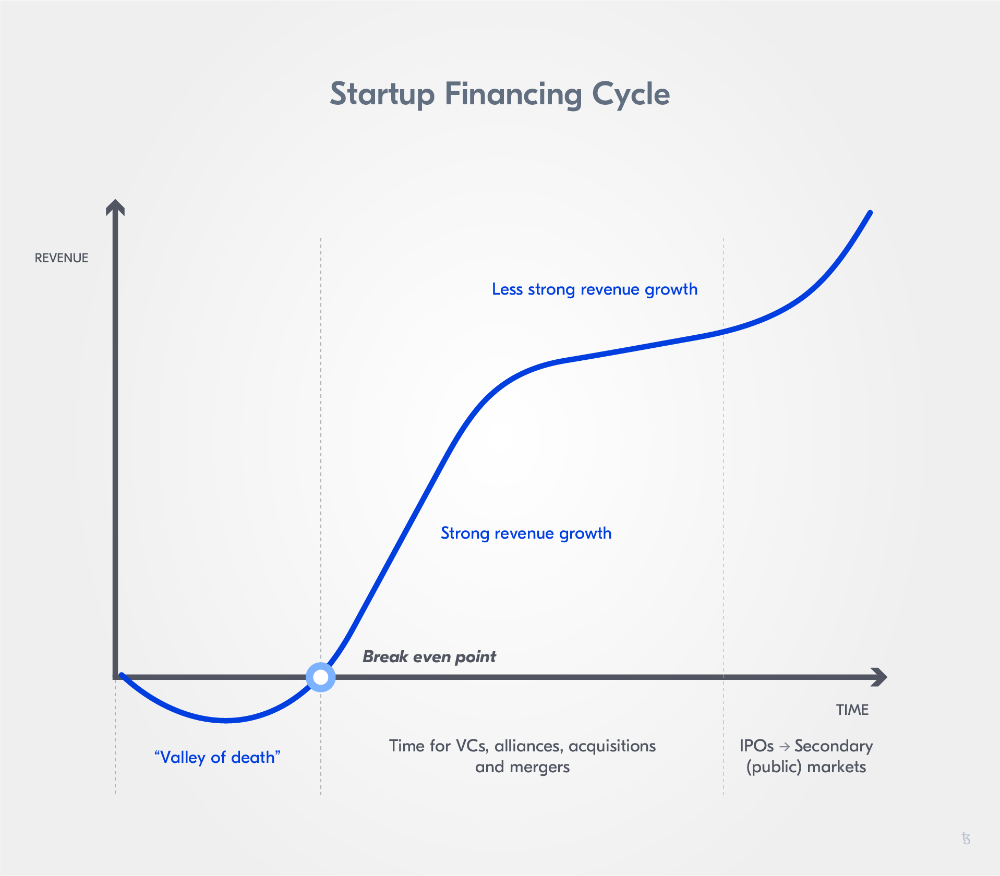

import HighlightBox from "../../src/components/HighlightBox"

import {
  ExpansionPanel,
  ExpansionPanelList,
  ExpansionPanelListItem
} from 'gatsby-theme-apollo-docs';

Blockchain technology-enabled new financial instruments and mechanisms. It lead to the upcoming of a novel form of finance, decentralized finance (DeFi). In DeFi, instead of relying on third parties (intermediaries) like banks, clearance houses, and exchanges to offer financial instruments, blockchain technology, and specifically smart contracts build the base for new financial mechanisms.

A notable majority of blockchain applications have focused on the financial sector, which can be expected when looking at the number of tokenization projects. This lead to the development of a number of security and other token issuance models to raise capital: initial coin offerings (ICOs), initial exchange offerings (IEOs), security token offerings (STOs) - A colorful parade of acronyms followed.

After the first cryptocurrencies were launched and the first ICO was conducted in 2013, the popularity of ICOs continued growing and led to an ICO bubble in 2017/2018. Still, the bubble burst has in no way curtailed the run on token offerings and DeFi instruments.

These new financial instruments were not only enthusiastically received by investors but became a popular way for start-ups in the industry to finance projects and the development of blockchain-based services. Funding in the blockchain space is often provided by venture capital. Thus, so-called fixed-size equity rounds, seed rounds, or fixed-size series A rounds are common to provide start-ups with the necessary cash flows.

<ExpansionPanel title="Raising capital - Funding mechanisms and start-up financing cycles">

**The start-up financing cycle**

In general, a crucial factor for long-term success when launching a start-up is financing - Start-ups often fail due to cash flow problems. A known issue when starting a business venture.

The revenue of start-ups usually follows a certain **growth development**. In the beginning, start-ups are in the so-called "valley of death": Revenues are not sufficient to result in a profit or even cover costs. Start-ups require seed capital, angel investors, or other forms of equity to roll out their business and develop their service offerings. Once revenues surpass the point where revenue covers the cost (i.e the break-even point), profit is generated. The revenue growth, the slope of the revenue curve, is quite high in the early stage, but then begins to flatten during the latter stage and results in a positive slope that is lower than in the early growth phase. In this revenue growth phase, venture capitalists and other companies looking for strategic alliances, acquisitions, or merger opportunities often provide start-ups with financing to support continued revenue growth.

At this point, initial public offerings (IPOs) or initial coin offerings (ICOs) are popular means for further financing. They prepare a company to open up to public markets and to later launch secondary offerings in case more funding is necessary.

Keeping in mind the start-up financing cycle helps understand which funding mechanisms are best suited in which phase of a start-up's venture by reflecting on the growth of revenue over time.

**Conventional funding mechanisms for start-up financing**

In capital structure theory, one often differentiates between **internal and external financing**.

**Internal financing** refers to a situation in which a company uses profits as a source of equity by re-investing them instead of distributing the profits among the owners and/or investors (reinvesting profits), or provisions are liquidated. **External financing** describes a situation in which financing of new investments and firm activities is done through external equity. External financing methods are equity issuances such as IPOs and credit financing.

One of the most discussed topics when it comes to blockchain technology and its impact on the financial sector is how companies and projects can raise external capital, especially in the case of start-ups.

When taking a closer look at the investment forms used as funding mechanisms in the early days of a business venture, we will often be faced with four terms: **Convertible notes, seed rounds, preferred stocks, and common stocks**. Let us explore them to better understand the origins of the novel DeFi forms being developed.

_**Convertible notes**_

A convertible note is *a type of bond that can be converted by the holder into some shares of common stock*. It can be understood as a security with debt and equity features.

They are considered a **debt security**, a security entitling holders to the payment of principal and interest because companies agree to a fixed or floating interest rate. Instead of receiving the return of investment plus the interest, investors get a right to convert the equity security in the future. As they are considered securities they fall under regulations such as the [US Securities Act of 1993](https://www.investor.gov/introduction-investing/investing-basics/role-sec/laws-govern-securities-industry#secact1933).

Key characteristics of a convertible note are:

* The main amount is due to the investor at the maturity date;
* Interest accrues at a fixed rate;
* The investor holds a claim on the company's equity senior to the claims of other equity holders and equal to the claims from the non-senior debt.

Convertible note holders receive equity on triggering events like in the case of future equity financing and the sale of the company, as well as when the maturity of the convertible note is reached.

In a start-up financing context, convertible notes are a common option to raise capital at an early stage. Some start-ups also use convertible notes for bridge financing until a later-stage equity round or sale of the company is conducted. In those cases, convertible notes are often referred to as bridge notes.

The increased use of convertible notes by start-ups can be traced back to their time efficiency: Deals for convertible notes can be closed much faster because it is easier to give different investors different prices. This helps alleviate the deadlock potential of investors waiting on other investors to engage before opting to invest (i.e. a "wait-and-see" approach). In fixed-size equity rounds, start-ups have to determine their investment goal (i.e. the minimum funding amount) in advance. This is no longer the case with convertible notes.

_**Seed funding**_

A seed round *is a financing round that raises initial capital to start a business*. It is often raised with convertible notes due to the difficulty of setting a specific valuation on an early venture. Startups frequently have more than one seed round of funding.

<HighlightBox type="info">

Wonder why it is called seed round and you gather seed capital? It is called seed because a seed round takes place very early in a company's existence (i.e. before it generates cash flows). Remember the start-up financing cycle? Seed rounds are typically done in the "Valley of Death".

</HighlightBox>

Seed rounds are ideal for start-ups with a developed business idea but in need of liquidity to maintain or expand operations, so to say to keep things running. A majority of start-ups engage in funding rounds to receive external capital. Seed funding helps a company grow its business. A seed round is the first equity funding of a start-up. Often seed funding is followed by further funding rounds - so-called Series A, B, and C rounds.

Investors can engage through these rounds early on in exchange for equity or a part of the company's ownership. A common investor type in seed funding is the so-called angel investor - An investor that engages in riskier business ventures like start-ups to receive equity stake (i.e. percentage of the company's ownership) or convertible note.

_**Common and preferred stock**_

There are **two types of equity or stock**:

* Preferred stock, and
* Common stock.

Whereas, **common stock/shares** are *securities representing ownership in a company* and are recorded in the equity section of a company's balance sheet. Common stockholders elect the board of directors and vote on corporate policies, i.e. they have voting rights. In case of a liquidation event, common shareholders' claims on assets are fulfilled after bondholders, preferred shareholders, and other debtholders are fully paid. Thus, common stock is riskier than for example, debt or preferred stock. Still common stock usually performs better than bonds and preferred stocks (long-term).

To issue common stock, a company first conducts an initial public offering (IPO) with the help of an underwriting investment bank. The bank determines the type of stock and its price. After the IPO, the purchase of stock is open to the public in secondary markets.

**Preferred stock/shares** refers to *equity of stockholders with a higher claim to dividends or asset distribution than common stockholders*. In the case of liquidation, the asset claim of preferred stockholders also takes precedence over common stockholders but follows that of bondholders. This type of stockholder has no or only limited voting rights when it comes to the company's governance. The details of each preferred stock depend on the terms defined by the company as long as it follows laws and regulations. The majority of preferred stock issued has no or a very distant maturity date. 

Usually, the value of preferred stock does not have the same potential of growth compared to common stock. In some instances, preferred stockholders can convert their stock for a number of common shares. The investors' gain depends on the market price.

Preferred stock has characteristics of both bonds and common stock. As with bonds, preferred stock results in higher dividends, a higher asset claims in case of liquidation, and can include a right to redeem shares at a pre-fixed price and date. Similar to common stock, preferred stock is a form of equity funding. At the same time, preferred stockholders receive fixed dividends, an increase/decrease of price does not affect preferred stockholders as much as common stockholders, and preferred stockholders do not have voting rights as is the case for common stockholders.

</ExpansionPanel>

A new promising form of financial instruments is the **Rolling Simple Agreement for Future Equity (Rolling SAFE)**. Startups issue Rolling SAFEs to raise funds from investors using a smart contract. In its **initial phase**, the terms of the offering are set. Then before reaching the minimum funding goal (MFG) set during the initial phase, the **pre-MFG phase**, investors buy tokens through a smart contract called a Decentralized Autonomous Trust (DAT) at a set fixed price. The funds collected are put in escrow. Once the **MFG is reached**, the smart contract moves a portion of the funds into a reserve and sends the rest to the issuing organization to fund its operations. The reserve helps make sure investors can sell tokens back to the DAT at any time. During the **post-MFG phase**, a pre-defined share of the revenues of the issuing organization is added to the reserve annually. As the funds in the reserve increase, the buying and selling price of the tokens increase as well, and new tokens are issued based on predetermined formulas. **Termination** results from a triggering event such as an IPO or a liquidation. During the **termination phase**, the smart contract buys back all the tokens still in circulation, and investors receive equity proportionally to the number of tokens held.

Let's dive into the specifics of a Rolling SAFE by taking a look at its predecessor, the SAFE.

## The origin of Rolling SAFEs: A simple agreement for future equity

A simple agreement for future equity (SAFE) can be defined as *an agreement between a company/the issuer and investors providing the latter with rights to the company's future equity*. A SAFE is a convertible security: An investor provides a company with funding to in the future be able to convert their investment into ownership in the company.

In 2013, [Y Combinator](https://www.ycombinator.com/), a US-American technology start-up accelerator, released the first SAFE. The first SAFE by Y Combinator allowed start-ups to raise funds before conducting a priced financing round like a series A preferred stock round. It was introduced as a simpler, more founder-friendly **alternative to convertible notes** with low transaction costs (i.e. costs related to any economic trade when participating in a market) to assist businesses with initial/early-stage funding by attracting early investors. As fundraising by start-ups changed towards raising higher liquidity through seed rounds, which no longer served as a preparation for later priced financing rounds but main funding for projects and operations, Y Combinator upgraded its SAFE in 2018 to become a post-money SAFE to:

* Reflect the change of use from a SAFE being an instrument combined with later priced investment rounds to a standalone instrument for large amounts of funding,
* Make it easier for investors to understand how much of a companies ownership they are acquiring, and
* Make it easier for start-ups to assess the dilution potential of their funding instruments.

The pre-money and post-money SAFEs are different regarding the valuation cap. The valuation cap is based on post-money value, meaning the timing of the valuation is different. For post-money valuations, later investments into the company are considered. In addition, pro-rate rights became optional. The right given to an investor that allows them to maintain their initial level of ownership percentage during later financing rounds became optional in post-money SAFEs. The rate only applies during the first conversion round of SAFE shares to equity.

<HighlightBox type="tip">

Want to take a closer look at SAFEs? In the [Y Combinator documents page](https://www.ycombinator.com/documents), you can find more information on SAFEs and sample forms.

</HighlightBox>

With a SAFE, the investor shares are not valued at the time the share agreement is signed. Instead, the company and investor determine the mechanism for the issuance of future shares and defer actual valuation. Investors receive their future shares once a **triggering event**, such as a priced investment round or a liquidity event, occurs. Thus, negotiated conditions usually relate to the valuation cap and/or a discount for the share valuation when the triggering event occurs.

A SAFE is a securities offering in which investors receive an equity stake or convertible note stake in a company for their investment. As such, SAFEs were envisioned to help start-ups until they can generate revenue through their business operations or receive further investments. While a start-up does not generate any profit, i.e. the revenue is lower than the (running) costs, a SAFE can help to raise initial funding.

SAFEs are usually terminated in the case of:

* An equity round,
* An acquisition,
* An initial public offering (IPO), or
* The company going out of business (insolvency or bankruptcy).

In case of a liquidity event (like an acquisition) taking place before a priced equity round, the investors of a SAFE can either receive back their original investment amount or convert their SAFE shares into common stock at a valuation based on the valuation cap set. In case the company goes out of business, there is a dissolution of the SAFE and the investors receive their money back.

In which way is a SAFE different from a convertible note?

SAFEs are similar to convertible notes, but are not a debt instrument; A SAFE is similar to a warrant and not a loan. Thus, a SAFE **does not have a maturity date or accruing interest**. The SAFE remains outstanding as long as a conversion/triggering event has not occurred. At the same time, investors receive a right to convert their SAFE into equity, and the price of equity is lower than the one investors in later funding rounds receive due to discount rates and/or valuation caps. If a company issues a more favorable instrument than the SAFE, it would need to inform the holders of a SAFE, so that they can decide to transform/convert their SAFE (i.e. fixed equity) to this more attractive instrument. SAFEs were designed to replace convertible notes as a simplified investment instrument for (pre-)angel investors wanting to translate their investment to an equity stake with preferential pricing when preferred stock is issued in a first priced investment round.

SAFEs do not have any **size requirements** when it comes to conversion. The SAFE converts at **any** equity investment.

Additionally, SAFEs are usually not subject to the regulations on debt mechanisms. This adds to their simplicity and makes SAFEs easier to conduct, compared to convertible notes. It also makes SAFEs less costly, as legal costs and negotiation time are reduced.

### An example: SAFE with a valuation cap and discount

SAFEs typically either have a valuation cap and/or a discount, meaning there are four main forms. Let us take a closer look at how a SAFE with a valuation cap and one with a discount would look like.

The **valuation cap** is an indicator of the maximum valuation allowed in an investment round. So to say, a valuation cap is the maximum amount at which a SAFE converts. A SAFE with a valuation cap translates into an offering where any valuation increase above the cap does not affect the price of the equity SAFE holders get. Whereas, the lower the valuation cap, the more beneficial it is for investors as investors get more equity stake during conversion.

For example, let us say a company's SAFE has a valuation cap of $1 million. If the round closes with a valuation of $2 million, the SAFE holder still receives equity as if the valuation would only be $ 1 million because of the valuation cap. Without the valuation cap of $1 million, the investor would receive twice as much equity for its SAFE shares as the valuation of all SAFE shares is twice as high (from originally $1 million to $2 million).

In a SAFE, **discount** refers to the amount by which the cost of equity decreases when shares are converted to equity. A SAFE's discount applies to the priced investment round valuation for SAFE holders during conversion to equity. Whereas, the higher the discount, the more shares an investor can convert to equity.

A company wants to offer a discount rate to make the SAFE more attractive for investors. The company (issuer of the SAFE) sets a discount rate of 20%, which is common for investment rounds. Which effect has a 20% discount rate? Say an investor allocates $100 to buy SAFE shares in the next investment round that has a $1 price-per-share. The investor can convert his $100 worth of SAFE shares to 125 shares of equity because of the 20% discount rate, which results in a $0.80 price-per-share instead of a $1 price-per-share. The investor receives 125 shares instead of 100 due to the discount.

In summary, key parameters of a SAFE are:

* **Valuation cap:** Is there a valuation cap? If there is one, what is the valuation cap?
* **Discount:** Is there a discount for SAFE investors when shares are converted to equity as a result of a triggering event?

Valuation caps and discounts can potentially create high dilution in cases where start-ups perform multiple SAFE and convertible note rounds.

### How useful is a SAFE?

SAFEs are well-suited to the needs of start-ups. Two aspects make them very attractive: high-resolution financing and simpler negotiations. A SAFE is a high-resolution fundraising opportunity, which provides founders and investors with more certainty and transparency, as well as reduced legal costs and negotiation time. The negotiation time is reduced significantly as only a few terms have to be negotiated by the investor and company, and there are templates companies can use to issue a SAFE. At the same time, SAFEs created the opportunity of accessing equity at very favorable terms for investors, while companies get faster access to funds and benefit from increased flexibility. The valuation of a company is delayed as is with any convertible security. This can also help minimize dilution.

Although SAFEs presented start-ups with a novel and very useful funding mechanism, they also bear one major issue for investors: What happens if you have to wait a very long time to convert your SAFE shares to equity? As SAFEs do not have a maturity date, the issuer company does not have a very strong incentive to get a priced investment round started, especially if the funding from the SAFE is sufficient for the business. This can lead to investors waiting for a conversion for quite a while. Additionally, valuation caps without discounts in SAFEs can result in SAFE investors receiving the same terms as later investors in the end. Moreover, investors do not earn interest with SAFEs. This might not be of much relevance for short-running SAFEs, but is a significant difference when SAFEs run long. Then costs of lost interest can become significant.

Company owners and founders should also carefully consider the issuance of SAFEs as they bear the potential of dilution during the conversion. Dilution can lead to owners underestimating the degree of control they lose through the investment rounds. This is where the Rolling SAFE comes in.

<HighlightBox type="tip">

A simple formula for equity dilution founders can review to better assess the ownership dilution stemming from SAFEs is:

**Equity dilution = SAFE amount/valuation cap**

Let us take a look at the formula and ownership dilution with an example. Imagine a company issuing a SAFE with a valuation cap of $1 million. Only $100.000 is raised with the SAFE. What does this mean regarding equity dilution?

The equity dilution is 0.10 or 10%. So to say, in effect 10% of the company's ownership is sold with the SAFE and its conversion.

What happens if the SAFE raises less or more? In case the SAFE only raised $ 50.000, the equity dilution is 0.05 or 5%. Now, if the SAFE raised $200.000, the equity dilution becomes 0.20 or 20%.

When keeping the valuation cap constant, the less the SAFE raises (the lower the SAFE amount), the lower the equity dilution is. At the same time, the more a SAFE raises (the higher the SAFE amount), the higher the equity dilution is. Meaning, the company's loss in ownership is strongly linked to the amount raised by a SAFE.

</HighlightBox>

## What is a Rolling SAFE?

As a reaction to start-ups frequently increasing the target amount of funding for early investment instruments like SAFEs, convertible notes, and seed rounds as well as focusing on early investment instruments as a primary funding source without planning and performing follow-up investment rounds, so-called rolling simple agreements for future equity (Rolling SAFEs) were developed as continuous offerings.

Generally speaking, a Rolling SAFE is a continuous and flexible fundraising mechanism. It consists of a security token offering that represents a proportional share of the future equity of a company. The token does not represent a percentual share of the ownership of the company, as in the case of traditional shares, but rather a claim on expected future equity. The promise of a Rolling SAFE is based on a company's current business performance and on the capability of a company to translate its business success into fundraising success.

Rolling SAFEs are blockchain-enabled **continuous** offerings of a **programmable equity**. The future equity claims are backed by a reserve and securitized in a certain token amount. The issuance, distribution, price calculation, and even buyback of tokens are automated and programmed. Equity becomes programmable through automatable and scalable mechanisms implemented in a smart contract.

<ExpansionPanel title="What is a programmable equity (PEQ)?">

Programmable equity (PEQ) is a term for a technology-enabled financing mechanism based on an equity claim issuance. Through it, the interests of stakeholders are aligned with the financial success of a company - Investors are interested in the financial success as their claim and with their return on investment (ROI) is linked to it.

PEQ offerings help create liquidity fast by tokenizing tradeable company shares allowing for high-resolution financing.

The main idea behind programmable equity, as the name already discloses, is offering equity without having to give up control over ownership and the decision-making rights that come with it. At the same time, PEQ offerings provide investors the opportunity to better and more transparently assess risk as the offering is programmed and largely automatized.

</ExpansionPanel>

A Rolling SAFE is a form of high-resolution fundraising, as it is much faster than, for example, a fixed-equity round - there is no need for pitches, negotiations, and intermediaries. It is a way to get liquidity fast. The time-investment to set up a Rolling SAFE is also much lower because the issuer can offer different prices for different investors without having to negotiate each investment individually. It is all automated through one offering. Rolling SAFEs present a good alternative to convertible notes because they help liquidity markets evolve towards high-resolution. Rolling SAFEs are alternatives to fixed-size equity rounds, as they are more flexible and less time-intensive.

In addition, Rolling SAFEs allow founders to maintain long-term control and ownership over their company, while they provide investors with greater transparency when it comes to the offering and price development of their tokens. Here Rolling SAFEs can be differentiated from traditional SAFEs.

Market psychological group dynamics are less strong for Rolling SAFEs because investors are individually incentivized to align their interests with the company's interest of being a successful business. In addition, investors are incentivized to invest early and not take a "wait-and-see" approach to decide on when to invest. The return on investment (ROI) is higher the earlier an investor buys tokens.

SAFEs and Rolling SAFEs share similarities conceptually but are two different investment instruments. As with SAFEs, Rolling SAFEs do not have a maturity date or accruing interests. One of the most essential differences is that a SAFE indirectly represents a claim of ownership as investors convert SAFEs to equity stake, while a Rolling SAFE token only represents a claim for future revenues of the company (i.e. when a company creates profit and with it cash flows). The focus moves from equity stake/shares to the future performance of a company. With this change, the incentivization for investors changes too. A Rolling SAFE is seen as a mechanism assisting with aligning investor interests with those of the company. At the same time, the instrument is tailored to early investors.

Additionally, Rolling SAFEs can be set to not rely on further investment/equity rounds as they can run as a continuous offering for as long as intended by the company. Whereas, investors can drop out and redeem their investment if they want to pull out. It is envisioned to be more than "just" an early investment instrument. For this reason, it is also suited for large target funding amounts.

The degree of assessable risk also increases in Rolling SAFEs: Founders do not have to fear equity dilution (i.e. their ownership being diluted) and investors can easier calculate margins and gains, as well as dilution due to an increase in transparency and the programmability of this form of equity funding. The backing by reserves managed by a smart contract adds additional investor security when it comes to buybacks but also the value development of the security.

Rolling SAFEs open up new liquidity markets for start-ups and present a new investment opportunity to a wider investor base - They are not bound to a specific market environment and usually do not present with access barriers, so to say, everyone can buy a Rolling SAFE token. Rolling SAFEs give investors improved access to benefit from the financial success of a company while providing young businesses with a possibility to have a running continuous security offering providing funding.

## Stages in a Rolling SAFE

To better understand the funding mechanism, let us take a closer look at the different stages of a Rolling SAFE.

The continuous offering - continuous because tokens are offered continuously to investors - of a Rolling SAFE can be split into **four stages**:

* Initialization,
* Pre-MFG,
* Post-MFG, and
* Termination.

### Initialization

During the **initialization**, the issuer (i.e. a company) decides on the terms of the offering, especially by:

* Setting the annual revenue committed to the reserve, 
* Determining the company valuation, and
* Setting a minimum threshold for the funding and running time of the offering.

<ExpansionPanel title="What is the reserve in a Rolling SAFE?">

Once the MFG is met, the bonding curve begins its work. The smart contract issues tokens, which represent a financial right (claim) on the cash reserve. This reserve is managed by the smart contract and reflects the organization's revenues. So to say, the token represents a claim on the equity of the organization.

When the organization begins to generate revenue, part of the revenue goes into the buyback reserve. In addition, the revenue begins to drive the price of the token. This mechanism creates a clear incentive for investors to hold on to their tokens until the organization begins to generate revenues and the price begins to rise.

The reserve allows for the bonding curve to act as an automated market maker. Because of the bonding curve, tokens can be bought or sold at any point in time, as the reserve holds enough funds to buy the tokens back.

</ExpansionPanel>

The running time can be indefinite and always be increased, but never decreased. The annual amount committed to the reserve helps decrease the risk for investors, as the reserve is used to finance token buys and the buyback at termination.

<HighlightBox type="tip">

Check out the *Termination* stage description for more details on the buyback.

For a closer look at the different functions used in a Rolling SAFE and how they relate to price, token amount, and the reserve, as well as at how the issuer can influence the price, just scroll down to *Rolling SAFE functions: Influencing the token price* at the end of this section.

</HighlightBox>

The higher the annual amount is, the less risky the offerings are for investors because the buyback at termination (i.e. when the tokens convert to equity) is ensured. Then the issuer only has to deploy a smart contract for the Rolling SAFE to begin.

In a Rolling SAFE, a **smart contract** issues the tokenized security handles sales and buybacks, and assists with funneling the annually committed revenue. This smart contract is often called the **decentralized autonomous trust (DAT)**.

The DAT issues tokens proportionally to the amount invested. The DAT tokens represent a claim on the DAT-managed cash reserve.

### Pre-MFG

The issuer sets a target amount of investment, the so-called **minimum funding goal (MFG)**. As long as the MFG is not met and the offering is in a so-called **pre-MFG** stage, tokens are minted proportionally to the amount held by the reserve. All tokens are offered at a fixed price and all funds received through token sales are escrowed by the DAT.

The initial, fixed price gives investors a threshold under which the price will never fall and helps reward early investors over those investing at a later time. Investors can withdraw their investment and receive 100% of it back, e.g. tokens can be redeemed and are then taken out of circulation. Thus, the MFG increases investor protection. In addition, the offering can be canceled by the issuer during this phase.

### Post-MFG

Once the MFG is reached, the offering can no longer be canceled, only closed, i.e. terminated. It remains active at a minimum for as long as the running time was set. A large part of the MFG funds moves into the cash reserve and the other part goes to the issuer company. The portion of the revenue moved into the cash reserve is determined by the reserve percentage set during initialization. Investor funding is no longer escrowed in the DAT reserve, as during the pre-MFG phase - Investors no longer withdraw and then receive 100% of their investment back, but instead can sell their tokens at the price determined by the bonding curve.

**Post-MFG**, the smart contract/DAT manages the token issuance and the reserve reflecting the amount allocated by the issuer to the cash reserve. When the issuer generates revenues, part of it goes into the reserve to finance the buyback at termination. This creates an incentive for investors to at least hold on to their tokens for as long as the issuer has not begun to generate revenue because the token price begins to increase with generated revenue. Ideally, investors hold on to their tokens until the offering is closed - when they can expect the highest ROI. Whereas, the bonding curve acts as an automated market maker so that tokens can be sold and bought at a calculated price at any point in time. The cash reserve ensures this by holding enough funds to buy back tokens.

The price of tokens is determined by a **bonding curve**. It creates a mathematically-based way to enable coordination and incentivization of investors. The bonding curve consists of a **buy and sell curve**, both determined by two functions. At this point, the price for buying back tokens is determined by the bonding curve. Thus, investors can no longer withdraw their investment and receive 100% of it back, i.e. sell their tokens for the same price they bought them.

The price of the tokens is automated and non-negotiable. The **initial price**, pre-MFG, was based on the company valuation and is calculated by an algorithm. The **post-MFG price** is based on a function of the number of tokens issued and sold. The higher the token amount, the higher the price. Moreover, the implied valuation is that of one growing over time with more funds being raised. Being an early investor does have value, as the price per token rises with the overall amount of tokens. For example, compare the price per token an early investor pays pre-MFG with the price per token after the MFG is met.

How is the price determined post-MFG? And how are buy and sell prices differ from each other?

* The **buy function** implements a linear relationship between the buy price and the number of tokens.
* The **sell function** is influenced by the cash reserve. To control the sell price, the issuer can use `pay()` and `burn()` functions to influence the reserve and with it control the sell price.

<HighlightBox type="tip">

Want to know more about `pay()` and `burn()` functions, as well as how the price can be influenced by the issuer? Check out *Rolling SAFE functions: Influencing the token price* on this page.

</HighlightBox>

While the offering is active, tokens are issued proportionally to the amount in the reserve, so token holders can buy and sell tokens for market prices or sell them directly back to the reserve (i.e. tokens can be redeemed).

How does a Rolling SAFE end?

### Termination

Rolling SAFEs are envisioned to be closed in two different ways:

* Closure due to liquidity or dissolution events, or
* Termination at the end of the running time.

When the company, for example, is sold or an IPO is conducted, the triggering event leads to the offering ending and investors being entitled to receive equity in proportion to their investment (i.e. number of tokens). Thus, a conversion to equity before the termination of the offering is conducted.

Concerning the termination, the issuer could let the offering run indefinitely, but usually, a running time is set and at the end of it the offering is terminated. Termination is possible as soon as a minimum period of time, as defined during initialization, has passed. The defined minimum period of time gives investors more transparency on the offering.

A Rolling SAFE is terminated once:

* The issuer pays an **exit fee** to the smart contract to buy back all tokens from investors - The fee equals the current issuance price of tokens multiplied with the number of outstanding tokens (tokens held by investors),
* The offering is closed, and
* All investors receive a payment in return for their tokens, e.g. all outstanding tokens are bought back with the funds held in the reserve and coming from the exit fee.

<HighlightBox type="info">

Why is the exit fee a fee? A fee per se is defined as *a fixed price paid for services or rights*. Fees are common in business transactions.

In the case of a Rolling SAFE, the exit fee is the fee the issuer pays to buy back tokens, i.e. get back all issued tokens by buying them back from tokenholders to terminate the offering. It can be considered a fee as the issuer is required to buy back **all** tokens that are still in circulation at the same time. So to say, the issuer pays a fixed price to terminate the offering.

</HighlightBox>

The termination of a Rolling SAFE resembles a traditional buyback of shares. All tokens are bought back at the same price.

Before diving into more details on how Rolling SAFEs present an investment instrument with fixed dilution, let us take a closer look at how a company can "manipulate" the price of a Rolling SAFE token.

## Rolling SAFE functions: Influencing the token price

Once the offering is launched, the price is automated and non-negotiable. The initial price is based on the valuation of the company. After an initial period when the minimum funding goal is met, the price is based on a function of the number of issued tokens and the number of tokens bought (the invested amount).

**The more tokens issued, the higher the price.** The earlier an investment takes place the more tokens the investor receives, as the price per token rises with the increasing number of tokens. Whereby, the **amount of capital** is per se unlimited. The equity allocation of the continuous Rolling SAFE offering can be increased but never decreased.

The **buy price** is determined by the number of tokens, as the buy function implements a linear relationship between the buy price and the number of tokens. The **sell price** is influenced by the reserve. To control the sell price, the company (issuer) can use **`pay()` and `burn()` functions** to influence the reserve and with it **control the sell price**.

There are mainly **four functions** in a Rolling SAFE:

* **`sell()` function**,
* **`pay()` function**,
* **`buy()` function**, and
* **`burn()` function**.

The **`sell()` function** is called by investors to sell their tokens for the base currency. Technically, the function is part of the smart contract, which receives the tokens, burns them, and sends back the correct amount of base currency (i.e. the currency against which the exchange rate is quoted) to the investor from the smart contract's cash reserve - unaffecting the issuer's treasury.

The **`pay()` function** calculates the current average selling price of a Rolling SAFE token. The `pay()` function is called to send funds to the issuer via the smart contract and send the correct amount of tokens to investors in return as the function also triggers the issuance of new tokens. The funds are transferred to the issuer but a part of it is retained by the smart contract and used to issue new tokens, which are sent to the issuer or the investor. Calling the `pay()` function leads to an increase in the cash reserve of the smart contract, which leads to an increased value of tokens.

The **`buy()` function** calculates the average price of a Rolling SAFE token in the base currency. Technically, the `buy()` function is called to send base currency to the issuer via the smart contract, which then issues new tokens in relation to the investment amount that are sent to the issuer. All funds are transferred using the smart contract's cash reserve. When an investor sends funds in base currency to the smart contract (i.e. the DAT receives a payment), a portion of the funds is sent to the **cash reserve** managed by the contract and another part goes into the **issuers/companies wallet**.

The **`burn()` function** assists with "burning" tokens, i.e. taking them out of circulation. This does not technically destroy tokens, but as they become unusable the marginal value of the tokens (the lowest value of the burnt tokens) is redistributed among the remaining tokenholders via the `sell()` function.

<HighlightBox type="info">

In blockchain, coin or token burning is not an unusual thing. Burning is done to take tokens out of circulation. Often this happens by sending a token intentionally to an unusable wallet address (burn address). The address is unusable because it cannot be accessed by or assigned to anyone.

</HighlightBox>

The Rolling SAFE's issuing organization can use the `burn()` function to either burn tokens that are not being used or more importantly, burn tokens to increase the overall value of all tokens. The latter takes place because when a token is burnt its value is redistributed to all tokenholders. When a tokenholder sells tokens, it receives apart from the cash reserve equal to the number of tokens being sold and on top, a portion of the value of burnt tokens is also allocated to the selling tokenholder. Through this mechanism value is never locked in the cash reserve; when all tokens are bought back by the issuer, the complete funds held by the cash reserve are depleted.

## Fixed dilution

In Rolling SAFEs, fixed dilution is ensured with the fixed retained revenue percentage dedicated to the reserve. Unlike a traditional additional issuance of shares, the token issuance and their value is fixed by the parameters of the offering's smart contract. The value an investor holds is not reduced by the issuance of further tokens. There is no dilution from equity financing. This reduces the risk for an investor and makes dilutions a fixed and pre-determined factor.

Independently of the equity raised by the issuer, all investor claims remain collectively the same. There is a certain degree of dilution each investor has to live with due to each token issuance contributing to dilution. The dilution remains predictable and therefore, reduces the amount of unknown and uncalculated risk from equity dilutions known from other financial instruments.

<HighlightBox type="reading">

* [Celia Wan (2020): DeFi Start-up Launches Platform That Lets People Invest in Start-up Revenue Instead of Equity](https://www.theblockcrypto.com/post/55189/defi-startup-launches-platform-that-lets-people-invest-in-startup-revenue-instead-of-equity)
* [Cooper Turley (2020): Introducing Continuous Security Offerings by Fairmint](https://defirate.com/introducing-fairmint/)
* [Fairmint Inc. (2021): A New Era of High Resolution Fundraising: The Rolling SAFE](https://blog.fairmint.co/a-new-era-of-high-resolution-fundraising-the-rolling-safe-1fb67eee68ab)
* [Fairmint Inc.: Rolling SAFE](https://www.rollingsafe.co/)
* [Fairmint Inc.: Template for a Continuous Agreement for Future Equity](https://fairmint-documents.s3.amazonaws.com/CAFE/CAFE+Template.docx)
* [FundersClub: What is a SAFE?](https://fundersclub.com/learn/safe-primer/safe-primer/safe/)
* [Han (2021): Continuous Security Offerings: Money on Tap from Tokenizing Your Revenue](https://otonomos.com/2021/03/continuous-security-offerings-money-on-tap-from-tokenizing-your-revenue/)
* [Joshua Stoner (2020): Fairmint Launches with High Hopes for the ‘Continuous Securities Offering (CSO)’](https://www.securities.io/fairmint-launches-with-high-hopes-for-the-continuous-securities-offering-cso/)
* [Marko Vidrih (2020): Continuous Security Offering (CSO) — A New Type of Financing](https://medium.com/the-capital/continuous-security-offering-cso-a-new-type-of-financing-79bf08b3b881)
* [Paul Graham (2010): High Resolution Fundraising](http://www.paulgraham.com/hiresfund.html)
* [Thibauld Favre (2019): Continuous Organizations Whitepaper](https://github.com/C-ORG/whitepaper)
* [Thibauld Favre (2020): Introducing the Continuous Securities Offering Handbook](https://medium.com/@thibauld/introducing-the-continuous-securities-offering-handbook-724b6e889296)
* [Thomson Reuters - Practical Law: Convertibel Note](https://uk.practicallaw.thomsonreuters.com/w-001-0681?originationContext=document&transitionType=DocumentItem&contextData=(sc.Default)&ppcid=2c2d9a07999349da8102457708057fb3)
* [Thomson Reuters - Practical Law: Simple Agreement for Future Equity (SAFE)](https://uk.practicallaw.thomsonreuters.com/w-001-0673?transitionType=Default&contextData=(sc.Default)&firstPage=true)
* [Y Combinator: Safe Financing Documents](https://www.ycombinator.com/documents/)
* [Y Combinator: Understanding SAFEs and Priced Equity Rounds](https://www.ycombinator.com/library/6m-understanding-safes-and-priced-equity-rounds)

</HighlightBox>
