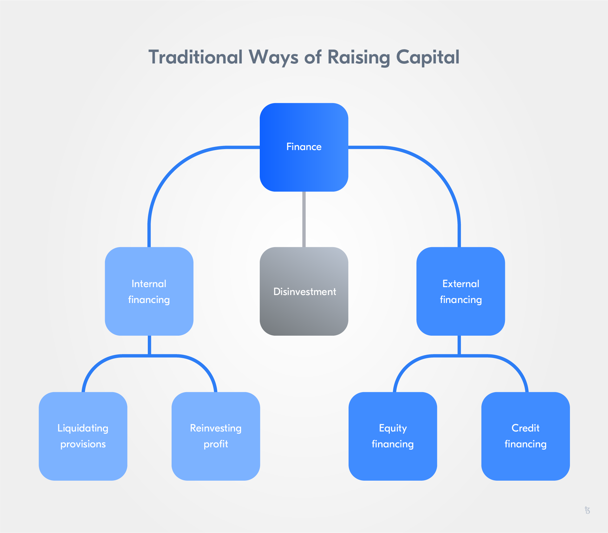

import HighlightBox from "../../src/components/HighlightBox"

import {
  ExpansionPanel,
  ExpansionPanelList,
  ExpansionPanelListItem
} from 'gatsby-theme-apollo-docs';

Blockchain technology-enabled new financial instruments and mechanisms. It lead to the upcoming of a novel form of finance, decentralized finance (DeFi). 
In DeFi, instead of relying on third parties, i.e. intermediaries, like banks, clearance houses, and exchanges to offer financial instruments, blockchain technology and specifically smart contracts build the base for new financial mechanisms.

<ExpansionPanel title="Raising capital - Start-up financing cycles">

In capital structure theory, one often differentiates between **internal and external financing**. Whereas, **internal** refers to a situation in which a company uses profits as a source of equity by re-investing it instead of distributing profits among the owners and/or investors (reinvesting profits) or provisions are liquidated. **External** describes a situation in which financing of new investments and firm activities is done through external financial means. External financing methods are equity issues, such as IPOs and credit financing.

Currently, one of the most discussed topics when it comes to blockchain technology and its impact on the financial sector is funding, i.e. new forms how companies and projects can raise external capital, especially in the case of start-ups.

**The start-up financing cycle**

In general, when launching a start-up a crucial factor for long-term success is financing as start-ups often fail due to cash flow problems. A typical issue when starting a business venture.

The revenue of start-ups usually follows a certain growth development. In the beginning, start-ups are in the so-called "valley of death", revenues are not sufficient to result in a profit or even cover costs. Start-ups require seed capital, angel investors, or other forms of equity to roll out their business and develop their service offerings. Once revenues surpass the point where the revenue covers the cost (i.e the break-even point), profit is generated. The revenue growth, the slope of the revenue curve, is quite high in the early stage, but then begins to flatten during the latter stage and results in a positive slope that is lower than in the early growth phase. In this revenue growth phase, venture capitalists and other companies looking for a strategic alliance, acquisitions, or merger opportunities often provide start-ups with financing to support continued revenue growth.

At this point, an initial public offering (IPO) or initial coin offering (ICO) are popular means for further financing preparing the company to open up to the public market and later be able to launch secondary offerings in case more funding is necessary.

Keeping in mind the start-up financing cycle helps understand which funding mechanisms are best suited in which phase of a start-up's venture by reflecting on the growth of revenue over time.

</ExpansionPanel>

A notable majority of blockchain applications focus on the financial sector, which can be expected when looking at the number of tokenization projects. This lead to the development of a number of security and other token issuance models to raise capital: Initial coin offerings (ICOs), initial exchange offerings (IEOs), security token offerings (STOs) - A colorful parade of acronyms followed. After the first cryptocurrencies were launched and the first ICO was conducted in 2013, the popularity of ICOs continued growing and led to an ICO bubble in 2017/2018. Still, the bubble burst has in no way curtailed the run on token offerings and DeFi instruments.

These new financial instruments were not only enthusiastically received by investors but became a popular way for start-ups in the industry to finance projects and the development of blockchain-based services. Often funding in the blockchain space is provided by venture capital. Thus, so-called fixed-size equity rounds, seed rounds, or fixed-size series A rounds, are common to provide start-ups with the necessary cash flows.

A new promising form of financial instrument is the rolling simple agreement for future equity (Rolling SAFE). Let's dive into finding out what a Rolling SAFE is by taking a look at its predecessor, the SAFE.

## The origin of Rolling SAFEs

A simple agreement for future equity (SAFE) can be defined as *an agreement between a company, the issuer, and investors providing the investor rights for future equity in the company*. The price per share is not defined at the time of the initial investment. Investors receive their future shares once a **triggering event**, such as a priced investment round or a liquidity event, occurs.

In 2013, [Y Combinator](https://www.ycombinator.com/), a US-American technology start-up accelerator, released the first SAFE. It was introduced as a simpler, more founder-friendly **alternative to convertible notes** with low transaction costs (i.e. costs related to any economic trade done when participating in a market) to assist start-ups with initial/early-stage funding. Companies regularly rely on seed rounds, convertible notes, preferred stock, and even common stock for funding. Not all financial instruments are well-suited for start-ups.

With a SAFE, the investor shares are not valued at the time the share agreement is signed, instead, company and investor determine the mechanism for the issuance of future shares and defer actual valuation. Thus, negotiated conditions usually relate to the valuation cap and/or a discount for the share valuation when the triggering event occurs.

Basically a SAFE is a securities offering in which investors receive an equity stake or convertible note stake in a company for their investment. As such, SAFEs were envisioned to help start-ups until they can generate revenue through their business operations or receive further investments. While the start-ups does not generate any profit, i.e. the revenue is lower than the (running) costs, a SAFE can help to raise initial funding.

<ExpansionPanel title="What are convertible notes">

A convertible note, often also called a convertible debt, is *a type of bond that can be converted by the holder into a number of shares of common stock*. It can be understood as a security with debt and equity features.

They are considered a **debt security**, a security entitling holders to the payment of principal and interest because companies agree to a fixed or floating interest rate. Instead of receiving the return of investment plus the interest, investors get a right to convert the equity security in the future. As they are considered securities they fall under regulations such as the US Securities Act.

Key characteristics of a convertible note are:

* The main amount is due to the investor at the maturity date;
* Interest accrues at a fixed rate;
* The investor holds a claim on the company's equity senior to the claims of other equity holders and equal to the claims from the non-senior debt.

Convertible note holders receive equity on triggering events like in the case of future equity financing and of the sale of the company, as well as when the maturity of the convertible note is reached.

In a start-up financing context, convertible notes are a common option to raise capital at an early stage. Some start-ups also use convertible notes for bridge financing until a later-stage equity round or sale of the company is conducted. Then convertible notes are often referred to as bridge notes.

The increased use of convertible notes by start-ups can be traced back to their time efficiency: Deals for convertible notes can be closed much faster because it is easier to give different investors different prices. This helps alleviate the deadlock potential of investors waiting on other investors to engage before opting to invest. In fixed-size equity rounds, start-ups have to determine their investment goal (i.e. the minimum funding amount) in advance. This is no longer the case with convertible notes.

</ExpansionPanel>

In which way is a SAFE different from a convertible note?

SAFEs are similar to convertible notes, but are not a debt instrument - A SAFE is similar to a warrant and not a loan. Thus, a SAFE **does not have a maturity date or accruing interest**. The SAFE remains outstanding as long as a conversion/triggering event (for example, in case of further equity financing or a sale of the company) has not occurred. At the same time, investors receive a right to convert their SAFE into equity with the SAFE, and the price of equity is lower than the one investors in later funding rounds receive due to discount rates or valuation caps.

Unlike a convertible note, a SAFE does not include an interest rate and maturity rate. Both convert into equity in future equity rounds and have calculation caps, discounts, and most favored nations, but convertible notes are more complex regarding to when and how the conversion is done.

<HighlightBox type="info">

Most favored nation (MFN) is a status, i.e. level of treatment, defined in inter-governmental trade agreements. MFN clauses ensure non-discriminatory trade policies because it implements equal trading among states.

Member states of the World Trade Organization (WTO) have agreed to grant each other MFN status. This also means that granting an MFN for one member of the WTO, in form of trade concessions, privileges, or immunities, leads to all members of the WTO being granted the same exemptions.

In the WTO, exceptions to the MFN principle, i.e. a preferential treatment being granted to only a selected number of WTO member states, are legal for trade relations with developing countries and regional free trade areas (e.g. North American Free Trade Agreement, NAFTA) and customs unions (e.g. European Union Customs Union, EUCU).

</HighlightBox>

Additionally, SAFEs are usually not subject to the regulations on debt mechanisms. This adds to their simplicity and makes SAFEs easier to conduct, compared to convertible notes. It also makes SAFEs less costly, as legal costs and negotiation time are reduced.

In summary, key parameters of a SAFE are:

* Valuation cap - Is there a valuation cap? If there is one, what is the valuation cap?
* Discount - Is there a discount for SAFE investors when shares are converted to equity as a result of a triggering event?
* Most-favored-nation clause - Is there an MFN clause included?

SAFEs are well-suited to the needs of start-ups. Two aspects make them very attractive: high-resolution financing and simpler negotiations. A SAFE is a high-resolution fundraising opportunity, that provides founders and investors with more certainty and transparency, as well as reduced legal costs and negotiation time. The negotiation time is reduced significantly as only the valuation cap has to be negotiated by the investor and company.

Although SAFEs presented start-ups with a novel and very useful funding mechanism, they also bear one major issue for investors: What happens if a SAFE's triggering event never happens? In case a triggering event, such as the sale of the company or receiving venture capital funding, does not occur, the investor cannot convert his shares into equity. This is where the Rolling SAFE comes in.

## What is a Rolling SAFE?

Generally speaking, a Rolling SAFE is a continuous and flexible fundraising mechanism. It consists of a security token offering that represents a proportional share of the future equity of a company. The token does not represent a percentual share of the ownership of the company, as in the case of traditional shares, but rather a claim on expected future equity. The promise of a Rolling SAFE is based on a company's current business performance and on the capability of a company to translate its business success into fundraising success.

How is this possible?

Rolling SAFEs are blockchain-enabled **continuous** offerings of a programmable equity. The future equity claims are backed by a reserve and securitized in a certain token amount. The issuance, distribution, price calculation, and even buyback of tokens are automated and programmed. Equity becomes programmable through automatable and scalable mechanisms implemented in a smart contract.

<ExpansionPanel title="Programmable equity (PEQ)">

What is meant by programmable equity (PEQ)?

PEQ is a term for a technology-enabled financing mechanism based on an equity claim issuance. Through it, the interests of stakeholders are aligned with the financial success of a company - Investors are interested in the financial success as their claim and with it, their return on investment (ROI) is linked to it.

PEQ offerings help create liquidity fast by tokenizing tradeable company shares allowing for high-resolution financing.

The main idea behind programmable equity, as the name already discloses, is offering equity without having to give up control over ownership and the decision-making rights that come with it. At the same time, PEQ offers investors the opportunity to better and more transparently assess risk as the offering is programmed and largely automatized.

</ExpansionPanel>

A Rolling SAFE is a form of high-resolution fundraising, as it is much faster than, for example, a fixed-equity round - there is no need for pitches, negotiations, and intermediaries, so it is a means to get liquidity fast. The time-investment to set up a Rolling SAFE is also much lower because the issuer can offer different prices for different investors without having to negotiate each investment. It is all automated through one offering. Rolling SAFEs present a good alternative to convertible notes because they help liquidity markets evolve towards high-resolution. Rolling SAFEs are alternatives to fixed-size equity rounds, as they are more flexible and less and time-intensive.

In addition, Rolling SAFEs allow founders to maintain long-term control and ownership over their company. While they provide investors with greater transparency when it comes to the offering and price development of their tokens. Market psychological group dynamics are less strong for Rolling SAFEs because investors are individually incentivized to align their interests with the company's interest of being a successful business. In addition, investors are incentivized to invest early and not take a "wait-and-see" approach to decide on when to invest. The return on investment (ROI) is higher the earlier an investor buys tokens.

Rolling SAFEs open up new liquidity markets for start-ups and present a new investment opportunity to a wider investor base - They are not bound to a specific market environment and usually do not present with access barriers, so to say, everyone can buy a Rolling SAFE token. Rolling SAFEs give investors improved access to benefit from the financial success of a company.

## Stages in a Rolling SAFE

To better understand the funding mechanism, let's take a closer look at the different stages of a Rolling SAFE.

The continuous offering - continuous because tokens are offered continuously to investors - of a Rolling SAFE can be split into **four stages**:

* Initialization,
* Pre-MFG,
* Post-MFG, and
* Termination.

During the **initialization** the issuer, a company, decides on the terms of the offering, especially by setting the annual revenue committed to being held in a reserve, determining the company valuation, and setting a minimum treshold for the funding and running time for the offering. The running time can be indefinite and always be increased, but never decreased. The annual amount committed to the reserve helps decrease the risk for investors, as the reserve is used to finance token buys and the buyback at termination. The higher the annual amount is, the less risky the offerings are for investors because the buyback at termination (i.e. when the tokens convert to equity) is ensured. Then the issuer only has to deploy a smart contract for the Rolling SAFE to begin.

In a Rolling SAFE, a smart contract issues the tokenized security, handles sales and buybacks, and assists with funneling the annually committed revenue. This smart contract is often also called the **decentralized autonomous trust (DAT)**. The DAT issues tokens proportionally to the amount invested. The DAT tokens represent a claim on the DAT-managed cash reserve.

The issuer sets a target amount of investment, the so-called **minimum funding goal (MFG)**. As long as the MFG is not met, so to say **pre-MFG**, tokens are minted proportionally to the amount held by the reserve. All tokens are offered at a fixed price and all funds received through token sales are escrowed by the DAT. The initial fixed price gives investors a treshold under which the price will never fall and helps reward early investors over those investing at a later time. Investors can withdraw their investment and receive 100% of it back, e.g. tokens can be redeemed and are then taken out of circulation. Thus, the MFG increases investor protection. In addition, the offering can be canceled by the issuer during this phase.

Once the MFG is reached, the offering can no longer be canceled, only closed, i.e. terminated. It remains active at a minimum for as long as the running time was set. Also, a large part of the MFG funds moves into the cash reserve and the other part goes to the issuer.  Investor funding is no longer escrowed by the DAT in the reserve, as it was during the pre-MFG phase. Instead, a portion of the revenue of the issuer is moved into the cash reserve as determined by the annual amount set during initialization.

**Post-MFG**, the smart contract, DAT, manages the token issuance and the reserve reflecting the amount allocated by the issuer to the cash reserve. When the issuer generates revenues, part of them goes into the reserve to finance the buyback at termination. This creates an incentive for investors to at least hold on to their tokens for as long as the issuer has not begun to generate revenue because the token price begins to increase with generated revenue. Ideally, investors hold on to their tokens until the offering is closed - when they can expect the highest ROI. Whereas, the bonding curve acts as an automated market maker so that tokens can be sold at a calculated price at any point in time. The cash reserve ensures this by holding enough funds to buy back tokens.

The price of tokens is determined by a **bonding curve**. It creates a mathematically-based way to enable coordination and incentivization of investors. The bonding curve consists of a buy and sell curve, both determined by two functions. At this point, the price for buying back tokens is determined by the bonding curve. Thus, investors can no longer withdraw their investment and receive 100% of it back, i.e. sell their tokens for the same price they bought them.

The price of the tokens is automated and non-negotiable. The **initial price**, pre-MFG, was based on the company valuation and size of the reserve and is calculated by an algorithm. The post-MFG price is based on a function of the number of tokens issued and sold. The higher the token amount, the higher the price. Moreover, the implied valuation is that of one growing over time with more funds being raised. Being an early investor does have value, as the price per token rises with the overall amount of tokens. For example, compare the price per token an early investor pays pre-MFG, with the price per token after the MFG is met.

How is the price determined? And how are buy and sell price different from each other?

The **buy function** implements a linear relationship between the buy price and the number of tokens. The **sell function**, on the other hand, is influenced by the cash reserve. To control the sell price, the issuer can use pay and burn functions to influence the reserve and with it control the sell price.

While the offering is active, tokens are issued proportionally to the amount in the reserve, so token holders can buy and sell tokens for market prices or sell them directly back to the reserve (i.e. tokens can be redeemed).

How does a Rolling SAFE end?

Rolling SAFEs are envisioned to be closed in two different ways: Termination at the end of the running time or closure due to liquidity or dissolution events. When the company, for example, is sold or an IPO is conducted, the triggering event leads to the offering ending and investors being entitled to receive equity in relation to their investment (i.e. amount of tokens). Thus, a conversion to equity before to the termination of the offering is conducted.

Concerning the termination, the issuer could let the offering run indefinitely, but usually, a running time is set and at the end of it, the offering is terminated. Termination is possible as soon as a minimum period of time, as defined during initialization, has passed. The defined minimum period of time gives investors more transparency on the offering. A Rolling SAFE is terminated once:

* The issuer pays the **exit fee**, the current issuance price of tokens multiplied with the number of outstanding tokens (tokens held by investors);
* Offering is closed;
* All investors can receive equity in return for their tokens, e.g. all outstanding tokens are bought back with the funds held in the reserve and coming from the exit fee.

The termination of a Rolling SAFE resembles a traditional buyback of shares. All tokens are bought back at the same price.

## Fixed dilution

The fixed target equity percentage allocation of Rolling SAFEs leads to a fixed dilution. Because of the percentage dedicated to the reserve, fixed dilution is ensured. Unlike a traditional additional issuance of shares, the token issuance and their value is fixed by the parameters of the offering's smart contract. The value an investor holds is not reduced by the issuance of further tokens. There is no dilution from equity financing. This reduces the risk for an investor and makes dilutions a fixed and pre-determined factor.

Independently of the equity raised by the issuer, all investor claims remain collectively the same. There is a certain degree of dilution each investor has to live with due to each token issuance contributing to dilution. The dilution remains predictable and therefore, reduces the amount of unknown and uncalculated risk from equity dilutions known in other financial instruments.

<HighlightBox type="reading">

* [Celia Wan (2020): DeFi Start-up Launches Platform That Lets People Invest in Start-up Revenue Instead of Equity](https://www.theblockcrypto.com/post/55189/defi-startup-launches-platform-that-lets-people-invest-in-startup-revenue-instead-of-equity)
* [Cooper Turley (2020): Introducing Continuous Security Offerings by Fairmint](https://defirate.com/introducing-fairmint/)
* [Fairmint (2021): A New Era of High Resolution Fundraising: The Rolling SAFE](https://blog.fairmint.co/a-new-era-of-high-resolution-fundraising-the-rolling-safe-1fb67eee68ab)
* [Fairmint: Rolling SAFE](https://www.rollingsafe.co/)
* [Fairmint Inc.: Template for a Continuous Agreement for Future Equity](https://fairmint-documents.s3.amazonaws.com/CAFE/CAFE+Template.docx)
* [Fairmint Inc.: The Rolling SAFE](https://fairmint.co/cafe-continuous-agreement-for-future-equity/#what-differences-cafe-safe)
* [FundersClub: What is a SAFE?](https://fundersclub.com/learn/safe-primer/safe-primer/safe/)
* [Han (2021): Continuous Security Offerings: Money on Tap from Tokenizing Your Revenue](https://otonomos.com/2021/03/continuous-security-offerings-money-on-tap-from-tokenizing-your-revenue/)
* [Joshua Stoner (2020): Fairmint Launches with High Hopes for the ‘Continuous Securities Offering (CSO)’](https://www.securities.io/fairmint-launches-with-high-hopes-for-the-continuous-securities-offering-cso/)
* [Marko Vidrih (2020): Continuous Security Offering (CSO) — A New Type of Financing](https://medium.com/the-capital/continuous-security-offering-cso-a-new-type-of-financing-79bf08b3b881)
* [Paul Graham (2010): High Resolution Fundraising](http://www.paulgraham.com/hiresfund.html)
* [Thibauld Favre: Continuous Organizations White Paper](https://github.com/C-ORG/whitepaper)
* [Thibauld Favre (2020): Introducing the Continuous Securities Offering Handbook](https://medium.com/@thibauld/introducing-the-continuous-securities-offering-handbook-724b6e889296)
* [Thomson Reuters - Practical Law: Convertibel Note](https://uk.practicallaw.thomsonreuters.com/w-001-0681?originationContext=document&transitionType=DocumentItem&contextData=(sc.Default)&ppcid=2c2d9a07999349da8102457708057fb3)
* [Thomson Reuters - Practical Law: Simple Agreement for Future Equity (SAFE)](https://uk.practicallaw.thomsonreuters.com/w-001-0673?transitionType=Default&contextData=(sc.Default)&firstPage=true)
* [Y Combinator: Safe Financing Documents](https://www.ycombinator.com/documents/)
* [Y Combinator: Understanding SAFEs and Priced Equity Rounds](https://www.ycombinator.com/library/6m-understanding-safes-and-priced-equity-rounds)

</HighlightBox>
