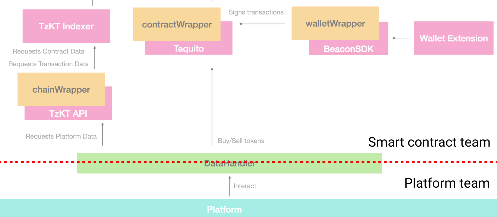
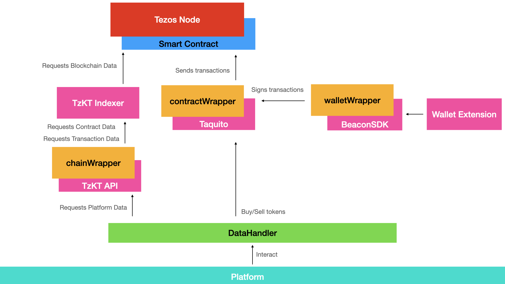

import HighlightBox from "../../src/components/HighlightBox"

import {
  ExpansionPanel,
  ExpansionPanelList,
  ExpansionPanelListItem
} from 'gatsby-theme-apollo-docs';

Due to the size of this project, we need to do some planning before starting to code. We will showcase our actual approach for the implementation of this whole project, and share our considerations and learnings.

On the top level, we have divided the project into two separate parts:

* The user-facing web application, the **[TZMINT web application](https://tzmint.b9lab.com/)**, and
* The smart contract and the **wrapper functions** to interact with it.

This division of concerns allows developing both parts in parallel while decreasing the complexity on each side. To ensure both parts fit together in the end, we drew a hard line between these two parts. Both are only connected through one interface: the **DataHandler**.



The [`DataHander`](https://github.com/b9lab/tezos-cso-project/blob/master/src/services/DataHandler.ts) is written in JavaScript and exposes all functions for the web application to interact with the blockchain on a high level (both read and write). For the developer working on the web application implementation, this handler allows all interaction and does not require developers to know the actual smart contract implementation.

On the other side, the `DataHandler` directly calls the wrapper functions implemented by the smart contract team, which does not need to know about the processing of this data in the web application beyond the wrapper functions. The call to the wrapper functions is also implemented in the `DataHandler` - so we really drew the line _through_ it.

With this setup, the team working on the web application does not need to be fully knowledgeable about all the blockchain-related details, while the smart contract team just needs normal JavaScript/TypeScript to implement the wrappers without knowledge regarding both frontend and backend frameworks (React, Next, Express). Not everyone needs to be a full-stack developer.

After a quick general project introduction (i.e. an explanation of the Rolling SAFE) and the development of the base user stories, both teams worked together on the specification of the function signatures and the return data for the [`DataHandler`](https://github.com/b9lab/tezos-cso-project/blob/master/src/services/DataHandler.ts) on a basic level:

```javascript
@return Promise.resolve(number totalInvestors) or Promise.reject(error)
chainWrapper.totalInvestors()

@return Promise.resolve(number totalInvestments) or Promise.reject(error)
chainWrapper.totalInvestments()

@return Promise.resolve(number companyValuation) or Promise.reject(error)
chainWrapper.companyValuation()
```

You can take a look at the full (original) specification document below, to get a feel for our first approach - Please note that this document was our very first specification document. After we had created this document, we began to implement the DataHandler with stubs, which then became our new specification file.

<ExpansionPanel title="Full signature specification">

```javascript
contractWrapper: contract calls, no function params, wallet will handle input
@returns Promise.resolve(number tokenAmount) or Promise.reject(error)
contractWrapper.buy(number tezAmount)

@return Promise.resolve(number tezAmount) or Promise.reject(error)
contractWrapper.sell(number tokenAmount)

@return Promise.resolve(number tokenAmount) or Promise.reject(error)
contractWrapper.burn(number tokenAmount)

@return Promise.resolve() or Promise.reject(error)
contractWrapper.pay(number tezAmount) 

chainWrapper: fetch contract storage and other blockchain relevant information
@return Promise.resolve(array storage) or Promise.reject(error)
Return value structure depends on the storage of the contract:
[string organization, JSON {k0:v0,...}, number buyPrice, number sellPrice, number total_tokens, number burned_tokens, number MFG, number MPT, number I, number D, number b, number s]
organization: contract administrator(address),
company_name: name of the company,
JSON {k0:v0,...} : token ledger
MFG: minimal funding goal
MPT: minimum period of time
I: percentage of the funds being held in the cash reserve (Reserve percentage)
D: percentage of the revenues being funneled into cash reserve (Retained Revenue percentage)
b: buy slope
s: sell slope
chainWrapper.storage()

@return Promise.resolve(string companyName) or Promise.reject(error)
chainWrapper.companyName()

@return Promise.resolve(number phase[0: initial, 1: slope phase]) or Promise.reject(error)
chainWrapper.phase()

@return Promise.resolve(number totalTokens) or Promise.reject(error)
chainWrapper.totalTokens()

@return Promise.resolve(number totalInvestors) or Promise.reject(error)
chainWrapper.totalInvestors()

@return Promise.resolve(number totalInvestments) or Promise.reject(error)
chainWrapper.totalInvestments()

@return Promise.resolve(number companyValuation) or Promise.reject(error)
chainWrapper.companyValuation()

@return Promise.resolve(number tez) or Promise.reject(error)
chainWrapper.buyPrice()

@return Promise.resolve(number tez) or Promise.reject(error)
chainWrapper.sellPrice()

@return Promise.resolve(number tez) or Promise.reject(error)
chainWrapper.reserveAmount()

@return Promise.resolve(string baseCurrency) or Promise.reject(error)
chainWrapper.baseCurrency()

@return Promise.resolve(number totalAllocation) or Promise.reject(error)
chainWrapper.totalAllocation()

@return Promise.resolve(number stakeAllocation) or Promise.reject(error)
chainWrapper.stakeAllocation()

@return Promise.resolve(number initialReserve) or Promise.reject(error)
chainWrapper.initialReserve()

@return Promise.resolve(array of strings terminationEvents) or Promise.reject(error)
chainWrapper.terminationEvents()

@param string address: tz address of the user
@return bought, sold, tokens, tez
chainWrapper.user(string address)

@return Promise(array bought) or Promise.reject(error)
[[timestamp, tezAmount, tokenAmount], ...]
chainWrapper.user(string address).bought()

@return Promise(array selled) or Promise.reject(error)
[[timestamp, tezAmount, tokenAmount], ...]
chainWrapper.user(string address).sold()

@return Promise(number tokens) or Promise.reject(error)
chainWrapper.user(string address).tokens()

@return Promise(number tez) or Promise.reject(error)
chainWrapper.user(string address).tezInvested()

@return Promise(string administrator) or Promise.reject(error)
chainWrapper.administrator()
```

</ExpansionPanel>

An example stub for the `getInvestmentNumbers()` function in the [very first version](https://github.com/b9lab/tezos-cso-project/blob/72ce67a34d8aa99e38895595033900e00d4f7b70/src/services/DataHandler.ts#L46) is:

```typescript
// General Investment Info

getInvestmentNumbers(): Promise<InvestmentNumbersDto> {
    return new Promise((resolve, reject) => {
        const data: InvestmentNumbersDto = {
            totalInvestment: '$2,000',
            investorsCount: 238,
            tokensCount: 37,
            unlockingDate: new Date("2021-07-30 12:05:33.574+00")
        };

        resolve(data);
    });
}

```

On the web application side, this common `DataHandler` with stubs allows to immediately start with the implementation of the scenarios with their views and flows. For the smart contract development, this is a perfect blueprint to be used as expected values in unit tests allowing to start with **test-driven development** right away.

Later, the stubs are replaced with the `chainWrapper` methods according the signatures:

```typescript

class DataHandler {

    /**
     * Gets the general investment numbers
     */
    async getInvestmentNumbers(): Promise<InvestmentNumbersDto> {
        const start = new Date(process.env.DEPLOYMENT_DATE || "2021-07-21T14:02:43Z");
        const end = new Date();
        const steps = 30;

        const storage = await chain.storage();
        const [
            companyName, 
            buyPrice, 
            sellPrice, 
            minimumFundingGoal, 
            totalInvestments, 
            investorsCount, 
            totalTokens, 
            reserveAmount, 
            sellSlope,
            buySlope, 
            unlockingDate,
            burnedTokensCount,
            phase,
            priceHistory
        ] = await Promise.all([
            chain.companyName(storage), 
            chain.buyPrice(storage, 1),
            chain.sellPrice(1),
            chain.mfg(storage),
            chain.totalInvestments(storage),
            chain.totalInvestors(storage),
            chain.totalTokens(storage),
            chain.reserveAmount(),
            chain.sellSlope(storage),
            chain.buySlope(storage),
            chain.unlockingDate(storage),
            chain.burnedTokens(storage),
            chain.phase(storage),
            chain.priceHistory(start, end, steps)
        ]);

        return {
            companyName: companyName,
            tokenBuyPrice: +buyPrice,
            tokenSellPrice: +sellPrice,
            minimumFundingGoal: +minimumFundingGoal,
            unlockingDate: unlockingDate,
            totalInvestment: +totalInvestments,
            investorsCount: +investorsCount,
            tokensCount: +totalTokens,
            burnedTokensCount: +burnedTokensCount,
            reserveAmount: +reserveAmount,
            buySlope: +buySlope,
            sellSlope: +sellSlope,
            isMFGReached: !!+phase,
            prices: priceHistory
        };
    }
```

## Workflows

We also used this common interface to communicate (specification) updates between the smart contract development and the application. Using automated units tests which run on any code update, any breaking change will be immediately visible. This is very important, because even with the best planning, it is natural that you might need to adjust these signatures as some details evolve during the course of a project. Plan in both **time** and **processes** to keep this common interface updated.

We will look into the details of unit and integration tests in the [testing Section](./07-testing). You can take a look at the configuration and run results in our public [repository on GitHub](https://github.com/b9lab/tezos-app-project/actions).


## Two parts, two repositories

To further untangle these two main parts, we also use two separate repositories:

* The [web application repository](https://github.com/b9lab/tezos-cso-project), and
* The [smart contract and wrapper repository](https://github.com/b9lab/tezos-app-project).

The smart contract repository is integrated into the web application repository as a [git submodule](https://git-scm.com/book/en/v2/Git-Tools-Submodules). This split into two repositories allows for separate ci/cd workflows and less friction on pull request reviews, all helping to speed up the development when working in a team.

When a change on the smart contract functions is requested from the web application team, we first adjust the unit tests in the smart contract repository, then sync these to the `DataHandler` stubs, and only then begin implementing the changes on both sides.

During the initial development, it was also very easy to update the stubbed functions with this split up once the smart contract and wrapper functions were ready, as the smart contract team could easily replace the stubbed data fields with the wrapper calls and push this update to the web application team to connect their functions.

## Connecting System Components

The component that brings the TZMINT web application and the Tezos blockchain together is the `DataHandler`. It requests the data the web application needs through wrappers, which use various Tezos APIs to interact with the blockchain and the user wallet:

* [Beacon](/beacon),
* [Taquito](./taquito), and
* [TzKT](./tzkt).

<ExpansionPanel title="Prerequisite - Building a web application with the Tezos ecosystem">

**[Beacon](https://www.walletbeacon.io/)** offers an interface to connect browser, mobile, desktop, web, and/or hardware wallets with an application. Several wallets are supported by the Beacon SDK: [AirGap](https://airgap.it/), [Galleon](https://github.com/Cryptonomic/Deployments/wiki/Galleon:-Releases), [Kukai](https://wallet.kukai.app/), [Temple](https://templewallet.com/), and [Spire](https://chrome.google.com/webstore/detail/spire/gpfndedineagiepkpinficbcbbgjoenn). Thus, we use Beacon for the communication between several wallets and the TZMINT web application.

**[Taquito](https://tezostaquito.io/)** is a Tezos TypeScript library that is designed for JavaScript projects and offers an API. Taquito assists us with the client development so that average users can interact with the smart contract managing the token offering through the TZMINT web application: Taquito helps send transactions to the Tezos node.

**[TzKT](https://github.com/baking-bad/tzkt)** is a Tezos blockchain indexer, which reduces the time it takes to fetch and process data from the blockchain. Additionally, with TzKT high-level functionalities (e.g. filtering, sorting, and calculating historical data), that go beyond the Tezos JSON/RPC interface, become available. TzKT comes with an advanced API to facilitate data access and subscribing to blockchain data. The TZMINT web application relies on TzKT to ensure proper fetching of blockchain data.

</ExpansionPanel>



The wrappers are used to fetch contract and transaction data and to call the contract. The following wrappers were used:

* `chainWrapper`: Uses the [TzKT API](./tzkt) to fetch blockchain data, formats, and caches, and to calculate values;
* `walletWrapper`: Uses the Beacon SDK to sign the transactions;
* `contractWrapper`: Uses `walletWrapper` to sign the transactions and Taquito to send transactions to the Tezos node.


