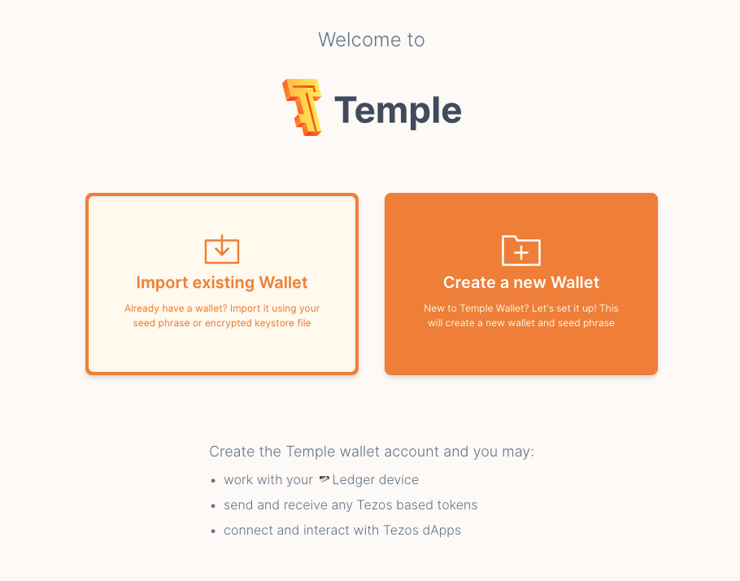
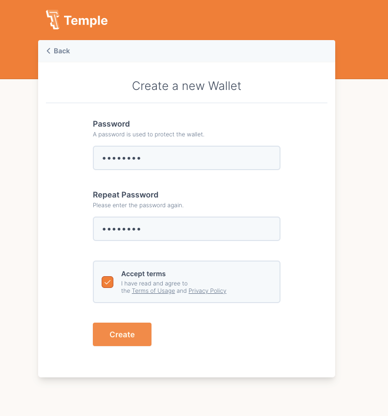
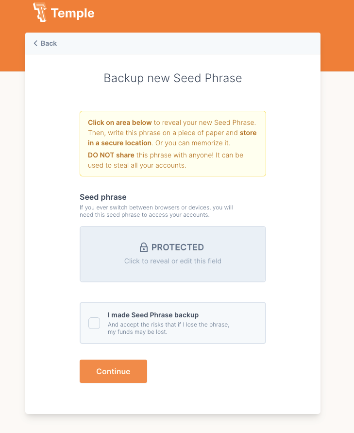
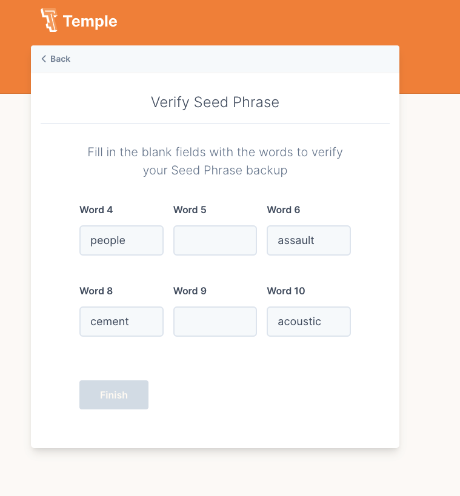
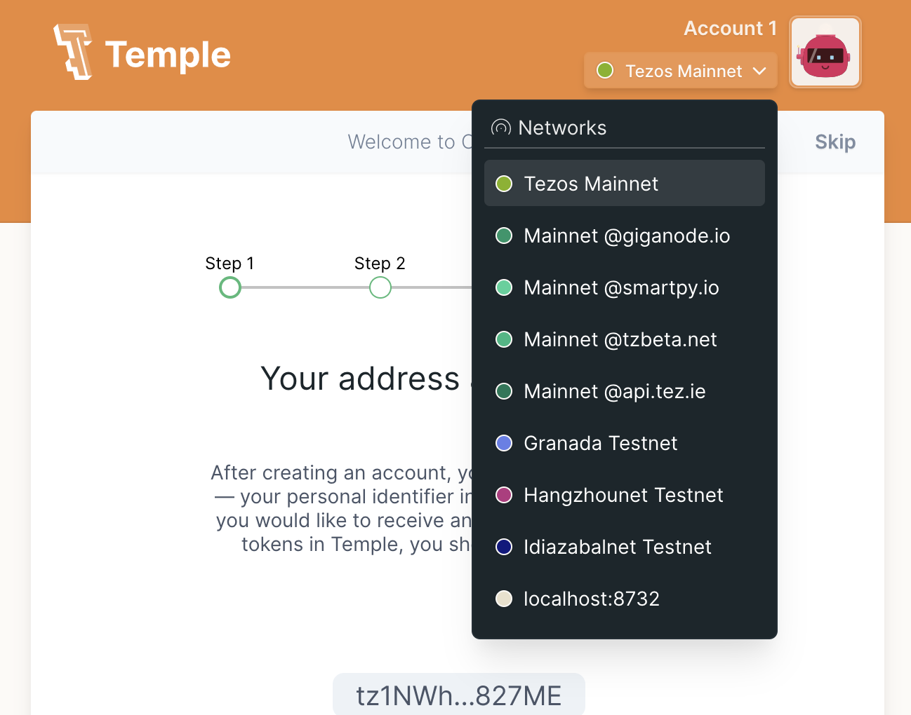
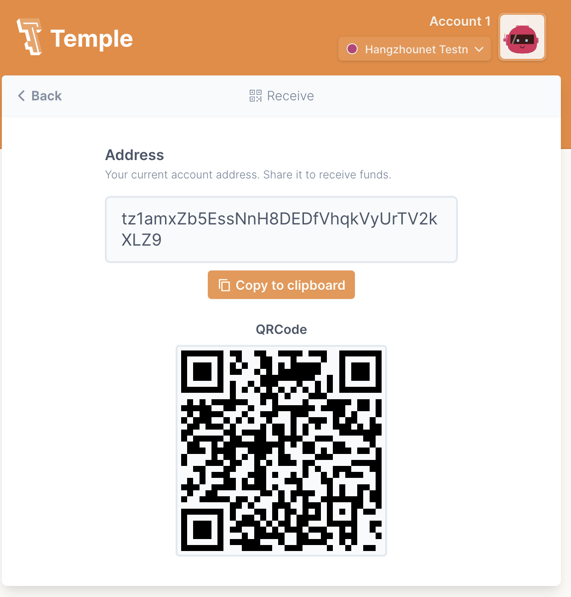
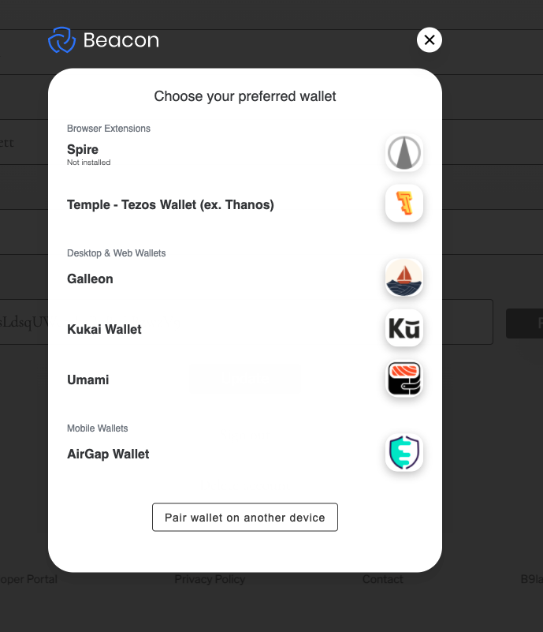
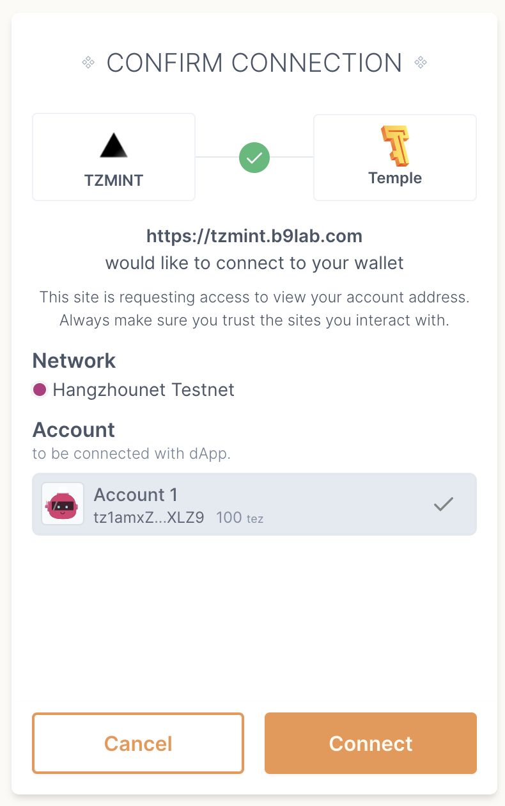
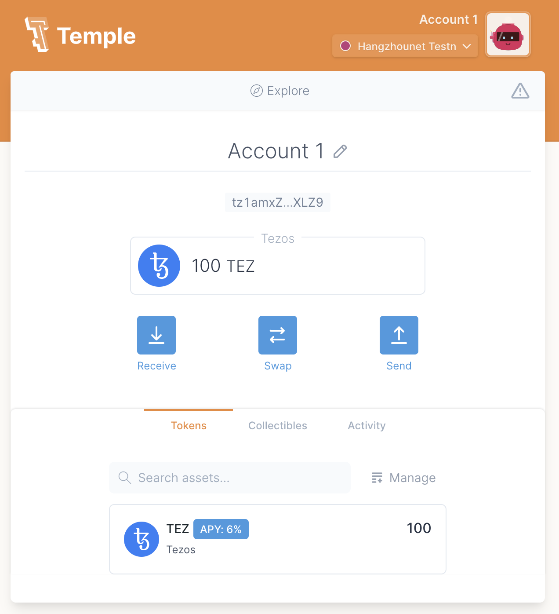

import HighlightBox from "../../src/components/HighlightBox"

import {
  ExpansionPanel,
  ExpansionPanelList,
  ExpansionPanelListItem
} from 'gatsby-theme-apollo-docs';

Invest in [TZMINT](https://tzmint.b9lab.com/) now! It is just **three quick steps** to get started with the TZMINT web application and get your first TZM tokens:

* Sign in with your e-mail at [https://tzmint.b9lab.com/](https://tzmint.b9lab.com/);
* Setup and connect your wallet;
* Get yourself some testnet tez.

<HighlightBox type="info">

The TZMINT web application platform is an example project and part of this educational course. There is **no real investment or company** involved. The TZM tokenss do not represent claims to a real investment but are only issued as part of an educational project; they do not hold any value. Instead, all transactions displayed are performed on a Tezos testnet, the Hangzhou Testnet.

</HighlightBox>

The following step-by-step get started instructions help you set up everything you need to buy and sell TZM tokens on trhough the web application. These tokens do not represent claims to a real investment but are only issued as part of an educational project - They do not hold any value.

## Signing-in

To sign in, please:

1. Go to [https://tzmint.b9lab.com/](https://tzmint.b9lab.com/), and
2. Click on the `Sign in` button in the top right corner.

You can now choose between **two ways to sign in**:

* With your email, or
* With Google.

To **sign in with your email**, type in your email address into the field and click on `Sign in with Email`. You will receive a sign-in link to your email address.
Just click on the `Sign in` button in the email and you will be redirected to the web application.

To **sign in with your Google account**, click on the button labeled `Sign in with Google`. This will redirect you to the Google account login.

Once you logged in, your web application account information will appear under the `My Profile` tab.

Now, you have an account on the platform! We still need to connect your wallet for you to be able to buy and sell TZM tokens.

## Connecting my wallet

As soon as you are logged in, the platform will ask you to connect your wallet. While you have not connected a wallet, a pop-up will appear asking you to select your preferred wallet every time you navigate to the `Profile` section.

You have to decide whether you want to **pair your wallet on the same device or another device**.

To pair your wallet on an **external device**, just click on the button `Pair wallet on another device`, a QR code becomes visible. Scan the QR code with a Beacon-compatible wallet and you are set.

For pairing with the **same device**, you can either connect your wallet through a browser extension or connect the platform to either desktop and web wallets, or mobile wallets.

You can choose between:

* [Spire](https://chrome.google.com/webstore/detail/spire/gpfndedineagiepkpinficbcbbgjoenn?hl=en) and [Temple Wallet](https://templewallet.com/) - if you want to connect through a browser extension,
* [Galleon](https://cryptonomic.tech/galleon.html), [Kukai Wallet](https://wallet.kukai.app/), or [Umami](https://umamiwallet.com/) - if you want to connect a desktop or web wallet, and
* [AirGap Wallet](https://airgap.it/) - if you want to connect through a mobile wallet.

### Connecting your Temple Wallet

In case you want to use the Temple Wallet, this is your road to success:

1. Install the **Temple Wallet extension** for your browser. If your using Google Chrome, just go to the [Chrome Web Store](https://chrome.google.com/webstore/detail/temple-tezos-wallet-ex-th/ookjlbkiijinhpmnjffcofjonbfbgaoc?hl=en) and add the extension for Temple.
2. Once the extension is added, Temple will ask you whether you want to **create a new wallet** - in case you do not have a wallet yet - **or import your existing wallet**.

In case you need to **create a new wallet**, just click on the right-side button.

It will then ask you to provide the password you would like to use, repeat it for confirmation, and accept the terms.

After clicking `Create`, you will be directed to the backup of your seed phrase.

Save your seed phrase somewhere safe - for example, on a piece of paper. Then confirm you made a **backup** by ticking the box and clicking `Continue`.

Now, verify your seed phrase, and click `Finish`.

3. Now you have to pair your wallet, but first, make sure you select the correct network.

Go to your Temple extension. It should be set by default to the Mainnet, but you want the **Hangzhou Testnet** for this application.

Just navigate to the upper right-hand corner and click on `Tezos Mainnet`. This opens a drop-down menu with all available networks to select from. Select `Hangzhou Testnet`.

4. As you will need your **address** to pair your wallet and receive testnet tokens, click on `Receive`. Your address will be displayed, and you can copy it to the clipboard to have it ready.

5. To pair your wallet, go to your `Profile`, paste in your address from your Temple Wallet, and click `Fetch`. A pop-up will open asking you to choose your preferred wallet. Click on `Temple - Tezos Wallet (ex. Thanos)`.

6. The Temple Wallet wants you to then confirm the connection; the wallet asks you for a permission request through a pop-up. Just click on `Connect`.

7. You should now see that the `Address` field in your `Profile` is filled out.

You do not have any tez (XTZ) to spend yet, so let us get some Hangzhou testnet tez!

## Getting my first Hangzhou Testnet tez

Now that you have signed in and connected your wallet, it is time to get some Hangzhou Testnet tez.

The easiest way to get some tez is to go via the **Telegram Faucet Bot**. You will need a Telegram account to use it. 

<HighlightBox type="tip">

Make sure you selected Hangzhounet and not the Mainnet.

</HighlightBox>

Go to [Faucet Bot](https://t.me/tezos_faucet_bot) to use the bot - the chat should open up.

Now, click on `Get coins`. The bot will ask you for your address.

After sending your address, the Faucet Bot will let you know how much tez you claimed for which testnet.

Once you claim coins, they should also appear in your wallet - if you used Temple, they appear in your extension.

As you can see, we claimed 100 tez (XTZ).

You are ready to buy and sell TZM tokens for tez through the web application, just navigate to the [Buy & Sale page](https://tzmint.b9lab.com/fund-withdraw). Enjoy!
