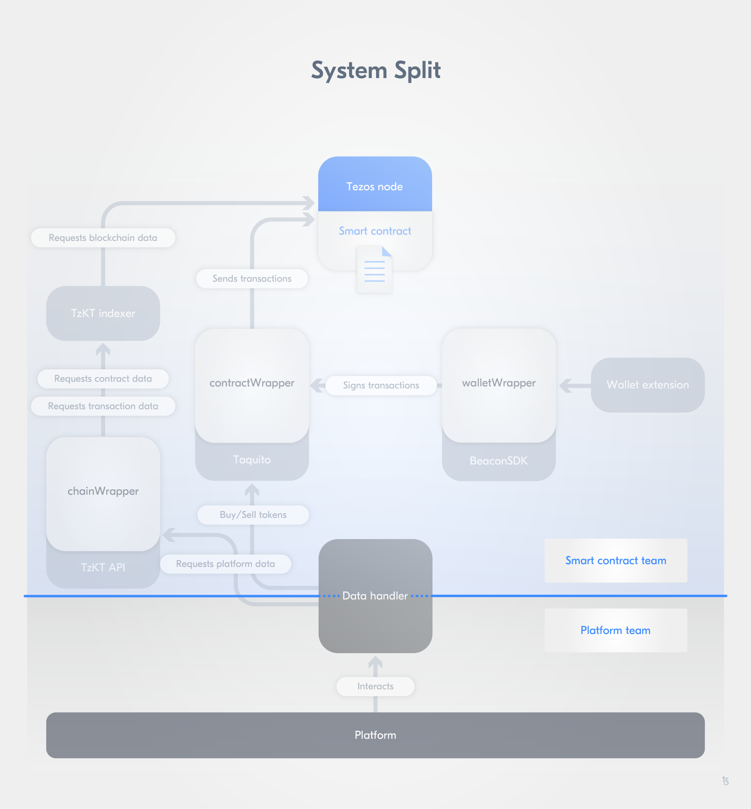
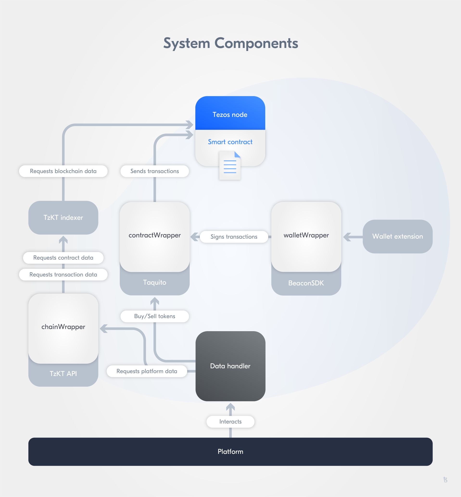

import HighlightBox from "../../src/components/HighlightBox"

import {
  ExpansionPanel,
  ExpansionPanelList,
  ExpansionPanelListItem
} from 'gatsby-theme-apollo-docs';

Due to the size of this project, we need to do some planning before starting to code. We will showcase our actual approach for the implementation of this whole project, and share our considerations and learnings.

On the top level, we divided the project into two separate parts:

* The user-facing web application, the **[TZMINT web application](https://tzmint.b9lab.com/)**, and
* The **smart contract** and the **wrapper functions** to interact with it.

This division of concerns allows developing both parts in parallel while decreasing the complexity of each part. To ensure both parts fit together in the end, we drew a hard line between these two parts. Both are only connected through one interface: the **`DataHandler`**.



The [`DataHander`](https://github.com/b9lab/tezos-cso-project/blob/master/src/services/DataHandler.ts) is written in JavaScript and exposes all functions for the web application to interact with the blockchain on a high level (read and write). For the developer working on the implementation of the web application, this handler allows all interactions and does not require developers to know the actual smart contract implementation.

On the other side, the `DataHandler` directly calls the wrapper functions implemented by the smart contract team, which does not need to know about data processing in the web application beyond the wrapper functions. The call to the wrapper functions is also implemented in the `DataHandler` - As you can see in the previous image, we drew the line _through_ the `DataHandler`.

With this setup, the team working on the web application does not need to be fully knowledgeable about all the blockchain-related details, while the smart contract team just needs normal JavaScript/TypeScript to implement the wrappers without knowledge regarding both the frontend and backend frameworks. Not everyone needs to be a full-stack developer.

## System Components

A quick overview of the individual components of the system. Further details about their configuration and implementation can be found in the upcoming [Web Application Stack](/rolling-safe-platform-stack) section.

### Next.js server

The web application itself runs on a server, serving web requests from web browsers. We will use [Next.js](https://nextjs.org/), which is an application server framework made to work with [React](https://reactjs.org/).

One important concern when building a web application connected to a blockchain is to specify where the actual blockchain interaction should happen: On the server, or on the client. Luckily, on Tezos this is very flexible: To query data, we can run our own [TzKT indexer](/tzkt), or use a public one, to query blockchain data through its REST Api, which works from both the client and the server using the same implementation.

For sending transactions, we have two options:

* Create a transaction on the client utilizing the user's wallet, using [Beacon](/beacon).
* Create and manage the user keys serverside and send the transactions from the server (hot wallet service).

We are following the first option, to keep full wallet control with the user and reduce the security risk of an unauthorized wallet access.

<HighlightBox type="info">

The smart contract is still the heart of the whole project. The web application only facilitates the interaction with the smart contract. Theoretically, a user could directly query the smart contract to fetch data, and craft a transaction manually to buy and sell. This would be very tedious, but is possible.

When implementing a hot wallet service though, users could **not** send transactions by themselves, therefore if your web application becomes unavailable, only querying data will be possible.

</HighlightBox>

We will use the public TzKT API (and thereby also the public Tezos node), available at `https://api.hangzhou2net.tzkt.io/`, and store this url as a configuration variable to begin with. We can then easily switch this to our own Indexer service later on, by just changing this url.

### Data query flow

Since we can query both from the client as well as the server in general, we implement the DataHandler and it's underlying wrappers to also support both use cases (with an exception of the WalletWrapper / Beacon integration, as this only runs on the client). We can then use the same DataHandler functions everywhere, regardless of it being called from the client UI, or any server function. This means, overall, we can support two different flows of data:


**Server-side data fetching**

**TODO: UML Sequence diagram 1**

When fetching the data Server-side, the request to the TzKT Api is made from the server directly, and the result is put into the response when it is being rendered on the server. Note that this means, the query to the TzKT Api must be completed before the server can start to send the response, therefore a long response time on the TzKT Api will also cause a long response time from the server. To overcome this, you could first render the page without data (to quickly respond), then use Ajax to query the data from the server and update the page. We will look into how to implement this in the upcoming [Web Application Stack](/rolling-safe-platform-stack) section.


**Client-side data fetching**

**TODO: UML Sequence diagram 2**

When fetching the data Client-side, the user's browser is sending the request directly to the TzKT Api, and also has to process the result on its own. This processing on the client is the main difference to the aforementioned Server-side fetching with Ajax, where the server can preprocess the data.


### User authentication and database

Theoretically, for the blockchain interaction, we do not need to keep track of any user accounts in our application. When a user creates a new transaction, the user's wallet will take care of the account management and keys. When querying user data, we can read the user's account address through the Beacon SDK (as shown in the `connectWallet()` function in the [Beacon section](/beacon)). We could also allow users to login with their wallet, using their account address as identifier - this is a common approach.

However, this means users need to have a wallet installed and configured to sign up, which depending on the target audience of the TZMINT web application might be something you want to assist the user with **after** signing up. Also, a detail we have excluded in this sample project is a full [know your customer (kyc)](https://en.wikipedia.org/wiki/Know_your_customer) process, which usually requires the user to enter personal information to confirm their identity and is required for legal reasons on such a financial project. We will showcase a different approach, which allows users to sign up and login just with their email address or their Google Account (no password), then collect personal information and finally, adding an extra convenience feature for the user. For this, we will use [NextAuth.js](https://next-auth.js.org/), which is a flexible authentication framework. **Briefly explained**, we are supporting the following two authentication mechanisms:

* Login by mail. The user enters their email address, which is stored on the server along with a token. An email is sent to the email address, including a login link which relates to the token. When the user clicks the link, the server checks the token and stores the authentication information (session) in a user cookie.
* Login with a third-party account, using [OAuth 2.0](https://oauth.net/2/). We will implement login with Google using this feature as example.

As personal information, we want to collect the username and country of the user - these two are choosen arbitrarily, just to show how to implement this feature. In order to store the token and the personal information, we will need a database. We add a basic **postgresql database**, only for this purpose.

Additionally, we store the user's account address in our database. This allows us to implement an extra convenience feature: When the user is logged in, we can fetch user data (balance, transaction history, etc.) without interacting with the user's wallet. Thus, the user can login from any device, without the need to connect/unlock their wallet, but still access their own investment information, since we only query these from the blockchain. Just for sending a transaction, the user will need to actually activate their wallet.


### UI Frontend

Besides React, we are using [Tailwind CSS](https://tailwindcss.com/) as a simple css framework. The core idea of tailwind is to expose css functionality through composable base classes, removing the need to write specific object/component scoped css, instead allowing to add properties through generalised utility classes. We won't go into the details of how to use Tailwind in this course, but if you have never used it before, we strongly recommend to [try it out](https://tailwindcss.com/docs/installation).

Furthermore, we use [Apexcharts](https://apexcharts.com/) for the chart display.


## Git Repository overview

Before we continue to look into the details of our components, we need to take a quick look at the important folders in the Git Repository, to get an overview of their use:

[Tezos CSO Project repository](https://github.com/b9lab/tezos-cso-project)

```
tezos-cso-project/
├─ cypress/                 Support files for the end-to-end tests
├─ database/                Web app database migrations
├─ docker/                  Docker scripts and cofig for the end-to-end tests
├─ pages/                   Web app content pages
├─ public/                  Web app static files (images)
├─ src/                     Web app source folder
│  ├─ components/           React components
│  ├─ constants             Constants incl. navigation
│  ├─ helpers               Helpers (formatting)
│  ├─ middlewares           Auth.js config
│  ├─ models                Database models (ORM)
│  ├─ services              Services (Handlers)
│  │  ├─ DataHandler.ts     The DataHandler, our main data interface
│  │  └─ UserHandler.ts     Handler for user management (create, update, delete)
│  └─ utils                 Extra hooks and param type definitions
├─ styles/                  Web app css styles
├─ tests/                   Web app tests (excl. end-to-end tests)
└─ tezos-app-project/       The smart contract + wrapper sub project (submodule)

```

The [Tezos App Project repository](https://github.com/b9lab/tezos-app-project/), which is included as [Git Submodule](https://git-scm.com/book/en/v2/Git-Tools-Submodules), contains the following folders:

```
tezos-app-project/
├─ config/
│  ├─ configuration.js      Main configuration file
├─ sample/                  Sample .html and js file, showing basic usage
├─ src/                  
│  ├─ chain/                ChainWrapper
│  ├─ contract/             ContractWrapper, Smart contract and deployment script
│  ├─ wallet/               WalletWrapper
├─ test/                    Unit tests
```


## Defining the DataHandler interfaces

After a quick general project introduction to understand the functioning of a Rolling SAFE and the development of the base user stories, both teams worked together on the specification of the function signatures and the return data for the `DataHandler` on a basic level:

```javascript
@return Promise.resolve(number totalInvestors) or Promise.reject(error)
totalInvestors()

@return Promise.resolve(number totalInvestments) or Promise.reject(error)
totalInvestments()

@return Promise.resolve(number companyValuation) or Promise.reject(error)
companyValuation()
```

You can take a look at the full (original) specification document below to get a feel for the team's first approach - Please note that this document was our very first specification document. After creating this document, we began to implement the `DataHandler` with stubs, which then became our new specification file.

<ExpansionPanel title="Full signature specification">

Note: Methods are already grouped into contract, chain, and wallet wrapper.

```javascript
contractWrapper: contract calls, no function params, wallet will handle input
@returns Promise.resolve(number tokenAmount) or Promise.reject(error)
contractWrapper.buy(number tezAmount)

@return Promise.resolve(number tezAmount) or Promise.reject(error)
contractWrapper.sell(number tokenAmount)

@return Promise.resolve(number tokenAmount) or Promise.reject(error)
contractWrapper.burn(number tokenAmount)

@return Promise.resolve() or Promise.reject(error)
contractWrapper.pay(number tezAmount) 

chainWrapper: fetch contract storage and other blockchain relevant information
@return Promise.resolve(array storage) or Promise.reject(error)
Return value structure depends on the storage of the contract:
[string organization, JSON {k0:v0,...}, number buyPrice, number sellPrice, number total_tokens, number burned_tokens, number MFG, number MPT, number I, number D, number b, number s]
organization: contract administrator(address),
company_name: name of the company,
JSON {k0:v0,...} : token ledger
MFG: minimal funding goal
MPT: minimum period of time
I: percentage of the funds being held in the cash reserve (Reserve percentage)
D: percentage of the revenues being funneled into cash reserve (Retained Revenue percentage)
b: buy slope
s: sell slope
chainWrapper.storage()

@return Promise.resolve(string companyName) or Promise.reject(error)
chainWrapper.companyName()

@return Promise.resolve(number phase[0: initial, 1: slope phase]) or Promise.reject(error)
chainWrapper.phase()

@return Promise.resolve(number totalTokens) or Promise.reject(error)
chainWrapper.totalTokens()

@return Promise.resolve(number totalInvestors) or Promise.reject(error)
chainWrapper.totalInvestors()

@return Promise.resolve(number totalInvestments) or Promise.reject(error)
chainWrapper.totalInvestments()

@return Promise.resolve(number companyValuation) or Promise.reject(error)
chainWrapper.companyValuation()

@return Promise.resolve(number tez) or Promise.reject(error)
chainWrapper.buyPrice()

@return Promise.resolve(number tez) or Promise.reject(error)
chainWrapper.sellPrice()

@return Promise.resolve(number tez) or Promise.reject(error)
chainWrapper.reserveAmount()

@return Promise.resolve(string baseCurrency) or Promise.reject(error)
chainWrapper.baseCurrency()

@return Promise.resolve(number totalAllocation) or Promise.reject(error)
chainWrapper.totalAllocation()

@return Promise.resolve(number stakeAllocation) or Promise.reject(error)
chainWrapper.stakeAllocation()

@return Promise.resolve(number initialReserve) or Promise.reject(error)
chainWrapper.initialReserve()

@return Promise.resolve(array of strings terminationEvents) or Promise.reject(error)
chainWrapper.terminationEvents()

@param string address: tz address of the user
@return bought, sold, tokens, tez
chainWrapper.user(string address)

@return Promise(array bought) or Promise.reject(error)
[[timestamp, tezAmount, tokenAmount], ...]
chainWrapper.user(string address).bought()

@return Promise(array selled) or Promise.reject(error)
[[timestamp, tezAmount, tokenAmount], ...]
chainWrapper.user(string address).sold()

@return Promise(number tokens) or Promise.reject(error)
chainWrapper.user(string address).tokens()

@return Promise(number tez) or Promise.reject(error)
chainWrapper.user(string address).tezInvested()

@return Promise(string administrator) or Promise.reject(error)
chainWrapper.administrator()
```

</ExpansionPanel>

An example stub for the `getInvestmentNumbers()` function in the [very first version](https://github.com/b9lab/tezos-cso-project/blob/72ce67a34d8aa99e38895595033900e00d4f7b70/src/services/DataHandler.ts#L46) is:

```typescript
// General Investment Info

getInvestmentNumbers(): Promise<InvestmentNumbersDto> {
    return new Promise((resolve, reject) => {
        const data: InvestmentNumbersDto = {
            totalInvestment: '$2,000',
            investorsCount: 238,
            tokensCount: 37,
            unlockingDate: new Date("2021-07-30 12:05:33.574+00")
        };

        resolve(data);
    });
}

```

On the web application side, this common `DataHandler` with stubs allows to immediately start with the implementation of the scenarios with their views and flows. For the smart contract development, it is a perfect blueprint to be used as expected values in unit tests. This allows to start with **test-driven development** right away.

Later, the stubs are replaced with the `chainWrapper` methods according to the signatures:

```typescript

class DataHandler {

    /**
     * Gets the general investment numbers
     */
    async getInvestmentNumbers(): Promise<InvestmentNumbersDto> {
        const start = new Date(process.env.DEPLOYMENT_DATE || "2021-07-21T14:02:43Z");
        const end = new Date();
        const steps = 30;

        const storage = await chain.storage();
        const [
            companyName, 
            buyPrice, 
            sellPrice, 
            minimumFundingGoal, 
            totalInvestments, 
            investorsCount, 
            totalTokens, 
            reserveAmount, 
            sellSlope,
            buySlope, 
            unlockingDate,
            burnedTokensCount,
            phase,
            priceHistory
        ] = await Promise.all([
            chain.companyName(storage), 
            chain.buyPrice(storage, 1),
            chain.sellPrice(1),
            chain.mfg(storage),
            chain.totalInvestments(storage),
            chain.totalInvestors(storage),
            chain.totalTokens(storage),
            chain.reserveAmount(),
            chain.sellSlope(storage),
            chain.buySlope(storage),
            chain.unlockingDate(storage),
            chain.burnedTokens(storage),
            chain.phase(storage),
            chain.priceHistory(start, end, steps)
        ]);

        return {
            companyName: companyName,
            tokenBuyPrice: +buyPrice,
            tokenSellPrice: +sellPrice,
            minimumFundingGoal: +minimumFundingGoal,
            unlockingDate: unlockingDate,
            totalInvestment: +totalInvestments,
            investorsCount: +investorsCount,
            tokensCount: +totalTokens,
            burnedTokensCount: +burnedTokensCount,
            reserveAmount: +reserveAmount,
            buySlope: +buySlope,
            sellSlope: +sellSlope,
            isMFGReached: !!+phase,
            prices: priceHistory
        };
    }
```

## Workflows

We also used this common interface to communicate (specification) updates between the smart contract development and the application. When using automated unit tests that run on any code update, any breaking change becomes immediately visible. This is very important for any project because even with the best planning, it is natural that you might need to adjust your interface signatures as some details evolve during a project.


<HighlightBox type="info">

We will look into the details of the unit and integration tests in the [testing section](./rolling-safe-platform-tests). You can take a look at the configuration and run results in our [public repository on GitHub](https://github.com/b9lab/tezos-app-project/actions).

</HighlightBox>

## Two parts, two repositories

To further untangle the smart contract implementation details from the web application, we also split up the projects into two separate repositories:

* The [web application repository](https://github.com/b9lab/tezos-cso-project), and
* The [smart contract and wrapper repository](https://github.com/b9lab/tezos-app-project).

The smart contract repository is integrated into the web application repository as a [git submodule](https://git-scm.com/book/en/v2/Git-Tools-Submodules). This split into two repositories allows for separate continuous integration/continuous deployment (CI/CD) workflows and less friction on pull request reviews, all helping to speed up the development when working in a team.

When a change on the smart contract functions is requested from the web application team, we first adjust the unit tests in the smart contract repository, then sync these to the `DataHandler` stubs, and only then begin implementing the changes on both sides.

During the initial development, it was also very easy to update the stubbed functions with this division of concerns once the smart contract and wrapper functions were ready, as the smart contract team could easily replace the stubbed data fields with the wrapper calls and push this update to the web application team to connect the functions.

## Connecting system components

The component that brings the TZMINT web application and the Tezos blockchain together is the `DataHandler`. It requests the data the web application needs through wrappers, which use various Tezos APIs to interact with the blockchain and the user wallet:

* [Beacon](/beacon),
* [Taquito](./taquito), and
* [TzKT](./tzkt).

<ExpansionPanel title="Prerequisite - Building a web application with the Tezos ecosystem">

**[Beacon](https://www.walletbeacon.io/)** offers an interface to connect browser, mobile, desktop, web, and/or hardware wallets with an application. Several wallets are supported by the Beacon SDK: [AirGap](https://airgap.it/), [Galleon](https://github.com/Cryptonomic/Deployments/wiki/Galleon:-Releases), [Kukai](https://wallet.kukai.app/), [Temple](https://templewallet.com/), and [Spire](https://chrome.google.com/webstore/detail/spire/gpfndedineagiepkpinficbcbbgjoenn). Thus, we use Beacon for the communication between several wallets and the TZMINT web application.

**[Taquito](https://tezostaquito.io/)** is a Tezos TypeScript library that is designed for JavaScript projects and offers an API. Taquito assists us with the client development so that average users can interact with the smart contract managing the token offering through the TZMINT web application: Taquito helps send transactions to the Tezos node.

**[TzKT](https://github.com/baking-bad/tzkt)** is a Tezos blockchain indexer, which reduces the time it takes to fetch and process data from the blockchain. Additionally, with TzKT, high-level functionalities that go beyond the Tezos JSON/RPC interface become available, such as filtering, sorting, and calculating historical data. TzKT comes with an advanced API to facilitate data access and subscribing to blockchain data. The TZMINT web application relies on TzKT to ensure proper fetching of blockchain data.

</ExpansionPanel>



The wrappers are used to fetch contract and transaction data and to call the contract. The following wrappers were used:

* `chainWrapper`: Uses the [TzKT API](./tzkt) to fetch blockchain data, formats, and caches, and to calculate values;
* `walletWrapper`: Uses the Beacon SDK to sign the transactions;
* `contractWrapper`: Uses `walletWrapper` to sign the transactions and Taquito to send transactions to the Tezos node.
