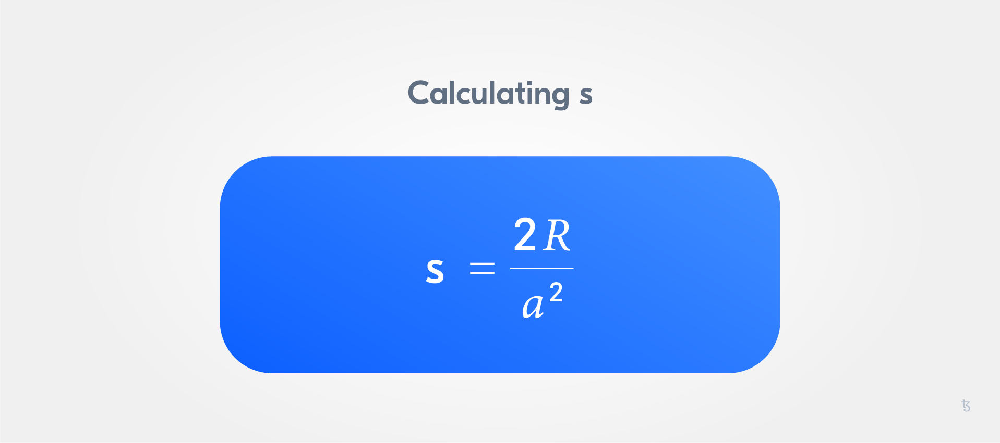
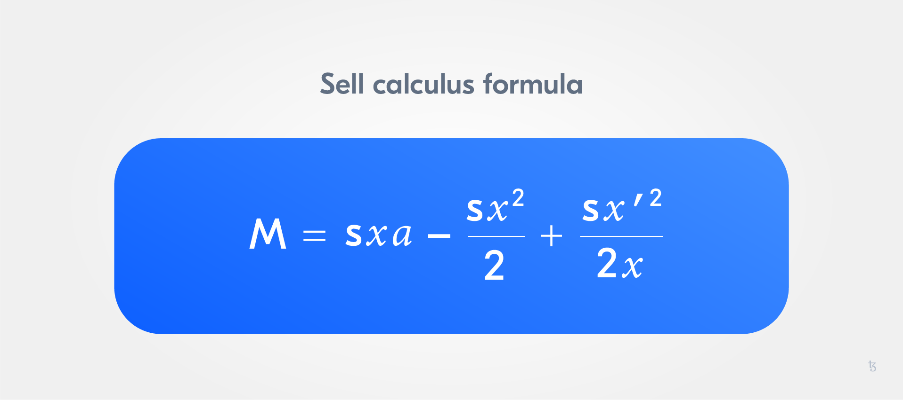

import HighlightBox from "../../src/components/HighlightBox"

import {
  ExpansionPanel,
  ExpansionPanelList,
  ExpansionPanelListItem
} from 'gatsby-theme-apollo-docs';

Now let us talk about the [`sell()` function](https://github.com/C-ORG/whitepaper#sell-calculus).

## The `sell()` function

The `sell()` function determines the sell price after the MFG is reached. `sell` will calculate the amount of tez for the sent number of tokens when a user wants to sell the offering's tokens.

There are not two phases, but only one when it comes to the sell price: the **slopy phase** (post-MFG). Once the MFG is reached, the sell price increases based on how the cash reserve develops.

<HighlightBox type="tip">

If this phase does not sound familiar, take another look at the [introduction section](./what-is-a-rolling-safe), especially _Stages in a Rolling SAFE_.

</HighlightBox>


The sell price is lower than the buy price.

<HighlightBox type="info">

If you are wondering why the sell price is lower than the buy price, make sure to go through the basics in the [Continuous Organizations Whitepaper](https://github.com/C-ORG/whitepaper).

</HighlightBox>

## Calculating the sell price

Compared to the buy price calculation, this time it is a bit more complex because we do not have a linear price function for the sell price. The sell slope will change over time - this function is also called by `buy_slope`:

```python
    # s calculus after each transaction
    def modify_sell_slope(self, send_back):
        sp.if self.data.total_tokens != 0:
           self.data.s = 2 * sp.utils.mutez_to_nat(sp.balance - send_back) / (self.data.total_tokens * self.data.total_tokens)
```

The value of `sp.balance` is the balance of the contract __after we receive the transaction but before we send any tez back to the user__. So the helper function needs to know the amount of tez sent back.

The sell slope depends on the reserve, which is represented by the contract balance:



`a` represents the total amount of tokens issued.

## Burning tokens

Now we can have a look at `burn`:

```python
    @sp.entry_point
    def burn(self, params):
        self.burn_intern(params.amount)
        self.modify_sell_slope()
```

Because burning is a part of the selling process, we will define an internal function to burn tokens:

```python          
    # internal burn function will be called by the entrypoints burn and sell
    def burn_intern(self, amount):
        # check if the address owns tokens
        sp.if self.data.ledger.contains(sp.sender):
            # check if the address owns enough tokens
            sp.if self.data.ledger[sp.sender] >= sp.as_nat(amount):
                # "burn"
                self.data.ledger[sp.sender] = sp.as_nat(self.data.ledger[sp.sender] - sp.as_nat(amount))
                self.data.burned_tokens += sp.as_nat(amount)
```

<ExpansionPanel title="What is understood by burning tokens? ">

When a token is supposed to be removed from circulation, one can "burn" them. Often, burning is done by sending tokens to an unusable wallet address, a so-called burn address. Tokens can then no longer be accessed or assigned to an address. This is the case when working with tez.

Since in the TZMINT web application the issuer mints its own tokens, there is no need for a burn address.

</ExpansionPanel>

In the above code, an important thing to notice is that we do not modify the total number of tokens issued if we burn a token. Thus, the buy price is not affected.

## Entrypoints

It is time to have a look at the `sell` **entrypoint**:

```python
    @sp.entry_point
    def sell(self, params):
        sp.if self.data.phase == 0:
            self.sell_initial(params.amount)
        sp.if self.data.phase == 1:
            self.sell_slope(params.amount)
```

This seems less complex than the buy entrypoint. The reason is that we cannot change the phase by selling:

```python
    def sell_initial(self, amount):
        # check if the address owns tokens
        sp.if self.data.ledger.contains(sp.sender):
        # check if the address owns enough tokens
            sp.if self.data.ledger[sp.sender] >= sp.as_nat(amount):
                # calculate the amount of tez to send
                # see https://github.com/C-ORG/whitepaper#-investments---sell
                pay_amount = sp.local(
                    "pay_amount", 
                    sp.utils.mutez_to_nat(self.data.price) * sp.as_nat(amount)
                )
                # burn the amount of tokens selled
                self.burn_intern(amount)
                # send pay_amount tez to the sender of the transaction
                sp.send(sp.sender, sp.utils.nat_to_mutez(pay_amount.value))
                self.modify_sell_slope(sp.utils.nat_to_mutez(pay_amount.value))
```

In the initial phase, one can sell a token and get 100% of the buy price, which will remain the same until the MFG is reached.

```python
    def sell_slope(self, amount):
        # check if the address owns tokens
        sp.if self.data.ledger.contains(sp.sender):
        # check if the address owns enough tokens
            sp.if self.data.ledger[sp.sender] >= sp.as_nat(amount):
                # calculate the amount of tez to send
                # see https://github.com/C-ORG/whitepaper#-investments---sell
                pay_amount = sp.local(
                    "pay_amount", 
                    sp.as_nat(
                        self.data.total_tokens * sp.as_nat(amount) * self.data.s - 
                        sp.as_nat(amount * amount) * self.data.s / 2 
                        ) + 
                        self.data.s * sp.as_nat(amount) * 
                        self.data.burned_tokens * self.data.burned_tokens /
                        sp.as_nat(2 * (self.data.total_tokens - self.data.burned_tokens) )
                )
                # burn the amount of tokens selled
                self.burn_intern(amount)
                # send pay_amount tez to the sender of the transaction
                sp.send(sp.sender, sp.utils.nat_to_mutez(pay_amount.value))
                self.modify_sell_slope(sp.utils.nat_to_mutez(pay_amount.value))
```

The calculation of `pay_amount` looks a bit messy because it depends on `total_tokens`, `self.data.s`(the sell slope), `params.amount` (the amount of tez sent with the transaction), and `self.data.burned_tokens`:



In the formula, our `pay_amount` represents `M` and `x` is the amount of tez sent with the transaction.

As you can see, the sell slope will increase if tokens are burned but the buy slope is always constant. This means that the entrypoint `burn` if implemented, allows for the organization to increase the sell price.

Anyway, there is another mechanism by which users/investors can gain profits from buying tokens: __closing__.

## The closing phase

<HighlightBox type="tip">

If you want to again take a look at the closing phase, the [introduction section of this chapter](./what-is-a-rolling-safe) includes a section on _Stages in a Rolling SAFE_.

</HighlightBox>


If the [closing phase](https://github.com/C-ORG/whitepaper#closing) is triggered, the contract buys back each token for the price of the last buy price and pays the token owners their part of the exit fee:

```python
    @sp.entry_point
    def close(self):
        # check if MPT is reached
        sp.verify(sp.now - self.data.MPT >= 0)

        # check that the initial phase is over but not closed
        sp.verify(self.data.phase == 1)

        # verify this is called by the org
        sp.verify(sp.sender == self.data.organization)

        # check the correct amount of tez is sent
        closing_sell_price= sp.local(
            "closing_sell_price",
            self.data.b * self.data.total_tokens
            )

        closing_sell_amount= sp.local(
            "closing_sell_amount",
            closing_sell_price.value * sp.as_nat(self.data.total_tokens - self.data.burned_tokens)
            )

        sp.if sp.balance < sp.utils.nat_to_mutez(closing_sell_amount.value):
            sp.failwith("Please send more tez for the closing")

        sp.for account in self.data.ledger.items():
            sp.send(account.key, sp.utils.nat_to_mutez(account.value * closing_sell_price.value))
        
        self.data.phase = 2

```

So, the sum of the payments is the exit fee.

Only the contract owner can call `close`. For the `close` transaction to be successful, the contract owner needs to send the exit fee. Note that the minimum period of time (MPT) must be reached if the organization wants to trigger the closing.
