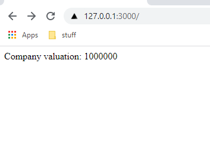

import HighlightBox from "../../src/components/HighlightBox"

import {
  ExpansionPanel,
  ExpansionPanelList,
  ExpansionPanelListItem
} from 'gatsby-theme-apollo-docs';

<!-- TODO: Add description and intro once complete Wir betrachten zunächst die Grundkomponenten unserer Serveranwendung (Next.js) und ihre Benutzung, um anschließend tiefer in die Verbindung mit unserem DataHandler und den verschiedenen Datenflüssen (dataflows) bis zum smart contract einzugehen.-->

## Developing with Next.js

You can create a new Next.js application using the `create-next-app` package by following the steps in the [automatic setup guide](https://nextjs.org/docs/getting-started#automatic-setup), or do a [manual setup](https://nextjs.org/docs/getting-started#manual-setup). After completion, you can start your local server with:

```bash
$ npm run dev
```

Which calls `next dev`, starting the server in development mode (includes live reloading).

## Web application scope

The web application has to serve multiple types of pages and functionalities:

* Serve static pages (website),
* Pages showing general information read from the blockchain,
* User authentication (login),
* Pages showing user-specific information read from the blockchain, and
* Interactions with the user's wallet to create and send transactions to the smart contract.

We illustrate each of these concerns with one example in the following.

## Web application architecture basics

As outlined in the [system architecture section](/rolling-safe-system-architecture), we use [Next.js](https://nextjs.org/) as a server framework for the web application. Next.js is a React framework built on Node.js, which runs your application server, and allows for a very modular and dynamic composition and configuration of our application. It understands but does not enforce, a [MVC](https://developer.mozilla.org/en-US/docs/Glossary/MVC) approach, routing files, data connections, server/client-side rendering, and the use of (React) components in the UI.

<HighlightBox type="tip">

If you have never seen Next.js before, we recommend taking a quick look at the [Next.js introductory overview](https://nextjs.org/learn/foundations/about-nextjs/what-is-nextjs) in the official documentation.

</HighlightBox>

### Pages and basic routing

Serving pages is a [basic feature in Next.js](https://nextjs.org/docs/basic-features/pages), described as:

> In Next.js, a [page](https://reactjs.org/docs/components-and-props.html) is a React component exported from a `.js`, `.jsx`, `.ts`, or `.tsx` file in the pages directory. Each page is associated with a route based on its file name.

The first page we want to create is our homepage, served on `/`. We create a new file in the `pages/` folder, named `index.tsx`.

<HighlightBox type="info">

**Note:** When using the automatic setup to create your application, there might already be a file `index.js`, which you can delete).

</HighlightBox>

Including the following content:

```javascript
export default function Home() {
    return (
        <div className="home">
            Welcome to the TZMINT Platform!
        </div>
    );
}
```

It renders a first starting page:


Due to the automatic routing, this page can be accessed on the server without further configuration both via:

* `/`, and
* `/index`.

You can now add further pages into the `/pages` folder, which is then served under `/{FILENAME}`, excluding the file extension.

### Templating and components

Our TZMINZ web application user interface (UI) should consist of the following components:

* A top navigation bar,
* Main page content, and
* A footer.

We are using the [layout feature of Next.js](https://nextjs.org/docs/basic-features/layouts) to set up templates. We use one single shared layout for all pages, thus we need to create two files:

* `src/components/Layout.tsx`, and
* `pages/_app.js`.

With `src/components/Layout.tsx` we specify our layout. As a minimal start, include:

```javascript
export type LayoutProps = {
    children: any
}

export default function Layout(props: LayoutProps) {
    return (
        <div>
            <div>Navigation</div>
            <main>
                <div>
                    {props.children}
                </div>
            </main>
            <div>Footer</div>
        </div>
    );
}

```

The actual page content is passed as children via the `props` object. The type declaration of `LayoutProps` is just required for Typescript.

Additionally, we need to create another file in our `pages` folder to load this layout: `pages/_app.js`. It instructs Next.js to use a [custom app](https://nextjs.org/docs/advanced-features/custom-app) for the rendering of all pages. This custom application then points to our layout file:

```javascript
import Layout from '../src/components/layout'

export default function MyApp({ Component, pageProps }) {
    return (
      <Layout>
          <Component {...pageProps} />
      </Layout>
    )
}

```

When visiting the index page, you now see:


The layout is imported as a React component. We can create further components (for our header and footer) as well as import and similarly use them:

* For the header include in `src/components/Header.tsx`:

```javascript
export default function Header() {
    return (
        <div>
            NAVIGATION
        </div>
    );
}

```

* For the footer include in `src/components/Footer.tsx`:

```javascript
export default function Footer() {

    return (
        <div>
            FOOTER
        </div>
    )
}
```

Then, adjust the `src/components/Layout.tsx` file to import and use these new components:

```javascript
import Header from "./Header" // highlight-line
import Footer from "./Footer" // highlight-line

export type LayoutProps = {
    children: any
}

export default function Layout(props: LayoutProps) {
    return (
        <div>
            <Header/> // highlight-line
            <main>
                <div>
                    {props.children}
                </div>
            </main>
            <Footer/> // highlight-line
        </div>
    );
}
```

This then results in the following rendering in the browser:


You can create and add further components like this.

<HighlightBox type="tip">

If you want to see an example for passing multiple custom properties to a component, you can take a look at the [CtaCard Component](https://github.com/b9lab/tezos-cso-project/blob/master/src/components/CtaCard.tsx).

</HighlightBox>

<!-- **TODO: NOTE ABOUT DIFFERENCES IN REPO** -->

### Reading data from the blockchain

As described in the [architecture section](/rolling-safe-system-architecture), we use the `DataHandler` as an interface between our platform application and the underlying `chainWrapper` and `contractWrapper`. From the platform point of view, this `DataHandler` is transparently hiding the actual blockchain interaction and simply returns a **promise**, which resolves to the data. For example, we use the following function in the `DataHandler` to fetch the company valuation:

```javascript
async getCompanyValuation(): Promise<CompanyValuationDto> {
        const companyValuation = await chain.companyValuation();

        return {
            valuation: +companyValuation
        };
    }
```

Which then calls `companyValuation()` on the `chainWrapper`. We can call this function directly from our React components. To extend our initial home page sample with this, we first need to import the `DataHandler` using:

```javascript
import DataHandler from "../src/services/DataHandler";
```

Then, we instantiate a new `DataHandler` object and call the `getCompanyValuation` function to fetch data from it:

```javascript
const dataHandler = new DataHandler();
await dataHandler.getCompanyValuation().valuation;
```

However, since this is calling an asynchronous function, we cannot run it within the component constructor. Next.js provides a specific function for this case, which fetches data on the server:

```javascript
export async function getServerSideProps(context) {
  return {
    props: {}
  }
}
```

Integrating this into our page results in the following final code:

```javascript
import DataHandler from "../src/services/DataHandler";

export default function Home(props) {
    return (
        <div className="home">
            Company valuation: {props.companyValuation}
        </div>
    );
}

export async function getServerSideProps(context) {
    const dataHandler = new DataHandler();
    const data = await dataHandler.getCompanyValuation();
  return {
    props: {
        companyValuation: data?.valuation.toString()
    }
  }
}
```

Which renders the following page:



### Server- and client-side data fetching (SSR, SSG, and CSR)

Next.js supports different ways to render your data. So far, you have seen how to use **[server-side rendering (SSR)](https://nextjs.org/docs/basic-features/data-fetching/get-server-side-props)**, which fetches data on the server for each request and then renders the page with it.

Alternatively, Next.js also allows you to use **[static-site generation (SSG)](https://nextjs.org/docs/basic-features/data-fetching/get-static-props)**, which fetches data **during the build time** and then renders it as a static value. To use SSG, you can use the same approach as demonstrated for SSR, but name the function `getStaticProps(context)` instead of `getServerSideProps(context)` - that is it!

Finally, we can also implement **client-side rendering (CSR)**. For this, Next.js recommends using **[SWR](https://swr.vercel.app/docs/with-nextjs)**, which is a React hook library created by the Next.js team exactly for this purpose. Using SWR requires an additional modification: it wants to read data from our server via a REST API sending JSON data. So, we have to create an API endpoint in our Next.js server wrapping our data fetch call and returning a proper HTTP response. We add a new file in `/pages/api/company-valuation.ts` with:

```javascript
import type { NextApiRequest, NextApiResponse } from 'next';
import DataHandler from '../../src/services/DataHandler';
import { CompanyValuationDto } from '../../src/utils/dtos';

/**
 * Get company valuation API
 */
export default async function companyValuationHandler(
  req: NextApiRequest,
  res: NextApiResponse<CompanyValuationDto>
) {
    const { method } = req;

    const dataHandler = new DataHandler();

    return new Promise<void>(resolve => {

        const handleSuccess = (data: CompanyValuationDto) => {
            res.status(200).json(data);
            resolve();
        };

        const handleError = (error: Error) => {
            console.error(error);
            res.status(500).end(`An error has occurred`);
            resolve();
        }

        switch (method) {
            case 'GET':
                dataHandler.getCompanyValuation().then(handleSuccess).catch(handleError);
                break;
            default:
                res.setHeader('Allow', ['GET']);
                res.status(405).end(`Method ${method} Not Allowed`);
                resolve();
        }
    });
}

```

This API is then exposed on `/api/company-valuation`. To integrate this into our page, Next.js supplies a special function `useSWR`. It is **not asynchronous**, so we can call it in the constructor. Our home page with client-side data fetching:

```javascript
import useSWR from "swr";

export default function Home(props) {
    const { data } = useSWR("/api/company-valuation");

    return (
        <div className="home">
            Company valuation: {data?.valuation?.toString()}
        </div>
    );
}
```

Using SWR also allows to combine server-side and client-side rendering: you can use SSR or SSG to pre-render the page content, then update it on the client-side. We are using this for the page displaying the Rolling SAFE parameters within our application. These parameters are configured in the smart contract during deployment. Next.js fetches them during the build and then checks for an update from the client, but does so after the page has been rendered. For this, we first supply the SSG function `getStaticProps`, as done before:

```javascript
export async function getStaticProps() {
    const dataHandler = new DataHandler();
    const initialData = await dataHandler.getRollingSafeParameters().catch(console.error);
    return { props: { initialData } };
}
```

Then, we pass this data as a second parameter to the `useSWR()` function, which wraps all the update magic:

```javascript
export default function CafeDetails(props: CafeDetailsProps) {
    // The following data is fetched at build time and shown as placeholder on the initial render while on the client-side, it will be fetched again and updated
    const { data, error } = useSWR(ROLLING_SAFE_PARAMETERS_API_ENDPOINT, { initialData: props.initialData });

    return (
        // ...
        <div>Termination events: {data.terminationEvents.toString()}</div>
        // ...
    );
}
```

Inside our React component, we directly access `data.terminationEvents` to access data. SWR initially supplies the value received from `getStaticProps()`, and the page is rendered with the data received at build time. It is sent with this to the client, displayed, and then the `ROLLING_SAFE_PARAMETERS_API_ENDPOINT` URL is used to fetch fresh data, which then updates the data on the client side.

<HighlightBox type="info">

Note that this endpoint is still pointing to the server, so the client is loading the actual update data through our server - but updating the page itself on the client.

</HighlightBox>

<!-- ### Authentication and User features -->

<!-- We don't have a CAFE params page anymore and the thing is called Rolling SAFE, please check the example above for correct naming convention and consistency -->

### User wallet interaction

Interacting with the user's wallet is done through the wallet wrapper, [`/src/wallet/wallet.js`](https://github.com/b9lab/tezos-app-project/blob/main/src/wallet/wallet.js), which wraps the Beacon SDK and passes the configuration to initialize it:

<HighlightBoxtyep="info">

The code is very similar to what we have seen in the [Beacon section](./beacon) in the previous chapter:

</HighlightBoxtyep="info">

```
// ...
wallet = new options.SDK(walletOptions),
        forcePermissionRequest = () => {
            return wallet
                .client
                .requestPermissions({
                    "network": {
                        "type": options.network,
                        "rpcUrl": options.url
                    }
                })
                .then(() => {
                    return wallet;
                })
// ...
```

The actual instantiation and configuration of the options happen in the main export file of the project, the file [index.ts](https://github.com/b9lab/tezos-app-project/blob/main/index.ts) in the projects root folder:

```
import { TezosToolkit } from "@taquito/taquito";
import { BeaconWallet } from "@taquito/beacon-wallet";
import { walletWrapper } from "./src/wallet/wallet.js";
import { chainWrapper } from "./src/chain/chain.js";
import { contractWrapper } from "./src/contract/contract.js";
import { configuration } from "./config/configuration.js";

const config = configuration();

let contract: any = null;

if (typeof window !== 'undefined') {
    let wallet = walletWrapper({
        SDK: BeaconWallet,
        network: config.chain,
        name: "TZMINT",
        url: config.provider
    });
    contract = contractWrapper({
        SDK: TezosToolkit,
        wallet,
        contractAddress: config.contractAddress,
        provider: config.provider
    });
}

export const chain = chainWrapper(config);

export { contract };
```

We do configure the `walletWrapper`, but instead of making it available as export like the `chainWrapper` and `contractWrapper`, we pass it directly into the contract wrapper, which makes use of it where needed.

## Behind the `DataHandler`: Interacting with the blockchain

<HighlightBox type="info">

In this section, we stopped digging deeper into the data flow once we reached the `DataHandler` because this is our interface object, hiding the blockchain complexity behind it. To understand the full stack flow as well as the integrations with the other SDKs and frameworks, a further look behind the `DataHandler` into the wrappers is needed.

</HighlightBox>

One can still differentiate between two different types of interactions with the blockchain: **queries** and **transactions**. Let us first take a look at transactions and then continue with queries.

### Transactions

<HighlightBox type="info">

We call the entrypoints like you learned to do in the [Taquito section](./taquito).

</HighlightBox>

In the [contract wrapper](https://github.com/b9lab/tezos-app-project/blob/master/src/contract/contract.js), you can see:

```javascript
    return {

        "buy": (tezAmount) => {
            return confirmDefault((contract) => {
                return contract.methods.buy([["unit"]]).send({"amount": tezAmount});
            });
        },
        "sell": (tokenAmount) => {
            return confirmDefault((contract) => {
                return contract.methods.sell(tokenAmount).send();
            });
        },
        ...
    };
```

`contract` is basically `tezos.wallet.at(contractAddress)`, so transactions are signed by a wallet:

```javascript
        wallet = new options.SDK(walletOptions),
        forcePermissionRequest = () => {
            return wallet
                .client
                .requestPermissions({
                    "network": {
                        "type": options.network,
                        "rpcUrl": options.url
                    }
                })
                .then(() => {
                    return wallet;
                })
                .catch((error) => {
                    throw new Error(error);
                });
        };
```

We use the `BeaconWallet`.

<HighlightBox type="tip">

Please take a look at the [Beacon section](./beacon) if you are not familiar with it.

</HighlightBox>

### Queries

TzKT API is used to fetch information from the Tezos blockchain. You can find the methods the TZMINT web application implements in the [chainWrapper](https://github.com/b9lab/tezos-app-project/blob/master/src/chain/chain.js) code.

<HighlightBox type="tip">

As a refresher, we recommend a recap of the [TzKT API section](./tzkt) in the _Developing Clients_ chapter.

</HighlightBox>

We need different API endpoints to fetch all the information displayed in the [TZMINT web application](https://tzmint.b9lab.com/). It makes sense to have a function for each of the endpoints used:

```javascript
/* eslint-disable max-lines */
    const requestStorage = (level) => {
            const levelRequest = typeof level === "undefined"
                ? ""
                : `?level=${level}`;


            return axios.get(`${apiEndpoint}v1/contracts/${contractAddress}/storage${levelRequest}`)
                .then((response) => {
                    return response.data;
                })
                .catch((error) => {
                    throw new Error(error);
                });
        },
        requestStorageHistory = (limit) => {
            const limitRequest = typeof limit === "undefined"
                ? ""
                : `limit=${limit}`;

            return axios.get(`${apiEndpoint}v1/contracts/${contractAddress}/storage/history?${limitRequest}`)
                .then((response) => {
                    return response.data;
                })
                .catch((error) => {
                    throw new Error(error);
                });
        },
        ...
```

`chainWrapper` uses [Axios](https://github.com/axios/axios) as HTTP client for queries. You can see that some functions have optional parameters, like `level` for the storage we request.

The endpoint to get the storage of a contract is `/contracts/${contractAddress}/storage`. A `level` and `levelRequest` are included because we also want to fetch the storage for a given block height. In addition, we want to be able to fetch the changes in the storage, so there is a `requestStorageHistory` method. For example, the price history is fetched to display on the platform.

Let us check other methods for the endpoints:

```javascript
        transactions = (sender, entrypoint) => {
            const url = `${apiEndpoint}v1/operations/transactions?target=${contractAddress}`,
                senderFilter = typeof sender === "undefined"
                    ? ""
                    : `&sender=${sender}`,

                entryFilter = typeof entrypoint === "undefined"
                    ? ""
                    : `&entrypoint=${entrypoint}`;

            return axios.get(url + senderFilter + entryFilter)
                .then((response) => {
                    return response.data;
                })
                .catch((error) => {
                    throw new Error(error);
                });

        },
```

Above, you again see the use of optional parameters. `transactions` returns a list of transactions sent to the contract address, where `sender` and `entrypoint` can be used to filter for a specific sender address or a specific entrypoint called in transactions.

Fetch balances for various purposes:

```javascript
        balance = (address) => {
            return axios.get(`${apiEndpoint}v1/accounts/${address}/balance_history`)
                .then((response) => {
                    return response.data;
                })
                .catch((error) => {
                    throw new Error(error);
                });
        },
```

And fetch some transaction details, like the tez amount sent by a transaction:

```javascript
        payedAmount = (hash) => {
            return axios.get(`${apiEndpoint}v1/operations/transactions/${hash}`)
                .then((response) => {
                    return response.data;
                })
                .catch((error) => {
                    throw new Error(error);
                });
        }
```

We want to avoid unnecessary queries, so we use a helper function:

```javascript
        cachedData = (cachedStorage, storageFunction, functionToCache) => {
            if (cachedStorage) {
                return functionToCache(cachedStorage);
            }
            return storageFunction().then(functionToCache);
        };
```

The helper function checks if a new query for the data is wanted. It is enough to fetch some values once because we know the contract logic and we do not expect those values to change over time, like various parameters about the reserve or different phases of the offering.

We can make more assumptions about when we expect something to change and further decrease the number of queries at the API endpoint. This logic is implemented in the web application part because we do not want to mix what is separated. The web application part has a database and can store the `storageData`. Therefore, the application decides when to fetch new data. So, in the wrapper, an optional parameter `storageData` is offered. If the application decides to use old data instead of requesting new data, it passes the old data kept in a database:

```javascript
        "mfg": (storageData) => {
            return cachedData(storageData, requestStorage, (data) => {
                return parseInt(data.MFG, 10);
            });
        },
        "sellSlope": (storageData) => {
            return cachedData(storageData, requestStorage, (data) => {
                return parseInt(data.sell_slope, 10);
            });
        },
        ...
        "companyValuation": (storageData) => {
            return cachedData(storageData, requestStorage, (data) => {
                return parseInt(data.company_v, 10);
            });
        },
        "phase": (storageData) => {
            return cachedData(storageData, requestStorage, (data) => {
                return parseInt(data.phase, 10);
            });

        },
```

Here, you see the option for caching in the wrapper even for values that change over time.

We cannot easily fetch the sell and buy price. For the `buyPrice`, we do a calculation for a given number of tokens and return the estimated price. This is also true for the `sellPrice`:

```javascript
        "buyPrice": (storageData, tokens) => {
            return cachedData(storageData, requestStorage, (data) => {
                const firstPart = data.buy_price * data.total_tokens * tokens / 2,
                    secondPart = data.buy_price * tokens * (parseInt(data.total_tokens, 10) + tokens) / 2,
                    tempPrice = Math.ceil((firstPart + secondPart)*10)/10;


                return parseInt(data.phase, 10) === 0
                    ? parseInt(data.price * tokens, 10)
                    : parseInt(tempPrice, 10);
            });
        },

        ...

        "sellPrice": (tokens) => {
            return balance(contractAddress).then((data) => {
                return data.length > 0
                    ? parseInt(data[data.length - 1].balance, 10)
                    : 0;
            })
                .then((recentBalance) => {
                    return requestStorage().then((data) => {
                        if (parseInt(data.phase, 10) === 0) {
                            return data.price * tokens;
                        }
                        const factor = tokens / (2 * data.total_tokens),
                            subtract = 1 - factor;

                        if (data.total_tokens > 0) {
                            return parseInt(2 * recentBalance * tokens / data.total_tokens * subtract, 10);
                        }

                        return 0;
                    });
                });
        },
```

<HighlightBox type="tip">

If you want to understand the calculations, please have a look at the previous sections [Smart Contract Implementation I](./rolling-safe-smart-contract-implementation-part-1) and [Smart Contract Implementation II](./rolling-safe-smart-contract-implementation-part-2).

</HighlightBox>

### Fetching from multiple endpoints

At some point, you might need to fetch data from multiple API endpoints, especially when you need to aggregate related data to get certain information, like in the case of the `bought` function:

```javascript
const bought = () => {
        // first fetch transactions calling buy entrypoint
        return transactions(address, "buy").then((data) => {
            return Promise.all(data.map((transaction) => {
                // go through the calls
                return requestStorage(transaction.level).then((currentState) => {
                    // then request the storage at the moment of this buy call
                    return requestStorage(transaction.level - 1).then((oldState) => {
                        const oldTokens = typeof oldState.ledger[address] === "undefined"
                                ? 0
                                : oldState.ledger[address],
                            currentTokens = typeof currentState.ledger[address] === "undefined"
                                ? 0
                                : currentState.ledger[address];

                        // check the amount of tokens bought
                        transaction.tokens = currentTokens - oldTokens;

                        // check if there was a transaction for the excess sent back
                        return sentBack(address, transaction.hash).then((adjustment) => {
                            transaction.amount -= adjustment;

                            return transaction;
                        });
                    });
                });
            }));
        });
    }
```

This function returns a list of token purchases for a user. We do not keep track of this list in the web application, so we have to generate it from data coming from the blockchain. First, look for transactions calling the buy entrypoint sent by the user. Then request the storage before and after such a call to see the number of tokens added in the ledger for the specific user. In addition, check if excess was sent back to make sure that the correct amount of tez paid for the number of tokens is returned.

<!-- Please check the end of the first sentence of the paragraph above -->
