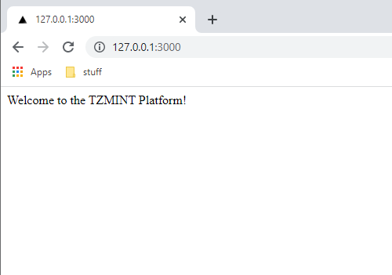
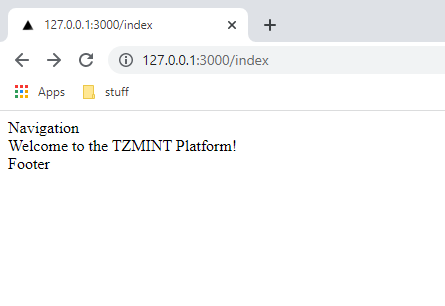
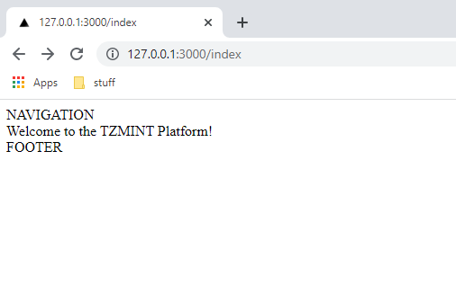

import HighlightBox from "../../src/components/HighlightBox"

import {
  ExpansionPanel,
  ExpansionPanelList,
  ExpansionPanelListItem
} from 'gatsby-theme-apollo-docs';

<!-- TODO: Add description and intro once complete -->

## Developing with Next.js

You can create a new Next.js application using the `create-next-app` package, following the steps in [the Automatic Setup Guide](https://nextjs.org/docs/getting-started#automatic-setup), or do a [Manual Setup](https://nextjs.org/docs/getting-started#manual-setup). After completion, you can start your local server with:

```bash
$ npm run dev
```

which calls `next dev`, starting the server in development mode (includes live reloading).


## Web application scope

* Serve static pages (website)
* Pages showing general information read from the Blockchain
* User authentication (login)
* Pages showing user-specific information read from the Blockchain
* Interactions with the user's wallet to create and send transactions to the smart contract

We cover each of these concerns with one example in the following.


## Platform architecture basics

We use [Next.js](https://nextjs.org/) as base for the web platform. Next.js is a React framework build on nodejs, which runs your application server and allows for a very modular and dynamic composition and configuration of our application. It understands (but does not enforce) an [MVC](https://developer.mozilla.org/en-US/docs/Glossary/MVC) approach, routing files, data connections, server/client side rendering and the use of (react) components in the UI.

<HighlightBox type="tip">

If you have never seen Next.js before, we recommend to take a quick look at the [About Next.js](https://nextjs.org/learn/foundations/about-nextjs/what-is-nextjs) overview in the official documentation.

</HighlightBox>


### Pages and basic routing

Serving pages is a [basic feature in Next.js](https://nextjs.org/docs/basic-features/pages), described as:

> In Next.js, a [page](https://reactjs.org/docs/components-and-props.html) is a React Component exported from a `.js`, `.jsx`, `.ts`, or `.tsx` file in the pages directory. Each page is associated with a route based on its file name.

The first page we want to create is our homepage, served on `/`. We create a new file in the `pages/` folder, named `index.tsx`. (**Note:** When using the Automatic Setup to create your app, there might already be a file `index.js`, which you can delete).

Putting the following content:

```javascript
export default function Home() {
    return (
        <div className="home">
            Welcome to the TZMINT Platform!
        </div>
    );
}
```

Renders a first starting page:



Due to the automatic routing, this page can be accessed both via:

* `/`
* `/index`

on the server without further configuration. You can now add further pages into the `/pages` folder, which will then be served under `/{FILENAME}`, excluding the file extension.

### Templating and Components

Our TZMINZ application User Interface (UI) should consist of the following components:

* Top navigation bar
* Main page content
* Footer

We are using the [Layout feature of Next.js](https://nextjs.org/docs/basic-features/layouts) to set up these Templates. We use one single shared layout for all pages, thus we need to create two files:

`src/components/Layout.tsx` to specify our Layout. As a minimal start, we put:

```javascript
export type LayoutProps = {
    children: any
}

export default function Layout(props: LayoutProps) {
    return (
        <div>
            <div>Navigation</div>
            <main>
                <div>
                    {props.children}
                </div>
            </main>
            <div>Footer</div>
        </div>
    );
}

```

The actual page content is passed as children via the `props` object. The type declaration of `LayoutProps` is just required for Typescript.

Additionally, to load this Layout, we need to create another file in our `pages` folder:

`pages/_app.js`, which instructs Next.js to use a [custom app](https://nextjs.org/docs/advanced-features/custom-app) for the rendering of all pages. This custom app will then point to our Layout file:

```javascript
import Layout from '../src/components/layout'

export default function MyApp({ Component, pageProps }) {
  return (
    <Layout>
      <Component {...pageProps} />
    </Layout>
  )
}

```

When visiting the index page, you will now see:




The Layout is imported as a react component. We can create further components (for our Header and Footer) and import and use them similarly:

`src/components/Header.tsx`

```javascript
export default function Header() {
    return (
        <div>
            NAVIGATION
        </div>
    );
}

```

`src/components/Footer.tsx`

```javascript
export default function Footer() {

    return (
        <div>
            FOOTER
        </div>
    )
}
```

Then, to load and use them, we adjust the `src/components/Layout.tsx` file, importing and using these new components:

```javascript
import Header from "./Header" // highlight-line
import Footer from "./Footer" // highlight-line

export type LayoutProps = {
    children: any
}

export default function Layout(props: LayoutProps) {
    return (
        <div>
            <Header/> // highlight-line
            <main>
                <div>
                    {props.children}
                </div>
            </main>
            <Footer/> // highlight-line
        </div>
    );
}
```

Which then results in this rendering in the browser:



You can create and add further components like this, if you want to see an example for passing multiple custom properties to a component, you can take a look at the [CtaCard Component](https://github.com/b9lab/tezos-cso-project/blob/main/src/components/CtaCard.tsx).


**TODO: NOTE ABOUT DIFFERENCES IN REPO**

### Reading data from the blockchain

As described in the [Architecture section](/rolling-safe-system-architecture), we use an object called `DataHandler` as interface between our platform application and the underlying `chainWrapper` and `contractWrapper`. From the platform point of view, this DataHandler is transparently hiding the actual blockchain interaction and simply returns a Promise which will resolve to the data. For example, to fetch the company valuation, we use the following function in the DataHandler:

```javascript
async getCompanyValuation(): Promise<CompanyValuationDto> {
        const companyValuation = await chain.companyValuation();

        return {
            valuation: +companyValuation
        };
    }
```

which in turn calls `companyValuation()` on the `chainWrapper`. 

**TODO: Explain how basic data fetching would work here**

### Wrapping data fetch into an API

**TODO: Explain data fetch api wrapping**


## Advanced platform features

### Server and Client Side Data Fetching (CSR, SSG and SSR)

Next.js supports different places to actually render your data. On the first level, we can seperate between [Server-side rendering (SSR)](https://nextjs.org/docs/basic-features/data-fetching/get-server-side-props) and [Client-side rendering (CSR)](https://nextjs.org/docs/basic-features/data-fetching/client-side). Both will render on each request.
Additionally, Next.js also supports Static-site generation (SSG), which allows to fetch data on build time.

When using Client-side rendering, it is recommended to use [SWR](https://swr.vercel.app/docs/with-nextjs), which is a React hook library created by the Next.js team exactly for this purpose. Using SWR also allows to combine Server-side and Client-side rendering: You can use SSR or SSG to pre-render the page content, then update it client-side with CSR. This is very useful for our application, because we have some data that should not change, but still be fetched from the blockchain, like the initial settings on our smart contract (Base currency, termination events, initial rserve, etc). To improve SEO and page load speed, we can inline this data statically when building the page (SSG), and then **update** the values Client-side when viewing the page (CSR).

To use SSG, we need to add a function to the page, called `getStaticProps()`, which returns the initial data as props object. We have used this on the `cafe-details.tsx` page:

```javascript
export async function getStaticProps() {
    const dataHandler = new DataHandler();
    const initialData = await dataHandler.getCafeParameters().catch(console.error);
    return { props: { initialData } };
}
```

Then, the main page function can receive this props object and use it. The initial data is then passed as second parameter to the function `useSWR`, which wraps all the update magic.

```javascript
export default function CafeDetails(props: CafeDetailsProps) {
    // The following data is fetched at build time and shown as placeholder on the initial render while on client-side it will be fetched again and updated
    const { data, error } = useSWR(CAFE_PARAMETERS_API_ENDPOINT, { initialData: props.initialData });

    return (
        <div>Termination events: {data.terminationEvents.toString()}</div>
    );
}
```

Inside our React component, we directly access `data.terminationEvents` to access the data. SWR will initially supply the value received from `getStaticProps()`, and the page will be rendered with the data received at build time. It is sent with this to the Client, displayed, and then the `CAFE_PARAMETERS_API_ENDPOINT` url is used to fetch fresh data, which then updates the data Client-side. Note that this endpoint is still pointing to the server, so the Client is loading the actual update data through our server - but updating the page itself on the Client.

### Authentication and User features

**TODO: explain Authjs**

### User Wallet interaction

**TODO: explain User wallet interaction**


## Behind the DataHandler: Interacting with the blockchain

So far, we stopped to dig deeper into the data flow in this Module when reaching the DataHandler, because this is our wrapper object, hiding the blockchain complexity behind it. To understand the full stack flow and the integrations with the other SDKs and frameworks, we need to look further, behind the DataHandler.

We have two different types of interactions with the blockchain: __Queries__ and __transactions__.

As you learned in the previous modules of this course, we need to sign a transaction and send the transaction to a node to perform it. Queries have a different nature. For queries, we are not forced to communicate with a Tezos node directly and we do not need any signatures.


### Transactions

We call the entrypoints like you learned to do so in the [Taquito section](./taquito). You can see in the [contract wrapper](https://github.com/b9lab/tezos-app-project/blob/master/src/contract/contract.js):

```javascript
    return {

        "buy": (tezAmount) => {
            return confirmDefault((contract) => {
                return contract.methods.buy([["unit"]]).send({"amount": tezAmount});
            });
        },
        "sell": (tokenAmount) => {
            return confirmDefault((contract) => {
                return contract.methods.sell(tokenAmount).send();
            });
        },
        ...
    };
```

`contract` is basically `tezos.wallet.at(contractAddress)`, so transactions are signed by a wallet:

```javascript
        wallet = new options.SDK(walletOptions),
        forcePermissionRequest = () => {
            return wallet
                .client
                .requestPermissions({
                    "network": {
                        "type": options.network,
                        "rpcUrl": options.url
                    }
                })
                .then(() => {
                    return wallet;
                })
                .catch((error) => {
                    throw new Error(error);
                });
        };
```

We use `BeaconWallet`.

<HighlightBox type="tip">

Please take a look at the [Beacon section](./beacon) if you are not familiar with it.

</HighlightBox>

### Queries

TzKT API is used to fetch information from the Tezos blockchain. You can find the methods the TZMINT web application implements in the [chainWrapper](https://github.com/b9lab/tezos-app-project/blob/master/src/chain/chain.js) code.

<HighlightBox type="tip">

As a refresher, we recommend a recap of the [TzKT API section](./tzkt) in the _Developing Clients_ chapter.

</HighlightBox>

We need different API endpoints to fetch all the information displayed in the [TZMINT web application](https://tzmint.b9lab.com/). It makes sense to have a function for each of the endpoints we want to use:

```javascript
/* eslint-disable max-lines */
    const requestStorage = (level) => {
            const levelRequest = typeof level === "undefined"
                ? ""
                : `?level=${level}`;


            return axios.get(`${apiEndpoint}v1/contracts/${contractAddress}/storage${levelRequest}`)
                .then((response) => {
                    return response.data;
                })
                .catch((error) => {
                    throw new Error(error);
                });
        },
        requestStorageHistory = (limit) => {
            const limitRequest = typeof limit === "undefined"
                ? ""
                : `limit=${limit}`;

            return axios.get(`${apiEndpoint}v1/contracts/${contractAddress}/storage/history?${limitRequest}`)
                .then((response) => {
                    return response.data;
                })
                .catch((error) => {
                    throw new Error(error);
                });
        },
        ...
```

`chainWrapper` uses [axios](https://github.com/axios/axios) as HTTP client for the queries. You will see that some functions have optional parameters like the `level` for the storage we request. 

The endpoint to get the storage of a contract is `/contracts/${contractAddress}/storage`. We include a `level` and `levelRequest` because we also want to fetch the storage for a given block level. In addition, we want to be able to fetch the changes in the storage, so there is a `requestStorageHistory` method. For an example, we fetch the price history in order to display it on the platform.

Let us check other methods for the endpoints:

```javascript
        transactions = (sender, entrypoint) => {
            const url = `${apiEndpoint}v1/operations/transactions?target=${contractAddress}`,
                senderFilter = typeof sender === "undefined"
                    ? ""
                    : `&sender=${sender}`,

                entryFilter = typeof entrypoint === "undefined"
                    ? ""
                    : `&entrypoint=${entrypoint}`;

            return axios.get(url + senderFilter + entryFilter)
                .then((response) => {
                    return response.data;
                })
                .catch((error) => {
                    throw new Error(error);
                });

        },
```

Above you will again see the use of optional parameters. `transactions` will return a list of transactions sent to the contract address, where `sender` and `entrypoint` can be used to filter for a specific sender address or a specific entrypoint called in the transactions. 

We need to fetch balances for various purposes:

```javascript
        balance = (address) => {
            return axios.get(`${apiEndpoint}v1/accounts/${address}/balance_history`)
                .then((response) => {
                    return response.data;
                })
                .catch((error) => {
                    throw new Error(error);
                });
        },
```

and we will fetch some transaction details, like the tez amount sent by the transaction:

```javascript
        payedAmount = (hash) => {
            return axios.get(`${apiEndpoint}v1/operations/transactions/${hash}`)
                .then((response) => {
                    return response.data;
                })
                .catch((error) => {
                    throw new Error(error);
                });
        }
```

We want to avoid unnecessary queries, so we use a helper function:

```javascript
        cachedData = (cachedStorage, storageFunction, functionToCache) => {
            if (cachedStorage) {
                return functionToCache(cachedStorage);
            }
            return storageFunction().then(functionToCache);
        };
```

which will check if a new query for the data is wanted. It is enough to fetch some values once because we know the contract logic and we do not expect those values be changed over time, like various parameters about the reserve or phases.

We can make more assumptions about when we expect something to be changed and decrease the number of queries at the API endpoint further. This logic is implemented in the web application part, because we do not want to mix what is separated. Web application part has a DB and can store the `storageData` and therefore it will decide when to fetch new data. So in the wrapper we will offer an optional parameter `storageData` and if the application decides to use old data instead of requesting new data, it will pass the old data kept in a DB:

```javascript
        "mfg": (storageData) => {
            return cachedData(storageData, requestStorage, (data) => {
                return parseInt(data.MFG, 10);
            });
        },
        "sellSlope": (storageData) => {
            return cachedData(storageData, requestStorage, (data) => {
                return parseInt(data.sell_slope, 10);
            });
        },
        ...
        "companyValuation": (storageData) => {
            return cachedData(storageData, requestStorage, (data) => {
                return parseInt(data.company_v, 10);
            });
        },
        "phase": (storageData) => {
            return cachedData(storageData, requestStorage, (data) => {
                return parseInt(data.phase, 10);
            });

        },
```

so you will see the option for caching in the wrapper even for those values which will change over time. 

We cannot easily fetch the sell and buy price. For the `buyPrice`, we do a calculation for a given number of tokens and return the estimated price. This is also true for the `sellPrice`:

```javascript
        "buyPrice": (storageData, tokens) => {
            return cachedData(storageData, requestStorage, (data) => {
                const firstPart = data.buy_price * data.total_tokens * tokens / 2,
                    secondPart = data.buy_price * tokens * (parseInt(data.total_tokens, 10) + tokens) / 2,
                    tempPrice = Math.ceil((firstPart + secondPart)*10)/10;


                return parseInt(data.phase, 10) === 0
                    ? parseInt(data.price * tokens, 10)
                    : parseInt(tempPrice, 10);
            });
        },

        ...

        "sellPrice": (tokens) => {
            return balance(contractAddress).then((data) => {
                return data.length > 0
                    ? parseInt(data[data.length - 1].balance, 10)
                    : 0;
            })
                .then((recentBalance) => {
                    return requestStorage().then((data) => {
                        if (parseInt(data.phase, 10) === 0) {
                            return data.price * tokens;
                        }
                        const factor = tokens / (2 * data.total_tokens),
                            subtract = 1 - factor;

                        if (data.total_tokens > 0) {
                            return parseInt(2 * recentBalance * tokens / data.total_tokens * subtract, 10);
                        }

                        return 0;
                    });
                });
        },
```

<HighlightBox type="tip">

If you want to understand the calculations, please have a look at the previous sections [Smart Contract Implementation I](./rolling-safe-smart-contract-implementation-part-1) and [Smart Contract Implementation II](./rolling-safe-smart-contract-implementation-part-2).

</HighlightBox>


### Fetching from multiple endpoints

In your own project, you will also face the moment when you will need to fetch multiple API endpoints to get certain information. Like in the case of the `bought` function:

```javascript
const bought = () => {
        // first fetch transactions calling buy entrypoint
        return transactions(address, "buy").then((data) => {
            return Promise.all(data.map((transaction) => {
                // go through the calls
                return requestStorage(transaction.level).then((currentState) => {
                    // then request the storage at the moment of this buy call
                    return requestStorage(transaction.level - 1).then((oldState) => {
                        const oldTokens = typeof oldState.ledger[address] === "undefined"
                                ? 0
                                : oldState.ledger[address],
                            currentTokens = typeof currentState.ledger[address] === "undefined"
                                ? 0
                                : currentState.ledger[address];

                        // check the amount of tokens bought
                        transaction.tokens = currentTokens - oldTokens;

                        // check if there was a transaction for the excess sent back
                        return sentBack(address, transaction.hash).then((adjustment) => {
                            transaction.amount -= adjustment;

                            return transaction;
                        });
                    });
                });
            }));
        });
    }
```

This function will return a list of token purchases for a user. We do not keep track of this list in the web application, so we have to generate it from the blockchain. First we look for transactions calling the buy entrypoint sent by the user. Then we request the storage before and after such a call to see the amount of tokens added in the ledger for the user. In addition we check if an excess was sent back because we want to return the correct amount of tez payed for the amount of tokens.
