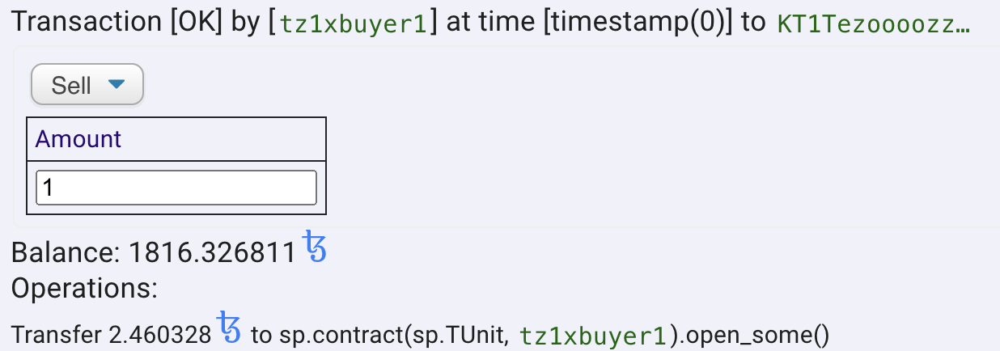

import HighlightBox from "../../src/components/HighlightBox"

import {
  ExpansionPanel,
  ExpansionPanelList,
  ExpansionPanelListItem
} from 'gatsby-theme-apollo-docs';

In this section, we will take a closer look at testing, more specifically:

* testing with the SmartPy IDE, and
* unit tests for the wrapper.

<!-- Please expand the introduction. -->

## SmartPy testing in the IDE

We test our platform on different levels with different tools. 

Let us use the SmartPy IDE for testing. First, we need to **define our scenario**:

```python
@sp.add_test(name= "Initialization")
def initialization():
    
    # dummy addresses
    organization = sp.address("tz1hRTppkUow3wQNcj9nZ9s5snwc6sGC8QHh")
    buyer1 = sp.address("tz1xbuyer1")
    buyer2 = sp.address("tz1xbuyer2")

    contract= PEQ(
        organization = organization, 
        b = 2000, 
        s = 1000, 
        initial_price = sp.tez(1), 
        MFG = sp.tez(1000), 
        preminted = 0,
        MPT = 1, # minimal period of time in years
        I = 90,
        D = 80, 
        company_valuation = 1000000,
        total_allocation = 4000,
        stake_allocation = 500,
        termination_events = ["Sale", "Bankruptcy"],
        govRights = "None",
        company_name = "TZMINT Demo"
        )

    scenario = sp.test_scenario()
    scenario += contract
```

The test starts with the initialization of the `contract`. Most of the initial parameters are arbitrary.

Now we can do some **testing for `buy`**:

```python
    # buy some tokens till reaching MFG check the price is fix
    scenario += contract.buy().run(sender = buyer1, amount = sp.mutez(500001000))
    
    # try to sell some before phase 1
    scenario += contract.sell(amount=1).run(sender = buyer1, valid=False)
```

Remember that we expect the `sell` call to fail before the MFG phase is over.

Why not do a few more **`buy` calls**:

```python
    scenario += contract.buy().run(sender = buyer2, amount = sp.mutez(200003000))
    scenario += contract.buy().run(sender = buyer1, amount = sp.tez(300))
    scenario.verify(contract.data.price == sp.tez(1))
```

In addition, we check that the **price does not change** in the MFG phase - This will be different after the MFG is reached:

```python
    # now MFG is reached, buy more and see price increasing
    scenario += contract.buy().run(sender = buyer1, amount = sp.tez(50))
    scenario += contract.buy().run(sender = buyer2, amount = sp.tez(400))
    scenario += contract.buy().run(sender = buyer1, amount = sp.tez(100))
    scenario.verify(contract.data.price > sp.tez(1))
```

We expect the price to increase after some `buy` calls took place.

Why not also **sell some tokens**:

```python
    scenario += contract.buy().run(sender = buyer1, amount = sp.mutez(51245389))
    scenario += contract.buy().run(sender = buyer1, amount = sp.tez(100))

    # now sell some tokens
    scenario += contract.sell(amount=100).run(sender = buyer1)

```

As you know, SmartPy provides detailed information on the transactions. So, we can make a few more calls to **observe the price changing over time**:

```python
    # and see how the price changes if you buy again
    scenario += contract.buy().run(sender = buyer1, amount = sp.tez(150))
    scenario += contract.buy().run(sender = buyer1, amount = sp.tez(150))
    scenario += contract.buy().run(sender = buyer1, amount = sp.tez(150))
    scenario += contract.buy().run(sender = buyer1, amount = sp.tez(50))
```

You can also check the **price of a token** with the output of:

```python
    # Check price for selling 1 token
    scenario += contract.sell(amount=1).run(sender = buyer1)
```

in the right panel of the IDE:



As you can see, the seller (i.e. previous buyer) receives 2.460328 tez for one token.

The last thing to test is the **closing** and the permissions for calling it:

```python
    # Check closing before MPT
    scenario += contract.close().run(sender = organization, valid=False, amount = sp.tez(2400), now= sp.timestamp_from_utc_now().add_days(360))
    # Check closing with wrong account
    scenario += contract.close().run(sender = buyer1, valid=False, now= sp.timestamp_from_utc_now().add_days(365))
    # Check closing with too less tez
    scenario += contract.close().run(sender = organization, valid=False, amount = sp.tez(300), now= sp.timestamp_from_utc_now().add_days(365))
    # Check closing with correct amount of tez
    scenario += contract.close().run(sender = organization, amount = sp.tez(2400), now= sp.timestamp_from_utc_now().add_days(365))
```

## Unit tests for the wrapper

We use [Chai](https://www.chaijs.com/) for unit tests. There are different unit tests for each wrapper.

The `walletWrapper` is very small, so there is not much to test besides `callCount`s of the inner functions.

```javascript
        it("should call only buy in the contract if buy is called", async function() {
            expect(contract).to.have.property("buy");
            const result = await contract.buy(getRandomInt(10));

            expect(buy.callCount).to.equal(1);
            expect(sell.callCount).to.equal(0);
        });
```
This applies also to the unit tests for the `contractWrapper`.

The `chainWrapper` is more complex. We want to make sure it offers the functions the `DataHandler` needs, so we use `to.have.property` to make sure:

```javascript
    ...
            expect(storage).to.have.property("I");
            expect(storage).to.have.property("D");
            expect(storage).to.have.property("b");
            expect(storage).to.have.property("s");
    ...
```

In addition, we can to pass the real network configuration and test the return types:

```javascript
    ...
        it("should return the d", async function() {
            const blockchain = chainWrapper(config),
                administrator = await blockchain.d();

            expect(administrator).to.be.a("number");
        });

        it("should return the unlockingDate", async function() {
            const blockchain = chainWrapper(config),
                administrator = await blockchain.unlockingDate();

            expect(administrator).to.be.a("string");
        });
    ...
```

Integration tests for the `walletWrapper` and the `contractWrapper` require a different appraoch because of the browser extensions needed to use a wallet.
