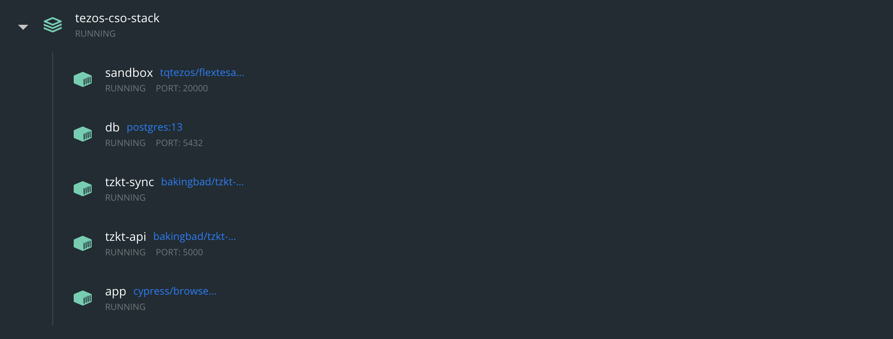

## Test network

We use [Docker Compose] to create a network composed by:

- three TzKT container
- a container with the Flextesa sandbox
- a container for the TZMINT platform

## Flextesa Sandbox

We use the [Flextesa image](https://hub.docker.com/r/tqtezos/flextesa/tags?page=1&ordering=last_updated) to create a sandbox environment. After the sandbox starts and the node responses, the bootstrap process starts:

- the Tezos Client will be configured,
- Alice and Bob's secret keys will be imported,
- the contract will be deployed and the address will be aviable,
- another test account will be created and funded which will be used to sign `buy` and `sell` transactions.

## TzKT

A TzKT indexer(tzkt-sync) will be configured to extract data from the node in the sandbox.  In addition a TzKT API container will expose data to the platform.

## Database

The database container uses PostgreSQL to store the fetched data. It contains a database for the platform and a database for the TzKT indexer.

## Browser Interaction

If you visit and test the TZMINT platform, you will see that a wallet popup will apper for confirmation each time if you want to sign and send a transaction. For automation, we use [Cypress.io](https://github.com/cypress-io/cypress) to visit and test the site and [Puppeteer](https://github.com/puppeteer/puppeteer) to interact with the wallet extensions.

The Puppeteer switches between wallet popup and Cypress windows in order to sequentially interact with the site and the wallet. This allows us to perform actions like submitting a transaction or confirming an address.

At the beginning of a test Cypress opens a Chrome instance loading a previously downloaded version of the wallet extension. When the test requires to interact with the wallet, it will import the account via mnemonic and configure the settings for the custom created network.

The TZMINT platform container(app) pulls the Cypress browser image and loads the platform volume.

Once the sandbox is bootstrapped it does a fresh install of the dependencies, then it prepares the environment used during the tests:

- reads contract address from a helper file written by the sandbox container after the contract deployment
- defines test account mnemonic and address
- configures the API endpoint and the RPC node endpoint

Then the unit and the end-to-end tests will be executed.
