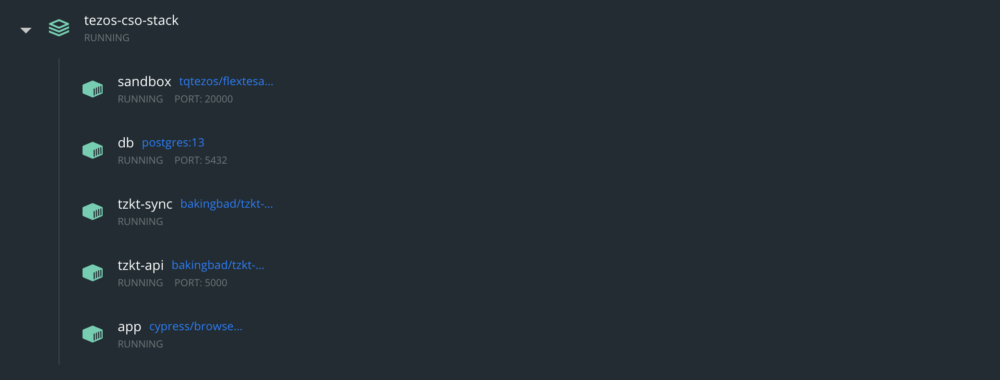
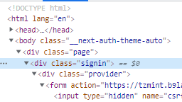
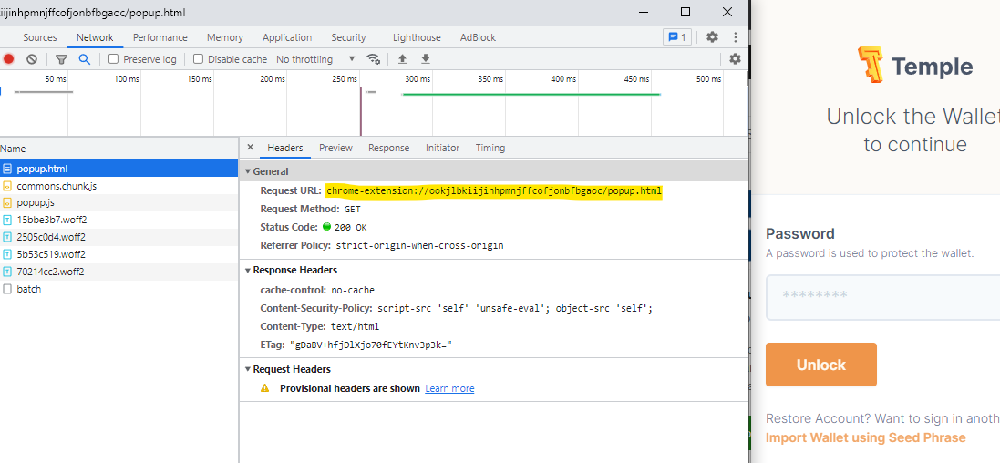

import HighlightBox from "../../src/components/HighlightBox"

import {
  ExpansionPanel,
  ExpansionPanelList,
  ExpansionPanelListItem
} from 'gatsby-theme-apollo-docs';

We also set up an end-to-end test to ensure the correct functioning of the [TZMINT web application](https://tzmint.b9lab.com/). Let us dive into some details!

## Test scope

In our end-to-end test, we want to go through the whole stack of our platform, from the user click on a button, down to the query/invocation of the smart contract, and back up to displaying the results to the user. This means that in addition to our Next.js application and its dependencies (database), we also need:

* A browser test framework, which can simulate the user and verify the results,
* Our Tezos node, indexer, and indexer API endpoint,
* A setup script to deploy our smart contract,
* A way to set up and interact with the user wallet, and
* An orchestration to manage the configuration and start of our tests.

The tests should then in general cover the whole flow of visiting the web application with the browser, logging in, and creating and sending transactions to change the contract state. Additionally, we also want to verify the correct behavior of the smart contract and the web application by reading the state after such changes.

So for example, we want to be able to write a test that creates a new user, buys 10 TZM tokens, and then confirms that these 10 TZM tokens are correctly shown in the user's account and transaction list.

## Tools and components

A quick overview of the tools we are using:

* **[Flextesa](https://tezos.gitlab.io/flextesa/):** As base environment, which allows us to run a Tezos sandbox with [Docker](https://www.docker.com/);
* **[Docker Compose](https://docs.docker.com/compose/):** To orchestrate the containers;
* **[Cypress](https://www.cypress.io/):** As javascript end-to-end test framework;
* **[TzKT](https://github.com/baking-bad/tzkt):** Indexer with API.

Furthermore, we use various bash scripts to prepare the test environment. Following up, we will take a look at the features of these tools.

### Flextesa

The [Flextesa](https://tezos.gitlab.io/flextesa/) library provides us a Docker image, which runs a Tezos sandbox network that is highly customizable: you can run multiple nodes, bakers, accusers, and endorsers within the network, and create various scenarios to thoroughly test the Tezos blockchain and its behavior. This sandbox is also used in the continuous integration (CI) tests of [Tezos](https://gitlab.com/tezos/tezos) itself.

<HighlightBox type="tip">

You can find a few example configurations and further information on using Flextesa in the [Flextesa developer documentation](https://tezos.gitlab.io/developer/flextesa.html#examples).

</HighlightBox>

### Docker Compose

[Docker Compose](https://docs.docker.com/compose/) is a tool that allows you to run and manage multiple containers as a stack. Our tools and components are running in individual Docker containers, which are started by Docker Compose. It also helps configure the virtual network, which allows the containers to communicate with each other. The configuration for such a stack is stored in a _Docker Compose_ file, usually but not always named `docker-compose.yml`.

<HighlightBox type="tip">

You can follow the [Docker Compose documentation](https://docs.docker.com/compose/) for a quick overview and introduction to Docker Compose.

</HighlightBox>

### Cypress

The Cypress framework combines browser automation tooling (similar to [Selenium](https://www.selenium.dev/)), a test framework (like [Mocha](https://mochajs.org/)), and additional helpers for assertions and mocking (like [Chai](https://www.chaijs.com/) and [Sinon](https://sinonjs.org/)), all in one package.

<HighlightBox type="tip">

The [official getting started guide](https://docs.cypress.io/guides/getting-started/installing-cypress) offers a good introduction to the use of Cypress.

</HighlightBox>

### TzKT

To run our indexer with an API, we need **two separate Docker images** provided by [Baking Bad](https://baking-bad.org/docs/):

* [tzkt-sync](https://hub.docker.com/r/bakingbad/tzkt-sync), which runs the indexing service, and
* [tzkt-api](https://hub.docker.com/r/bakingbad/tzkt-api), which connects to the sync container and exposes the REST API.

<HighlightBox type="tip">

Feeling unsure about the TzKT indexer? Take another look at the [TzKT section](./tzkt) to begin your TzKT journey.

</HighlightBox>

## Test stack

Overall, our stack will run the following containers:

* A container with the Flextesa sandbox,
* Two TzKT containers,
* A container for the TZMINT web application running within Cypress, and
* A PostgreSQL database for both the web application and the indexer.



The configuration for the stack and the individual containers can be found in the `/docker` folder of the [project repository](https://github.com/b9lab/tezos-cso-project/tree/master/docker).

### Flextesa sandbox container

For the Flextesa sandbox, we do not need a complicated configuration with multiple nodes or endorsers, just a basic setup to be able to process transactions and advance the blockchain. However, we need to perform a bit of bootstrapping:

* Setup the default Alice and Bob accounts with known secret keys;
* Deploy the smart contract;
* Create and fund another test account, which is used to sign `buy` and `sell` transactions within the tests.

We wrapped these steps in a bootstrap script, found in `/docker/scripts/sandbox/bootstrap-sandbox.sh`:

```bash
#!/bin/bash

set -x

source /opt/scripts/prepare-env.sh

echo "Bootstrap: Waiting for port 20000 to become reachable"
timeout 30 sh -c 'while ! curl -s localhost:20000; do sleep 1; done'

if [ $? -eq 0 ]
then
  echo "Bootstrap: Sandbox ready, port 20000 available"
else
  echo "Bootstrap: Sandbox bootstrap failed($?), port 20000 not reachable"
  exit 1
fi

echo "Bootstrap: Sandbox bootstrap (1/2) - setup accounts"
export TEZOS_CLIENT_UNSAFE_DISABLE_DISCLAIMER=yes
tezos-client --endpoint http://localhost:20000 bootstrapped
tezos-client --endpoint http://localhost:20000 config update
tezos-client import secret key alice unencrypted:edsk3QoqBuvdamxouPhin7swCvkQNgq4jP5KZPbwWNnwdZpSpJiEbq --force
tezos-client import secret key bob unencrypted:edsk3RFfvaFaxbHx8BMtEW1rKQcPtDML3LXjNqMNLCzC3wLC1bWbAt --force
sleep 5

echo "Bootstrap: Sandbox bootstrap (2/2) - deploy contract"
cd opt/contract
CONTRACT_ADDRESS=`sh ./deployment.sh | egrep -m1 -o 'KT.{34}\b'`

cat > /opt/shared/contract-address.txt <<EOF 
$CONTRACT_ADDRESS
EOF

tezos-client transfer 10000 from bob to $TEST_ACCOUNT_ADDRESS --burn-cap 0.06425

cat <<EOF >/opt/sandbox-ready
EOF

echo "Bootstrap: Completed"
```

We use the [timeout command](https://linux.die.net/man/1/timeout) together with a loop that uses curl to continuously query localhost on port 20000 - waiting for the Flextesa sandbox startup to complete:

```bash
timeout 30 sh -c 'while ! curl -s localhost:20000; do sleep 1; done'
```

Afterward, we use the Tezos client to bootstrap the node and connect the client to it, with:

```bash
tezos-client --endpoint http://localhost:20000 bootstrapped
tezos-client --endpoint http://localhost:20000 config update
```

To deploy the contract, we need to set up Alice's and Bob's accounts, which allows us to use the [existing deployment script](https://github.com/b9lab/tezos-app-project/blob/main/src/contract/deployment.sh) from the sub-repository. We _grep_ the contract address from the output of the deployment process, storing it in a separate text file, `/opt/shared/contract-address.txt`. The folder `/opt/shared/` is shared between the Flextesa and the Cypress containers.

Finally, once everything is complete, we create an empty file in `/opt/sandbox-ready` to signal the bootstrap process is complete. This will later be used by the process step to wait for the completion of the bootstrap process.

### TzKT container

The indexer service, `tzkt-sync`, needs to be configured to read the data from our sandbox node, instead of the public node. This is done by adjusting the `/app/appsettings.json` file within the container. The [default config](https://github.com/baking-bad/tzkt/blob/master/Tzkt.Sync/appsettings.json#L7) contains:

```json
"TezosNode": {
    "Endpoint": "https://mainnet-tezos.giganode.io/",
    "Timeout": 60
}
```

Which we need to adjust to point to the sandbox container on port 20000.

On the API service, `tzkt-api`, we have to configure the port we want to expose the API on by setting an environment variable:

```
TZKT_API_KESTREL__ENDPOINTS__HTTP__URL=http://0.0.0.0:5000
```

### Cypress container

The [Cypress](https://cypress.io/?utm_source=API&utm_medium=marketingautomation&utm_campaign=gocypress) container needs to run our application to perform the tests. We use a specific cypress image, `cypress/browsers:node12.14.1-chrome85-ff81`, which includes a headless Chrome browser with a fixed Chrome version.

The first step within the container is to install all dependencies and build our source. Then we need to configure and start the application, followed by running the test suite. We use the [npm ci](https://docs.npmjs.com/cli/v8/commands/npm-ci) command, which is similar to running `npm install` but usually faster and specifically meant to run in automated environments - it will always perform a fresh dependency installation by fetching the packages with the version stored in the `package-lock.json` file. Finally, we can start the test suite with `npm test`.

These steps are wrapped into the file `/docker/scripts/cypress/run-tests.sh` - [view in repository](https://github.com/b9lab/tezos-cso-project/blob/master/docker/scripts/cypress/run-tests.sh)). It also configures the environment variables needed for the application itself and loads the blockchain account into the wallet (i.e. address and mnemonic). We read the deployed contract address from the shared file at `/opt/shared/contract-address.txt` into an environment variable with:

```bash
export NEXT_PUBLIC_CONTRACT_ADDRESS=`cat /opt/shared/contract-address.txt`
```

Additionally, we configure the node and TzKT API's URLs, setting the `NEXT_PUBLIC_NODE_PROVIDER` and `NEXT_PUBLIC_INDEXER_API_ENDPOINT` environment variables accordingly.

### Database container

The database container uses [PostgreSQL](https://www.postgresql.org/). It contains a database for the web application and a database for the TzKT indexer. We use an official [standard Postgres image](https://hub.docker.com/_/postgres).

## Cypress test implementation

Cypress tests are written in JavaScript files, which can contain one or multiple test scenarios. The syntax and use are very similar to other testing frameworks.

Let us take a lookt at a sample test from the [cypress getting started guide](https://docs.cypress.io/guides/getting-started/writing-your-first-test#Step-4-Make-an-assertion):

```javascript
describe('My First Test', () => {
  it('clicking "type" navigates to a new url', () => {
    cy.visit('https://example.cypress.io')

    cy.contains('type').click()

    // Should be on a new URL which includes '/commands/actions'
    cy.url().should('include', '/commands/actions')
  })
})
```

This creates a test group _My First Test_, with a single test _clicking "type" navigates to a new URL_. When this test runs, it will:

* Navigate to `https://example.cypress.io`;
* Search for an element containing the string `type` and click on this element;
* Check (i.e. assert) that the browser URL, after navigation, includes `/commands/actions`.
 
<HighlightBox type="info">

`describe`, `it`, and `should` might look familiar to you - these are not provided by Cypress itself but functions from the included testing libraries [Mocha](https://mochajs.org/) and [Chai](http://www.chaijs.com/).

</HighlightBox>

### Page tests

Our tests are located in the folder `/cypress/integration/`. Here you can find the following files:

```
cypress/integration/
├─ 00-wallet.spec.js                Browser wallet setup
├─ 01-protected_pages.spec.js       Page access and profile test
├─ 02-signin.spec.js                Signin via mail test
├─ 03-price.spec.js                 Price data (queries) test
└─ 00-transaction.spec.js           Transaction test (buy and sell)
```

Let us take a look at an excerpt from the `01-protected_pages.spec.js` test to understand how we can interact with our application in a test.

**Protected pages** are pages that require the user to be logged in, e.g. the `/profile` page that is displayed after user login. To identify whether the login form is shown, we can look into the Document Object Model (DOM) of our site searching for the element displaying the login form. Looking at the DOM with our browser inspector, we can see that we have wrapped the login form into a class called `.signin`, which is a child class of the `.page` container:



We can get this element with `cy.get('.page .signin')`. Additionally, we should use `should('be.visible')` to make sure the element is not hidden. We wrap this in a little helper function `isLoginPage()`:

```javascript
const isLoginPage = () => {
    cy.get('.page .signin').should('be.visible');
}
```

We can call this from within any test, and the test will throw if the page signing is not visible.

Now, to complete the actual test, we instruct Cypress to visit the `/profile` page and check for it to open the login:

```javascript
describe('Accessing protected pages without login', () => {

    it('Visiting the profile page I should be redirected to login page', () => {
        cy.visit('/profile');
        isLoginPage();
    })
})
```

<!-- TODO: Explain the mocked login test -->

## Browser wallet interaction

If you visit and test the [TZMINT web application](https://tzmint.b9lab.com/), you can see that a wallet pop-up appears asking for confirmation each time you want to sign and send a transaction. This pop-up is triggered by the Beacon SDK interacting with the browser's wallet, which is installed as a browser extension. Interacting with this pop-up is necessary to confirm each transaction a user wants to send. Furthermore, before we can interact with the wallet pop-up, we need to set up our account and allow the TZMINT application to access our wallet. Basically, we need to automate the steps shown in the [get started section](/get-started).

Unfortunately, this is not a simple task due to a few limitations: the plug-in needs to be installed into the browser used by Cypress and then configured. Chrome extensions are implemented as kind of small JavaScript web applications, which are exposed inside Chrome via a qualified URL like `chrome-extension://ookjlbkiijinhpmnjffcofjonbfbgaoc/popup.html`. You can open an extension pop-up, then press the shortcut to open the browser inspector and inspect the elements and network traffic of an extension, which reveals the URL the extension is being served from.



A problem remains: these URLs are internal Chrome URLs and not valid HTTP(s) URLs, so **Cypress cannot interact with** them. Therefore, we somehow need to wrap the extension interaction to trigger it from Cypress.

Further complicating things is the fact that Cypress runs a test in one browser window/tab at a time - and only one! It is part of the [main limitations](https://docs.cypress.io/guides/references/trade-offs#Permanent-trade-offs-1) of Cypress. You cannot access another tab or window while running your test.

Last but not least, configuring the wallet itself also has a few requirements: we only have the account address and the mnemonic to import the account into the wallet - we need a wallet that allows us to easily import the account with just these two pieces of information. Then, we need to configure it to use a custom RPC endpoint to make the wallet work with our test network. We chose the [Spire wallet](https://github.com/airgap-it/spire) for our tests.

<HighlightBox type="tip">

If you need to write a test for a browser extension, and you are not familiar with the Chrome extension architecture, we recommend diving into how they are built and work by looking at the [Chrome extension developer documentation](https://developer.chrome.com/docs/extensions/mv3/) and begin testing with your sample extension before implementing the tests for the real extension.

</HighlightBox>

### Install the extension

To install the extension, we need to supply and load it as an unpacked extension package, as we would do when debugging our extension code - shown in the Chrome extension [getting started](https://developer.chrome.com/docs/extensions/mv3/getstarted/#unpacked) guide. We also do not want our extension to update, so we have included the unpacked extension in our source, you can find it at `/cypress/plugins/extensions/gpfndedineagiepkpinficbcbbgjoenn/`. You can unpack an extension by downloading it as a ZIP package from the [Chrome Web Store](https://chrome.google.com/webstore) to then unpack it.

Now the most complex part: loading and accessing the browser extension.

<HighlightBox type="info">

First, a note before outlining the details: there is a package that can help with this task, the [Cypress-browser-extension-plug-in](https://github.com/ejoubaud/cypress-browser-extension-plugin). The last update is four years old and we had some problems using it with Spire, thus, resorting to a custom approach. However, there is a lot of value that can be gained from taking a look at this repository to see how one can interact with extensions.

</HighlightBox>

We cannot overcome the Cypress limitation of only being able to handle one browser window at a time, but we can try to do it on our own. We can use the [Puppeteer](https://github.com/puppeteer/puppeteer) library, a high-level API wrapper to control and automate Chrome to manually interact with Chrome. Usually, we would not want to use Puppeteer as we have Cypress, which allows us to interact with the browser on an even higher level. But in this specific case, implementing the wallet wrapper for our Cypress tests with Puppeteer is the needed trick.

We can then load this wrapper as a [Cypress plug-in](https://docs.cypress.io/guides/tooling/plugins-guide#Use-Cases). Cypress plug-ins allow you to load your code and tap into the node process running outside of the browser - exactly what we need.

Please, do not get confused with the naming: we create a Cypress plug-in, which will load its own Chrome window with Puppeteer, and install and configure the Spire browser extension within the Chrome window loaded by our plug-in. You can find the Cypress plug-in code in `/cypress/plugins/index.js`. Two important steps are included in this file:

1. **Install the extension on browser launch** by passing the path to the extension code as a browser launch option:

```javascript
on('before:browser:launch', (browser, launchOptions) => {
    launchOptions.extensions.push(__dirname + '/extensions/gpfndedineagiepkpinficbcbbgjoenn')
    if (browser.name === 'chrome') {
      launchOptions.args.push('--disable-background-timer-throttling');
      launchOptions.args.push('--disable-backgrounding-occluded-windows');
      launchOptions.args.push('--disable-renderer-backgrounding');

      const hostArg = launchOptions.args.find(arg => arg.startsWith('--remote-debugging-address'));
      const host = hostArg.split('=')[1];
      const rdpArgument = launchOptions.args.find(arg => arg.startsWith('--remote-debugging-port'));
      const port = parseInt(rdpArgument.split('=')[1]);
      process.env.REMOTE_DEBUGGING_URL = `http://${host}:${port}`;
    }

    return launchOptions
  })
```

Hooking into the `before:browser:launch` event, we add the extension by pushing it into the `launchOptions.extensions` list. Then, we use Chrome's debugging features to get an address and later on a port to hook in by reading `--remote-debugging-address` and `--remote-debugging-port` from the launch options.

2. **Provide an interface for Cypress** by exposing tasks, which can then be called from our Cypress tests. This is part of the Cypress plug-in architecture; you can expose tasks that can then be called from within the Cypress tests:

```javascript
on('task', {
    getUserEmail() {
      return emailAccount.email
    },
    getLastEmail() {
      return emailAccount.getLastEmail();
    },
    setupSpire: async () => {
      const config = {
        accountMnemonic: process.env.TEST_ACCOUNT_MNEMONIC,
        customRpcUrl: process.env.NEXT_PUBLIC_NODE_PROVIDER,
      }
      return await spireHelper.initialSetup(config);
    }
[...]
```

### Configure and interact with the extension

We use **two additional helpers** for the extension interaction, located in `/cypress/helpers`:

* **`puppeteer.js`:** Implements helper functions to switch between the main Cypress window and our extension window, as well as basic interaction functions to click on buttons, find elements, and set input values in the extension window;
* **`spire.js`:** Uses the `puppeteer.js` helper functions wrapping them into higher functions like `_changeNetwork(customRpcUrl)`.

In the spire helper, we use the following function to import our account:

```javascript
async _importAccount(mnemonic) {
    // navigate to local secret page
    await this.puppeteerHelper.waitAndClick('body > app-root > ion-app > ion-split-pane > ion-menu > ion-content > ion-list > ion-menu-toggle:nth-child(4) > ion-item > ion-label');
    // type test account mnemonic
    await this.puppeteerHelper.waitAndSetValue(mnemonic, '#main-content > beacon-local-mnemonic > ion-content > ion-list:nth-child(1) > ion-item > ion-textarea > div > textarea');
    // save
    await this.puppeteerHelper.waitAndClick('#main-content > beacon-local-mnemonic > ion-content > ion-list:nth-child(1) > ion-button:nth-child(3)');
    // confirm
    await this.puppeteerHelper.waitAndClick('div.alert-button-group.sc-ion-alert-md > button:nth-child(2)');
    return true;
}
```

As you can see, we are following the usual steps a user would take to import the account with a mnemonic by actually clicking on buttons. Similarly, to confirm a transaction, we use:

```javascript
async confirm() {
    await this.puppeteerHelper.assignWindows();
    await this.puppeteerHelper.switchToWalletWindow();
    await this.puppeteerHelper.waitAndClick('beacon-request > ion-content > ion-fab > ion-button.ion-color.ion-color-primary.md.button.button-solid.ion-activatable.ion-focusable.hydrated'); // highlight-line
    await this.puppeteerHelper.switchToCypressWindow();
    return true;
}
```

Where the main work is finding the right DOM path to the button:

```
beacon-request > ion-content > ion-fab > ion-button.ion-color.ion-color-primary.md.button.button-solid.ion-activatable.ion-focusable.hydrated
```

To then pass it to the `waitAndClick` function defined in our `puppeteer.js` helper file.

### Using the Cypress tests

We are ready to use this wallet extension wrapper plug-in in our Cypress tests. Cypress loads by default plug-ins from `cypress/plugins/index.js`. Since we exported a task in our plug-in, we can now call it from within our test with `cy.task('setupSpire')`. We use another file in `/cypress/support/commands.js` to wrap the task launch into Cypress commands:

```javascript
Cypress.Commands.add('setupSpire', () => {
    return cy.task('setupSpire');
});
```

Looking into the `00-wallet.spec.js` file, we can see that we can now directly call these commands:

```javascript
describe('Select account', () => {

        before(() => {
            cy.wait(2000);
            cy.setupSpire(); // highlight-line
        })

[...]

        it('Should select and confirm spire account', () => {
            cy.visit('/profile');
            cy.get('.fetch-address-button').click();
            cy.confirmAddress(); // highlight-line
        })

    })
```

Et voilà!

Similarily, in the `04-transaction.spec.js` file, you will find a well readable test using two further helper functions, `openModalAndBuy` and `confirmTransaction`:

```javascript
it('should fund some tokens', () => {
    cy.visit('/fund-withdraw');

    cy.openModalAndBuy(10, true);

    cy.wait(5000);
    cy.confirmTransaction();

    cy.get('.transaction-success', { timeout: 50000 }).should('be.visible');
    cy.get('.transaction-item').invoke('attr', 'id').then(id => {
        transactionIds.push(id);
    })
})
```

### Running the test stack

Running our tests has become a little more complex since we need to run our main server application and then launch cypress to connect to it, also passing a few config flags. We use another package called [start-server-and-test](https://www.npmjs.com/package/start-server-and-test) to wait for the application server to be started before launching Cypress. You can see the configuration in the main `package.json` file.

The two commands to start the tests are:

```json
"test:e2e:run": "cypress run --config pageLoadTimeout=30000,baseUrl=http://127.0.0.1:3000,video=false --browser chrome --headed",
"test:e2e": "npm run build && start-server-and-test serve http://127.0.0.1:3000 test:e2e:run"
```

If you take a look into the [file in the repository](https://github.com/b9lab/tezos-cso-project/blob/master/package.json#L18), you will see that we call these on the main `test` command next to running the unit tests:

```json
"test": "npm run test:unit && npm run test:e2e"
```

Thus, we can now run `npm run test` to launch all tests.

## Container orchestration

Now that we have prepared all containers and looked into the individual details, let us go back to our container orchestration because we need to organize a few things:

* We have to wait for some containers to be ready, before starting the processes in the next containers;
* We need to set up some shared files;
* We need to set up a virtual network to allow the containers to communicate with each other.

All of this is done in our Docker Compose configuration file. This file, [`/docker/sandbox.yml` in the repository](https://github.com/b9lab/tezos-cso-project/blob/master/docker/sandbox.yml), contains a service definition for each container:

* Sandbox,
* Database (DB),
* API,
* Sync, and
* Cypress.

<!-- Check db abbreviation introduction here -->

Including the images described in the [test stack section](/rolling-safe-tezos-full-end-to-end-test/#test-stack) above.

### Wait for the container launch

All our containers, except for the Flextesa sandbox, require the database to be started to work. Docker Compose has its mechanism to control the order in which containers start - using the keyword `depends_on`.

<HighlightBox type="warning">

`depends_on` does not wait for the container to be ready! It just starts the container after the depending one has started.

</HighlightBox>

On the `api` container, we use this to make sure Docker first starts the database container before starting the API container:

```yaml
services:
  api:
    container_name: tzkt-api
    image: bakingbad/tzkt-api:latest
    depends_on:
      - db

  db:
    container_name: db
    image: postgres:13

(excerpt)
```

<HighlightBox type="info">

More information can be found in the [Docker Compose documentation](https://docs.docker.com/compose/compose-file/compose-file-v2/#depends_on).

</HighlightBox>

### Wait for container readiness

For the database, it is fine to use `depends_on` because it starts pretty fast and the other containers connecting to it can handle an initial connection timeout. If they cannot connect to the database, the containers will retry again at least 60 seconds before failing, which is enough time for the database to accept connections. For the Cypress test container though, we need to make sure the initial preparations on the Flextesa sandbox have been completed - setting up the network, deploying the contract, and preparing the accounts. We need to also pass the deployed contract address to our application **after** it has been deployed, so we need to wait for this to finish.

We can use the [Healthcheck feature](https://docs.docker.com/compose/compose-file/compose-file-v2/#healthcheck) in Docker Compose to check whether everything is ready and give the Cypress test container an additional dependency. At the end of the bootstrap process, the sandbox writes a file into `/opt/sandbox-ready` to signal it is ready. We can implement a healthcheck looking for the existence of this file:

```yaml
services:

  sandbox:
    container_name: sandbox
    image: tqtezos/flextesa:20210602
    healthcheck:
      test: ["CMD", "test", "-e", "/opt/sandbox-ready"]
      interval: 15s
      timeout: 30s
      retries: 5

  cypress:
    container_name: app
    image: cypress/browsers:node12.14.1-chrome85-ff81
    volumes:
      - $MOUNT_POINT:/opt/app
      - shared:/opt/shared
    depends_on:
      sandbox:
        condition: service_healthy
```

We define the healthcheck on the `sandbox` container to look for the existence of the file using the Unix [test command](https://de.wikipedia.org/wiki/Test_(Unix)). It will retry five times with an interval of 15 seconds. This healthcheck is set as a dependency on the `cypress` container using the `condition: service_healthy` setting to tell Docker Compose it should not only wait for the container to start but also for the healthcheck to return success.

<HighlightBox type="warning">

You must implement a healthcheck when using `condition: service_healthy`! There is no default healthcheck.

</HighlightBox>

### Virtual network

The network configuration is simple. We do not need to define custom networks, the default one used by Docker Compose is sufficient. All we need to do is to tell Docker Compose which ports we want to expose on the individual containers. These ports are then exposed to the host too. They allow the containers to connect. Docker Compose runs a little helper, which allows you to connect to the other containers using their container name from inside each container. For example, our database container exposes port `5432` by setting:

```yaml
db:
    container_name: db
    [...]
    expose:
      - 5432
```

In our compose file to other containers.

To export this on the host too, we can also use:

```yaml
    ports:
      - 0.0.0.0:5432:5432
```

Then, from inside another container, you can access the database using the address

```
db:5432
```

Which will resolve to the correct container.

### Adjust configuration on startup

One last detail: the `tzkt-sync` container gave us some problems with the initial configuration. As mentioned before, we need to adjust the `/app/appsettings.json` file inside the container to point it to our sandbox, instead of the public mainnet node. However, we need to adjust this file after the container starts, before the sync service reads the config. If you just need to replace a single string in a file, it can be quicker to run a small [unix sed command](https://de.wikipedia.org/wiki/Sed_(Unix)), which we use on the `tzkt-sync` container defined in our compose file as [entrypoint](https://docs.docker.com/compose/compose-file/compose-file-v2/#entrypoint):

```yaml
services:

  sync:
    container_name: tzkt-sync
    image: bakingbad/tzkt-sync:latest
    depends_on:
      - db
    entrypoint: /bin/bash -c 'sed -i "s/https:\/\/mainnet-tezos.giganode.io/http:\/\/sandbox:20000/g" /app/appsettings.json && dotnet Tzkt.Sync.dll'

[...]
```
It replaces `https://mainnet-tezos.giganode.io` with `http://sandbox:20000`.

The command `dotnet Tzkt.Sync.dll` is the startup command.

### Wrapping up

The final wrapping is for our CI: to run a simple command to fulfill the whole test run, use the file `/docker/scripts/run-stack.sh`, which contains:

```bash
#!/bin/bash

set -x

docker-compose -f ./sandbox.yml down -v
chmod +x scripts/db/create-multiple-db.sh
docker-compose -f ./sandbox.yml up --abort-on-container-exit
```

We run `docker-compose -f ./sandbox.yml down -v` to stop all containers, in case one is still running from a previous run. This is mainly useful for local testing.

We then start the whole stack with `docker-compose -f ./sandbox.yml up`, passing the `--abort-on-container-exit` flag. This does something important for our CI run: If everything runs fine, the `cypress` container will exit with a **zero return code**, signaling a success. If a test fails, it will exit with a non-zero exit code, while the other containers would still continue to run. We make sure the whole stack is shut down once the Cypress tests are completed by using the `--abort-on-container-exit` flag.
